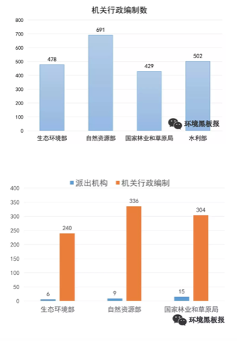
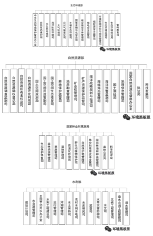

# 前沿资讯

## 十一月 {-}

### 研究动态 {-}

本栏目旨在介绍环境科学、环境工程与生态学及相关学科近期发表的有意思的研究

- 海洋微塑料正在成为研究热点，但密歇根大学的 Allen Burton 却在ES&T上发了篇 Viewpoint 泼冷水，在他眼里，这类研究缺少风险评价，可能毫无意义

推荐人：田振宇

文献链接 http://pubs.acs.org/doi/10.1021/acs.est.7b05463

- 谷歌正在用车载传感器检测街道级别的空气质量

推荐人：于淼

文献链接 http://flowingdata.com/2017/11/08/google-maps-street-level-air-quality-using-street-view-cars-with-sensors/

- 城市热岛效应所引发的温度跟相对湿度变化会影响半挥发化合物的溶解度进而影响pH值，研究人员发现巴尔的摩市跟芝加哥城市跟郊区上空的pH差异在0.8与0.65，当我们讨论区域尺度的大气污染时，城乡差异的来源可能比想象的要复杂

推荐人：于淼

文献链接 http://pubs.acs.org/doi/10.1021/acs.est.7b02786

- 科研作图是很多研究生痛苦的一个根源，然而并不是越炫酷越好，下面这个例子可以说是一个反面教材，过多的立体化、文字化与阴影化处理丢失了图片传达信息的意图，不如直接用表格 （编自 Andrew Gelman的博客） 

推荐人：于淼

链接 https://www.memphisflyer.com/NewsBlog/archives/2016/08/26/report-alcohol-crashes-down-distracted-driving-accidents-up

### 805研究简报 {-}


本栏目旨在介绍805班同学发表的论文

#### 菌根耐铬机理获新进展 - 伍松林 {-}

做为陆地上最为广泛的微生物之一，丛枝菌根（arbuscular mycorrhiza, AM）真菌能与绝大多数的陆地高等植物形成共生体系，帮助植物适应养分贫瘠、干旱、重金属污染等各种逆境胁迫。AM真菌在植物耐受铬污染胁迫中具有重要作用，因而在铬污染土壤生态恢复中具有极大潜在应用价值。然而AM如何促进植物耐受铬污染尚不得而知。

最近一项研究表明AM真菌在六价铬污染情况下能够上调植物根系高亲和硫酸根转运蛋白基因的表达，促进植物根系对硫的吸收。AM真菌同时系统调控了硫在植物体内的转运和代谢以抵御铬污染胁迫。硫代谢产物如半胱氨酸（cysteine, Cys), 谷胱甘肽（glutathione, GSH), 植物络合素（phytochelatins, PCs)等往往能够通过巯基与金属阳离子相结合，进而降低金属毒性。基于此，研究人员推断，AM根系中应有更多的铬与巯基相结合。

然而，事实并非如此，基于同步辐射光源的XAFS分析技术发现，相比较未接种根系，接种AM真菌的根系中有较少的铬与巯基相结合，相反，磷酸结合态铬在AM根系中占主导。这似乎说明，硫代谢产物在菌根耐铬中的作用并不在于络合金属铬。有趣的是，研究人员通过相关分析初步发现，这些主要硫代谢产物（Cys, GSH, PCs）可能在缓解铬引起的植物氧化胁迫中起着重要作用。

相关文章参见：https://www.sciencedirect.com/science/article/pii/S0098847217302939

## 十二月 {-}

### 研究动态 {-}

- 辣木籽被国内保健行业广为吹捧，但它其实是水处理界的明星，将其混合沙子作为滤水器可以去除99%的颗粒物与细菌

推荐人：于淼

链接：http://pubs.acs.org/doi/10.1021/acs.estlett.7b00490

- 这篇等了很久了，USEPA对家用净水器滤芯做的嫌疑物筛选分析和非目标分析。所采用的Brita Filter是美国最常见的家用简易净水器，滤芯里是活性炭和阳离子交换树脂（他们应该给我广告费啊）。饮用水里有哪些污染物？看看这篇文章吧！

非常不错的一个暴露组学范例研究，用非目的分析配合数据库筛选环境水样中的毒性化合物，目测重复难度不大，不过完成这个实验需要多领域专家协作，这篇是EPA外带橡树岭国家实验室配合出来的，国内有同等战力的单位屈指可数

推荐人：田振宇、于淼

链接：https://www.sciencedirect.com/science/article/pii/S026974911732691X

- 把汽车型号，费用，和减排目标联系起来做分析，看看什么车既便宜又环保（可是一般电动车不好修而且开起来太肉啊，well,作者是不是收了Tesla钱了 (●′ω`●)）

推荐人：田振宇

链接：http://pubs.acs.org/doi/10.1021/acs.est.6b00177

- 毒理学研究往往考察单一污染物对单一毒性的影响，EHP上的评论文章引用了一篇双酚类污染物复合暴露的研究指出，针对多污染物与多毒性终点的研究可能给出更多毒理学信息，也需要新的方法学创新

推荐人：于淼

链接：https://ehp.niehs.nih.gov/ehp2341/ https://ehp.niehs.nih.gov/ehp2325

- Environmental DNA (eDNA) 是近些年提出的新概念，指环境样品中可直接测定的非生物来源DNA，可定量分析环境多样性变化，我很好奇这是不是那些搞基因组的发现自己技术过时了就包装下输送到考古跟环境研究领域抢经费了，不过确实是个不错的指标，有希望成为研究热点

推荐人：于淼

链接：http://pubs.acs.org/doi/10.1021/acs.est.7b05199 http://www.sciencedirect.com/science/article/pii/S0006320714004443

- Scripps研究所一直是化学类研究的前沿阵地，脑洞也比较大，在近期提出的一套暴露组学研究流程中研究人员使用了IBM的Watson AI系统来学习文献中的分子并评价暴露组学筛选出的分子，这是要让多少人丢饭碗啊

推荐人：于淼

链接：http://pubs.acs.org/doi/full/10.1021/acs.analchem.7b02759


- “赏金科学家”召集令！！！美国农垦总局出价十万美金征集根除水体中斑马贻贝的方案，欢迎物种入侵相关研究组来美捞金，毕竟一个方案就是两个面上的钱，截止日期二月底

推荐人：于淼

链接：https://www.innocentive.com/ar/workspace/challengeDetail?challenge=9933880


- 来自中国的研究组测了下海盐、湖盐和井盐中的塑料纤维，发现海盐里微塑料明显多于井盐，这个视角比较独特，直接跟食品挂钩了，不过依然缺少风险评价

推荐人：于淼

链接：http://pubs.acs.org/doi/10.1021/acs.est.5b03163


- 这个有点像淼哥之前推荐的 Environmental DNA (eDNA) 那个，不同的是研究者着眼于抗生素抗性基因（antibiotic resistance genes, ARG, 也就是耐药超级细菌所需要的基因）。在污水处理过程中细胞相关的ARG能被较为高效地清除，但是游离的胞外ARG去除效率较低，可能是耐药基因的一个重要来源

推荐人：田振宇

链接：http://pubs.acs.org/doi/10.1021/acs.est.7b04283


- 原来以为原生动物除了难杀灭和能引起奇怪的病之外就没啥意义。然而最近EAWAG的一项研究发现，活性污泥中的原生动物能够通过电荷吸附的作用去除污水中的胺类。

推荐人：田振宇

链接：http://pubs.acs.org/doi/10.1021/acs.est.7b03556

- 五大湖的藻华会影响类似海盐气溶胶的淡水湖气溶胶，单颗粒质谱技术或气溶胶质谱技术有助于我们研究这一特定环境过程，这类概念很不错，但落地还是需要未知物鉴定的数据分析技术，不然还是pca游戏

推荐人：于淼

链接：http://pubs.acs.org/doi/10.1021/acs.est.7b03609


- 拿NHANES数据集发ES&T不新鲜，但搞个10年前的ANN算法来溯源就有点过分了，这种题目放到数据类MOOCs上当作业可能都是送分题，而且数据质量也太差了，0.3%到0.5%的灵敏度还不如随机噪音，没有验证集结果根本就是瞎猜

推荐人：于淼

链接：http://pubs.acs.org/doi/10.1021/acs.est.7b05128

### 805研究简报 {-}


本栏目旨在介绍805班同学发表的论文

#### 氮杂环芳烃环境过程研究新进展 - 田振宇 {-}

氮杂环芳烃（azaarenes）是多环芳烃（PAHs）的氮取代类似物。这类污染物常伴随多环芳烃同时出现在污染场地中，但是由于分析方法的限制，目前对于它们的浓度和环境行为了解十分有限。特别是已知具有较强毒性的高分子量（4-5环）氮杂环芳烃，在各种环境介质的信息都比较缺乏。现有研究大多集中于低分子量（2-3环）的少数几个同类物。换句话说，这类污染物中最危险的东西，我们了解的最少，需要填补这一信息上的空白。

基于高分辨质谱（HRMS）和质量亏损过滤（mass defect filtering），本研究将一种非目标分析方法应用于四个不同污染场地的土壤样品，检测出8个系列共232个同类物。其中四环和五环的氮杂环芳烃被大量检出，种类和浓度都较高。对比污染场地中污染物的分布，可见风化程度高的土壤中四环和五环氮杂环芳烃比例更高。已知有毒且有致癌性的的benzo[c]acridine和dibenzo[a,h]acridine被检出，并且发现它们具有较多的同分异构体。
从本研究可以得出的主要结论是：

- 由于以往的研究忽略了氮杂环芳烃的多样性，它们在污染土壤的毒性中起到的作用很可能被低估；

- 对于土壤中氮杂环芳烃的研究，应更多集中于以往较少关注的高分子量同类物，因为它们的浓度较高且具有持久性。

链接：http://pubs.acs.org/doi/abs/10.1021/acs.est.7b03319
（其实窝是810班的）

## 一月 {-}

### 研究动态 {-}

- ES&T Letter 的执行主编是一个特别喜欢写 editorial 的教授，哪怕一期就三四篇，在 Letter 的 IF 没有超过正刊后，主编大人自己定义了一个 Author Impact Factor（AIF），用过去两年发表数除以2，然后又定义了 L 因子（用 AIF 除以发表期刊的平均 IF ），不得不说这个指标就比较难刷了，有一点他说的非常在理，期刊要以发表的工作为荣，而不是反过来。

推荐人：于淼

链接：http://pubs.acs.org/doi/10.1021/acs.estlett.7b00546

- 用高通量metagenomics 测室内空气中的病毒核酸，采样的地方是12个大学宿舍。宿主多样性很高，而且病毒群落组成可能反映与房间居住者的关联。

推荐人：田振宇

链接：http://pubs.acs.org/doi/10.1021/acs.est.7b04203

- 考虑停留时间，室内空气污染其实比室外影响要大，清华大学的一个研究组考察了中式烹饪过程中室内污染的影响因素，结果发现烹饪方式对大多数污染物影响最严重，基本趋势是炒菜>油炸>蒸煮，如果开了排气扇，大多数污染物浓度都能下降一半。

推荐人：于淼

链接：http://pubs.acs.org/doi/10.1021/acs.est.7b05600

- 左旋葡聚糖经常被用来作为生物质燃烧的标志污染物进行溯源，然而最近的研究发现燃煤也可以生成左旋葡聚糖，这导致我们可能高估了北京的细颗粒物中生物质燃烧的贡献，特别是有燃煤行为的地区

推荐人：于淼

链接：http://pubs.acs.org/doi/10.1021/acs.est.7b05858

- 关于精子质量和大气颗粒物之间关联的流行病学研究。结论比较有意思，说 PM10 (以及与 PM2.5的差) 与精子质量有负相关性，而不是PM2.5。但是大气颗粒物的数据来自区域性的监测和调查问卷，感觉不是很靠谱。

推荐人：田振宇

链接：http://pubs.acs.org/doi/10.1021/acs.est.7b05206

- 光化学反应能在道路尘土中产生单线态氧。大气气相反应和水体光化学反应中的单线态氧并不稀奇，考虑到颗粒物本身就带有各种污染物，这个发现还是有点意思。和持久自由基有无关联？是否会影响stormwater 中的污染物？可以问出一系列的问题了。

推荐人：田振宇

链接：http://pubs.acs.org/doi/10.1021/acs.estlett.7b00533

- 欧盟在2018年又加入了7种严控污染物，有三种含镉物质，另外得克隆也进入名单了，阻燃剂从 PBDEs 开始，几乎就是沿着替代品路线一路禁下去，核心问题在于卤代物天然具有遇热释放卤原子猝灭火焰的特性，替代物都是沿着这个常温稳定，高温分解的思路开发，而这个思路几乎对应持久性有机污染物的特性，这个猫捉老鼠的游戏需要新技术作为搅局者来打破循环。

推荐人：于淼

链接：https://echa.europa.eu/candidate-list-table

- 数据分析方法是长久以来被忽视的研究方向，伴随数据时代的崛起，越来越多的数据人才正在流入传统科研领域掘金，环境学科更是价值洼地，这篇 EHP 的文章是基于 stan 构建的一个贝叶斯在线分析工具，从 stan 角度看就是一个本科生课后作业水平，但 EHP 在环境领域什么份量相信大家都心里有数。总之，不学习新知就会被抛弃，这是学术圈的铁律。

推荐人：于淼

链接：https://ehp.niehs.nih.gov/ehp1289/

## 二月 {-}

### 研究动态 {-}

- 人为设计过的 DNA 被纳米材料包裹后释放到流域中进行溯源是一项非常新的技术，确实 DNA 片段是环境友好的而纳米材料是稳定的，但一个有意思的情况是如果搞 eDNA 研究的跟 DNA-tracer 的都用了一条河… 呃，估计要出大新闻了

推荐人：于淼

链接：http://pubs.acs.org/doi/10.1021/acs.est.7b02928

- 我在逻辑上等这篇文章很久了，就知道微塑料上这个“微”字一定会被“纳”字来入侵，现在果然有人跑出来炒“纳塑料”概念了，一个尺度转换就是一个学科啊

推荐人：于淼

链接：http://pubs.acs.org/doi/10.1021/acs.est.7b05559

- 经济发展对于污染物的迁移等环境过程有着重要影响，这篇研究发现发达地区对周边欠发达地区输送了汞污染或者说优先使用了脱汞技术，这类按经济区域尺度研究的污染不平衡很有意思，如果跟自然地理条件相结合可能会有很有意思的发现

推荐人：于淼

链接：http://pubs.acs.org/doi/10.1021/acs.est.7b04607

- 也是关于微塑料的，用 micro-Raman 检测瓶装水里的微塑料，发现瓶体会向水中直接释放塑料微粒。听起来是有点吓人，浓度呢？真正的风险呢？
推荐人：田振宇
链接：https://www.sciencedirect.com/science/article/pii/S0043135417309272

- 《地球物理学研究快报》发现大约 79.3 ± 46.1 万吨的汞被冻结在永久冻土层中，而 2010 年全球人类活动排放到大气中的汞约为 1960 吨，也就是说，人类直接活动产生的汞也许不算什么，但要是北极的永久冻土层化个30%，现有海洋生态基本要重写了

推荐人：于淼

链接：http://onlinelibrary.wiley.com/doi/10.1002/2017GL075571/full

- 新烟碱类农药是近年来的一个小热点，因为被怀疑导致蜂群崩溃。EST新文章分析了中美的蔬菜水果样品中的7种新烟碱，并和美国农业部农药项目(USDA/PDP)的数据进行了对比，发现中美样品的检出频率都高于USDA的数据。（似乎西红柿的残留更厉害一些?）

推荐人：田振宇

链接：https://pubs.acs.org/doi/10.1021/acs.est.7b05596

- Science上的新研究显示，从挥发性日用化工产品（如杀虫剂、涂料、油墨、清洁剂、个人护理用品等，特别是从室内溢出）排放的VOC已经达到了化石燃料排放量的近一半，逐渐接过了交通运输的份额，并且颇具生成SOA的潜能。（估计以后的法规也会侧重这一块儿）

推荐人：崔天去

链接：http://science.sciencemag.org/content/359/6377/760.full

- Hites 老爷子是为数不多一个人发论文的环境化学科学家，最近他又关注了下 PCB-11，跟传统被禁用的 PCBs 的来源不同，PCB-11 是一种染料生产的副产品，五大湖地区大气中常见 PCBs 的半衰期大概12年，而 PCB-11 在大气中浓度多年来一直稳定，几乎没有半衰期

推荐人：于淼

链接：https://pubs.acs.org/doi/10.1021/acs.estlett.8b00019

- DNA 促进 PAH 在进蒙脱石上的吸附。我们知道一些 PAH 致癌的作用是与DNA 碱基发生不可逆的结合，致使复制出错而突变。反其道而行的话，也可以利用这个机制对PAH 进行吸附。主意不错，但是这么多DNA 哪来？（窝记得窝上中学的实验，DNA 用的是。。。鱼白？）

推荐人：田振宇

链接：https://pubs.acs.org/doi/10.1021/acs.est.7b05174

- Acesulfame K, 中文俗称安赛蜜，是一种难降解的代糖甜味剂，以其稳定性常被用作废水的标志物（去年有人用它计算游泳池里尿的含量）。然额，德国科学家发现它们的废水处理厂中有一些能够较高效地去除这种物质，时间仅用了几年。原因是活性污泥中的某些微生物产生了能够吃掉安赛蜜的能力，真是一种可以观察到的进化。（另一个脑洞，如果肠道微生物也有了这种能力。。。）

推荐人：田振宇

链接：https://pubs.acs.org/doi/10.1021/acs.est.7b05619

- 单萜[Monoterpene]是VOC里的一大自然源，高分辨质谱测到它们贡献了美国东南部（如森林覆盖的阿拉巴马）夏日PM2.5的一半（相当可观），人为排放的NOx也促进了Monoterpene-SOA的生成。（VOC除甲烷外的自然源大概是人为源的10倍，所以其实在很多地方，树是主要问题，而不是车、煤）

推荐人：崔天去

链接：http://www.pnas.org/content/early/2018/02/06/1717513115

## 三月 {-}

### 研究动态 {-}

- 世界范围内只有7%的塑料被循环利用，而亚洲特别是中国基本没有良好的管控，全球90%的海洋微塑料是来自于10条主要河流的输入，其中8条来自亚洲，长江尤为严重

推荐人：于淼

链接：https://www.economist.com/blogs/graphicdetail/2018/03/daily-chart-2

- 三氯生是一种牙膏中常见的杀菌剂，其结构与持久性有机污染物多溴联苯醚及二恶英近似，最近研究发现其在污水处理厂内可转化为甲基三氯生，而甲基三氯生有可以在植物体内转化为三氯生，这类环境转化行为无疑提高了研究其环境过程与环境半衰期的复杂度。

推荐人：于淼

链接：https://pubs.acs.org/doi/10.1021/acs.estlett.8b00071

- 刚看到 Hites 老爷子这篇对 GC-MS 发展历程的前瞻性文章，什么叫老派科学家，老派科学家就是这种看电视上演员把 mass spectrometry 说成 mass spec 后就要跑到 AC 上发文章吐槽的风格，如果你用 GC-MS ，一定看看这篇里对技术发展的梳理，可能很多仪器故障就有思路解决了，不要总是打 800 。

推荐人：于淼

链接：https://pubs.acs.org/doi/abs/10.1021/acs.analchem.6b01628

- 一般认为微生物生物降解处理后的水毒性会降低，但这份研究表明这些代谢产物的毒性并没降低，这个研究比较初步，如果用代谢组学方法研究，可能会揭示更多的毒性细节

推荐人：于淼

链接：https://pubs.acs.org/doi/10.1021/acs.est.7b06408

- 典型外来入侵文章，随机森林算法放在统计学习或机器学习里可能都过时很久了（现在流行各种深度学习、卷积神经网络还有强化学习），但结合环境数据就可以造出一个精度很高的细颗粒物浓度预测模型，以后问题解决型专家可能会比知识型专家更受欢迎，因为有些任督二脉需要合作或通才才能打通

推荐人：于淼

链接：https://pubs.acs.org/doi/10.1021/acs.est.7b05381

- 很有意思的小设备，有点类似温度计，用固相萃取富集，然后用眼睛看颜色扩散长度来决定样品中铜的浓度，原理非常简单，但能组出个能用的产品也是本事，这也是很少有的 ES&T 分析方法类文章

推荐人：于淼

链接：https://pubs.acs.org/doi/10.1021/acs.est.7b05436

- 还记得去年十一月研究速递里说的那个关于海洋微塑料的吐槽吗？现在又有了下文，德国科学家认为，虽然毒性数据短缺，但也不能等着出了问题再亡羊补牢，而合理的解决方法似乎就一个：模型

推荐人：于淼

链接：https://pubs.acs.org/doi/10.1021/acs.est.8b00961

- FT-ICR-MS 研究酒已经是经典案例了，这篇文章更引入了代谢组学的一些方法来研究酒，很难得把故事讲圆了，以后如果再看到品酒专家，可以试探性让他解释下 FT-ICR-MS 是什么。要说跟环境化学的关系，其实酿酒就是个复杂的环境过程，自然界或污水厂都存在类似的场景，同构互换是最简单的发现新研究策略

推荐人：于淼

链接：https://www.frontiersin.org/articles/10.3389/fchem.2018.00029/full

- 石墨烯产品也许还没上市，但环境定量分析已经如火如荼的搞起来了，跟阻燃剂有类似的矛盾，在危害产生前就保持警惕是没问题的，但权衡危害与效益是需要时间来见证的

推荐人：于淼

链接：https://pubs.acs.org/doi/10.1021/acs.est.7b04938

## 四月 {-}

### 研究动态 {-}

- 怎么讲，手里有锤子的时候看什么都是钉子。non-target 玩多了之后，看什么都可以non-target 一下，塑料也不放过。不过整体来说还算是有趣的研究。

推荐人：田振宇

链接：https://pubs.acs.org/doi/pdfplus/10.1021/acs.estlett.8b00119

- 通过分子描述符构建保留时间预测模型是合理的，但是我个人对于预测非目的分析的研究是有疑问的，也许像这篇用了改进的ANN预测后模型效能提高了，但实际应用时还是比较尴尬，你手头只有未知物的保留时间而不是分子描述符，怎么推结构？多变量推单变量是没问题的，反过来基本没有模型可以做到，除非你把目标物限制到特定种类，但如果限定了，模型就不通用了。如果结合二级质谱倒还好说，不过眼下看路还很长。

推荐人：于淼

链接：https://pubs.acs.org/doi/10.1021/acs.jcim.7b00496

- 这个思路也很有意思：从消费量最大的产品来反推什么可能是新的重要污染物。液晶屏的单体有可能具有毒性，生物蓄积能力，以及持久性。不过在还没有实际数据的时候，这么着急发viewpoint 是什么套路?

推荐人：田振宇

链接：https://pubs.acs.org/doi/10.1021/acs.est.8b01636

- 现在已经有人用机器学习预测新型合金玻璃了，据说比实验筛选快100倍，如果材料科学逐渐变成AI子学科，其他实验学科也不远了，有时间都去学点新技术吧，可能以后实验就仅仅是个验证部分了，而发现则由模型来主导

推荐人：于淼

链接：http://advances.sciencemag.org/content/4/4/eaaq1566

- 气溶胶质谱常用来检测烹饪气溶胶，但一个新研究显示烹饪气溶胶的离子化效率显著高于正常值，也就是之前的测定可能高估了烹饪气溶胶浓度，这对溯源研究可能有重要影响

推荐人：于淼

链接：https://pubs.acs.org/doi/10.1021/acs.est.7b06278

- 从废旧电子产品中回收贵金属已经变的越来越便宜，能够比开采原生矿的性价比更高。我一开始还在想是否回收过程的污染成本会很高，然而其实采矿也好不到哪里去吧

推荐人：田振宇

链接：https://pubs.acs.org/doi/10.1021/acs.est.7b04909

- 有人在印度乡村做了个随机对照实验，找了三组人进行家庭用水相关培训，之后一组人会收到信息提醒，一组人会收到提醒+水中大肠杆菌的测试结果，一组人收到提醒+水中大肠杆菌的测试试剂盒，追踪一个月后去测定他们家饮水中大肠杆菌，结果发现后面两组水质都有改善，然后结论认为提供足量信息会改善习惯与水质。其实我感觉这文章从设计到结论问题一大堆，不过最关键的是，这种拿人做实验真的没伦理问题吗？

推荐人：于淼

链接：https://pubs.acs.org/doi/10.1021/acs.est.8b00035

- 分散剂经常被用于清除海洋中泄漏的石油，这个研究发现分散剂对于石油的光化学氧化产物效果很差，因此最好不要在阳光强烈的天气使用。

推荐人：田振宇

链接：https://pubs.acs.org/doi/10.1021/acs.estlett.8b00084

- 非目的分析目前主要有三大分支，一个是石油组学，一个是代谢组学，另一个就是环境筛查，其实方法大同小异，这篇侧重多级质谱的特征离子来筛选未知全氟化合物，虽然不是真正意义上的非目的，但这个流程还是具备很强可移植性的，喜欢排列组合的朋友可以关注下。

推荐人：于淼

链接：https://pubs.acs.org/doi/10.1021/acs.est.8b00779

### 政策速递 {-}

#### 重大政策资讯 {-}

- 2018年3月，十三届全国人大一次会议表决通过《中华人民共和国宪法修正案》，首次将“生态文明”写入宪法，使党的主张成为国家意志的体现，为生态环境保护工作提供了有力保障。生态文明建设进入了新时代。

- 2018年3月，国务院机构改革，组建自然资源部，统一行使全民所有自然资源资产所有者职责，统一行使所有国土空间用途管制和生态保护修复职责；组建生态环境部，整合分散的生态环境保护职责，统一行使生态和城乡各类污染排放监管与行政执法职责。

链接

http://www.gov.cn/xinwen/2018-03/17/content_5275116.htm

#### 中央&国务院政策资讯 {-}

- 4月1日

环境保护税起征 全国首张环保税税票在沪开出

链接

http://www.gov.cn/xinwen/2018-04/02/content_5279187.htm

中华人民共和国环境保护税法

http://www.zhb.gov.cn/gzfw_13107/zcfg/fl/201704/t20170417_411610.shtml

中华人民共和国环境保护税法实施条例

http://www.gov.cn/zhengce/content/2017-12/30/content_5251797.htm

- 4月12日

国务院公布《关于落实〈政府工作报告〉重点工作部门分工的意见》，打好污染防治攻坚战（2018年《政府工作报告》中的三大攻坚战之一）涉及15个部门。具体包括生态环境部、国家发展改革委、国家能源局、科技部、工业和信息化部、公安部、财政部、自然资源部、住房城乡建设部、交通运输部、水利部、农业农村部、商务部、海关总署、国家林业和草原局等。

链接

http://www.gov.cn/zhengce/content/2018-04/12/content_5281920.htm

- 4月14日

《中共中央 国务院关于支持海南全面深化改革开放的指导意见》。海南成为继福建、贵州、江西之后的第4个国家级生态文明试验区，继三江源、祁连山、大熊猫、东北虎豹、武夷山、钱江源、普达措、神农架、北京长城、湖南南山之后的第11个国家公园体制试点。

链接

http://www.gov.cn/xinwen/2018-04/14/content_5282456.htm

- 4月20日

中共中央国务院批复《河北雄安新区规划纲要》，雄安新区发展定位之一“绿色生态宜居新城区”，规划“打造优美自然生态环境”。

链接：

http://www.xinhuanet.com/2018-04/21/c_1122720132.htm

- 4月26日

习近平主持召开深入推动长江经济带发展座谈会并发表重要讲话，强调新形势下推动长江经济带发展，关键是要正确把握整体推进和重点突破、生态环境保护和经济发展、总体谋划和久久为功、破除旧动能和培育新动能、自我发展和协同发展的关系，坚持新发展理念，坚持稳中求进工作总基调，坚持共抓大保护、不搞大开发，加强改革创新、战略统筹、规划引导，以长江经济带发展推动经济高质量发展。

#### 生态环境部政策资讯 {-}

- 4月10日

生态环境部通报关于2017年度全国环评机构和环评工程师查处情况

链接

http://www.zhb.gov.cn/gkml/sthjbgw/bgtwj/201804/t20180410_434168.htm

生态环境部《国家地表水水质自动监测站文化建设方案》征集公众意见，进一步强化国家地表水水质自动监测站的公共服务功能，赋予水站人文内涵，丰富和拓展水站文化属性。

链接

http://www.zhb.gov.cn/hdjl/yjzj/zjyj/201804/t20180411_434321.shtml

- 4月12日

生态环境部部长李干杰在京主持召开部务会议，审议并原则通过《关于废止有关排污收费规章和规范性文件的决定（草案）》《工矿用地土壤环境管理办法（试行）（草案）》

链接

http://www.mep.gov.cn/gkml/sthjbgw/qt/201804/t20180413_434430.htm

生态环境部部长李干杰在京主持召开生态环境部常务会议，审议并原则通过《土壤环境质量 农用地土壤污染风险管控标准（试行）》《土壤环境质量 建设用地土壤污染风险管控标准（试行）》。

链接

http://www.mep.gov.cn/gkml/sthjbgw/qt/201804/t20180413_434432.htm

- 4月13日

生态环境部办公厅发函（环办科技函[2018]117号），征集先进大气污染防治技术。

- 4月17日

生态环境部发布《2018年生态环境监测工作要点》，明确2018年生态环境监测重点任务和工作要求。

链接

http://env.people.com.cn/n1/2018/0417/c1010-29931839.html

- 4月18日

生态环境部印发《关于加强固定污染源氮磷污染防治的通知》，推动解决日益突出的氮磷污染问题

链接

http://www.zhb.gov.cn/gkml/sthjbgw/qt/201804/t20180418_434875.htm

生态环境部联合住房城乡建设部将于5月初启动2018年黑臭水体整治环境保护专项行动，范围涉及36个重点城市（直辖市、省会城市、计划单列市）及全国其他部分地级市。

链接

http://www.zhb.gov.cn/xxgk/hjyw/201804/t20180418_434739.shtml

- 4月20日

生态环境部召开会议推进生态保护红线划定工作。今年2月，国务院批准了京津冀3省（市）、长江经济带11省（市）和宁夏回族自治区共15省份生态保护红线划定方案，山西等其余16省区将于今年年底前完成生态保护红线划定，最终汇总形成生态保护红线全国“一张图”。

- 4月23日

生态环境部三天通报六起典型案件 涉及中央环保督察整改不力、污染反弹等问题，一批责任主体受到严肃处理

链接

http://www.zhb.gov.cn/xxgk/hjyw/201804/t20180423_435128.shtml

- 联合发布

生态环境部、农业农村部、水利部联合印发《重点流域水生生物多样性保护方案》

链接

http://www.mep.gov.cn/gkml/sthjbgw/sthjbwj/201804/t20180410_434172.htm

商务部、生态环境部等8部门联合印发《关于开展供应链创新与应用试点的通知》，将构建绿色供应链列为重点任务，引导地方和企业践行绿色发展理念，促进生态环境质量改善。

链接

http://www.mep.gov.cn/gkml/sthjbgw/qt/201804/t20180425_435354.htm?COLLCC=2822344264&

生态环境部办公厅、国家发改委印发《清洁生产审核评估与验收指南》

链接

http://www.mep.gov.cn/gkml/sthjbgw/bgtwj/201804/t20180424_435213.htm?COLLCC=2822314204&

#### 其他部委政策资讯 {-}

- 4月3日

农业农村部 财政部发布2018年财政重点强农惠农政策，支持农业资源生态保护和面源污染防治

链接

http://www.mof.gov.cn/mofhome/nongyesi/zhengfuxinxi/bgtGongZuoDongTai_1_1_1_1_3/201804/t20180403_28587

- 4月18日

国家审计署发布2018年第2号公告：2017年第四季度国家重大政策措施落实情况跟踪审计结果。污染防治方面：（一）7个省的部分地区未完成国家大气、水污染防治方面目标任务。（二）9个省的24个生态环境保护项目推进缓慢或建成后闲置，涉及投资9.43亿元。

链接

http://www.audit.gov.cn/n5/n25/c121703/content.html

## 五月 {-}

### 研究动态 {-}

- 算是一个有意思的知识迁移，把质谱数据上搜索多肽的方法（和引擎）用于识别PEG之类的清洁剂，毕竟其实都算是高分子了。

推荐人：田振宇

链接：https://pubs.acs.org/doi/10.1021/acs.analchem.8b00365

- 感觉很有意义的一个研究，作者发现磺胺类抗生素在活性污泥中的主要转化途径是与蝶呤生成共轭加合物，并且这类产物依然有抗菌活性。这一发现凸显了转化产物（TP）检测的重要性，并有助于解释之前对于磺胺类去除条件的争议。

推荐人：田振宇

链接：https://pubs.acs.org/doi/10.1021/acs.est.7b06716

- 元素水平的研究特别是重金属元素比例研究是我本科毕设时做过的且感觉比较有意思的方向，最近一篇研究关注了货轮发动机的煤烟与排放气溶胶中细颗粒物里的元素组成，发现重金属 V 被细颗粒物富集了，毒性也相应加大了。

推荐人：于淼

链接：https://pubs.acs.org/doi/10.1021/acs.est.8b01764

- MFC 这个东西我一直不知道靠不靠谱，感觉其中一个疑虑就是能不能大规模投入实用。这不就有人搞了一吨容量的 MFC 跑了一年，COD去除70-90%，能量密度达到 7–60 W m−3 （懂行的人来说说这属于什么水平？）

推荐人：田振宇

链接：https://www.sciencedirect.com/science/article/pii/S0043135418303609

- 有人担心不同长度的 eDNA 水环境降解速率不同导致检查出得丰度不同，这项研究发现长度的影响并不大，而来源的影响更大，这样就有可能用不同长度 eDNA 来进行环境过程溯源了

推荐人：于淼

链接：https://pubs.acs.org/doi/10.1021/acs.est.8b01071

- 现在更多人去讨论全球变暖，但臭氧洞、酸雨曾与之并称新世纪三大环境灾难，后面两个其实只是少了关注但不代表不存在了，一项研究发现如果中国未来对废旧冰箱空调的处理不当将造成氟利昂等制冷剂的大量排放进而同时加剧全球变暖与臭氧空洞的形成

推荐人：于淼

链接：https://pubs.acs.org/doi/10.1021/acs.est.7b05987

- 细颗粒物源解析的基本原理是先采集不同来源的细颗粒物并分析成分，然后根据成分构建多元模型反推样品中细颗粒物的成分组成，举个例子，A源有10单位的铁，B源有20单位的铁，测C源发现12单位的铁，那么C源的主要成分就可能来自A，通过质量平衡与因子分析就可以从概率上得到一个来源组成，这篇文章把这种源解析模型做成了个excel表格，唯一的问题在于我没找到下载链接…

推荐人：于淼

链接：https://pubs.acs.org/doi/10.1021/acs.est.8b00131

- 环境分析与临床生物标记物分析的思路互补性比较强，临床上喜欢用特异性很高的单标记物来进行诊断，基于质谱的环境分析则更擅长高通量痕量定性定量，结合起来就可以是基于质谱高通量同时分析多个特异性很高的生物标记物，这篇文章就用这个思路来同时分析尿液中的七种氧化应激生物标记物，虽说环境分析更喜欢测定外源污染物，但如果同时测定内源标记物就会是个很不错的故事。

推荐人：于淼

链接：https://pubs.acs.org/doi/10.1021/acs.est.8b00883

- 质谱与光源是现在环境分析技术的两极，其中微型质谱或便携式质谱一直是离子阱质谱的天下，但最近杜克大学的研究人员又把磁谱这个老古董翻了出来并用离子同步进样方式进行了改进，新仪器可以小型化并可以测到m/z 10 到 120而离子阱一般低于50就测不到了，这个质量段对于地质与食品的同位素分析非常有用

推荐人：于淼

链接：https://link.springer.com/article/10.1007/s13361-017-1820-y

### 政策速递 {-}

#### 重大政策资讯 {-}

- 全国生态环境保护大会

5月18日至19日，全国生态环境保护大会在北京召开。习近平在全国生态环境保护大会上强调坚决打好污染防治攻坚战、推动生态文明建设迈上新台阶。李克强韩正讲话汪洋王沪宁赵乐际出席。

习近平讲话强调，要自觉把经济社会发展同生态文明建设统筹起来，充分发挥党的领导和我国社会主义制度能够集中力量办大事的政治优势，充分利用改革开放40年来积累的坚实物质基础，加大力度推进生态文明建设、解决生态环境问题，坚决打好污染防治攻坚战，推动我国生态文明建设迈上新台阶。

此次大会规格很高，除了出访的栗战书，习近平和其他常委悉数出席，可见中央对生态环境保护问题的重视程度之高。

链接：http://www.gov.cn/xinwen/2018-05/19/content_5292116.htm

#### 中央&国务院政策资讯 {-}

- 5月7日

韩正在国务院机构改革第二次推进会上强调，坚持优化协同高效做细做实“三定”工作、构建起职责明确依法行政的政府治理体系。要求抓紧研究起草相关综合执法队伍整合组建的指导意见，积极支持地方因地制宜推进机构改革。

链接：http://www.gov.cn/xinwen/2018-05/07/content_5288865.htm

- 5月7日

栗战书在全国人大常委会大气污染防治法执法检查组第一次全体会议上指出：以法律的武器治理污染、用法治的力量保卫蓝天。

链接：http://www.gov.cn/xinwen/2018-05/07/content_5288861.htm

- 5月25日

李克强主持召开国务院全体会议，强调推进改革开放促经济转型升级，高质量发展保障基本民生，不断改善人民生活。要坚持新发展理念，加快新旧动能转换，增强发展内生动力。坚定淘汰落后产能，大力发展环保产业，走出生态保护和经济发展的双赢之路。

要强化风险防控。完善预案，加强预警，突出抓好金融、城市治理、安全生产、污染防治、自然灾害等方面风险以及国际重大风险应对，做好应急管理，确保经济社会大局稳定。

链接：http://www.gov.cn/premier/2018-05/25/content_5293703.htm

- 5月28日：

中国科学院第十九次院士大会、中国工程院第十四次院士大会召开。习近平出席会议并发表重要讲话，强调要瞄准世界科技前沿引领科技发展方向、抢占先机迎难而上建设世界科技强国。

链接：http://www.gov.cn/xinwen/2018-05/28/content_5294268.htm

#### 生态环境部政策资讯 {-}

- 5月7日

生态环境部部长李干杰在京主持召开生态环境部部务会议，审议并原则通过《环境污染强制责任保险管理办法（草案）》

链接：http://www.zhb.gov.cn/gkml/sthjbgw/qt/201805/t20180507_437465.htm

- 5月10日

生态环境部办公厅印发《关于坚决遏制固体废物非法转移和倾倒进一步加强危险废物全过程监管的通知》（环办土壤函〔2018〕266号），旨在严厉打击固体废物非法转移倾倒违法犯罪行为，坚决遏制固体废物非法转移高发态势，加强危险废物全过程监管，有效防控环境风险。

链接：http://www.mee.gov.cn/gkml/sthjbgw/stbgth/201805/t20180522_440867.htm?COLLCC=2493837362&

- 5月18日

农业农村部会同生态环境部联合印发《2017年度畜禽养殖废弃物资源化利用工作考核实施方案》的通知。

链接：http://www.moa.gov.cn/govpublic/XMYS/201805/t20180522_6142748.htm

- 5月20日

生态环境部启动水源地专项督查，组织开展全国集中式饮用水水源地环境保护专项第一轮督查，进一步推动水源地保护攻坚战向纵深发展。

链接：http://www.mee.gov.cn/gkml/sthjbgw/qt/201805/t20180520_440699.htm?COLLCC=2493903990&

- 5月21日

《乏燃料管理安全与放射性废物管理安全联合公约》缔约方第六次审议会议在奥地利维也纳国际原子能机构总部开幕，来自64个缔约方共计600多名代表出席了本次会议。会议将持续两周，第一周审议各缔约方国家履约报告，第二周对审议情况进行总结并发布大会报告和主席报告。中国七项实践被认定为良好业绩。

链接：http://www.mee.gov.cn/xxgk/hjyw/201805/t20180525_441444.shtml?COLLCC=2494299366&

背景材料：乏燃料又称辐照核燃料，是经受过辐射照射、使用过的核燃料，通常由核电站的核反应堆产生。

- 5月22日

第25个“国际生物多样性日”，生态环境部和中国科学院联合发布中国生物多样性红色名录，为全面掌握我国生物多样性受威胁状况，提高生物多样性保护的科学性和有效性提供一手材料。

链接：http://www.mee.gov.cn/gkml/sthjbgw/qt/201805/t20180522_441028.htm?COLLCC=2494263839&

- 5月22日：

生态环境部在重庆召开全国环境执法工作会议，认真学习贯彻习近平生态文明思想和全国生态环境保护大会精神，持续深入推进生态环境执法工作，进一步总结经验、加大力度，为坚决打好污染防治攻坚战，推动生态文明建设迈上新台阶做出应有贡献。

链接：http://www.mee.gov.cn/gkml/sthjbgw/qt/201805/t20180523_441053.htm?COLLCC=2493806167&

- 5月25日

第一批中央环境保护督察“回头看”近日将全面启动。“回头看”督察始终坚持问题导向，重点督察经党中央、国务院审核的中央环境保护督察整改方案总体落实情况；督察整改方案中重点环境问题具体整改进展情况；生态环境保护长效机制建设和推进情况。重点盯住督察整改不力，甚至“表面整改”“假装整改”“敷衍整改”等生态环保领域形式主义、官僚主义问题；重点检查列入督察整改方案的重大生态环境问题及其查处、整治情况；重点督办人民群众身边生态环境问题立行立改情况；重点督察地方落实生态环境保护党政同责、一岗双责、严肃责任追究情况。

链接：http://www.mee.gov.cn/gkml/sthjbgw/qt/201805/t20180525_441461.htm?COLLCC=2494232722&


- 5月28日

生态环境部研究制定《禁止环保“一刀切”工作意见》。中央环境保护督察组将陆续进驻10省（区），对第一轮中央环境保护督察整改情况开展“回头看”。为防止一些地方在督察进驻期间不分青红皂白地实施集中停工停业停产行为，影响人民群众正常生产生活，生态环境部明确禁止环保“一刀切”行为。

链接：http://www.zhb.gov.cn/gkml/sthjbgw/qt/201805/t20180528_441554.htm

- 5月29日

2018年全国生态环境宣传工作会议今日在京开幕，生态环境部部长李干杰出席会议并讲话。他强调，必须坚决贯彻习近平新时代中国特色社会主义思想和党的十九大精神，以习近平生态文明思想为指导，全面落实全国生态环境保护大会的部署和要求，进一步强化生态环境宣传工作，为坚决打好污染防治攻坚战营造良好舆论氛围，加快形成全社会共同关心、支持和参与生态环境保护的强大合力。

#### 其他部委政策资讯 {-}

- 工业和信息化部办公厅财政部办公厅

关于发布2018年工业转型升级资金工作指南的通知【工信厅联规〔2018〕36号】：5月24日，为加快制造强国和网络强国建设，促进工业转型升级，工业和信息化部、财政部联合组织开展2018年工业强基工程实施方案、绿色制造系统集成、工业互联网创新发展工程及智能制造综合标准化与新模式应用等申报工作。

链接：http://www.miit.gov.cn/n1146295/n1652858/n1652930/n3757016/c6193268/content.html

- 国家发展改革委

永定河综合治理与生态修复部省协调领导小组2018年全体会议：国家发展改革委组织召开永定河综合治理与生态修复部省协调领导小组2018年全体会议,研究部署永定河综合治理与生态修复2018年重点工作。

链接：http://www.ndrc.gov.cn/xwzx/xwfb/201805/t20180529_887475.html

会议背景：永定河是流经京津冀晋等省区的一条重要河流和生态廊道，是北京的母亲河。针对永定河治理的现状和问题，2016年12月以来，国家发展改革委、水利部、国家林业局制定印发了《永定河综合治理与生态修复总体方案》（以下简称《总体方案》），并会同有关地方和单位共同成立永定河综合治理与生态修复部省协调领导小组，部署启动实施了永定河综合治理与生态修复工作。

- 工信部

5月17日，为加强新能源汽车动力蓄电池回收利用溯源管理，规范和指导各相关方履行溯源管理责任，工信部编制了《新能源汽车动力蓄电池回收利用溯源管理暂行规定》（征求意见稿）。现向社会公开征求意见。

链接：http://www.miit.gov.cn/n1146285/n1146352/n3054355/n3057542/n3057548/c6175519/content.html

- 海关总署

5月28日，根据《进口可用作原料的固体废物检验检疫监督管理办法》，海关总署制定了《进口可用作原料的固体废物装运前检验监督管理实施细则》（海关总署公告2018年第48号），自2018年6月1日起执行。

链接：http://www.customs.gov.cn/customs/302249/302266/302269/1863885/index.html

- 自然环境部（原国土资源部）

地下水质量标准(GBT14848-2017)，于2018年5月1日起实施。

链接：http://www.gb688.cn/bzgk/gb/std_list?p.p1=0&p.p90=circulation_date&p.p91=desc&p.p2=GB/T%2014848-2017

#### 地方政府资讯 {-}

5月16日上午，河北雄安新区生态环境局在容城县举行揭牌仪式。雄安新区生态环境局成为生态环境部组建后全国第一个地方“生态环境局”。

链接：http://www.xinhuanet.com/energy/2018-05/17/c_1122845095.htm

## 六月 {-}

### 研究动态 {-}

- 今年的第十一届中国R语言会议亮点不少，更难能可贵的是每次会议后报告幻灯片都可以在网上看到，严格意义上R语言会议越来越像数据科学会议了，因为主题涉及金融、计算机、统计、公共卫生、人工智能、地理信息系统、软件开发等诸多热门数据行业。我大概看了下幻灯片，Tensorflow 框架、深度学习、区块链、气候变化、量化投资、商业分析平台等主题出现次数较多，也学习到很多有机会与环境研究结合的新概念与工具，非常适合开拓眼界。

推荐人：于淼

链接：https://pan.baidu.com/s/10XcJiydC2KFRtuQ5RU7myw （密码d4aa）

- 我能明显感觉到环境非目的分析正在快速迭代到代谢组学的研究水平，这篇研究20年人血中污染物变化的研究思路就是代谢组学的流程，作者很聪明地增加了与市售化学品数据库的标注，眼下代谢组与暴露组的区别基本就在检测物是内源还是外源了，当然测定之前你不可能知道，所以其实技术是可共享的。

推荐人：于淼

链接：https://pubs.acs.org/doi/10.1021/acs.estlett.8b00196

- 这个是生态中心的工作，讨论的冷冻-解冻循环中纳米银离子的形态转化问题，现在真的挺少见这类纯环境过程的研究了，很多环境化学的研究其实已经严重偏离真实环境条件了，对真实环境条件中过程的研究其实是环境化学的学科核心竞争力，不然就成了其他学科的追随跟风者了。

推荐人：于淼

链接：https://pubs.acs.org/doi/10.1021/acs.est.8b00694

- 页岩气开发一直以来都挺热的，不过这篇研究算是页岩气开发的副产品。通过对勘探水样的分析与比对90年的数据，研究人员意外发现这组水样数据展示了酸雨影响的减弱，这可能归功于清洁空气法案或铁矿石开采工业的减弱。

推荐人：于淼

链接：https://pubs.acs.org/doi/10.1021/acs.est.8b01123

- 做过环境样品前处理的同学可能都有体会，污水厂的活性污泥样品是最难处理的，气味可以让你怀疑人生，这篇综述讨论的却是如何将污泥商品化。颇有点大象装冰箱的意味，一共三步：捕集-发酵-产品升级。这里商品化的主要是挥发性有机酸，如果你能从中盈利，那就真是赚“脏钱”了。

推荐人：于淼

链接：https://pubs.acs.org/doi/10.1021/acs.est.7b05712

- 我记得七八年前学水处理时微滤膜也就刚刚流行，结果现在纳滤膜都过时了，而处理物也从传统污染物变成了全氟化合物。有点排列组合的意思，他们是用了孔径大一些的纳滤膜，不过我关心的其实是全氟化合物可能不是特异性被处理的，那就真有点找噱头了。就算活性污泥法，其实也能处理很多所谓新型污染物的，只是之前没人想关注而已。

推荐人：于淼

链接：https://pubs.acs.org/doi/10.1021/acs.est.8b01040

- 环境污染也是不平等的，出了污染源导致的，还有可能是经济活动导致。这份研究通过国内供应链数据发现，有些发达省份不但维持了自己的经济价值是流入状态还对外输出了污染，而西南部省份则不但输入了污染，经济价值也是外流的。区域污染不平等可能也会是以后的重要议题。

推荐人：于淼

链接：https://pubs.acs.org/doi/10.1021/acs.est.8b00009

- 游泳池说实话成分比较复杂，这篇研究追踪了一些与粪便相关的人源化合物与肠道疾病的关系，结果发现双酚A和胆固醇可能跟这类疾病有关，不过只提高了1～2%的风险。我感觉这个结果很可能是假阳性，需要更严格的统计检验。

推荐人：于淼

链接：https://pubs.acs.org/doi/10.1021/acs.est.8b00639

- 离子淌度高分辨质谱这两年开始流行了，仪器厂商正在大力推广，多出来的离子淌度这一维对于定性可能非常有用。这篇工作已经开始给离子淌度构建环境分析的数据库了，估计过不了多久我们就能看到商品了。

推荐人：于淼

链接：https://pubs.acs.org/doi/10.1021/acs.est.8b00999

### 政策速递 {-}

#### 重大政策资讯 {-}

- 2018年6月24日，新华社播发《中共中央、国务院关于全面加强生态环境保护 坚决打好污染防治攻坚战的意见》。这是中共十九大将污染防治攻坚战列入全面建成小康社会的三大攻坚战后，首份详细的“作战”部署图。意见阐述习近平生态文明思想的八个坚持，单独章节提出“全面加强党对生态环境保护的领导”，并以2020年为时间节点，兼顾2035年和本世纪中叶，从质量、总量、风险三个层面确定攻坚战的目标。

链接 《中共中央、国务院关于全面加强生态环境保护 坚决打好污染防治攻坚战的意见》

http://www.gov.cn/zhengce/2018-06/24/content_5300953.htm

#### 中央&国务院政策资讯 {-}

- 6月7日

国务院办公厅公布5处新建国家级自然保护区名单：

山西省  太宽河国家级自然保护区；

吉林省  头道松花江上游国家级自然保护区、甑峰岭国家级自然保护区；

黑龙江省  细鳞河国家级自然保护区；

贵州省  大沙河国家级自然保护区

链接 http://www.gov.cn/zhengce/content/2018-06/07/content_5296756.htm

- 6月19日

在第十三届全国人民代表大会常务委员会第三次会议上，受国务院委托，生态环境部部长李干杰，就全国人大常委会固体废物污染环境防治法执法检查报告及审议意见研究处理情况进行报告。

链接 《国务院关于研究处理固体废物污染环境防治法执法检查报告及审议意见情况的报告》

http://www.npc.gov.cn/npc/xinwen/2018-06/19/content_2056153.htm

- 6月20日

国新办举行《打赢蓝天保卫战三年行动计划》吹风会。会上，生态环境部副部长赵英民说，《打赢蓝天保卫战三年行动计划》将于近期印发实施，总体目标是，经过3年努力，大幅减少主要大气污染物排放总量，协同减少温室气体排放，进一步明显降低PM2.5浓度，明显减少重污染天数，明显改善环境空气质量，明显增强人民的蓝天幸福感。

链接 http://www.scio.gov.cn/32344/32345/37799/38461/tw38463/Document/1631614/1631614.htm

- 5月23日

中央纪委通报曝光了6起生态环境损害责任追究典型问题，涉及天津、河北、江苏、安徽、重庆和甘肃六省市，被通报人数达40多人。值得注意的是，这是中央纪委首次就该领域的责任追究典型问题进行通报。

链接 http://www.ccdi.gov.cn/yaowen/201805/t20180524_172496.html

#### 生态环境部政策资讯 {-}

- 生态环境部主要的新闻就是环保督查“回头看”了。这一看，结果可谓精彩纷呈，令人目不暇接。很多生态环保工作人员，都在感慨，生态环境部门终于装上了牙齿！大家感受下~

云南昭通市敷衍整改垃圾污染问题久拖不决

http://www.mep.gov.cn/gkml/sthjbgw/qt/201806/t20180613_443094.htm

敷衍整改 非法掩埋 南通如皋市危险废物威胁长江水质安全

http://www.mep.gov.cn/gkml/sthjbgw/qt/201806/t20180615_443273.htm

佛山市三水区走捷径“河上治污”应对断面考核

http://www.mep.gov.cn/gkml/sthjbgw/qt/201806/t20180616_443298.htm

33张罚单难阻新义煤矿违法排污

http://www.mep.gov.cn/gkml/sthjbgw/qt/201806/t20180617_443308.htm

虚假整改甚至包庇纵容 江西一些地市污染反弹问题突出

http://www.mep.gov.cn/gkml/sthjbgw/qt/201806/t20180618_443318.htm

濮阳市执法犯法纵容偷排行为编造虚假文件应对督察组

http://www.mep.gov.cn/gkml/sthjbgw/qt/201806/t20180619_443330.htm

面对污染无动于衷，面对督察百般隐瞒 泰州市数万吨化工废料非法填埋长江岸边

http://www.mep.gov.cn/gkml/sthjbgw/qt/201806/t20180620_443430.htm

边督边改弄虚作假 江西崇仁县一批干部被问责

http://www.mep.gov.cn/gkml/sthjbgw/qt/201806/t20180620_443450.htm

宁夏宇光能源屡罚不改 地方监管软弱无力

http://www.mep.gov.cn/gkml/sthjbgw/qt/201806/t20180620_443451.htm

曲靖市委市政府官僚主义 上市公司环境污染触目惊心

http://www.mep.gov.cn/gkml/sthjbgw/qt/201806/t20180621_443500.htm

治污光说不练，问题依然如故 汕头市对督察整改的漠视程度令人震惊

http://www.mep.gov.cn/gkml/sthjbgw/qt/201806/t20180621_443561.htm

新乡、三门峡两市矿山环境治理进展缓慢

http://www.mep.gov.cn/gkml/sthjbgw/qt/201806/t20180622_443615.htm

假整改 真变通 宁夏灵武再生资源循环经济示范区侵占国家级自然保护区问题依然如故

http://www.mep.gov.cn/gkml/sthjbgw/qt/201806/t20180623_443631.htm

梧州市十年不作为 饮用水水源保护区环境风险十分突出

http://www.mep.gov.cn/gkml/sthjbgw/qt/201806/t20180625_443659.htm

黄河湿地自然保护区惊现大型养殖场 河南三门峡市敷衍整改问题突出

http://www.mep.gov.cn/gkml/sthjbgw/qt/201806/t20180625_443670.htm

江苏徐州、宿迁部分群众举报问题整改不力 酸洗废水渗坑被督察组发现后就地掩埋

http://www.mep.gov.cn/gkml/sthjbgw/qt/201806/t20180626_443760.htm

呼伦湖生态环境治理成效不明显 重点治理项目被人为搁置

http://www.mep.gov.cn/gkml/sthjbgw/qt/201806/t20180626_443796.htm

污水处理厂逾期七年未建成 杞麓湖生态环境受威胁

http://www.mep.gov.cn/gkml/sthjbgw/qt/201806/t20180627_443924.htm

以停代治 敷衍整改 邯郸市露天矿山整治工作不力

http://www.mep.gov.cn/gkml/sthjbgw/qt/201806/t20180627_445682.htm

南宁市环保督察发现表面整改问题突出 黑臭水体污染反弹严重

http://www.mep.gov.cn/gkml/sthjbgw/qt/201806/t20180628_445776.htm

沙钢集团百万吨钢渣弃置江边 威胁长江水生态环境安全

http://www.mep.gov.cn/gkml/sthjbgw/qt/201806/t20180628_445704.htm

- 5月30日

为贯彻《中华人民共和国环境保护法》《中华人民共和国固体废物污染环境防治法》，防治危险废物造成的环境污染，加强对危险废物的管理，保护环境，保障公众健康，生态环境部修订形成了国家环境保护标准《危险废物鉴别标准 通则（征求意见稿）》（GB 5085.7）、《危险废物鉴别技术规范（征求意见稿）》（HJ/T 298）。

- 6月7日

为贯彻落实习总书记在全国生态环境保护大会上的重要讲话精神，坚决打赢蓝天保卫战，进一步推动地方各级党委政府及相关部门落实大气污染防治责任，持续改善京津冀及周边地区、汾渭平原、长三角地区等重点区域环境空气质量，巩固大气污染防治成效，生态环境部决定继续开展大气污染防治强化督查，并制定了《2018-2019年蓝天保卫战重点区域强化督查方案》。

链接 http://www.mep.gov.cn/gkml/sthjbgw/sthjbwj/201806/t20180612_442954.htm

- 6月17日

生态环境部通报2018-2019年蓝天保卫战重点区域强化督查工作进展。200个督查组按照工作方案要求，对京津冀及周边地区224个县（市、区）进行督查，发现涉气环境问题185个。

链接 http://www.mep.gov.cn/gkml/sthjbgw/qt/201806/t20180618_443323.htm


- 6月23日

生态环境部环境监测司负责人就山西临汾监测数据造假案答记者问。5月30日，山西省晋中市榆次区人民法院以“破坏计算机信息系统罪”对涉案16人作出判决：主犯临汾市环保局原局长张文清被判处有期徒刑两年，主犯临汾市环保局办公室原负责人张烨、环境监测站原聘用人员张永鹏分别被判处有期徒刑一年。其他13名从犯被判处有期徒刑八个月至拘役四个月不等。

链接 http://www.mep.gov.cn/gkml/sthjbgw/qt/201806/t20180623_443636.htm

- 6月23日

第二十次中日韩环境部长会议在苏州举行。中国生态环境部部长李干杰、日本环境省大臣中川雅治、韩国环境部部长金恩京分别率团出席会议，对中日韩环境合作的发展前景和未来方向进行了展望和探讨，通过并签署了《第二十次中日韩环境部长会议联合公报》

链接 http://www.xinhuanet.com/world/2018-06/24/c_129899767.htm

- 联合发布

住房城乡建设部、生态环境部、水利部、农业农村部联合发布《关于做好非正规垃圾堆放点排查和整治工作的通知》，总体目标是到2020年底，基本遏制城镇垃圾、工业固体废物违法违规向农村地区转移问题，基本完成农村地区非正规垃圾堆放点整治。

链接 http://www.mohurd.gov.cn/wjfb/201806/t20180606_236320.html

生态环境部、中央文明办、教育部、共青团中央、全国妇联等五部门在2018年六五环境日国家主场活动现场联合发布《公民生态环境行为规范（试行）》，倡导简约适度、绿色低碳的生活方式，引领公民践行生态环境责任，携手共建天蓝、地绿、水清的美丽中国。

链接 http://www.mep.gov.cn/gkml/sthjbgw/qt/201806/t20180605_442476.htm

农业农村部、财政部出台《关于实施绿色循环优质高效特色农业促进项目的通知》。根据中央农村工作会议、中央1号文件有关部署要求，为推动质量兴农、绿色兴农，深化农业供给侧结构性改革，提高农业创新力、竞争力和全要素生产率，助力实施乡村振兴战略，农业农村部、财政部决定实施绿色循环优质高效特色农业促进项目，出台此项通知。

链接 http://www.moa.gov.cn/gk/cwgk_1/nybt/201806/t20180615_6152200.htm

海关总署、生态环境部为进一步规范固体废物进口管理，防治环境污染，根据《中华人民共和国固体废物污染环境防治法》《固体废物进口管理办法》《国务院办公厅关于印发禁止洋垃圾入境推进固体废物进口管理制度改革实施方案的通知》及有关法律法规，发布《关于发布限定固体废物进口口岸的公告》。

链接 http://www.moa.gov.cn/gk/cwgk_1/nybt/201806/t20180615_6152200.htm

#### 其他部委政策资讯 {-}

- 6月1日

国家审计署发布《2018年第3号公告：长江经济带生态环境保护审计结果》：2017年12月至2018年3月，审计署对长江经济带11省市2016年至2017年生态环境保护相关政策措施落实和资金管理使用情况进行了审计，重点抽查了59个地级市（区）。这是审计署第一次对长江经济带进行生态环境保护审计，并发布专门的审计报告。审计的重点，也从单纯的经济角度 更多地转向从生态保护、生态修复的角度看问题。

链接 http://www.audit.gov.cn/n4/n19/c123511/content.html

- 6月7日

国家标准委为深入贯彻党中央、国务院关于加快推进生态文明建设的总体部署，坚决打好污染防治攻坚战，建立和完善生态文明建设标准体系，组织编制了《生态文明建设标准体系发展行动指南（2018-2020年）》。

链接 http://www.sac.gov.cn/sgybzyb/gzdt/bmxw/201806/t20180607_342464.htm

- 6月15日

海关总署根据《进口可用作原料的固体废物检验检疫监督管理办法》，制定了《进口可用作原料的固体废物国内收货人注册登记管理实施细则》，现予以公告，自2018年8月1日起执行。《进口可用作原料的固体废物国内收货人注册登记管理实施细则（试行）》（原质检总局公告2009年第91号公布）同时废止。

链接 http://www.customs.gov.cn/customs/302249/302266/302269/1891984/index.html

- 6月20日

商务部流通业发展司发布《中国再生资源回收行业发展报告（2018）》。报告指出，2017年，国家高度重视再生资源行业的发展，不断推出重要利好政策；社会资本对行业的关注度趋高，企业兼并重组活动频繁；新型回收模式层出不穷，整个行业呈现稳中有进、稳中向好趋势。

链接 http://ltfzs.mofcom.gov.cn/article/ztzzn/an/201806/20180602757116.shtml

- 6月22日

自然资源部召开新闻发布会公开通报16起违法案件查处结果，包括土地案件6起，海洋案件2起，矿产案件4起，林业案件4起。处理方式有行政处分、罚款、免职、判刑等。

链接 http://gi.mlr.gov.cn/201806/t20180622_1871240.html

- 6月26日

工业和信息化部办公厅发布关于开展2018年度国家工业节能技术装备推荐及“能效之星”产品评价工作的通知（工信厅节函〔2018〕212号），继续组织推荐一批国家鼓励发展的工业节能技术装备，以加快推动高效节能技术产品的推广应用。

链接 http://www.miit.gov.cn/newweb/n1146285/n1146352/n3054355/n3057542/n3057544/c6232879/content.html

## 七月 {-}

### 研究动态 {-}

- 环境研究的难点在于其复杂的过程很难简化，在生命周期评价中，不同的家庭会有不同的消费模式，这篇研究使用了自组织映射（SOM）这种非监督方法来识别模式并提取特征，虽然有点炫技的成分，但是这种用法确实很有启发性。

推荐人：于淼

链接：https://pubs.acs.org/doi/10.1021/acs.est.8b01452

- 将海洋微塑料与疏水有机污染物结合起来评价风险是个靠谱的思路，毕竟微塑料也只是载体，窃以为可以套用些土壤污染研究方法来试试。

推荐人：于淼

链接：https://pubs.acs.org/doi/10.1021/acs.est.8b02515

- 入海口开在北极圈的河并不多，这篇研究发现这些河里的碳酸根与碳酸氢根在最近40年直线上升，看样子海洋酸化也有河流输入的重要影响。

推荐人：于淼

链接：https://pubs.acs.org/doi/10.1021/acs.est.8b01051

- 高氯酸也是一种常见的环境化学研究对象，研究人员分析了来自格陵兰岛覆盖300年的冰芯发现，高氯酸的浓度似乎并没有受到人类影响比较稳定，反而历史上几次火山喷发造成了大气中高氯酸的高浓度，不过最近20年浓度的上升则可能与有机氯化合物的生产转化有关。

推荐人：于淼

链接：https://pubs.acs.org/doi/10.1021/acs.est.8b01890

- 这是篇viewpoint，作者均为国内环境化学领域的专家（三位来自生态中心），概述了最近几年国内空气质量的改善与进一步改进的空间。虽然细颗粒物浓度一直在下降，但距离世卫组织标准还有距离，而且下一步可能需要重点关注其中的毒性物质。

推荐人：于淼

链接：https://pubs.acs.org/doi/10.1021/acs.est.8b03137

- 很多人初上手非目的分析会被成千上万的峰搞得无从下手，这篇研究虽然流程上没有什么特殊的，但其将峰数从60000降到了1500，其峰过滤方法值得关注。

推荐人：于淼

链接：https://pubs.acs.org/doi/10.1021/acs.est.8b01126

- 《经济学人》援引一项基于污染与居民消费数据经济学研究发现，中国的大气污染治理的花费不仅仅是政府投资，个人消费行为模式也受影响，人们在高污染地区的健康与医药花费更高而生活必需品开支相对减少，不过我更怀疑生活必需品消费的下降可能来自于房价所带来的负债压力

推荐人：于淼

链接：https://www.economist.com/graphic-detail/2018/06/28/how-smog-affects-spending-in-china?fsrc=rss

- 抗生素滥用的一个直接体现在于抗性基因的出现，这篇研究调查了全球19个城市里总悬浮颗粒物中抗性基因的相对丰度并以西安为例研究了10年内的变化，不同城市不同抗生素的差异比较大，或许未来空气质量预报就要多一个抗性指标了

推荐人：于淼

链接：https://pubs.acs.org/doi/10.1021/acs.est.8b02204

- 近年来西藏的市政污泥中发现了高浓度的汞污染，研究人员通过质量流分析与药代动力学分析发现，传统藏药中的汞可能贡献了环境中45%的汞污染，同时作为世界第三极西藏本身就对汞有冷捕集作用，如果结论可靠那么西藏的未来的汞污染将会是现象级的。

推荐人：于淼

链接：https://pubs.acs.org/doi/10.1021/acs.est.8b01754

### 政策速递 {-}

#### 重大政策资讯 {-}

- 2018年7月3日

国务院公开发布《打赢蓝天保卫战三年行动计划》，主要包括调整优化产业结构，推进产业绿色发展；加快调整能源结构，构建清洁低碳高效能源体系；积极调整运输结构，发展绿色交通体系；优化调整用地结构，推进面源污染治理；实施重大专项行动，大幅降低污染排放；强化区域联防联控，有效应对重污染天气等内容。

链接 《国务院关于印发打赢蓝天保卫战三年行动计划的通知【国发〔2018〕22号】》

http://www.gov.cn/zhengce/content/2018-07/03/content_5303158.htm

- 2018年7月10日

第十三届全国人民代表大会常务委员会第四次会议听取和审议了栗战书委员长所作的全国人大常委会执法检查组关于检查大气污染防治法实施情况的报告。会议充分肯定和高度评价执法检查组的工作，一致赞成执法检查报告，同意报告对贯彻实施大气污染防治法、打赢蓝天保卫战提出的意见和建议。

链接 《关于全面加强生态环境保护 依法推动打好污染防治攻坚战的决议》

http://www.xinhuanet.com/2018-07/10/c_1123106900.htm

#### 中央&国务院政策资讯 {-}

- 7月3日

国务院办公厅发布关于成立京津冀及周边地区大气污染防治领导小组的通知，以推动完善京津冀及周边地区大气污染联防联控协作机制。经党中央、国务院同意，将京津冀及周边地区大气污染防治协作小组调整为京津冀及周边地区大气污染防治领导小组，并在《通知》中明确了领导小组的主要职责、组成人员、工作机构和工作规则。

链接 http://www.gov.cn/zhengce/content/2018-07/11/content_5305678.htm

- 7月5日

国务院发出通知，部署开展2018年国务院大督查，以深入贯彻落实党的十九大精神和《政府工作报告》要求，确保完成全年经济社会发展主要目标任务。

链接 《国务院关于开展2018年国务院大督查的通知【国发明电〔2018〕3号】》http://www.npc.gov.cn/npc/xinwen/2018-06/19/content_2056153.htm

- 7月14日

国务院印发《关于加强滨海湿地保护严格管控围填海的通知》，重点明确了严控新增围填海造地、加快处理围填海历史遗留问题、加强海洋生态保护修复、建立滨海湿地保护和围填海管控长效机制四个方面的政策要求。

链接 http://www.gov.cn/zhengce/content/2018-07/25/content_5309058.htm

- 7月18日

国新办发表《青藏高原生态文明建设状况》白皮书，白皮书指出青藏高原地区生态文明制度逐步健全、生态保育成效显著、环境质量持续稳定、绿色产业稳步发展、科技支撑体系基本建立、生态文化逐渐形成。

链接 http://www.scio.gov.cn/zfbps/32832/Document/1633895/1633895.htm

#### 生态环境部政策资讯 {-}

- 7月

为深入推进我国固体废物污染环境防治工作，有效防范固体废物污染环境风险，根据全国人大立法工作计划，在认真调查研究的基础上，生态环境部研究起草了《中华人民共和国固体废物污染环境防治法（修订草案）（征求意见稿）》。征集意见截止时间为2018年8月18日。

链接 关于公开征求《中华人民共和国固体废物污染环境防治法（修订草案）（征求意见稿）》意见的通知【环办土壤函[2018]644号】http://www.mep.gov.cn/gkml/sthjbgw/stbgth/201807/t20180717_446712.htm

- 7月20日

生态环境部部长李干杰主持召开生态环境部常务会议，审议并原则通过《柴油货车污染治理攻坚战行动计划》《长江保护修复攻坚战行动计划》《城市空气质量排名方案》，听取2018年上半年全国空气和地表水环境质量状况的汇报。

链接 http://www.mep.gov.cn/gkml/sthjbgw/qt/201807/t20180721_447063.htm

- 7月23日

生态环境部部长李干杰主持召开生态环境部常务会议，审议并原则通过《农业农村污染治理攻坚战行动计划》《渤海综合治理攻坚战行动计划》。

链接 http://www.mep.gov.cn/gkml/sthjbgw/qt/201807/t20180724_447149.htm

- 7月24日

生态环境部部长李干杰主持召开生态环境部常务会议，审议并原则通过《生态环境部贯彻落实<全国人大常委会关于全面加强生态环境保护 依法推动打好污染防治攻坚战的决议>实施方案》《京津冀及周边地区2018—2019年秋冬季大气污染综合治理攻坚行动方案》及《区域空间生态环境评价工作实施方案》

链接 http://www.mep.gov.cn/gkml/sthjbgw/qt/201807/t20180725_447187.htm

- 7月25日

生态环境部向媒体通报2018年上半年（1—6月）全国地表水环境质量状况。通报指出，2018年上半年，2050个国家考核断面（1940个为国家地表水评价断面，110个为入海河流断面）全部采用采测分离模式开展监测，其中，1940个国家地表水评价断面中，实际开展监测的断面1925个，其余15个断面因断流、交通阻断等原因未开展监测。

链接 http://www.mep.gov.cn/gkml/sthjbgw/qt/201807/t20180725_447229.htm

- 联合发布

财政部、自然资源部、生态环境部决定2018年开展第三批山水林田湖草生态保护修复工程试点，以贯彻落实党的十九大报告“实施重要生态系统保护和修复重大工程”和2018年政府工作报告“加强生态系统保护和修复”要求。

链接 无

工业和信息化部、科技部、生态环境部、交通运输部、商务部、市场监管总局、能源局联合发布关于做好新能源汽车动力蓄电池回收利用试点工作的通知【工信部联节〔2018〕134号】。根据《关于组织开展新能源汽车动力蓄电池回收利用试点工作的通知》（工信部联节函〔2018〕68号）要求，七部门组织对有关地区及企业申报的新能源汽车动力蓄电池回收利用试点实施方案进行了评议。经研究，确定京津冀地区、山西省、上海市、江苏省、浙江省、安徽省、江西省、河南省、湖北省、湖南省、广东省、广西壮族自治区、四川省、甘肃省、青海省、宁波市、厦门市及中国铁塔股份有限公司为试点地区和企业。

链接 http://www.gov.cn/xinwen/2018-07/26/content_5309433.htm

#### 其他部委政策资讯 {-}

- 7月26日

自然资源部发布《2017年海岛统计调查公报》，对海岛基本情况、海岛资源、海岛保护与修复、海岛经济发展、海岛周边海域水质、海岛人居环境、海岛管理与执法等方面进行了统计分析。

链接 http://gi.mlr.gov.cn/201807/t20180727_2156215.html

- 7月2日

为贯彻落实中共中央办公厅、国务院办公厅《关于创新体制机制推进农业绿色发展的意见》，大力推进生态文明建设，有力支撑农业绿色发展和农业农村现代化，农业农村部组织编写了《农业绿色发展技术导则（2018—2030年）》，设定了研制绿色投入品、研发绿色生产技术、发展绿色产后增值技术、创新绿色低碳种养结构与技术模式、绿色乡村综合发展技术与模式、加强农业绿色发展基础研究、完善绿色标准体系等七个方向的重点任务。

链接 《农业绿色发展技术导则》http://www.moa.gov.cn/govpublic/KJJYS/201807/t20180706_6153629.htm

- 7月13日

为深入学习贯彻习近平总书记在全国生态环境保护大会重要讲话和会议精神，落实《中共中央、国务院关于全面加强生态环境保护坚决打好污染防治攻坚战的意见》，进一步做好农业农村生态环境保护工作，打好农业面源污染防治攻坚战，全面推进农业绿色发展，推动农业农村生态文明建设迈上新台阶，农业农村部提出深入推进生态环境保护工作的意见

链接 http://www.moa.gov.cn/gk/ghjh_1/201807/t20180725_6154722.htm

- 7月2日

为贯彻落实《生产者责任延伸制度推行方案》（国办发〔2016〕99号）和《新能源汽车动力蓄电池回收利用管理暂行办法》（工信部联节〔2018〕43号）要求，推进动力蓄电池回收利用，工业和信息化部制定了《新能源汽车动力蓄电池回收利用溯源管理暂行规定》，自2018年8月1日起施行。

链接 http://www.miit.gov.cn/n1146295/n1146592/n3917132/n4061768/c6245200/content.html

- 7月23日

工业和信息化部发布关于印发坚决打好工业和通信业污染防治攻坚战三年行动计划的通知【工信部节〔2018〕136号】，从调整优化产业结构和布局、加快推进绿色智能改造提升、培育壮大绿色制造产业等几方面做了计划安排。

链接 http://www.miit.gov.cn/n1146295/n1652858/n1652930/n3757016/c6274238/content.html

- 7月6日

海关总署公告2018年第91号（关于公布《进口可用作原料的固体废物国外供货商注册登记管理实施细则》的公告），从受理、审查和批准，变更、重新申请和延续，监督管理等方面做了规定。

链接 http://www.customs.gov.cn/customs/302249/302266/302269/1930360/index.html

## 八月 {-}

### 研究动态 {-}

- 除生物剂及其转化产物能在地下水里检测出来，应该说不稀奇。这篇的可贵之处就在于靠合理布设采样点，证明这些污染物是来自于雨水径流。

推荐人：田振宇

链接：https://www.sciencedirect.com/science/article/pii/S004313541830589X

- 虽然还没有文章但是这个poster足够有意思：欧洲赛鸽子比赛的获胜鸽子被别的参赛者举报可能用了吗啡作为兴奋剂，而因为poppy seed（罂粟籽）是常见的鸽子饲料和人类食物（你的bagel上就会有），这事儿说不清楚。获胜鸽子的主人不服，找科学家帮忙检测。从鸽子粪便里的确能检测到吗啡和其他阿片类药物，但是高浓度仅仅会维持较短的时间（不到两天，而在比赛前还有一天的时间离开鸽子主人），不足以作为有效的兴奋剂。当然模拟的条件和实际飞行也有区别。

推荐人：田振宇

链接：https://www.researchgate.net/publication/326914172_The_Pigeon_Poppy_Seed_Defence_-_Analysis_of_Opiates_as_Markers_of_Doping_Use_in_Racing_Pigeons

- 近年来空气污染一直都特别关注细颗粒物，但这项工作认为，相比发达国家，我国的地表臭氧污染也很严重

推荐人：于淼

链接：https://pubs.acs.org/doi/10.1021/acs.estlett.8b00366

- 溶解性有机质存在荧光效应，这篇研究发现这种荧光效应与温度有关，不过我感觉这个荧光效应应该还可以指示更复杂的环境过程，剩下的就留给大家去想象吧

推荐人：于淼

链接：https://pubs.acs.org/doi/10.1021/acs.est.8b00643

- 不同学科对同一分析方法还是存在不同命名的，这篇文章中寻找同系物的方法在脂质组学中被认为半目的分析，不过我推荐这篇文章的原因在于其耦合了暴露评价的流程，现在其实不缺技术，缺的是组合技术的工作流

推荐人：于淼

链接：https://pubs.acs.org/doi/10.1021/acs.est.8b02492

- 这是个很物理的研究，全球变暖后，自来水厂的消毒副产物、用电量等指标都会增长，显然最初设计时并未考虑过这些，备不住以后的机器也要空调房了

推荐人：于淼

链接：https://pubs.acs.org/doi/10.1021/acs.est.7b01591

- 环境分析的准确性一直备受质疑，很多时候都是只看数量级的，这份工作总结了对新兴阻燃剂的多实验室比对，发现仪器分析并不是低准确度的原因，基质效应与前处理可能是低准确度的主要原因

推荐人：于淼

链接：https://pubs.acs.org/doi/10.1021/acs.est.8b02715

- 北美这边中小城市的居住格局基本是区块为单位，几个区块间会有个商区，一般餐馆、商店都分布在这里，这篇研究关注了餐馆本身产生的有机气溶胶，发现餐馆下风向200m内的细颗粒物会有明显上升，又因为20%的匹斯堡人口居住在这样的区域内，所以餐馆可能比工厂对人健康产生影响更大

推荐人：于淼

链接：https://pubs.acs.org/doi/10.1021/acs.est.8b02654

- DNA适配体在环境分析化学中是一个研究热点，修饰过的DNA分子适配特定污染物后在特定传感平台上会产生荧光，这篇综述却指出，虽然应用前景比较明朗，但目前灵敏度还测不到环境相关浓度，另外环境样品中的DNA片段也会对测定产生干扰

推荐人：于淼

链接：https://pubs.acs.org/doi/10.1021/acs.est.8b00558

- 猎奇向样品研究之一，丝袜里的内分泌干扰物研究。继多年前的摆一圈多国纸币 的BPA研究之后，Kannan大佬又玩起了多国丝袜（误），脑洞也是非常厉害了。本研究发现丝袜里面的各种已知内分泌干扰物浓度不低，尤其是一些含莱卡（Spandex）的丝袜中的BPS和BPA浓度达到了mg/g 级，贴身暴露的浓度可能会相当可观，广大女性朋友们要注意了。

推荐人：田振宇

链接：https://pubs.acs.org/doi/10.1021/acs.est.8b03129

- 猎奇向样品研究之二，non-target 方法测定木乃伊（及其内脏罐）的成分。蜂蜡的成分在多个样品中有检出，并且检测到一些文献未曾提及的防腐成分，如水杨酸等。抛开口味重不谈，很多现在能检测到的东西，其实无法确定是原来加进去的还是漫长岁月改变的结果，毕竟这是几千年的东西了。

推荐人：田振宇

链接：https://pubs.rsc.org/en/content/articlelanding/2018/an/c8an01288a

- 很有意思的一个关于阻燃剂的职业暴露研究，作者研究了三组不同的职业人群（办公室白领，出租司机，保安），采集了三种不同的样品 hand wipe, surface wipe, 和 dust (不知道前两个怎么翻译好) 并且研究了他们之间的相关性。他们根据目标阻燃剂的结果得出的职业暴露的规律是 出租司机>办公室白领>保安（车内 和 室内？）。另外发现hand wipe和surface wipe结果相关性很好，而hand wipe 和dust并不太相关。其实我觉得可以更进一步，看一下哪种样品和体内浓度更相关，这才是最终目的。

推荐人：田振宇

链接：https://pubs.acs.org/doi/10.1021/acs.est.8b02723

### 政策速递 {-}

#### 重大政策资讯 {-}

- 2018年8月

8月份，国务院各大部委三定方案（定机构、定职能、定编制）先后出台。三定方案出台后各部门的职能、权责等基本尘埃落定。定机构，是确定行使职责的部门，包括名称、性质（行政或事业）、经费（全供、差供、自收自支）等；定编制，是定人员数额，包含部门领导职数和内设机构的领导职数；定职能，是确定部门职责以及部门内设的处（科或股）、室的具体职责。

链接

生态环境部“三定”方案

http://fgw.wulanchabu.gov.cn/Article/HTML/2133.html

自然资源部“三定”方案

https://wenku.baidu.com/view/1ba88740ba68a98271fe910ef12d2af90242a8ce.html

国家林业和草原局“三定”方案

http://blog.sina.com.cn/s/blog_598139890102xmm4.html

水利部“三定”方案

http://bj.huatu.com/2018/0816/837560.html

- 插播解读


对于自然资源管理相关的部委，网络上有资源对最新“生态-资源-林草-水利”部局三定方案进行了对比

链接 http://www.cenews.com.cn/pollution_ctr/xxfb/201808/t20180823_883410.html?from=groupmessage

我们对一些具体的内容进行了摘抄编写，便于大家一览。

```{r}

```

```{r}

```

#### 中央&国务院政策资讯 {-}

- 8月

土壤污染防治法草案进入三审 全国人大常委会同日启动海洋环境保护法执法检查。

链接 http://www.mep.gov.cn/xxgk/hjyw/201808/t20180828_454296.shtml

#### 生态环境部政策资讯 {-}

- 8月8日

生态环境部通报全国集中式饮用水水源地环境保护专项行动进展。目前，各地认真贯彻落实党中央、国务院决策部署，扎实推进饮用水水源地环境问题清理整治工作，取得阶段性成效。按照《方案》要求，各地排查县级及以上饮用水水源地2466个，发现环境问题6426个。水源保护区内存在的环境问题，主要包括：生活面源污染、工业企业排污、农业面源污染、旅游餐饮污染、交通穿越等项目，分别占问题总数的27%、16%、16%、14%、13%。各地按照“一个水源地、一套方案、一抓到底”的要求，均已建立问题清单管理制度，对排查出来的问题建档立案，为下一步清理整治奠定了较好的基础。

链接 http://www.mep.gov.cn/gkml/sthjbgw/qt/201808/t20180808_451049.htm

- 8月15日

按照《大气污染防治法》相关规定和国务院印发的《打赢蓝天保卫战三年行动计划》要求，近日生态环境部会同市场监管总局发布了《环境空气质量标准》（GB 3095-2012）修改单，修改了标准中关于监测状态的规定，并修改完善了相应的配套监测方法标准，实现了与国际接轨。。

链接 http://www.mep.gov.cn/gkml/sthjbgw/qt/201808/t20180815_451395.htm

- 8月21日

“绿盾2018”自然保护区监督检查专项行动巡查拉开帷幕。由生态环境部、自然资源部、水利部、农业农村部和中国科学院等5部门联合组成组成12个组；进行为期1个月的专项巡查。首批3个巡查组分赴天津、甘肃和广东。

链接 http://www.mep.gov.cn/xxgk/hjyw/201808/t20180823_452432.shtml


相关回馈

湖北自然保护区问题整改取得积极进展

https://www.huanbao-world.com/a/quanguo/hubei/37896.html

甘肃祁连山国家级自然保护区神树水电站生态破坏问题整改不到位

http://www.cenews.com.cn/news/201808/t20180829_883783.html

甘肃小陇山国家级自然保护区未执行生态流量保障要求

https://baijiahao.baidu.com/s?id=1609951111027544705&wfr=spider&for=pc

福建漳江口红树林国家级自然保护区核心区存在大量养殖设施

https://baijiahao.baidu.com/s?id=1609951180324037719&wfr=spider&for=pc

- 8月27日

中央电视台报道国务院第十八督查组在湖南株洲核查污水直排时，发现株洲市醴陵王坊水质自动监测站的水质监测探头插入矿泉水瓶，涉嫌数据造假。对此，生态环境部连夜调度，立即组建由环境管理、环境执法、地方环保人员以及监测专家组成的调查组，于8月28日赶赴现场进行调查。

链接 http://www.mep.gov.cn/gkml/sthjbgw/qt/201808/t20180828_454324.htm

- 8月28日

生态环境部常务会议，审议并原则通过《关于生态环境领域进一步深化“放管服”改革 推动经济高质量发展的指导意见》和《柴油车污染物排放限值及测量方法（自由加速法和加载减速法）》《汽油车污染物排放限值及测量方法（双怠速法及简易工况法）》两项污染物排放标准。

链接 http://www.mep.gov.cn/gkml/sthjbgw/qt/201808/t20180829_454356.htm

- 联合发布

自然资源部、中国工商银行近日联合印发《关于促进海洋经济高质量发展的实施意见》（以下简称《实施意见》）。《实施意见》明确了双方下一步推动海洋经济高质量发展的工作目标、重点领域、重点区域、服务方式、合作机制等内容，以深入贯彻党的十九大关于“加快建设海洋强国”“增强金融服务实体经济能力”“加强生态保护修复”和中央经济工作会关于“推动高质量发展”的战略部署。《实施意见》落实了《全国海洋经济发展“十三五”规划》和《关于改进和加强海洋经济发展金融服务的指导意见》要求，将推动海洋经济的高质量发展。

链接 http://www.mlr.gov.cn/xwdt/jrxw/201808/t20180828_2183527.htm

## 九月 {-}

### 研究动态 {-}

- 用类似于代谢组学的方法测定生牛奶，巴士杀菌奶，和UHT灭菌奶中的化学成分特征。此研究发现氧化脂类可以作为区分不同奶产品的标志物（marker）。

推荐人：田振宇

链接：https://www.journalofdairyscience.org/article/S0022-0302(18)30787-2/fulltext

- 如果把城市看作一个整体，那么农产品在城市与农田间的传输也可以看成一种进出口，有人据此绘制了美国都会区的农产品进出口分布图，近八成都会区是需要进口农产品的，这种城乡输血关系在国内也客观存在，经济上的等价交换不一定反映了资源空间上的合理配置，这为可持续城市规划设计提供了基础数据

推荐人：于淼

链接：https://pubs.acs.org/doi/10.1021/acs.est.7b06462

- 一般认为DNA比RNA稳定，这篇研究测试了单链/双链+DNA/RNA的光解速率常数，发现双链比单链稳定，RNA比DNA稳定，这个结果我觉得对进化研究比较有启发，可能用来解释RNA病毒的环境过程

推荐人：于淼

链接：https://pubs.acs.org/doi/10.1021/acs.est.8b02308

- 看题目非常有意思，PFAS和猫的甲亢相关，窝就点进去看数据了。但是看了数据发现甲亢组和非甲亢组其实区别不是很大，诶。。。（王老师你不要怪我）。以及选取的猫都是十岁以上，大概过了这个年龄就可以算老猫了？

推荐人：田振宇

链接：https://setac.onlinelibrary.wiley.com/doi/abs/10.1002/etc.4239

- 城市化水平原来都是各自国家报，尺度都比较大，这篇研究通过城市夜晚灯光对公里尺度上的人工物质流例如钢铁、水泥、铝制品进行回归，发现可以用来对地表物质流进行研究。这个现象其实可以深挖下，例如光谱分析

推荐人：于淼

链接：https://pubs.acs.org/doi/10.1021/acs.est.8b02838

- 年轮不仅仅可以用来记录树的年龄，也可以用来反推当时重金属污染的情况，这篇研究就用年轮很好的追溯了使用汞齐的欧洲掘金时代。年轮、冰柱、泥芯都属于环境化学中常见的反映时间尺度上物质变化的样品且相对独立，只不过采样难度不是一般的高。

推荐人：于淼

链接：https://pubs.acs.org/doi/10.1021/acs.est.8b02117

- 现代人越来越宅，因此其实室内污染比室外污染可能更应引起关注，一个常见的说法就是开窗通气晒一下或者刷光敏油漆来除臭，不过这篇研究发现有些用来室内除臭的光敏油漆也会释放高浓度的挥发性有机污染物。

推荐人：于淼

链接：https://pubs.acs.org/doi/10.1021/acs.est.8b03865

- 这是一篇标准的跨学科灌水文，很多地方概念都是错的，而且要是让真正做机器学习的看到估计还以为是个课后习题。

推荐人：于淼

链接：https://pubs.acs.org/doi/10.1021/acs.est.8b03328

- 现在做非目的分析的同学越来越多，这篇来自EPA的文章对使用工具进行了很好的综述，推荐阅读

推荐人：于淼

链接：https://www.nature.com/articles/s41370-017-0012-y

### 政策速递 {-}

#### 重大政策资讯 {-}

- 2018年9月

中共中央、国务院印发《乡村振兴战略规划（2018—2022年）》，对实施乡村振兴战略第一个五年工作做出具体部署，是指导各地区各部门分类有序推进乡村振兴的重要依据。

链接 《乡村振兴战略规划（2018－2022年）》

http://www.xinhuanet.com/politics/2018-09/26/c_1123487123.htm

#### 中央&国务院政策资讯 {-}

- 9月18日

国务院办公厅下发关于开展生态环境保护法规、规章、规范性文件清理工作的通知【国办发〔2018〕87号】。此次清理的范围是生态环境保护相关行政法规，省、自治区、直辖市、设区的市、自治州人民政府和国务院部门制定的规章，以及县级以上地方人民政府及其所属部门、国务院部门制定的规范性文件。清理的重点是，与习近平生态文明思想和党的十八大以来党中央、国务院有关生态环境保护文件精神，以及生态环境保护方面的法律不符合不衔接不适应的规定。

链接 http://www.gov.cn/zhengce/content/2018-09/18/content_5322978.htm

- 9月27日

中共中央办公厅、国务院办公厅印发《海南省机构改革方案》。这是全国首个获得党中央、国务院批准的地方机构改革方案。改革后，海南省将设置党政机构55个，其中省委机构18个、政府机构37个，同中央和国家机关保持总体一致，也体现了海南特色。同日，海南省机构改革动员大会在省人大会堂召开，省委书记、省人大常委会主任作动员讲话。

链接 http://www.hainan.gov.cn/data/news/2018/09/181852/

#### 生态环境部政策资讯 {-}

- 9月2日

在国家主席与南非总统见证下，生态环境部部长和南非环境部部长分别代表各自政府，在人民大会堂共同签署了《中华人民共和国政府与南非共和国政府关于气候变化领域合作的谅解备忘录》（简称《备忘录》）。根据《备忘录》，双方将在碳排放交易，绿色低碳城镇化，碳捕集、利用和封存技术，温室气体信息汇编与温室气体数据库管理等优先领域开展合作，并将共同加强气候变化领域能力建设。

链接 http://www.mee.gov.cn/gkml/sthjbgw/qt/201809/t20180905_549331.htm

- 9月21日

生态环境部批准《环境影响评价技术导则 土壤环境（试行）》为国家环境保护标准，并予发布，以贯彻《中华人民共和国环境保护法》和《中华人民共和国环境影响评价法》，保护土壤环境质量，管控土壤污染风险。该标准自2019年7月1日起实施。

链接 http://www.mee.gov.cn/gkml/sthjbgw/sthjbgg/201809/t20180921_626417.htm

- 9月21日

生态环境部发布“关于进一步强化生态环境保护监管执法的意见”，以贯彻落实党中央、国务院决策部署，坚决纠正违法排污乱象，压实企业及其主要负责人生态环境保护责任，推动守法成为常态。意见包括：落实企业主要负责人第一责任、全面推行“双随机、一公开”、 利用科技手段精准发现违法问题、实施群众关切问题预警督办制度、集中力量查处大案要案、制定发布权力清单和责任清单、严格禁止“一刀切”。

链接 http://www.mee.gov.cn/gkml/sthjbgw/bgtwj/201809/t20180927_630564.htm

- 9月26日

生态环境部就侵占破坏自然保护区问题约谈辽宁锦州、吉林延边、江苏镇江、安徽宣城、重庆沙坪坝区和北碚区、云南丽江和西双版纳等8市（州、区）政府和有关部门，要求严格自然保护区管理，推进中央环保督察和“绿盾2017”整改落实，禁止以损害自然保护区为代价谋求一时一地经济增长。

链接 http://www.mee.gov.cn/gkml/sthjbgw/qt/201809/t20180926_629613.htm

- 9月27日

7省（市）公开中央环境保护督察整改落实情况。

经党中央、国务院批准，中央环境保护督察组于2017年4月至5月组织对天津、山西、辽宁、安徽、福建、湖南、贵州等7省（市）开展环境保护督察，并于2017年8月完成督察反馈。督察反馈后，7省（市）党委、政府高度重视，将环境保护督察整改作为政治责任来担当，作为推进生态文明建设和环境保护的重要抓手，建立机制，强化措施，狠抓落实，取得明显的整改成效。截至2018年9月中旬，7省（市）督察整改方案明确的531项整改任务已完成313项，其余正在推进中。通过督察整改，一批长期难以解决的环境问题得到了解决，一批长期想办的事情得到了落实

链接

天津市对外公开中央环境保护督察整改情况

http://www.mee.gov.cn/gkml/sthjbgw/qt/201809/t20180928_632821.htm

山西省对外公开中央环境保护督察整改情况

http://www.mee.gov.cn/gkml/sthjbgw/qt/201809/t20180928_632822.htm

辽宁省对外公开中央环境保护督察整改情况

http://www.mee.gov.cn/gkml/sthjbgw/qt/201809/t20180928_632823.htm

安徽省对外公开中央环境保护督察整改情况

http://www.mee.gov.cn/gkml/sthjbgw/qt/201809/t20180928_632824.htm

福建省对外公开中央环境保护督察整改情况

http://www.mee.gov.cn/gkml/sthjbgw/qt/201809/t20180928_632825.htm

湖南省对外公开中央环境保护督察整改情况

http://www.mee.gov.cn/gkml/sthjbgw/qt/201809/t20180928_632826.htm

贵州省对外公开中央环境保护督察整改情况

http://www.mee.gov.cn/gkml/sthjbgw/qt/201809/t20180928_632827.htm

## 十月 {-}

### 研究动态 {-}

- 2017 年销售美国的奶粉和牛奶中依然能检出微量的三聚氰胺，虽然浓度比 2008 年的毒奶粉要低很多。另外液体配方奶比奶粉中三聚氰胺浓度更高。持续的低浓度污染可能是来自养奶牛的饲料。

推荐人：田振宇

链接：https://pubs.acs.org/doi/10.1021/acs.estlett.8b00515

- 虽然媒体报道富营养化是少了，但现状其实一直在恶化，这篇研究关注了墨西哥湾海洋低溶解氧区的时空分布特征，我国近海也存在这个问题且对渔业影响很大。

推荐人：于淼

链接：https://pubs.acs.org/doi/10.1021/acs.est.8b03474

- 很多人可能没意识到美国经过页岩气革命已经是能源出口国了，天然气替代煤炭石油作为燃料本身是可以降低二氧化碳排放的，但是这篇研究发现天然气开采点附近的甲烷泄露却是区域内的峰值，而甲烷也是温室气体。

推荐人：于淼

链接：https://pubs.acs.org/doi/10.1021/acs.est.8b03535

- 美国儿童肥胖问题已经是根深蒂固了，这篇研究探索了三百来个可能造成儿童肥胖的有关因素，用随机森林法发现大部分高危险因素都是社会性因素（比如这个学区的犯罪率之类的），而不是通常认为的环境因素（比如周围有多少免费的运动场）。机器学习的方法夺人眼球，加州的杰瑞特教授从来都不拒绝把眩酷科技带入传统的流行病学方法里。

推荐人：张雪莹

链接：https://www.sciencedirect.com/science/article/pii/S0013935118302226

- Hites 老爷子对 non-target screening 的一些问题和建议，主要集中在可重复性问题。有很多非常中肯的观点，虽然也有一些值得商榷。

推荐人：田振宇

链接：https://pubs.acs.org/doi/10.1021/acs.est.8b05671

- 近年来越来越多的流行病学研究登上曾经被自然科学占领的 Nature 期刊。俗话说”3 岁看小，7 岁看老 “，通过检查小时候的肠道菌群能看出长大后患一型糖尿病的概率。母乳喂养依然是建立肠道菌落多样性的最重要因素。此外，家里有兄弟姐妹和毛绒宠物也很重要。这一期 Nature 还同时接收了同一项目的另一篇有关儿童建立肠道菌群的文章。推荐理由是幼儿的肠道菌群还在建立的过程中，相关地代谢组酶组也不是太稳定，这两篇文章提供了不少日后研究幼儿组学的参考。

推荐人：张雪莹

链接: https://www.nature.com/articles/s41586-018-0620-2

- 又一篇 view point, 关于机器学习（machine learning）在环境毒理方面的应用，作者认为 ML 在这个领域应该有更好的应用，但目前接受度以及实际工作的水平还不够。尤其是作者提出的 “ML-literate scientists” 这个概念很有意思。

推荐人：田振宇

链接：https://pubs.acs.org/doi/10.1021/acs.est.8b05382

- 远洋货轮为了控制首要污染物会采用低硫燃料，然而这篇研究发现低硫燃料却导致了更多中等挥发性有机污染物的释放，污染控制中针对性的控制手段往往按下葫芦瓢起来，需要综合考量，不过这又绕到了 unknown unknown 的困境中了，还是先摸着石头过河吧。

推荐人：于淼

链接：https://pubs.acs.org/doi/10.1021/acs.est.8b04418

- 也是 viewpoint，很多污染物的环境行为是跟政治经济技术有直接关系的，中国修改了钢铁标准中钒的量，然后 2017 年钒矿石价格直接翻倍，增多的钒矿会导致更多的钒释放到环境中，然后有人发现钒的污染自上世纪七十年代减少后又重新升高了。正是因为这些错综复杂的关系，才让环境研究既有意思也很难进行控制实验。

推荐人：于淼

链接：https://pubs.acs.org/doi/10.1021/acs.est.8b05560

### 805研究简报 {-}


本栏目旨在介绍805班同学发表的论文

#### 非目的检测中的结构 / 反应引导分析 - 于淼 {-}

质谱非目的分析的一个难点在于冗余峰比较多，单一化合物在高分辨全扫描模式下会存在同位素、加合物、粒子碎片、中性丢失等多种峰，这些峰的响应往往高度相关，后续的统计分析如果不考虑这种内在的均质性，分析结果是有偏的，能在离子化过程出现更多峰的化合物会有更高的权重。针对这一问题，我开发了 GlobalStd 算法，通过同一保留时间聚类中高频出现的质量差来推测属于同一物质的离子峰并选择出可能的分子离子峰，这里我没有使用相关性来判断是因为物质间可能存在天然的相关性。实验结果显示 20% 的峰即可保留原有数据中的异质性。

在不进行注释的情况下，我提出了结构 / 反应引导分析，原理就是基于 GlobalStd 算法得出的代表性峰间的质量差异来推测其可能涉及的生化反应，例如羟基化过程可能伴随 16 的质量差。如果该质量差高频出现，那么这就说明这类反应可能比较重要，实验数据也很好地支持了这个假设。这样，我们可以直接用所有涉及该反应的峰来定量特定的反应过程，从而跳过具体的注释过程来探索生物样品中的已知 / 未知生化反应。

GlobalStd 算法与结构 / 反应引导分析被我打包成 pmd 软件包且通过 shiny 提供了图形化界面，可以很好地耦合进基于 xcms 的数据分析流程。实验原始数据也封装进了 pmd 软件包。

链接：https://www.sciencedirect.com/science/article/pii/S0003267018313047

pmd 包网站：https://yufree.github.io/pmd/

### 政策速递 {-}

#### 重大政策资讯 {-}

- 2018年10月9日

中共中央办公厅印发《关于统筹规范督查检查考核工作的通知》，以更好推动党的十九大精神和党中央决策部署贯彻落实，深入推进全面从严治党，进一步改进工作作风，坚决克服形式主义、官僚主义。就是说，以后各级督查检查（包括环保督查）也要按章办事、考虑实际、控制总量了。

链接: http://www.gov.cn/xinwen/2018-10/09/content_5328884.htm

#### 中央&国务院政策资讯 {-}

- 9月24日

国务院办公厅印发关于完善促进消费体制机制实施方案（2018—2020年）的通知，生态环境部所分到的工作包括促进汽车消费优化升级、发展壮大绿色消费、加强消费产品和服务标准制定、加强消费领域统计监测、认真做好消费宣传引导等，主旨在于推进绿色消费、绿色产品标准体系。

链接: http://www.gov.cn/zhengce/content/2018-10/11/content_5329516.htm

- 10月9日

国务院办公厅印发关于推进运输结构调整三年行动计划（2018—2020年）的通知，提及城市绿色配送行动，积极落实财政等支持政策中，指出要贯彻落实《国务院关于印发打赢蓝天保卫战三年行动计划的通知》（国发〔2018〕22号）有关要求，对大力淘汰老旧车辆、推广应用新能源汽车的有关企业和人员依照有关政策及时给予经济补偿。

链接 http://www.gov.cn/zhengce/content/2018-10/09/content_5328817.htm

- 10月15日

国务院办公厅印发《关于加强长江水生生物保护工作的意见》。长江是中华民族的母亲河，是中华民族发展的重要支撑。多年来，受拦河筑坝、水域污染、过度捕捞、航道整治、岸坡硬化、挖砂采石等人类活动影响，长江生物多样性持续下降，水生生物保护形势严峻，水域生态修复任务艰巨。国务院为加强长江水生生物保护工作，提出此意见文件。主要包括总体要求、开展生态修复、拯救濒危物种、加强生境保护、完善生态补偿、加强执法监管、强化支撑保障、加强组织领导等方面。

链接: http://www.gov.cn/zhengce/content/2018-10/15/content_5330882.htm

- 10月24日

为更好实现国有资产综合报告“全口径”、“全覆盖”的目标，实现各类国有资产管理、报告、监督的全流程闭环，10月24日上午，国务院就2017年度国有资产管理情况向十三届全国人大常委会第六次会议作《国务院关于2017年度国有资产管理情况的综合报告》。这在国内尚属首次。其中叙述我国2017年国有自然资源资产情况包括：国有土地面积5.05亿公顷，内水和领海面积38万平方公里，天然气剩余技术可采储量5.5万亿立方米，等。同时，国有自然资源资产管理情况和下一步工作安排也有阐述。

链接: http://www.npc.gov.cn/npc/xinwen/2018-10/25/content_2063928.htm

- 10月26日

第十三届全国人民代表大会常务委员会第六次会议通过15部法律修改的决定，主要修改内容多是国家机构改革之后各主管部门的调整。其中与生态环境相关的有7部：《中华人民共和国野生动物保护法》、《中华人民共和国大气污染防治法》、《中华人民共和国节约能源法》、《中华人民共和国防沙治沙法》、《中华人民共和国农产品质量安全法》、《中华人民共和国循环经济促进法》、《中华人民共和国环境保护税法》。

链接: http://www.gov.cn/xinwen/2018-10/27/content_5334907.htm

- 10月29日

国务院印发《关于严格管制犀牛和虎及其制品经营利用活动的通知》，犀牛和虎是国内外广泛关注的珍稀濒危野生动物。根据《中华人民共和国野生动物保护法》等法律法规和《濒危野生动植物种国际贸易公约》等国际公约的规定，为加强对犀牛和虎的保护，有力打击犀牛和虎及其制品非法贸易，严格管制犀牛和虎及其制品经营和利用等活动，印发《通知》。

链接: http://www.gov.cn/zhengce/content/2018-10/29/content_5335423.htm

#### 生态环境部政策资讯 {-}

- 10月15日

《打好污染防治攻坚战宣传工作方案（2018—2020年）》为进一步推动生态环境宣传工作上台阶上水平，营造打好污染防治攻坚战良好舆论氛围，形成人人关心、支持、参与生态环境保护工作的局面，生态环境部日前印发此方案。

链接: http://www.mee.gov.cn/xxgk2018/xxgk/xxgk15/201810/t20181015_662363.html

- 10月24日

为履行《保护臭氧层维也纳公约》和《关于消耗臭氧层物质的蒙特利尔议定书》（以下简称议定书），生态环境部近日印发《关于禁止生产以一氟二氯乙烷（HCFC-141b）为发泡剂的冰箱冷柜产品、冷藏集装箱产品、电热水器产品的公告》

链接: http://www.mee.gov.cn/xxgk2018/xxgk/xxgk15/201810/t20181024_665324.html

有关该公告的专家解读：

链接: http://www.mee.gov.cn/xxgk2018/xxgk/xxgk15/201810/t20181024_665325.html

- 10月25日

为贯彻党中央、国务院关于打赢蓝天保卫战决策部署，落实《打赢蓝天保卫战三年行动计划》，全力做好2018-2019年秋冬季大气污染防治工作，汾渭平原大气污染防治协作小组第一次全体会议审议通过了《汾渭平原2018-2019年秋冬季大气污染综合治理攻坚行动方案》。

链接: http://www.mee.gov.cn/xxgk2018/xxgk/xxgk03/201810/t20181029_667650.html

- 10月30日

生态环境部通报表扬安徽、福建、广西3地环境违法犯罪案件办理工作，三省分别针对严重的工业固废、危险废物跨省非法转移、倾倒污染环境案件进行处理。三省环保部门在案件查办过程中，充分发扬特别能吃苦、特别能战斗、特别能奉献的生态环境保护铁军精神，省、市、县三级环保部门通力合作，监察执法、环境监测、固体废物管理、应急管理等部门密切配合，部署周密、措施果断、行动迅速，通过运用“两法衔接”机制，强化刑事打击手段，切实发挥刑责治污的惩戒和警示作用。

链接: http://www.mee.gov.cn/xxgk2018/xxgk/xxgk15/201810/t20181030_670129.html

- 10月15日

住房城乡建设部、生态环境部联合发布《城市黑臭水体治理攻坚战实施方案》，重在进一步落实2015年国务院印发的《水污染防治行动计划》，扎实推进城市黑臭水体治理工作。涉及部门包括：住建部、发改委、财政部、生态环境部、自然资源部、水利部、工信部、农业农村部、组织部、人民银行、银保监会、证监会、科技部等，各城市人民政府负责落实。好奇各部门做什么？看文件吧~

链接: http://www.mohurd.gov.cn/wjfb/201810/t20181015_237912.html

## 十一月 {-}

### 研究动态 {-}

- 当前环境研究细分领域越来越多，我们越来越倾向于回答那些特定污染物在特定区域的问题，然而，对大尺度区域里污染物的整体考量也很重要，这份研究探索了细颗粒物在全球尺度上的日浓度分布，给了一个整体估计，这种全球尺度的基线数据值得关注。

推荐人：于淼

链接：https://pubs.acs.org/doi/10.1021/acs.estlett.8b00573

- 国内关于室内污染的研究多借鉴国外的方法与思路，不过我想提醒的是生活习惯差异是需要考虑的，例如国内室内一般不用地毯，用地毯也会另配拖鞋，但国外地毯经常是光着脚踩，这种习惯差异本身就会导致暴露量估计的差异。同样，国内建筑的通风设计与采暖标准跟海外也有较大差异，模型应该对此进行相应的调整。

推荐人：于淼

链接：https://pubs.acs.org/doi/10.1021/acs.est.8b03580

- 也是关于室内污染的，二手烟指的是别人抽你吸，三手烟则指别人抽完了，房间吸收了，然后缓慢释放出来，这篇研究发现不同的污染物会分布到不同的气溶胶中，可以考虑与生物有效性结合下理解。

推荐人：于淼

链接：https://pubs.acs.org/doi/10.1021/acs.est.8b03580

- 粮食需求要求农业的集约化生产，这篇文章详细讨论了全球尺度农业集约化可能带来的环境影响，主要是对氮排放的讨论，这是一篇基线数据报告，不过如果能结合全球气候变化进行讨论就更好了。

推荐人：于淼

链接：https://pubs.acs.org/doi/10.1021/acs.est.8b03610

- 轮胎磨损会产生橡胶颗粒，这篇文章用底栖动物考察了生态毒理影响，结果发现影响有限，作者进一步讨论了不同淋洗所可能造成的毒性，认为过高的毒性报道可能来自于过激的采样萃取过程，颗粒中污染物的生物有效性可能并不高。环境分析化学的一个特性就是真实环境条件下的浓度分析，生物有效性问题值得结合调查数据进行深入讨论。

推荐人：于淼

链接：https://pubs.acs.org/doi/10.1021/acs.est.8b05035

- 短链氯化石蜡是一类同分异构体与同系物接近天文数字的污染物，而中链与长链氯化石蜡在这方面问题更大，面对这种滚刀肉，学术界需要就分析方法与标准达成一致，这篇文章就针对这个问题进行了详细讨论，相信对进行系列污染物例如双酚类、全氟类与eDNA分析方法研究的同学也会有启发性。

推荐人：于淼

链接：https://pubs.acs.org/doi/10.1021/acs.estlett.8b00537

- Bruce E. Logan 的日常吐槽，川普喜欢建边境隔离墙而不喜欢气候变化，但事实上全球变暖引发的海平面上升也需要构建防波堤来减少影响，这方面花的也不比边境隔离墙少多少，而且边境墙不一定有必要但防波堤对沿海地区几乎是唯一选择，哪怕他们不信气候变化也不能防止海水倒灌。减少化石燃料使用与开发新能源可能是唯一的道路。

推荐人：于淼

链接：https://pubs.acs.org/doi/10.1021/acs.estlett.8b00572

- 同位素在环境化学里是神器般的存在，放射性同位素可以示踪，稳定同位素如果十分稳定可以溯源，如果不稳定可以指示环境过程，这篇研究就发现锶的稳定同位素可以用来指示燃烧源，在水环境与鱼中都比较稳定。

推荐人：于淼

链接：https://pubs.acs.org/doi/10.1021/acs.estlett.8b00477

- 美国这边道路畅通的一个重要原因是遇上下雪后撒盐跟不要钱一样，均下来一人一年撒盐62.1kg，这个量已经足够产生环境影响了，这篇文章发现撒盐已经实质上影响了私人井的水质并对建筑结构产生了腐蚀，可以算是一种公地悲剧吧

推荐人：于淼

链接：https://pubs.acs.org/doi/10.1021/acs.est.8b04709

### 十一月环境新闻新政 {-}

#### 中央国家层面 {-}

- [11月14日，中华人民共和国政府和加拿大政府关于应对海洋垃圾和塑料的联合声明](https://www.mfa.gov.cn/web/ziliao_674904/1179_674909/t1613067.shtml)

中华人民共和国国务院总理李克强与加拿大总理贾斯廷·特鲁多于新加坡举行第三次中加总理年度对话。双方认识到，当前人类活动造成的塑料污染给海洋健康、生物多样性及可持续发展带来负面影响，对人体健康构成潜在风险。双方认为，采取可持续的全生命周期法管理塑料，对减轻塑料对环境的威胁，尤其是对减少海洋垃圾具有重要意义。

**延伸阅读**

- [奥地利的一项研究称，在人体内发现了多达9种不同种类的微塑料，大小从0.05-0.5毫米不等，比头发丝还小几倍。其中最常见的为聚丙烯(PP)和聚对苯二甲酸乙二醇酯(PET)，这两者都是矿泉水瓶的主要材料。](http://tech.ifeng.com/a/20181028/45202181_0.shtml)

- [自来水中也有微塑料](http://news.ifeng.com/a/20180906/60032654_0.shtml)

美国明尼苏达大学等研究团队发现，在全球13个国家的自来水、欧美和亚洲产食盐以及美国产的啤酒中，广泛存在引发全球性污染问题的“微塑料”。研究团队分析了在美国、英国、古巴和印度等14个国家采集的159份自来水样本。除意大利之外的13个国家的样本中都发现了微塑料。

- [鲸鱼搁浅，胃内剖出将近6千克塑料垃圾](https://baijiahao.baidu.com/s?id=1617711608828470969&wfr=spider&for=pc)

2018年11月20日，印度尼西亚瓦卡托比国家公园发现一头抹香鲸的尸体。研究人员解剖后发现将近6千克的塑料垃圾，包括115个塑料杯、25个塑料袋、4个塑料瓶、2只拖鞋、一个尼龙袋和超过1000块塑料制品残余。

#### 国务院 {-}

- [11月29日，中共中央国务院《关于建立更加有效的区域协调发展新机制的意见》，《意见》提出要加快形成统筹有力、竞争有序、绿色协调、共享共赢的区域协调发展新机制，促进区域协调发展。《意见》全文多处与《生态文明体制改革总体方案》高度衔接，将生态文明建设贯穿各方面。例如“健全市场一体化发展机制” 中提出“完善区域交易平台和制度”，包括自然资源资产有偿使用制度、统一的自然资源资产交易平台等；“健全区际利益补偿机制”中明确，完善多元化横向生态补偿机制。](http://www.gov.cn/xinwen/2018-11/29/content_5344537.htm)

#### 国家发改委 {-}

- [11月2日，国家发改委印发《淮河生态经济带发展规划》，要求以供给侧结构性改革为主线，坚决打好防范化解重大风险、精准脱贫、污染防治三大攻坚战，着力推进绿色发展，改善淮河流域生态环境，实施创新驱动发展战略，深化体制机制改革，构建全方位开放格局，促进区域协调发展，推动经济发展质量变革、效率变革、动力变革，建设现代化经济体系，增进民生福祉，加快建成美丽宜居、充满活力、和谐有序的生态经济带。](http://www.ndrc.gov.cn/zcfb/zcfbghwb/201811/t20181107_919133.html)

#### 生态环境部 {-}

- [11月6日，生态环境部印发《长江流域水环境质量监测预警办法（试行）》，要求以“和谐长江、健康长江、清洁长江、优美长江和安全长江”为目标，以水环境质量只能变好、不能变差为原则，加快建立长江流域自动监测管理和技术体系，完善长江流域国家地表水环境监测网络，推进长江流域水环境质量持续改善。](http://www.ywrp.gov.cn/bzgf/6253.html)

#### 教育部 {-}

- [11月1日，教育部归口管理的国家强制标准《中小学合成材料面层运动场地》正式实施。](http://www.moe.gov.cn/srcsite/A17/moe_938/s3273/201811/t20181101_353337.htm)

**延伸阅读**

短评：这一标准看似和生态环境没有太大关系，实则是“毒跑道”环境公益诉讼案所推动的成果。

- 2016年3月底，北京刘诗昆万象新天幼儿园（“刘诗昆幼儿园”）铺设塑胶跑道并投入使用，很快家长发现，塑胶跑道散发出刺激性气味，多名幼儿出现眼睛疼、流泪、咳嗽、流鼻血等身体不适症状，家长认为这是新铺设的塑胶跑道“有毒”所导致，于是开始向有关部门反映问题。

- [2017年4月10日，原告中国生物多样性保护与绿色发展基金会与被告刘诗昆幼儿园公益诉讼环境污染责任纠纷一案，以调解方式结案，刘诗昆幼儿园拆除园内铺设的“有毒”塑胶跑道，铺上草坪；并以保护生态环境为目的向社会捐助10万元。](http://news.sina.com.cn/o/2018-02-05/doc-ifyreuzn3040514.shtml)

#### 部门联合发布 {-}

- [11月6日，生态环境部 农业农村部联合发布《农业农村污染治理攻坚战行动计划》，行动目标是通过三年攻坚，……到2020年，实现“一保两治三减四提升”：“一保”，即保护农村饮用水水源，农村饮水安全更有保障；“两治”，即治理农村生活垃圾和污水，实现村庄环境干净整洁有序；“三减”，即减少化肥、农药使用量和农业用水总量；“四提升”，即提升主要由农业面源污染造成的超标水体水质、农业废弃物综合利用率、环境监管能力和农村居民参与度。拭目以待~](http://www.mee.gov.cn/xxgk2018/xxgk/xxgk03/201811/t20181108672959.htm)

在保障措施中提出“加强村民自治”和“培育市场主体”，体现村级组织和环保市场主体在乡村振兴中的重要性。

- [11月19日，国家市场监督管理总局、国家标准化管理委员会发布2018年第15号公告，批准发布了《危险化学品重大危险源辨识》GB 18218-2018、《危险化学品生产装置和储存设施风险基准》GB 36894-2018等国家标准。](http://std.sacinfo.org.cn/gnoc/queryInfo?id=5B346CFFC8BAFE6C2261363A85D93492)

- [11月28日，工业和信息化部 中国农业银行关于推进金融支持县域工业绿色发展工作的通知，旨在增强金融服务实体经济能力，促进工业绿色低碳循环发展，推进县域工业绿色转型升级。](http://www.miit.gov.cn/n1146285/n1146352/n3054355/n3057542/n3057544/c6514554/content.html)

#### 热点新闻 {-}

- [11月4日1时许，福建省泉州市泉港区发生碳九(C9)泄漏事件。11月25日下午，泉州市政府召开发布会，称此次事故共泄漏碳九69.1吨。而在11月8日的通报中，这个数字是6.97吨。几乎整整10倍！](http://www.fujian.gov.cn/xw/zfgzdt/sxdt/qz/201811/t20181126_4682855.htm)

- [11月28日，河北省张家口市运输乙炔的大货车爆炸，引起了化工厂周边车辆连环爆炸燃烧。应急管理部将对事故调查处理情况挂牌督办，要求河北省认真组织事故调查处理工作，依法依规抓紧开展事故调查，严肃追究相关人员责任；要求河北省立刻组织开展专项执法检查和消防安全检查，对大型化工企业以及化工企业集中的地区开展检查，全面排查重大隐患和火灾风险，约谈企业负责人，督促企业落实风险管控和火灾联防联治责任，确保防控措施有力有效。](http://www.chinasafety.gov.cn/xw/bbgz/201811/t20181130_222820.shtml)

**延伸阅读**

- 泉州泄漏事故恶意瞒报，企业7人被批捕，政府官员8人被问责！

短评：事件处理过程中，出现未及时组织居民防护、通报信息草率、干扰新闻工作人员等问题，导致政府公信力受到影响。但是在最新的通报中，对相关人员的处理、认错的态度等，算是适度的挽回吧。
