# 科普讲堂

## 混沌的冬日

### 序

1962年，美国海洋生物学家 Rachel Carson 出版了《寂静的春天》，这本书展示了农药污染下没有虫鸣的春天。在其影响下公众开始关注环境污染问题并开启了环境科学研究的序幕。然而，国内公众对于环境污染的关注也许并不用等到春天。近几年，每每国庆刚过，雾霾就会几次三番的席卷全国，呈现出混沌的冬日。

```{r}
knitr::include_graphics('images/cw1.png')
```

有人说发展的问题会在发展中解决，例如发达国家也经历过类似的阶段，但伴随产业转型与法规调控，污染问题都会自然而然地消亡；又有人说虽然城市会被雾霾笼罩，但从统计数据上看居民平均寿命其实比所谓田园风光的乡村更长；还有人说大气污染相比土壤、水还有固废污染都不算严重，只是可见度更高（也就是能见度低）……的确，雾霾这个现象背后有着错综复杂的社会经济影响，从不同的角度去看会发现不一样的东西。多一个角度看问题并不会让你过的更好，但至少更明白些。

下面我将给出一些非技术与法规调控的视角，希望对读者理解雾霾以及其他一些环境污染问题能有帮助。

### 研究增长的极限

```{r}
knitr::include_graphics('images/cw2.png')
```

上图是生物资讯数据库 Pubmed 上用颗粒物（particulate matter）作为关键词得到的论文数量，一百年来可以说是持续增长，特别是21世纪以来增长尤为迅猛。但需要注意的是到2015年达到了峰值（3429），16年已经明显下降（3134），今年还有两个月（2348），但不出意外也不会超过16年。至于为什么会有少量18年文献（26），这是学术界硬通货论文的通货膨胀，透支未来可以说是现代社会最伟大也最危险的发明，学术界亦然。也就是说，对于颗粒物的研究兴趣实际已经在降低了。

这个现象可能有点反直觉，因为近几年大气环境污染的公众关注度非常高，经费投放也很可观，但学术界却降低了学术交流频次。无独有偶，使用传统研究热点例如汞、铬、二恶英、基因组、纳米颗粒去进行检索，都会发现研究在2014-2015年间出现了峰值。但同时如果去看一些新兴研究例如3D打印，颗粒物中的细颗粒物（fine particulate matter），则增长还是非常迅速的（下图是以细颗粒物为关键词的文献发表状况）。

```{r}
knitr::include_graphics('images/cw3.png')
```

如果把学术界所有人的研究精力看成是总量稳定的，那么论文数可以看成精力的指标，对于包括大气颗粒物在内的很多环境研究课题而言，学术界正在把蛋糕切给更新的技术与概念。同样是进行雾霾研究，如果你从事微米尺度研究，而学术界却更加认可纳米尺度的研究，那么你的文章就很难发表，然后就是经费紧张，如此循环；进而使得新概念也不断变成老概念。

就颗粒物研究而言，目前学术圈总体关注度已经在下降，但分支中却有上升的。那么可想而知，学科内存在激烈竞争，并不是所有的颗粒物研究方向都是热点。而且还可以预期的是少数研究方向的异军突起会吸收更多学科内的研究资源，很多优秀的研究人员可能一开始选错了研究方向，最终的结局就是转行。研究的增长极限是客观存在的，所以如果你在这个年代打算去找专家咨询，最好去问上升期的新人，因为很多概念从出现到流行不到三五年，有经验的专家反而可能因为有学科内竞争关系而给出带有其自己都意识不到的感情色彩的论断。

### 有原罪的雾霾

如果某天PM2.5爆表，然后你又恰好感觉到嗓子不舒服，那么很自然你会认为这是雾霾的锅。这符合情理，但不一定符合事实，雾霾跟健康是有联系的，但跟健康有联系的可不仅仅是雾霾。即使仅仅考虑大气污染，颗粒物也只是能够产生爆表AQI的一个因素，其余的例如工业主导的硫酸型烟雾或汽车尾气主导的光化学烟雾都会影响健康，都能让嗓子不舒服，此时你会把原因归到哪里？

进一步讲，环境因素也只是影响健康的一个方面，遗传也起作用。假如你在雾霾天听到一个有气管炎家族病史的患者在咳嗽，你会认为是环境影响还是遗传作用？而根据最近Science的一份研究，即便你排除掉环境因素与遗传因素，仅仅是新陈代谢过程中DNA的复制次数就可解释癌症的发病率的66%，而这个过程根本就无法用先天后天因素来解释，就是个生长问题。

在中国，雾霾是有原罪的，它实际承载了社会转型期人们的一部分焦虑。如果其对健康的总影响是十，那么其中真实作用可能也就二三，替遗传和其他污染物背了三四的锅，还有三四则可以说是心因性的。今年柳叶刀上一篇文献就提到，中国PM1跟PM2.5大概贡献了医院急诊的4.47%与5.05%。这种研究有两个问题，第一，即使排除了意外导致的急诊（例如车祸），就诊行为本身就会受天气影响；此外就是 type M 型错误（效应数量级错误），也就是说这个效应是真实的，但是影响不一定大。
 
这其实是目前环境研究的一个通病，找一组病人和一组正常人（有的连这个也省了）采集样本，然后一把测定几百上千种污染物（这个现在技术上是没问题的），然后算相关系数，这种情况随机你都可以发现几个的，而这样做出的发现有个通病，那就是效应通常不大，很难重现。一个小而真实的效应或许有学术价值，但舆论一放大就会产生公众心理焦虑，而心理状态又会影响生理状态，这类影响可能并不比真实影响小。

雾霾是有原罪的，但被过度聚焦了，由此产生的焦虑与恐慌本身也会产生健康影响。如果公众可以更好理解科学研究现状与其中的问题，这并不能客观降低空气污染的健康影响，但在实际意义上却可能减轻雾霾的心因性副作用。

### 万金油的幻象

不知道从什么时候开始，万金油的心态重新出现了。以前如果我告诉你有一种方法可以让你永远远离雾霾危险，你肯定说我瞎扯。好，现在我换一种说法，在人工智能+区块链+可穿戴设备+大数据的实时监控下，我可以给你一副智能眼镜，上面会实时反应你现在的风险指数，如果指数超过80%，那么你就应该进入室内。逻辑上来说，如果你按照超过指标就躲到室内，那么这个风险永远不会变成100%，也就是说，这跟我刚才说的永远远离雾霾危险实质等同，但是这样的产品你多半不会觉得是瞎扯，甚至会愿意付高价购买，这又是为什么？

万金油思维从来都没远离过我们，只是从熟悉的名词变成了看似专业的术语。人们有一种看起来很理性但又很荒谬的行为：乐观而盲目地相信着未知的科技。雾霾来了，那就买个最好的空气净化器；外面看不见了，那就来个3M口罩；嗓子不舒服了，那就去搞点清肺的保健品。其实很多人都知道这些科技可能还不成熟，但只要花钱了就有种事情完结可以甩锅的想法。真实的情况往往是越是大家关注的事物，就越有人去贩卖这种包装过的万金油，你买到的更多只是一个确定性的心态。

```{r}

```

在这个分工细致的现代社会里，绝大多数的服务业出售的都是经过专业化包装的确定性，用来抵消分工后一颗颗螺丝钉无法感知全局的焦虑。雾霾就是个全局问题，涉及很多不同专业的知识，当个体被复杂性搞晕时，最简单的方法就是掏出一把钞票买个心安理得。即使问题不能在当前根本解决，但生活总要继续，或许这就是万金油思维在进化上的意义。在雾霾这种大IP下，科学家、政府、骗子、掮客、投机商你方唱罢我登场，过分认真你就输了。

### 混沌的冬日

回溯千年，宋代诗人陆游在《秋霁》中提到:“驱除云雾极知难”，除了难在技术与法规，雾霾也是直指人心的。

看看窗外，凛冬将至

```{r}
knitr::include_graphics('images/cw5.png')
```

作者：yufree
编辑：栟

## 北京的空气变好了，但是……

早在2009年，美国驻华大使馆便自设空气监测站，并对外发布PM2.5数据。而直到2011年以后，随着微博、微信等自媒体的蓬勃发展，一些微博大V、微信公众号开始关注并转发美国驻华大使馆的空气监测数据。这引发了公众强烈热议，什么是PM2.5也成为一时关注焦点，环保等相关政府管理部门也不得不对此有所回应。2013年，国务院发布《大气污染防治行动计划》（就是所谓的“大气十条”），提出十条具体措施，明确经过五年努力，全国空气质量总体改善。而北京随后制定了《2013-2017年清洁空气行动计划》，明确了到2017年底PM2.5年均浓度控制在60微克/立方米左右的“京60”目标。

——写在最初

今年，是“大气十条”的收官之年，北京市空气质量是否明显好转？“京60”的目标是否已经实现？带着这些问题，我们采访了北京某环境监测部门的工程师及中科院某所大气环境研究人员，并对北京市市民进行了街访。

### 北京的空气质量到底变好了没有？

北京某环境监测部门工程师(以下简称“监测部门”)：从总体上来看，北京市空气质量呈现逐年转好的态势。以PM2.5为例，自2013年开展监测以来，2013-2016年PM2.5年平均浓度分别为89.5、85.9、80.6和73.0微克/立方米，下降的趋势非常明显。

根据北京市环保局发布的监测数据显示，2017年1-10月份，北京市PM2.5累计浓度为64微克/立方米，同比下降8.6%;空气质量达标，也就是我们所说的“1级优”或“2级良”天数172天，同比增加11天。这些数据均体现了北京市空气质量正逐年好转的特征。

下图是2013年1月-2017年10月北京市PM2.5日平均浓度的热度图（单位：微克/立方米），我们可以看出，这几年，PM2.5高浓度天数确实在减少，低浓度天数在增加。

```{r}
knitr::include_graphics('images/air1.png')
```

中科院某所大气环境研究人员(以下简称“科研所”)：空气质量变好还是变坏，污染物的浓度水平是一方面，污染物的成分变化更需要我们的关注。

举例来说，在1998年，北京主要遭受严重的燃煤和机动车排放混合型污染。自1998至2013年的15年期间，我们国家主要在燃煤电厂的脱硫脱硝技术方面做了很大的改进，使酸雨问题得到了控制。

```{r}
knitr::include_graphics('images/air2.png')
```

而且，这15年期间，北京的CO、SO2、NO2和PM10的年均浓度均有显著下降，下降比例分别为58%，78%，24%和42%，尤其是CO和SO2基本稳定在国家空气质量标准值内。

但是，为什么最近几年，雾霾的问题反而更严重了呢？高效的除尘工艺只对粒径大颗粒物具有良好的去除效果，对于数量浓度较高的细小颗粒物去除率还有待提升。尤其在高湿环境下，大气中的多种污染组分如NOx、O3和光照条件促进SO2和VOC等的均相和非均相反应，促进新粒子的生成及细粒子的老化，形成成分复杂的较高浓度的细颗粒物（PM2.5）飘散在空气中，可由呼吸道直接吸入肺部，增大对人体的危害程度。同时，这些细小的颗粒物对阳光的吸收散射增强，降低大气能见度。

这几年随着环保力度加大，尤其是“大气十条”的落实，京津冀、长三角、珠三角PM2.5的浓度比2013年同期分别下降了38.2%、31.7%、25.6%，下降幅度均大幅高于考核标准。“京60”目标也有望实现。

近几年，VOC的排放呈显著增长趋势，或许会成为未来大气污染治理的又一难点。

小编言：随着我们环保治理力度的不断加大，北京空气中PM2.5确实在不断减少，蓝天的数量在不断增加，我们政府下了大决心，打了场胜仗，但是空气质量是否真的变好了，可能还有待研究。

### 目前，对于PM2.5浓度评价的标准使用的都是均值，如2017年，北京年均值达到60微克每/立方米左右，这样设置是否合理？

监测部门：目前的标准，使用的是均值，每日空气质量评价参考的是日均值，年度目标的完成情况参考年均值。各行各业很多和实际生产生活相关的标准都不需要特别精细化，虽然说设立置信区间能够更精细化，但是在当前的实践中可能比较有难度。标准就是个标尺作用，要满足大部分需要，在满足日常需求上，我认为用均值就够了。不过科学的标准更应该是根据人体健康效应来设置。

科研所：我不认为均值是一个很好的统计量，打个比方，如果只用一个标准值去衡量，那就相当于默认均值背后的分布或者污染特征是一样的，但实际数据的分布并不一样。如果能够精细化一些，可能会更加准确，说服力也更强一些。当然，这也是当前科研出现危机的一个例子，现实的复杂并不适合用简单统计量来描述。

```{r}
knitr::include_graphics('images/air3.png')
```

现在环境监测能力越来越强，获得的数据越来越丰富，加上越来越先进的数据处理手段，有实现精细化展示的可能性。标准的制定最好通过置信区间来定义，例如考核指标改为90%的分时浓度区间，也可以考虑工作日与双休日制定标准。

```{r}
knitr::include_graphics('images/air4.png')
```

小编言：均值作为标准，应用和管理起来或许会很方便，但是会隐含一些我们看不到的分布特征，而这些特征对于精细化管理大有裨益。

### 按照《北京城市总体规划》（2016-2035年）要求，到2020年PM2.5浓度下降到56微克/立方米左右，对此，您持何种态度，判断依据？

监测部门：我对此还是持乐观态度的，主要原因为：(1)目前的高压态势环保治理已经成为常态，而不是部分时期采取的临时措施，污染源减排力度将会持续加大。(2)国家正积极加大能源结构调整，目前清洁能源的使用率和使用范围越来越大。(3)民众的环保意识越来越强，自身参与环保的行动也越来越多。在政府和民众的不懈努力下，北京市PM2.5浓度会越来越低。

科研所：对于这个观点，我持乐观态度。首先，政府、民众都很关心，科研人员也在污染源解析、气象模式预报、大气污染追因等方面做了很多的研究工作。其次，治理污染需要一个过程，在2015年以前，重点在酸雨的调控，近几年，重点在PM2.5的调控，未来还有VOC和O3问题也需要解决。根据目前的数据和政府的决心来看，我是持乐观态度的。

小编言：对于未来，我们多是持乐观态度，一方面我们对现在的政府充满了信心，“绿水青山就是金山银山”理论正在引领新实践，另一方面我们自身也深感美丽生活环境的重要性，环保意识不断增强。

听了政府监测部门和科研机构人员的回答，我们已经感受到了政府和研究机构在改善北京空气质量方面所做的努力。那么作为北京市居住的老百姓，作为空气质量改善的最直接受益人，他们的感受是怎么样的呢?

### 您好，您觉得北京的空气变好了吗？

蓝天：感觉今年蓝天确实比去年多了，是不是跟今年风多有关系啊。不过也听说最近环保搞的力度挺大，又是督察又是巡查的，空气污染严重还问责，今年还轰轰烈烈的搞了煤改气，听说周边农村里煤不让烧，气供不上，挨冻了都，好在听说环保部紧急发文，让一些没改好的地方接着烧煤。今年天儿好可能这些治理法子还是起了作用吧。

白云：感觉今年重雾霾好像是好了一点，以前雾霾严重的时候，窗户外面都几乎看不见。其实我对雾霾真是没怎么关注，感觉对自己影响不大，主要是考虑到孩子，希望每天都可以看到蓝天，这几年的雾霾让人有些麻木了吧，到哪里看到雾霾都不觉得吃惊了，反而连续出现蓝天倒是觉得不可思议。

青山：这个我还真关注了，毕竟跟咱北京人儿息息相关么。北京现在空气肯定是在慢慢变好，但是大家感觉不强烈。感觉政府宣传的不好，一方面是老百姓不信，另一方面政府没有转变思维，还是封堵，而不是疏通，预警措施也不够。

### 按照目前北京市环保局网站公布数据，北京市今年很有可能达到年均值60微克每立方米左右，北京市空气质量逐年改善，您对此怎么看？

绿水：其实吧，我不清楚60微克是啥概念，天天听人说，也没有人科普过，如果说就是雾霾好一点，今年感觉是比去年强点，但要说强多少，也没有吧，前两天不还雾霾来着。

阳光：达标能怎样，数据可以求平均值的，总共有个30天极其严重，而其他天数全是好的，一平均不就是好了，但是老百姓的感官还是不好的。

鲜花：恩，现在政府抓环境抓的紧，我们那片好几个小工地都关了。政府立了指标，老百姓就好监督嘛。而且现在市长是搞环境出来的，又是从环保部过来的，我觉得在改善北京空气方面，还是能有所作为的。

小编言：看来，民众的感受也是因人而异啊，不过总的来说，政府的努力还是得到了认可，民众提出质疑的同时也对政府对科研部门寄予了厚望。

```{r}
knitr::include_graphics('images/air5.png')
```

经过几年的努力，北京的空气改善明显，但是否有新形式的污染物出现危害公众健康，是否在目前认为的质量改善背后隐藏着其他的隐患，作为政府工作人员还是科研工作者亦或是你我，都仍需负重前行，不忘初心。

作者： 次要男主角
校稿：周宁，王小咖
图片：yufree
编辑：竹而乐

## 等风来

2000年左右，北京人讨厌风，因为一到大风季节，黄沙滚滚，遮天蔽日。可是近些年来，人们又盼着风，期望风来了，把自己从雾霾中解救出来，一时间“等风来”成了所有人的心声。雾霾和风几乎每年都会在北京的地界干上几场大仗，有时力量悬殊，战争迅速结束；有时势均力敌，展开拉锯战。下面我们详细解析一下双方斗争的形势。

### 与雾霾的战争

首先我们将北京全市PM2.5（细颗粒物）日平均浓度高于200微克/立方米、持续时间超过2小时的污染状况定义为一次重污染事件，2013年8月到2014年8月期间，我们共观察到六次重污染事件，分别为2013年10月28日（265.59微克/立方米）、2013年12月8日（202.63微克/立方米）、2014年1月23日（233.71微克/立方米）、2014年2月15日（437.15微克/立方米）、2014年2月26日（337.39微克/立方米）和2014年3月27日（234.32微克/立方米）。我们基于GIS软件，通过克里金差值方法对这六次重污染过程形成和消散过程进行了模拟。

### 雾霾的胜利

北京PM2.5重污染事件主要受外源传输影响。从重污染形成的过程看，北京这六次重污染过程中，细颗粒物从北京东南部或者南部，逐渐向城中心和西北部缓慢扩散，最终全城形成重污染（图1）。

```{r}
knitr::include_graphics('images/windhaze1.png')
```

```{r}

```

在重污染形成期间北京平均风速低于1米/秒，主导风向为南风和东南风（图2），说明北京的PM2.5重污染的形成受外源传输影响较大。主要的污染物来自北京东南部和南部的廊坊、天津和保定等省市。重污染的形成时间一般为3-7天。

```{r}
knitr::include_graphics('images/windhaze3.png')
```

### 大风的胜利

北京PM2.5重污染的消散主要借助风。北京这六次重污染消散过程中，受风的影响，细颗粒物从北京西北部开始，逐渐向城中心和东南部推移，最终实现全城PM2.5消散（图3）。在此期间北京平均风速为2.5米/秒，而主导风向为西北风和北风为主，只有一次为南风。从模拟结果看，北京的细颗粒物被西北风一分为二，之后在向东北和西南逐渐扩散，直至完全消散。说明北京的PM2.5重污染的消散主要依赖于西北风的影响，而且平均风力为2.5米/秒（图4）。重污染的消散过程比较迅速，整个消散过程时间一般在6-11个小时，其中消散最快的一次，出现在2014年2月26日，全市平均PM2.5浓度从431微克/立方米降到21微克/立方米，仅用了6个小时，期间平均风速为3.2 米/秒，主导风向为西北风。其中最慢的一次（2014年2月17日）持续了18个小时。主导风向为东南风，风力2.4米/秒。可见，北京PM2.5的消散过程与风向和风力有密切关系。

```{r}
knitr::include_graphics('images/windhaze4.png')
```

```{r}
knitr::include_graphics('images/windhaze5.png')
```

```{r}
knitr::include_graphics('images/windhaze6.png')
```

总体看来，风速1米/秒是一个坎，风速小于1米/秒，则容易形成雾霾累积；当风速大于1米/秒，重污染容易扩散，尤其是西北风。

### 势均力敌

2018年1月13-17日，京津冀及周边地区经历了一次大范围重污染过程，污染范围包括河北省、山西省、山东省和河南省等城市全部或者部分地区。石家庄市是受重污染影响较大的城市之一，截止到1月21日0时，本次中污染石家庄市出现了164个小时的重度污染和90个小时严重污染（数据来源于网络，未经审核）。

```{r}
knitr::include_graphics('images/windhaze7.png')
```

石家庄市从13日凌晨开始空气质量逐步转差，污染物浓度波动上升（图5）。13日5时达到重度污染， 14日6时，污染物逐渐累积，11时达到严重污染。16日14时至17日7时空气质量出现短时改善，部分时段降至中度污染以下水平。此后空气质量继续恶化，重污染持续，但污染程度轻于第一次累积过程。1月18日15时，再次得到短时缓解，之后污染物浓度继续升高，全市PM2.5小时平均值最高值出现在19日12时，达到317微克/立方米。之后迅速下降。1月19日16时，下降到最低值，为117微克/立方米。之后污染物继续累积，1月21日空气质量好转。截止到目前，重污染源已经持续393个小时，其中，有164个小时的重度污染和90个小时严重污染（数据来源于网络，未经审核）。

在此过程中，风速与空气污染指数呈现明显的负相关关系（图5）。风与霾此消彼长，在石家庄市展开拉锯战，持续时间已经超过一周。中间几次过程，主要风速大于1米/秒，空气污染就会得到改善。一旦面临静风时刻，污染物开始逐渐累积。

### 雾霾攻坚—源头把控

在污染治理上，我们要做的还有很多，默默的等风来，不是真正的解决问题的方法。根据贺克斌院士的观点，城市治霾的根本在于管住污染源。2017年8月18日《京津冀及周边地区2017-2018年秋冬季大气污染综合治理攻坚行动方案》（环大气〔2017〕110号）实施以来，在京津冀及周边地区2+26城市，坚持问题导向，把稳固“散乱污”企业及集群综合整治成果和高架源稳定达标排放作为坚守阵地，把压煤减排、提标改造、错峰生产作为主攻方向，把重污染天气妥善应对作为重要突破口，加强联防联控，严格执法监管，强化督察问责，全面实施攻坚行动，动员全民共同应对重污染天气。“攻坚行动”方案规定主要完成的11项任务中有8项与污染源管控有关。截止到2017年12月PM2.5浓度削减幅度最大的前六位城市是石家庄、北京、廊坊、保定、鹤壁和安阳市，与去年同期相比，PM2.5浓度削减幅度均在40%以上，可见污染源管控才是真正解决雾霾的根本手段。

等风来不如去追风，幸福都是奋斗出来的，总有一天我们能切实做到污染源有效管控，从源头上减少排放，雾霾问题才能从根本上得到解决，相信我们生活的环境会越来越好。

作者：大石
校稿：看透，胜利屯屯长
编辑：丫头晚安

## 纳米非米

随着“水十条”、“气十条”和“土十条”的出台，我国已全面启动了“向污染宣战”的环境大战。那么纳米材料如何在环保领域掀起新潮呢？本文以碳纳米材料为一个视角，从选料-制备-应用的角度浅谈一下纳米材料在环保领域如何小试牛刀。

### 碳纳米材料

相信在很多读者的印象中，“纳米（Nanometer）”一词总是披着神秘的面纱，影影绰绰，忽远忽近。那么纳米到底是什么？实际上，它与毫米、厘米和分米一样，也就是个长度单位而已，十亿分之一米，即一纳米。

纳米尺度的物质在性质上，跟宏观物体表现出巨大的差异。比如纳米级的金子不再是金色而会失去光泽呈现黑色，纳米级的导电体会变得绝缘，坚硬的金属在纳米级会变得柔软。实际上，无论是人工纳米材料还是天然纳米材料，我们经常与它们亲密接触。大家几乎天天使用的数码电子产品的中央处理器就是用纳米材料制备；iphone的疏油涂层、国家大剧院的穹顶都与纳米材料有关；军事里的隐形战机也是涂了一层吸波纳米材料；甚至大气里的雾霾也包含了各种尺寸的纳米颗粒。可以说纳米材料已经与我们的生活息息相关了。

碳纳米材料的重要性和应用潜力已在最近20年的最高科学奖项中得到承认，包括1996年诺贝尔化学奖（富勒烯）、2008年卡弗里奖（碳纳米管）和2010年诺贝尔物理学奖（石墨烯）。由于其独特的理化性质，碳纳米材料在环境治理领域的应用研究一直是热点之一。然而由于目前的碳纳米材料制备方法成本高、产率低、条件苛刻、生产过程会伴有有毒副产物，极大地限制了其在环境领域的实际应用。因此，迫切需要开发高效、绿色、低成本的材料制备技术。在此背景下，该领域里近年来兴起的“以废治废”新概念逐渐引起了注意。意即将人们通常视作废弃物的材料（如富碳生物质）加工处理成碳材料，再投入到环保相关领域里使用。

```{r}
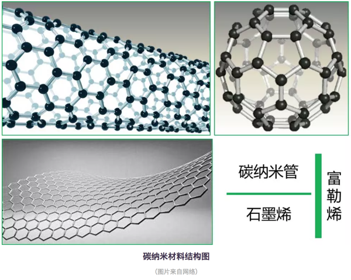
```

### 哪些废弃物可以加工成纳米碳材料？


一般来讲，可以加工成纳米碳材料的废弃物，可以按其环境价值分为两类。一是低值类废弃物。如秸秆、稻草、稻壳等植物类废弃物；动物粪便、剩余污泥等有机质废弃物；以及甘蔗渣、甜菜渣等工业废弃物；二是负值类废弃物，如塑料袋、塑料瓶、海绵、轮胎等。

这两类的大多数废弃物都未得到合理利用，以此类废弃物作为原料制备碳纳米材料，一方面可以降低大规模生产时的成本，另一方面也可解决传统处置方式可能引起的环境污染问题。例如我国农村地区的秸秆（环境黑板报后续会有关于农村秸秆的专题文章）和农膜问题，大量焚烧会造成严重的空气污染和资源浪费。

```{r}
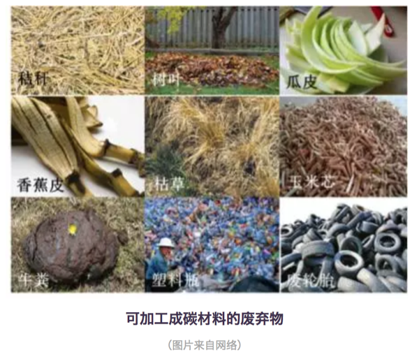
```

### 如何将废弃物加工成纳米碳材料？

一般有水热碳化法和直接碳化法。

水热碳化法是指在密闭环境中，以水溶液为介质，使原料在高温（100-300°C）高压下经过一系列复杂反应生成碳材料的过程（实际上就是将原料洗好、称好，放铁罐子里扔烘箱里反应半天左右就行）。用水热碳化法制备碳材料，因其操作简单、无污染、对仪器要求低、转化率高等优点被广泛应用。此外，水热法合成的碳材料表面通常会含有丰富的官能团，特别有利于其应用在工业废水的处理中。目前，包括木屑、树叶、稻壳、松针、塑料袋、废报纸等废弃物都被成功地通过水热法碳化成碳材料，还有研究通过此法成功地将草变成了荧光碳量子点。

直接碳化法是指将原料置于无氧条件（惰性气体）下，高温（>600°C）裂解成碳材料的过程。（实际上也很简单，就是将原料放到管式炉中通氮气或者氩气加热一段时间就可以）在高温条件下，原料中的挥发性有机物会逐渐被分解直至留下碳骨架。通常，直接碳化法还需加入一些化学活化剂或者氧化性气体来活化碳材料，以使其表面孔隙度和比表面积增强。碳化温度、升温速率、碳化时间等因素都会影响碳材料最终的形貌和性质。用此法合成的碳材料，表面会具有较强的疏水性，所以对有机污染物的吸附能力很强。

### 纳米碳材料在环保领域有哪些用处？

1. 土壤修复

以废弃生物质制得的碳材料具有发达的孔隙结构，当被添加到土壤中时，可以明显改善土壤结构，降低土壤的体积质量[1]。另外，生物质以生物质碳材料的形式贮存在土壤中，Ｃ元素被固定，减少了向大气的排放；另一方面，生物质碳材料也可以为土壤提供Ｎ等营养元素，提升土壤肥力[2]。上海交大曹心德教授认为生物质碳材料还可以用于土壤污染物的稳定化修复，他将具有独特吸附性能的碳材料形象比喻为“吸盘”，对土壤中重金属和有机污染物进行吸附“封锁”，从而阻碍植物对污染物的吸收。Puga A. P.等人将甘蔗秸秆制成碳材料用于土壤中重金属钝化研究，发现其可将Cd、Pb 和 Zn 的有效态分别降低 56%、50% 和 54%，并抑制它们向地上部的迁移[3]。Khan. S.等人使用盆栽试验研究证实， 用污泥制得的碳材料能够减少水稻对As、Co、Cr、Cu、Ni、Pb的吸收[4]。当然，不同的废弃物原材料、碳化温度、碳化方法制得的碳材料物理化学性质不同，其土壤修复的效果也有差异。

2. 污水处理

废水中常见的污染物有重金属离子、染料及其他有机污染物。吸附法处理废水由于工艺简单、成本较低、可利用吸附剂来源广泛等优势倍受青睐。废弃物加工制得的碳材料比表面积大、孔隙度高、表面基团丰富，对吸附废水中的污染物十分有利。研究表明，以废弃物为原料制得的碳材料不仅可以通过表面作用（静电吸引、疏水作用、π-π作用等）对重金属离子和有机物分子进行吸附（adsorption），还能凭借较高的孔隙度对油类污染物进行吸收（absorption）。例如新加坡南阳理工大学张华教授课题组成功将废报纸制得碳气溶胶材料用于油类物质和有机溶剂如氯仿等的去除，取得了较好的处理效果[5]，这为解决海洋原油泄露污染提供了一个潜在的解决思路。印度理工学院鲁尔基分校Vinod K.教授将废轮胎制得的碳材料作为吸附剂处理水中重金属离子，发现其对Pb2+、Ni2+有非常好的吸附能力[6]。陕西师范大学张志琪教授课题组成功将香蕉皮碳化为多空碳材料，发现其对水中典型染料分子亚甲基蓝有较好的吸附去除能力[7]。

3. 能源应用

此种碳材料由于较高的石墨化程度，其电子传递能力较强。又由于生物质中还有大量的N，P，S等杂原子，使得由其制备的碳材料导电性进一步增强。因此此种材料在电化学上也具有广阔的应用前景。例如碳材料因为比表面积大、稳定性好、导电性好、价格便宜、来源丰富而成为超级电容器电极材料的首选。我们日常生活中的新能源汽车、数码相机，甚至楼道应急灯都有超级电容器的身影。例如大连理工大学邱介山教授课题组将虾皮制备成氮掺杂碳材料用作超级电容器，其在电流密度为50 mA/g时，比电容可达357 F/g[8]。利用西瓜皮、麦秸、绿茶、柚子皮、稻壳等制成的碳材料也可作为性能优异的负极材料用于锂离子电池。例如新加坡南洋理工大学于霆教授将竹筷碳化成碳纤维用于锂离子电池，其首次放电和充电质量比容量值分别为500mAh/g和283 mAh/g，且循环稳定性较好，有望替代传统石墨电极在锂电池中的作用[9]。

```{r}

```

### 结语

以废弃物为原料制备的碳材料已被广泛研究用于土壤修复、污水处理和电化学领域，展现出了广阔的潜在应用前景。废弃物来源广泛、价格低廉的性质也使得此概念为大规模商业生产提供可能。然而目前对废弃物碳材料的研究才刚刚起步，处于发展阶段，很多碳材料仅限于实验室制备而没有进行大规模的工业化生产，距离大规模实际应用还为时尚早。

此外，在大规模应用之前，其对环境可能造成的潜在风险也有待进一步研究。这也正是纳米科技目前的发展缩影。正如中国科学院院长白春礼所说：“纳米科技发展方兴未艾，基础科学研究领域中新原理不断建立、新功能材料的涌现与可控制备技术的发展、纳米生物医药的应用探索都体现出纳米科技对人类知识体系的极大拓展以及对生活方式的潜在推动作用。尽管纳米材料显示了产业化以及临床应用的巨大前景，但多数材料目前仍处于实验室研究阶段，如何实现这些材料的功能化、推动商业化应用、相关的生态影响和生物效应是纳米科技发展面临的关键问题”。中国科学院生态环境研究中心江桂斌院士曾将基础研究形象比作翻书：“当书本一页一页翻至最后时，就是量变到质变的时候”。这也同样适用于纳米领域，或许质变之时我们就能用上充电几秒即可充满的电子产品，纳米机器人实现药物精准输送、有的放矢。

文献引用

[1]:陈心想，耿增超。西北农林科技大学学报（自然科学版），2013，41: 167-174．

[2]:Kezhen Qian, Ajay Kumar, et.al.  Renew. and Sustain. Energy Reviews, 2015, 42: 1055-1064.

[3]:Puga A P, Abreu C A, et al. J. of Environ. Manage., 2015, 159: 86–93.

[4]:Khan S, Cai Chao, et al． Environ. Sci. & Technol., 2013, 47 : 8624-8632．

[5]:Bi H, Huang X, et al. Small 2014, 10, 3544.

[6]:Gupta V K, Ganjali M R, et al. Chemical Engineering Journal, 2012, 197: 330.

[7]:Liu R L, Liu Y, et al. Bioresourse Technology 2014, 154: 138.

[8]:Gao F,Qu J Y, et al. Electrochim. Acta 2016, 190: 1134.

[9]:Jiang J, Zhu J H, et al. Energy Environ. Sci. 2014, 7: 2670.

作者：眼神防守
校稿：柴胡半夏苏，yufree
编辑：栟

## 你喝的可能是“有毒”的自来水？！

### 水发生了什么？——水污染

地球是个名副其实的“水球”，水资源总储量约为1.36×109km3，但除去海洋等咸水资源外，只有2.5%为淡水。淡水又主要以冰川和深层地下水的形式存在，储存在河流湖泊中能被人类所利用的淡水仅占全世界总储水量的0.3%， 然而，这极为稀有的淡水，却面临着另外一个不可忽视的严峻问题——水污染。水污染问题使得人类“获得安全可靠的饮用水”这一基本诉求难上加难。

```{r}
knitr::include_graphics('images/dushui1.png')
```

联合国组织秘书长在2002年世界水日发布的新闻稿估计， 全世界有11亿人无法获得安全饮用水。中国的水污染问题尤其严重，如图所示，中国绝大部分地区的饮用水仅满足最低标准，在中南部有些地区，饮用水水质更加糟糕。

```{r}
knitr::include_graphics('images/dushui2.png')
```

### 引起水污染的罪魁祸首是谁？——污染物

近些年来，全国各地水污染事件频发，如2012年12月，位于山西省长治市境内的煤化工厂发生苯胺泄漏入河事件，导致河北省邯郸市发生停水和居民抢购瓶装水，同时由于泄漏苯胺已随河水流出省外，河流下游的河南省安阳市境内红旗渠等部分水体亦检出超标的苯胺、挥发酚等污染物。

综合所有水污染事件可得出，引起水污染的污染物有很多，通常可分为三大类，即物理性、化学性和生物性污染物。

物理性污染物包括悬浮物、热污染物和放射性污染物。其中放射性污染物危害最大, 但一般存在于局部地区。化学性污染物包括有机和无机化合物， 该类化合物近些年来在环境水体中频繁被检出。生物性污染物包括细菌、病毒和寄生虫。随着痕量分析技术的发展，至今从源水中检出的化学性污染物已达数千种以上。在所有的化学性污染物中，微量有机污染物逐渐引起人们的广泛关注，并已成为世界几乎所有地区水污染的首要污染物。

微量污染物是指那些广泛使用但通常在很低或者极低浓度水平就能影响自然环境生物化学过程的有机污染物，包括人工化学合成品，比如活性药物成分、食品添加剂、化妆品成分和洗涤剂成分，以及天然存在的一些物质如激素、生物毒素等。近年来，一些新型微量污染物，例如药物与个人护理品（PPCPs）、内分泌干扰物（EDCs）、全氟类化合物（PFCs）等的环境污染及潜在影响问题已成为各国学者和公众关注的焦点。很多微量污染物具有较强的环境持久性、生物活性、生物累积性和难降解性，如果长期暴露于环境中，对生态系统和人类健康将带来难以预测的潜在风险。我国是各类工业品、药品的生产和消耗大国，工业和人口密集，能源和资源利用率仍然较低，高强度的工业化学品生产、使用和废弃会产生严重的环境效应，因此微量污染物的环境残留问题更是不容忽视。

```{r}
knitr::include_graphics('images/dushui3.png')
```

### 污水处理厂可以使水变干净么？——未必！

为了去除环境水体中的微量污染物，人们寄希望于现有的污水处理工艺。然而，当被污染的水经过污水处理厂处理之后，真的可以变干净么？答案却是未必！

- 微量污染物的去除很难达到100%

近年来，欧盟和一些发达国家开始高度关注水环境中的微量污染物问题，研究发现城市污水中化学物质普遍存在，有些是常规污水处理工艺难以去除的，因此污水排放是河流水体中化学物质的重要来源。

城镇污水处理厂的工艺选择主要基于排放标准中COD、BOD5、NH3-N、TN、TP等常规污染物指标的稳定达标。另外值得注意的一点是，污水中的许多痕量污染物具有一定的毒性，对活性污泥中的微生物易产生一定的抵抗和抑制作用，因此，目前常用的污水处理工艺如活性污泥等对痕量污染物的去除并不能达到100%。同时，在污水处理工艺流程中，部分微量污染物通过活性污泥吸附或者生物降解、水解等得到去除，但许多亲水性物质不能吸附到活性污泥上，导致出水仍然残留相对较高的浓度，释放到接纳水体中，引起水生生物的慢性接触。需要关注的是，某些微量污染物具有中等或较强的疏水性，易于被活性污泥絮凝吸附；但由于仅仅是相的转移而不是降解，这部分被吸附的微量污染物往往随着污泥的处理处置过程进入地表水体或土壤环境中，直接或间接造成潜在的环境与健康风险。城镇污水处理厂出水及污泥是环境中不可忽视的痕量有机污染物的源。

- 残存的微量污染物可能在处理过程中发生二次反应生成更毒的物质

在当前的污水处理厂中，化学降解方法包括光催化氧化，臭氧化和氯化被认为是有效处理微量有机污染物的几种工艺。然而，虽然微量污染物可以在一定程度上被去除，但由于有毒转化产物的生成，使得其环境健康风险却未必消失。有各种报道称，微量污染物在化学降解过程中可能转化成其他的副产物，使得污水处理厂的出水毒性反而较处理之前增加， 这些转化产物最终进入地表水，甚至到达饮用水，对水生环境及人体健康造成更高的生态及健康风险。有研究表明，这些有毒的转化产物可能破坏内分泌干扰系统，干扰人类和动物的激素系统功能。此外，有些有毒转化污染物还可能致癌，致突变和引起生殖系统的病变。例如，在饮用水氯化处理过程中， 有大量的消毒副产物如三卤甲烷，卤乙酸及亚氯酸盐等生成，这些消毒副产物已被证实在较低的剂量下即可以诱发肝癌和肾癌，并可降低精子的自动力，影响生殖系统的发育。

换句话说，人们原本寄希望于去除有毒的微量污染物从而得到干净安全的饮用水，这一目的不仅难以达到，相反，被污染的水在经过污水处理厂处理后可能生成更加有毒的转化产物，使得其环境和健康风险可能更高！更为糟糕的是，民众对于这一现象知之甚少，以为自己饮用的是一杯经过处理之后的干净安全的饮用水，实则却是一杯含有有毒化学物质的“不健康水”！

```{r}
knitr::include_graphics('images/dushui4.png')
```

### 小结        

中国约50%的水源受到微量有机化合物及重金属离子等物质的污染，令人堪忧的是，目前全国县以上4000多家自来水厂中，95%以上仍然使用传统水处理工艺，这些工艺在处理有机化合物及重金属离子时，处理效果并不理想，同时，即使这些传统处理工艺能够在一定程度上去除该类污染物，更加有毒的转化产物也可能会生成使得自来水面临更高的健康风险，而普通民众对于这一事实却无处知晓。

水污染问题的确是个相当棘手的大问题，利益关系错综复杂，要完全改善也并非一朝一夕，是一个缓慢长远的过程! 笔者认为目前的水污染治理还存在诸多问题，首先，水质检测不够专业认真。几乎所有的饮用水专家和学者都认为中国的水质存在严重的安全隐患，但是在众多自来水厂的报告中，却几乎没有一家自来水厂自检水质不合格。这一看似矛盾的现象说明很多自来水厂在水质检测上并不认真，很多时候仅是马马虎虎测一些无关痛痒的参数告知民众自来水是安全的，但是背后真正的问题并没有被揭示出来。其次，污染控制不严，执法力度不够。自来水水质优，首先应得益于严格的水源控制。为保障水源安全，应建立水源保护区，在保护地带内，禁止一切有污染物质的进入，违者应被加以重罚。但我国目前的情况却是，许多工厂非法排污造成水源污染，但是当民众给所属环保部门报告时，监管部门大多并未作出积极的反应，或者即使作出反应，也仅是隔靴搔痒，并未真正杜绝该类地下排污问题的发生。

2015年“水十条”落地，预示着政府将握紧拳头向水污染宣战，笔者真心希望政府在以上问题上加大监管力度，对故意排污造成水污染的当事者予以重罚，同时对环保部门及水质检测部门加以规范，以期对水质状况获得最真实的第一手数据，为日后的水污染治理提供重要的观测基础。

作为与水息息相关的我们每一个人，除了等待政府可以更快更好的解决水污染问题，在日常用水中时要及时观察生活用水的水质变化，看其是否出现异常颜色或浑浊，有无异物及异味等。饮水前先放水，让水流一会儿，将管道中的“死水”流出再饮用。另外如有条件，建议增加具备反渗透膜过滤的净水器。

作者：李立平（博士，毕业于香港科技大学，从事水处理领域近7年，在相关研究领域发表学术论文数篇）
校稿：yufree，大石
编辑：丫头晚安

## 一滴水的故事

曾几何时，一滴水随着千万个同伴出现在这个星球。他们开始塑造这个星球，改变着地貌，孕育着生命。人类从出现的那一刻起，就开始了与水相爱相杀的历史。从两河流域的空中花园到尼罗河流域的金字塔，从马拉松的烽火到牧野之战的硝烟，水，孕育了地球最初的文明。同时，人类早先的传说，从诺亚方舟到大禹治水，又无处不在昭示着人类对水的敬畏。

水与人类的相爱相杀一直在进行着。有一滴水躲在茶壶里变成了蒸汽，告诉一位叫瓦特的人这样的力量可以推动机器运转，于是推动了轰轰烈烈的工业革命；有一滴水和同伴们一起构成了江、河、湖、海，让人类可以物流南北、货往东西，文明的火种得以靠水传播。

人类使用着水，也污染着水；净水养育着人类的同时，污水却时刻威胁着人类，这样的相爱想杀更是直接催生了我们的专业——环境科学与工程。此刻我们对水充满敬畏，毕竟水撑起了整个产业链上的勤劳的人们。水进入大气在不利的气象条件和污染物参与的情况下，形成雾霾，这一点我们在《混沌的冬日》里已经写过；水进入城市，若无法正常下渗、排除，则形成内涝，这直接催生了海绵城市的建设思路，这一点我们在《城市之殇》中已经展现；即使不听话的、因污染而变坏的水，工程师们不死心，坚信每一滴水都是清纯的，于是我们人类建立了污水处理厂，通过活性污泥法和生物膜法等工艺，使受污染的水改头换面，还清还纯，而这在《污师私房菜》中，我们也有所提及。

地球的水储量是巨大的，然而淡水资源却是如此的稀缺，环境工程师们在累死累活守护净水的同时，一个“开源”的灵感开启了水资源的另一段神奇之旅：

### 海水淡化

海水淡化方法主要分为热法和膜法。

热法：海水的盐度很高，直接饮用只会越喝越齁，但早在公元前1400年，海边的居民便学会了在锅内把海水加热到沸腾，使海水蒸发变成水蒸汽，盐分留在锅底成为垢，并使水蒸汽遇冷成为可饮用的蒸馏水。这也是今天常用的蒸馏法海水淡化的原型。而现代常用的热法海水淡化主要有多级闪蒸和低温多效两种。

```{r}
knitr::include_graphics('images/seawater1.png')
```

膜法：1950年美国佛里达大学瑞德（C.E.Reid）教授在无意间发现了一个奇怪的现象。他观察到海鸥在海上飞行时从海面啜起一大口海水，隔了几秒后，吐出一小口海水，这个现象引起了他的思考。后来经研究发现，海鸥体内有一层薄膜，该薄膜非常精密，海水被海鸥吸入体内后，经过压力作用使水分子穿透薄膜转化为淡水，而含有杂质及高浓缩盐分的海水则吐出嘴外。于是，受此启发，瑞德教授提出了反渗透的基本理论。反渗透膜如同一只特殊的过滤筛子，在压力下过滤掉了水，而留下了盐（看到这里我觉得瑞德教授至少不是一个喜欢吃野味的人）。运用这一原理，我们就可以利用反渗透膜从盐水中获取淡水了。

```{r}
knitr::include_graphics('images/seawater2.png')
```

我国人口占世界22%，淡水占有量却仅为8%，世界排序名列109位，是世界上12个严重贫水的国家之一。而海洋中蕴藏着丰富的淡水，其总量约占海水的97%，相当于13.3亿立方公里之多，是一个巨大而又稳定的淡水储库。海水淡化作为水资源的开源增量技术，具有稳定供水、应急供水和战略性供水的特点，是解决沿海水资源短缺问题的重要途径。笔者收集了我国沿海地区人均水资源情况，发现沿海地区由于经济发展水平和人口密度较高，缺水情况反而高于全国平均水平，形成了靠水没水的情况。海水淡化成为了一些沿海地区解决缺水问题的关键手段之一。

```{r}
knitr::include_graphics('images/seawater3.png')
```

我国海水淡化的历史始于上世纪五十年代。至2015年，全国总产能已经超过百万吨，约为全球海水淡化总产能的2%左右。随着经济的发展，我国在国际海水淡化市场的比重逐渐增加。如下图所示，我国在这一年的产能增长约为中东地区的一半左右。中东地区存在一些自然条件上的限制，促使他们更加积极地开发海水淡化技术，因此中东地区历来是海水淡化最重要的市场，所以我们国家海水淡化产能比不过这些土豪真的不丢人。

```{r}
knitr::include_graphics('images/seawater4.png')
```

目前我国已建的海水淡化产能主要集中在辽宁、天津、河北、山东等北方省市，这四省市产能占我国海水淡化总产能的81.9%（2014年数据，见下表）；与此对应的是不同省份对于海水淡化的关注度，下图是来自海水淡化的网络搜索指数，排行前五分别是北京、广州、浙江、江苏、山东,从中不难看出，海水淡化的关注度和接受水平也与地区的经济发展状况息息相关。

```{r}
knitr::include_graphics('images/seawater5.png')
```

2016年12月，国家发改委和国家海洋局联合印发的《全国海水利用“十三五”规划》指出，到“十三五”末，全国海水淡化总规模拟达到220 万吨/天以上，其中沿海城市新增海水淡化规模105 万吨/天以上，海岛地区新增海水淡化规模14 万吨/天以上。而海水直接利用规模拟达到1400 亿吨/年以上，海水循环冷却规模达到200 万吨/小时以上。新增苦咸水淡化规模达到100 万吨/日以上。海水淡化装备自主创新率达到80%及以上，自主技术国内市场占有率达到70%以上，国际市场占有率提升10%。相信未来海水淡化会有更快的发展。海水淡化项目在某种程度上是一种基础建设项目，与各级政府的施政方向密不可分，所以虽然国家出台了一系列的规划政策，具体落地还是需要很长一段路。

### 后记

2010年，我们像一个一个水滴汇入了中科院这个汪洋大海，拥有了这片汪洋大海里的化学物质。随着时间的推移，我们又流到了其他地方，在各自的岗位上吸收了新的化学物质。不同物质间的反应总能产生新的物质，所以我们决定讲我们的源，讲述我们每一滴水的故事。

作者：yy 
校稿：胜利屯支书，看透 
编辑：栟

## 小秸秆，大问题

2017年11月，演员孙艺洲拍戏途径哈尔滨，被郊县烧秸秆的烟熏味儿呛到流泪，随后在微博上抱怨：为什么一个白天空气质量优良的城市到了夜晚就空气爆表?为什么?怎么办?这个问题并不算新，但当它被一个拥有一千多万粉丝的耿直boy问出来的时候，还是结结实实触到了很多人的痛处。

```{r}
knitr::include_graphics('images/stalk1.png')
```

在哈尔滨，把孙艺洲呛到流泪的是秸秆焚烧产生的颗粒物。每年秋收以后，庄稼被打捆、加工、再被送到每个人的餐桌上，算是完成了自己的历史使命;但秸秆这种副产品却被留了下来。

在田间地头，常常可见成垛的玉米或者小麦秸秆，勤快点儿的农户，将其垛得整整齐齐，也算是道风景;懒一些的，堆放得毫无章法，影响观瞻。

其实这个时候农民是真的忙。每年10-11月，是我国 “秋收秋种”期，各级农业部门一级战备、高度紧张，密切关注天气变化和降雨量，一轮又一轮的“紧急通知”，为的是指导农民收得时机合适，种得不早不晚。因为只有这样才能保证丰产丰收。

我们大东北黑土地在这个时候是收玉米种小麦，秋收整地追求“深、净、细、实”，小麦播种要在适宜播种期抢播早播。收下来的玉米秸秆无处可放，尽管我国80年代起就出台各种秸秆禁烧的相关规定，禁烧态势越压越重，但比起秸秆处理的经济压力和劳动力需求，很多农民不由自主就选择用“一把火”解决问题。

不烧不行啊，秸秆太多了。1991年我国秸秆产量为6亿多吨，经过了粮食总产量的“十三连丰”，到2015年，秸秆产量为10亿多吨。多出的秸秆总量为4亿多吨!什么概念呢?如果把这4亿多吨秸秆以100根为一扎首尾相连，能绕地球赤道转325000圈……

```{r}
knitr::include_graphics('images/stalk2.png')
```

不烧不行啊，农民家里实在没人。壮劳力都出去打工了，只剩下老人和孩子，尽管乡里承诺可以集中处理，那也需要把秸秆运输到集中处理点，老人孩子不会开车，没有工具，再好的政策也解不了眼前的急。

但烧秸秆的确是后患无穷。农作物光合作用的产物有一半以上保留在秸秆里，它富含氮、磷、钾、镁和有机质，秸秆大量集中燃烧的过程也是一种剧烈释放能量和物质的过程，周围环境根本无法在短期内消纳这么多的释放物，大气污染因此产生。

跟燃煤锅炉引起的污染不同，秸秆焚烧的主要产物是颗粒物、一氧化碳、二氧化碳等，对城市和乡村的低空空气影响更为直接。然而在大气污染研究领域，秸秆燃烧对雾霾的贡献一直颇有争议。

撇开具体贡献率不谈，稍加研究便可发现：在10月和11月的秋收期，从华北到东北(每年秸秆主要燃烧区)，雾霾符合低硫份、高悬浮颗粒物、连片集中爆发的特点。

换句话说，叠加了大规模的秸秆焚烧，使得轻中度采暖季雾霾立刻升级为大范围重度雾霾。环保部10月期间的卫星遥感巡查监测数据分析表明，在16个省(区)共监测到疑似火点1583个，比2014年同期增长74.5%，也的确证实了秸秆燃烧对雾霾的推波助澜“功效”。

所以，怎么办才好?秸秆问题和我国的大多数农业问题一样，工程浩大、解决起来困难重重。

目前秸秆的综合利用工作虽在稳步推进，但仍存在很大问题：一是秸秆还田成本高，运营公司与农户缺乏主动性;二是农民缺乏必要的技术支持，导致秸秆无法真正实现废物利用。

就东北地区来说，冬季气温偏低，秸秆还田要想充分被土壤消纳，必须使用进口农机深度翻耕，进一步增加了还田成本和土壤压力。说白了，东北地区黑土地耕作土层只有20厘米，想翻耕30厘米好让还田秸秆快速腐烂，需要钱，需要时间，需要人力，需要对新茬农作物减产的心理预期。

与这些困难形成对比的是，政府部门越来越强硬的禁烧手段。自1997年起，我国开始重视秸秆禁烧和综合利用工作，到2008年明确农作物秸秆综合利用分工、确定综合利用比例，再到2014年重拳出击京津冀及周边地区，提出部分地区全部实现秸秆综合利用的目标，禁烧力度越来越大。

进入2015年以后，我国出台了“史上最严”大气污染防治法，明确了县级人民政府应该补贴支持秸秆收储运和综合利用服务，并规定：露天焚烧秸秆的，可以处五百元以上二千元以下的罚款。

```{r}
knitr::include_graphics('images/stalk3.png')
```

为了彻底杜绝火点，在大气污染防治法的框架下，有些省份开出了自己的处罚清单。河南省在增加督查和暗访的基础上，以环保部公布的秸秆焚烧卫星监测火点数为依据，以县(市、区)为单位，出现一个火点，省财政扣拨县(市、区)财政资金50万元，力度之大空前绝后。

秸秆问题逐渐进入人们的视线并得到如此重视，除了它与雾霾之间千丝万缕的联系之外，还因为它的确是农业和环保领域牵一发而动全身的节点。

一根秸秆，一头连着三农，一个敏感脆弱又是万事之本的领域，一头连着环保，一个同样是成长痛点难点的行业。不能烧，但也不能接受粮食减产!粮食减产，根基没了，中国人民要挨饿;烧秸秆，污染加剧，人民叫苦连天。相信很多民生问题都是如此。

好在中国人民是世界上最勤快的人民。纵观其他国家，在面对这个问题的时候农民往往是两手一摊，对执法人员说“我没办法呀!”……毫无悔改之意。

美国作为一个重要的粮食输出国，直到2011年在中部和东南部仍有大量火点发现，可比我国东北严重多了，有NASA图为证。印度人民更是开挂，烧着秸秆接受记者采访，大大方方毫不避讳。

<embed height="415" width="544" quality="high" allowfullscreen="true" type="application/x-shockwave-flash" src="//static.hdslb.com/miniloader.swf" flashvars="aid=17180921&p=1"></embed>

秸秆的五料化利用技术(肥料化、饲料化、基料化、燃料化、原料化)并不高深，而秸秆问题的处理方式千差万别，对应效果天壤之别。

```{r}
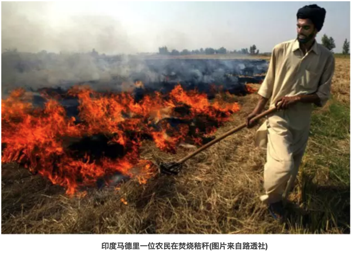
```

解决秸秆问题，一个靠重视，一个靠财政。回看我国，重视程度和经济投入力度都需更进一步。

2007年，美国政府投资1.25亿美元建设了3个生物能源中心，专门进行纤维素生物能源研究。同年，美国农业部出资1400万美元、能源部出资400万美元，共同设立基金研发生物燃料、生物能源及相关产品的研究与开发。

据统计，2008-2012年，美国政府对生物质研发法中涉及的项目共计投资了1.18亿美元。除了对研发环节和支持外，美国对可再生能源发展规定了技术开发抵税和生产抵税的措施，生物质发电和秸秆纤维素乙醇项目都享受响应的税收补贴或者减免。

对比我国，2016年，农财两部门整合资金10亿元，选择秸秆焚烧问题较为突出的10个省份开展秸秆综合利用试点，取得了初步成效。果然真金见实效。

现在秸秆综合利用的主要方法是还田(直接和间接)，直燃、气化、制沼，制醇和用作饲料、栽培基料等。

还田的方式简单、粗暴、直接、见效快，被各地采用最多，但由于地域差异明显，也存在一些弊端和后患。

直燃、气化、制沼和制醇等方式都需要大量的经费投入，各省由于财政状况难以统一，无法按照某个标准整体推进;另一方面，秸秆禁烧和综合利用与农户素质密切相关，在加大财政投入的同时，提高农民认识，增强回收利用秸秆的积极性也是较为有效的措施。

而在环境黑板报更新的《纳米非米》中，提出了以秸秆等有机废物为原料制备生物碳材料“以废制废”的观点，也是秸秆处理另一条可选择的路径。

```{r}

```

```{r}
knitr::include_graphics('images/stalk6.png')
```

### 结语

据悉，今年11月份哈尔滨火点问题爆出以后，相关责任人已于近日被环保部约谈，东北秸秆问题治理的机遇和挑战也随之而来。秸秆燃烧这种事，连遥感卫星都看得到，还怕执法部门不知道吗?小秸秆、大问题!希望所有的环保责任人能够直面问题，应对挑战。在关注大动向时，不忘记身边还有这样的“小事情”也同样需要我们的努力!

作者：胜利屯支书
校稿：广播站王站长、柴胡半夏苏
编辑：竹而乐

## VOC减排——大气治理的新挑战

### 前言

“今天空气质量怎么样？适不适合户外活动？”关注空气质量已经成了人们日常生活的一部分。由于人口增长和工业及经济的快速发展，人类在生活和生产中向大气中排放的污染物量也日渐增多，主要包括二氧化硫、氮氧化物、烟粉尘等颗粒物、挥发性有机化合物（Volatile organic compounds，VOCs）等等，而由此引发的大气污染问题也层出不穷：除了被热议的灰霾，酸雨、温室效应、光化学烟雾、臭氧层破坏、有毒物质扩散等也不容小觑。随着《大气污染防治行动计划》的实施，我国对二氧化硫、氮氧化物、烟粉尘排放控制取得明显进展，但VOCs防治工作相对滞后。目前，VOCs减排已经成为大气污染防治的重点。VOCs是什么？对于局外人来说，可能非常陌生，但在大气治理的圈子内，它已经火的不要不要了。那么，挥发性有机物到底是何方神物，会引起如此大的关注？

### VOCs是何物

#### VOCs的定义

学术界对于VOCs的定义是指沸点在50~260℃，室温下饱和蒸汽压超过133.32Pa的易挥发性有机化合物。简单点说，挥发性有机物首先是有机物，然后这种有机物容易由液态转为气态物质进入环境空气中。举个例子，装修完之后，很多朋友会关心甲醛的问题。甲醛是胶粘剂的主要成分，板材中残留的和未参与反应的甲醛会逐渐向周围环境释放，甲醛就是生活中最常见的VOC。除了甲醛，生活中接触到的油漆、汽油等都含有VOCs。

```{r}
knitr::include_graphics('images/voc1.png')
```

VOCs之所以被关注、被研究、被减排，就不得不说说它的危害。VOCs不仅危害环境，而且危害身体。一方面，VOCs是大气环境中光化学反应的前体，在阳光照射等特定条件下，会与环境空气中的化学物质，发生一系列光化学反应，生成臭氧，而形成光化学烟雾。同时，VOCs也是灰霾重要的前体物质，通过对细颗粒物（PM2.5）源解析，大气中VOCs在PM2.5中的比重占20~30%，还有部分PM2.5由VOCs转化而来。

```{r}
knitr::include_graphics('images/voc2.png')
```

另一方面，大多数的挥发性有机物均有病理毒性，都对人体各器官组织有较大的危害作用。以甲醛为例，其在室内达到一定浓度，可引起眼红、眼痒、咽喉不适或疼痛等症状。

```{r}
knitr::include_graphics('images/voc3.png')
```

VOCs排放源主要包括自然源和人为源。自然源主要为植被排放、森林火灾、野生动物排放和湿地厌氧过程等，属自然界的正常规律，源和汇处于平衡状态。而人为源大致可分为工业源、生活源、农业源和移动源。有调查报道，我国VOCs的工业源和交通源为主要的人为源，分别占43%和28%。

```{r}
knitr::include_graphics('images/voc4.png')
```

其中工业源排放企业涉及的行业有电子信息、纺织印染、石油化工、家具、木材加工、塑料橡胶制品加工、包装印刷、制药等，这些行业也正是目前我国主流工业。正因为人类活动，越来越多的VOCs进入大气中，在环境空气中的累积，打破了自然界VOCs源和汇的平衡。

```{r}
knitr::include_graphics('images/voc5.png')
```

1940年至1960年间，美国洛杉矶多次发生光化学烟雾事件。在1952年12月的一次光化学烟雾事件中，洛杉矶市65岁以上的老人死亡400多人。1955年9月，由于大气污染和高温，短短两天之内，65岁以上的老人又死亡400余人，许多人出现眼睛痛、头痛、呼吸困难等症状甚至死亡。事件的主要原因是汽车尾气排放了大量的碳氢化合物，在阳光照射下，发生光化学反应，产生有毒气体。这是人类首次认识到VOCs的严重危害，因此，洛杉矶对VOCs的关注走在了世界的前列。1963年，美国以《清洁空气法》的规定为基本依据，要求卫生教育福利部处理空气污染问题，明确机动车对空气污染的影响，并通过环境保护署制定和颁布限值VOCs污染排放的一系列标准，指导全国执行VOCs排放限值。1970年7月，日本东京出现了光化学烟雾现象，几所大学连续出现学生眼睛疼痛、呕吐等现象。因此，日本在VOCs污染排放方面的关注也比较早。

```{r}
knitr::include_graphics('images/voc6.png')
```

### VOCs的减排之路

#### 国家层面

我国尚未出现过VOCs污染事件，因此对其关注较晚，2000年，《中华人民共和国大气污染防治法》中仅有诸如有机烃类尾气、恶臭气体、有毒有害气体、油烟等类似概念。

随着灰霾问题的深入研究和环境空气中臭氧浓度升高问题，VOCs逐渐被重视。为改善大气环境质量，促进VOCs削减，我国出台了一系列的政策。2013年，国务院出台《大气污染防治行动计划》，明确要对石化、有机化工、表面涂装、包装印刷等行业实施VOCs综合整治，全国范围内的VOCs减排正式启动。同年，环境保护部编制了《挥发性有机物（VOCs）污染防治技术政策》，为VOCs减排提供了技术规范支持。2015年8月29日第十二届全国人大常委会第十六次会议通过了《中华人民共和国大气污染防治法》，自2000年修订以来，首次增加对VOCs控制要求，从此VOCs减排有了法律依据。这些政策的颁布，从计划到技术、再到立法，逐渐指明我国VOCs减排方向。

在部门规章方面，国家发改委、环保部、财政部、工信部、质检总局、能源局等部委相继出台了有针对性的VOCs污染防治相关文件。各部门相互配合，共同打好VOCs减排攻坚战。

在技术标准方面，我国《大气污染物综合排放标准》（GB162972-1996）对14类VOCs规定了最高允许排放浓度、最高允许排放速率和无组织排放限值，其中包括甲醛、苯、甲苯、二甲苯等挥发性有机物。针对不同的有机污染物排放源以及污染源和环境空气中VOCs的监测技术，截止到2017年，环保部总共制订了15个涉及VOCs的排放标准和20个监测技术方法。从标准实施年限来看，2010年以前，只有3个排放标准和8个监测技术方法，其他都是近几年开始实施。技术标准的制定，为VOCs减排提供了监测和排放依据。

#### 地方层面

为积极推动VOCs减排，各地结合地方实际，出台了一系列相关的政策法规和标准方法。表 1列举了北京和江苏省的VOCs污染防治政策。由表 1可见，我国地方从2010年前后，开始加强对VOCs进行管控。近一两年，VOCs污染防治成为各地大气防治的重点工作，各地不断完善VOCs减排政策措施。

```{r}
knitr::include_graphics('images/voc7.png')
```

在技术标准方面，国内出台VOCs排放标准的省市并不多，以北京、江苏、浙江和广东为例，各地根据当地的产业特点，制定了相关VOCs排放标准。近两三年，北京连续制定了12项地方排放标准，涉及的行业有印刷、家具制造、炼油和石油化工、汽车、工业涂装和建筑涂料等；江苏重点针对化学工业和表面涂装行业，制定了相关地方排放标准；浙江以化学合成制药、制鞋、化学涂装、纺织染整行业为重点行业；广东以集装箱制造和电子行业为重点行业。

### VOCs减排技术和挑战

对VOCs减排的主要技术思路是源头控制和末端治理。简单的说，源头控制就是从原料开始，减少VOCs的产生。末端治理，顾名思义，将产生的VOCs进行最终的销毁。有两类基本技术，一类是回收技术，对排放的VOCs进行提纯处理，再资源化循环利用。主要包括吸收、吸附、冷凝和膜分离方法等技术。另一类是销毁技术，将排放的VOCs分解化合转化为其他无毒无害的物质。主要包括活性炭吸附、低温等离子、热力燃烧、催化燃烧等技术。

涉及VOCs排放的行业众多，污染物种类繁多，废气成分复杂，因此，在对VOCs减排时，要考虑技术上有效、经济上可行，往往这两者很难平衡，这也是VOCs减排面临的最大的挑战。

### 小结

因此，虽然我国对VOCs的管控起步较晚，为改善环境空气质量，近年来，我国已将VOCs减排作为一项重点工作，出台了相应的法律、法规、政策、技术规范等，并迅速形成一套体系，为VOCs污染防控指明了方向，提供了支撑和保障。

“大家非常关心中国会不会发生光化学烟雾事件，中国政府也高度关注。我们组织过专家分析，世界历史上发达国家发生的光化学烟雾一般臭氧浓度都达到了600以上，个别城市2000以上。中国的臭氧浓度远低于此，所以中国现在和将来不会、也极少可能会发生光化学烟雾事件。”引用环保部大气环境管理司司长刘炳江的一段话，作为总结，相信我国VOCs减排之路，对环境改善有重要的意义。

作者：远方老友
校稿：广播站王站长、柴胡半夏苏
编辑：栟

## 生态•五行•人伦

```{r}
knitr::include_graphics('images/swr1.png')
```

```{r}
knitr::include_graphics('images/swr2.png')
```

往事有时令人不忍直视。想当初，环境保护也曾贵为与计划生育相互比肩的两项基本国策之一。然而，一直以来，世人只知后者威加海内，却与前者对面不识。三十年河东，三十年河西。现如今，环境保护俨然已成尚方宝剑，坐拥一票否决权，何止扬眉吐气，大快人心。人们对生态环境保护的关注前所未有。本文也顺着风向，用陈词旧调来赶一次时髦。

一般来说，人们生活的环境通常分为自然环境和社会环境。自然是天与地，天与地之间的万物按照“道”的规律循环不息的现象和状态，包括人类和其他生命世界、物质世界的一切活动。生态是指生物在一定的自然环境下生存和发展的状态。我们人类研究生态，也就是要研究怎样保护和利用自然环境以服务人类的发展，也就是要弄清楚自然是怎样在影响着人类的活动。

研究生态的原理和方法很多，无论东方和西方，还是古代和当代，都有自成体系的表达。本文主要介绍一下在中国古代的五行理论中环境是怎样影响人的。

150年前，马克思提出：“运动着的物质世界是普遍联系和永恒发展的”；3000年前，五行系统理论把这些运动、联系和发展以取象的方法做出了精致的总结。

在五行理论中，根据运动和显现的方式将事物分为木火土金水五类。五行包括气（炁）和象，属于同类五行的事物相互感应。所谓的“天人合一”、“天人相感”，在这个角度讲就是天、地、人、万物之间是一体的，是一直在相互感应的。

为了问题聚焦，我们在这里不具体讨论感应的媒介是电波、磁场，还是量子纠缠，只强调说当某一类五行出现问题的时候，属于这一类五行的所有事物都会受影响。也就是说天地间某一类五行的气（炁）出现问题了，那么赖以这一类五行的气（炁）所支撑的象必然也就要出现问题。我们也不在这里科普具体的五行系统理论，只是应用五行的理论来探讨生态与人伦的问题。这里的人伦包括人的社会伦理和家庭伦理。

```{r}
knitr::include_graphics('images/swr3.png')
```

限于篇幅，此次只简单讲一个离我们最亲近的五行：大地母亲——土五行。

当前，土壤中重金属超标、农田里化肥农药高残留等问题，导致土地受到了普遍破坏。因为破坏的规模和程度足够大，引起了“土”五行气（炁）和象的破坏。

土对应信。所以，当前社会诚信普遍缺失。具体表现为：人们说过的话容易变卦，谈好的事兑现不了（谈十个事情甚至成不了一个），签过的协议无法履行，约定的日期时间不能遵守，制售贩假货泛滥。这里的真实情况不一定是人们主动的不讲诚信，有很大部分是环境在对事件本身产生影响。

土对应怨、脾胃、祖辈、口、安全感。土德受损，人们遇到问题容易怨天尤人，脾胃功能不好，与祖辈少有连接和沟通（包括祭祖），容易打妄语（恶口、两舌、绮语、诳语），贪吃、什么都吃而且吃不到什么好东西。人们普遍缺乏安全感。

土地肥沃、平坦、无污染的地区，人们则是讲信用、不怨人（心胸开阔）、与祖辈亲近（老人容易有儿孙绕膝的天伦之乐）、饮食有节制、不妄语、脾胃好，有安全感。

当土地出了问题，其生长出来的食物自然就要受影响，导致人吃了之后也就有问题。土地贫瘠，土壤中某些元素过剩、毒素残留，会导致食物营养成分不全或者有毒素，人吃了之后自然就会在心理和行为上有相应的表现。吃水培（无土栽培）食物也是如此。长期如此，整个社会也就出现变化。

土地缺失或者供应不足，土地状态被破坏，都会对当地的人和社会状态产生相应影响。

另一方面，一方水土养一方人。医院里的营养师都知道，北方人需要补充维生素的话要吃苹果，而吃香蕉的效果就不如苹果理想。但陕西的苹果的营养对陕西人最适用，本地人最适应本地的农作物。转基因的农作物结出的果实因为无法再当作种子进行发芽生根，所以人吃了会影响生育。

脾属土，主肌肉。人是父精母血交媾而成，从父亲那得了骨，从母亲那得了肉。断奶之后，我们靠土地长出的食物来长肌肉。断奶前应该食母乳。现在人们都是给孩子喂牛奶。而牛奶适合牛的胃，适合牛的营养需求。当前婴儿普遍吃母乳不足，容易导致肌肉和脾胃系统出现问题，长大与母亲不太亲近，也会影响孩子土五行的运转和土德的圆满。

土五行就是这样影响着人与自我的和谐、与家庭的和谐、与社会的和谐。有一个好的生态系统，首先是有好的土地，因为土地不仅是五行之一，还担当着万物的生化、收纳和承载。

```{r}
knitr::include_graphics('images/swr4.png')
```

作者：含章
编辑：栟

## 油田环保之痛——含油污泥

### 序：油田环保的痛处

石油作为一种重要的资源，在国民经济发展中具有支柱性地位，不仅支持着工业农业生产，也与每个人的生活息息相关。2011年至2015年间，我国每年的石油开采量持续高于2亿吨。

```{r}
knitr::include_graphics('images/youni1.png')
```

石油资源开发与使用过程中造成的污染是令全世界头痛的一大难题。举世震惊的墨西哥湾漏油事件，造成了严重的生态灾难，令难以计数的生物遭遇灭顶之灾，沿岸生态遭遇了极大破坏，也使得石油生产过程中的环保问题引起了大众的关注。事实上，在石油业的生产过程中，除了事故导致原油泄露造成的直接环境污染外，在石油开采和加工过程中产生的含油污泥也是一个重要的污染源，且会对周边生态环境造成持续性的危害。

```{r}
knitr::include_graphics('images/youni2.png')
```

### 含油污泥的来源

含油污泥，简称油泥，是在石油开采、运输、炼制及含油污水处理过程中产生的含油固体废物，是由石油烃类、胶质、沥青质、泥砂、无机絮体、有机絮体以及水和其它有机物、无机物牢固粘结在一起的乳化体系。

含油污泥主要产生在油田和炼油厂，分为3 种类型，即落地油泥、集输油泥和炼厂油泥。落地油泥是在油田开发特别是油井采油生产和井下作业施工过程中，部分原油放喷或被油管、抽油杆、泵及其他井下工具携带至地面，进而渗入地面土壤形成的油泥；集输油泥是储油罐在自然沉降中产生一些油泥，也称之为称为罐底泥；炼厂油泥主要细分有三种，分别为隔油池底泥、溶气浮选浮渣和剩余活性污泥等，其中以浮选浮渣量为最大，占三泥总量的80%。

```{r}
knitr::include_graphics('images/youni3.png')
```

目前，我国每年产生近百万吨的含油污泥，若加上石油化工产生的“三泥”（生化污泥、池底污泥及浮渣），油泥的总量还要大得多，而且炼厂的规模越大，含油污泥的排放量越大。

### 含油污泥的成分与特性

含油污泥成分非常复杂，含有大量的老化原油，固体悬浮物，以及细菌质等固体废物，其中原油是主要的成分。油泥中含有数百种有毒有害化合物，其中的某些化合物(多环芳烃等)具有“三致”效应；另外含油污泥中往往含有苯系物、酚类等物质。美国环保署(EPA)将其列为优先污染物，并且对其排放有严格的限制，我国也将油泥列入《国家危险废物名录》。

含油污泥的特性：一般含油污泥的含油率约10%-50%，含水率约40%-90%。黏度高，难以沉降，脱水效果差，污泥固相颗粒细小，油、水密度差小，这些都是含油污泥黏度大、难以除油脱水的主要原因。

### 含油污泥的危害

含油污泥因其体积庞大，并含有大量的有毒物质，直接进行排放会占用大面积的土地，同时伴有非常难闻的气味，对附近的土壤、植物、水体、空气造成严重的污染，最终对人体产生极大的危害。

- 影响土壤的性质

当含油污泥中的石油烃类等物质渗入土壤后，会在土壤颗粒表面黏着，直接影响土壤的通透性，从而造成土壤导水通路的阻塞，进而造成土壤渗水量的下降，透水性的降低，最终使土壤的性质发生改变，直接威胁到土壤中的微生物生存。

```{r}

```

- 危害植物生长发育

植物的组织内部能够被含油污泥中的低分子烃类物质渗透，从而破坏植物的正常生理机制；而含油污泥中的高分子烃类会很容易在植株表面形成一层粘性膜，将直接阻塞植株的气孔，植株的水吸收作用以及呼吸和光合作用都会受到严重的影响，最终会造成植物根系的腐烂，植被的破坏将会引起生态系统中食物链的破裂，会导致生态系统中最初级生产者失去制造有机物和氧气的能力。

```{r}
knitr::include_graphics('images/youni5.png')
```

- 污染水体

含油污泥中的石油类污染物浸入地下水后，直接对饮用水资源和地下水资源造成影响，危及人类生命安全。另外，含油污泥处置不当，可能会使石油类污染物在水体中聚集，如码头、港口、河道沿岸等，破坏水体环境。

```{r}

```

- 危害空气质量

含油污泥中的低沸点有机污染物极易挥发至空气中，有机硫化物、苯类、酚类等有害物质具有致癌、致畸、致突变的作用，随着呼吸进入人体，直接对人体的肺、胃、呼吸系统、神经中枢系统产生严重的危害。

```{r}
knitr::include_graphics('images/youni7.png')
```

### 相关控制标准

在国家层面，目前与含油污泥相关的控制标准有《危险废物填埋污染控制标准》（GB18598—2001）、《危险废物焚烧污染控制标准》（GB18484—2001）、《农用污泥中污染物控制标准》（GB4284—84）。在《危险废物填埋污染控制标准》和《危险废物焚烧污染控制标准》标准中，将含油污泥归类为危险固体废物，但并没有对含油污泥的油含量提出量化指标。在《农用污泥中污染物控制标准》中，对污泥中的矿物油含量做了明确规定，要求土壤中矿物油最高允许含量不得超过3000 mg/kg（≤0.3％）。地方层面主要有以下三省份制定了相关标准：2010年12月，黑龙江省发布了《油田含油污泥综合利用污染控制标准》，明确规定了含油污泥用于农用、铺设油田井场和通井路的污染物控制标准；2016年7月，陕西发布《含油污泥处置利用控制限值》，规范含油污泥回收利用处置；2017年6月，新疆维吾尔自治区发布《油气田含油污泥综合利用污染控制要求》。

```{r}

```

### 含油污泥的处理处置

如果含油污泥得不到妥善处理，将造成资源的巨大浪费，同时也会对环境造成不可挽救的破坏。因此，采用合适的处理方法对含油污泥进行资源化与无害化处理，不仅可以减少环境污染，而且还能达到资源再利用的目的。当前的油泥处理技术主要包括热解法、调质离心分离、固化处理、焚烧、焦化、填埋、溶剂萃取、热碱水洗、电化学技术、生物处理 (包括地耕法、堆肥法、污泥微生物反应器法)等。

由于含油污泥来源广泛、成分复杂，同时处理技术种类繁多，且都存在各自的应用弊端和适用范围(不同技术的特点比较如下表)，目前尚无任何一种技术可以作为处理所有类型含油污泥的理想方法。通常要根据油泥的来源及特性，有针对性地选择一种或者多种组合技术实现油泥的治理。

```{r}

```

### 处理存在的难点和技术展望

随着新环保法的通过，各地对油田环保的要求越来越高，含油污泥的随意排放将不再可能，各地隐藏的污染也被逐渐揭开。这对污泥处理行业来说，无疑发展前景利好。尽管油泥处置发展前景好，市场也很大，但是目前含油污泥处置也存在一些难点，同时对其发展前景进行梳理如下：

- 含油污泥中最难处理的是重质油油泥，其黏度大，沥青质及胶质含量高，回收难，在现有的工艺设备处理过程中成本较高，设备折旧快，因此降黏预处理是此类油泥处置的重要环节；

- 热解方法由于是在厌氧环境条件下热源对含油污泥间接加热，能够通过油气组分的挥发分离实现油泥中石油组分的回收，同时降低残渣中的含油率，是一种油泥无害化与资源化的综合处理工艺。因此，该技术是近三年来油泥处置行业极为推崇的热点实用工艺，尤其在能源价格低、油泥组分中砂质组分含量的西北地区的油泥，更适合推广该技术；

- 热解方法尽管处理含油污泥非常实用有效，但是与调质离心等减量化工艺相比，仍存在耗能高、处理规模小等问题，因此，在以后的研究过程中亟待开发提高热解处理效果与规模的带有新型热源的新一代热解设备；

- 微生物及植物修复方法尽管修复周期长，却非常适合低浓度石油污染的场地及油泥处理，是物理与化学方法后续深度处理含油污泥的重要补充措施。为了使植物修复最终成为解决实际环境问题的有效手段，如何将石油污染的植物修复从盆栽实验的研究成功转向田间试验及实际的工程尚需进一步的深入研究；

- 目前含油污泥高级氧化技术在东北及西北地区油田的油泥处理工程中得到有效的实际应用，但该方法存在药剂成本高、处理的油泥残留化学药剂等问题，因此开发环境友好、氧化能力突出的绿色修复药剂就显得尤为重要；

- 目前油泥处理的验收标准往往是以含油率为重要指标，但是缺乏具体的石油烃组分的定性定量分析，鉴于不同组分的生物有效性及环境风险有很大差异，因此在以后的研究中有必要深度细化处理后含油污泥的石油组分含量，进一步明确验收标准。

作者：OILs
校稿：周宁、爱杯子的王小咖
编辑：栟

## 斯德哥尔摩公约和它“锁”住的POPs

### 管控持久性有机污染物的斯德哥尔摩公约

随着国家层面对环保的重视，公众也越来越多的开始关注环境污染问题。大家可能时常听到一个词——POPs，一个读起来略带喜感的单词缩写，但它指代的物质却十分“恐怖”。POPs是持久性有机污染物(Persistent Organic Pollutants)的简称，是指那些具有生物蓄积性、能够通过各种环境介质长距离迁移并长期存在于环境中，对人类健康和生态环境造成严重危害的天然或人工合成的有机化合物，其污染的复杂性远超过常规污染物。一些POPs具有三致效应(致畸、致癌、致突变)，它们的危害往往具有隐蔽性和突发性的特点，一旦发生重大污染事件，将产生灾难性后果并持续危害几代人。例如1968年3月发生在日本的米糠油事件，由于管理不善，致使生产米糠油时混入多氯联苯，产品被人食用后导致中毒，患病者超过5000人，30余人死亡，实际受害者约13000人。症状主要表现为咳嗽不止，肝功能下降，全身肌肉疼痛，重者发生急性肝坏死、肝昏迷等，及至死亡。副产品之一的黑油作为饲料喂养家禽后造成数十万只家禽死亡。这是一起典型的POPs中毒事件，当时震惊了全世界。

 为此，2001年联合国环境规划署通过了旨在控制POPs的《斯德哥尔摩公约》(下文简称公约)，作为保护生态环境和人类健康免受有机污染物危害的全球行动。目前，已有包括我国在内的179个国家和地区加入了公约，从缔约国数量上可以看出公约的国际影响力，同时也能看出各个国家对于POPs污染的重视。其中公约规定的12种POPs，即氯丹、艾氏剂、狄氏剂、异狄氏剂和七氯、滴滴涕、六氯苯、多氯联苯、毒杀芬、灭蚁灵、多氯二苯并呋喃、多氯二苯并-对-二恶英等，被称为“肮脏的一打(dirty dozen)”，受到缔约国的严格控制与削减。在国际公约的推动下，国际上有关POPs的相关研究也逐步深入，已成为环境科学研究中最受关注的热点领域之一(见图1)。
 
```{r}
knitr::include_graphics('images/gongyue1.png')
```

随着人类经济活动的快速发展，许多新型POPs，如氯化石蜡、全氟化合物、溴代阻燃剂等也不断在各种环境介质中被发现，逐渐成为关注的焦点。这些物质绝大多数是正在大量生产和使用的化工产品，目前尚未对其生产排放进行有效管控，而且相关的人体健康风险、生态风险和毒理学数据还较为缺乏，难以准确评估其生态和健康效应。

```{r}

```

公约如何将某种POPs列入管控对象呢？公约规定了任一缔约国均可向秘书处提交旨在将某一化学品(拟增列POPs)列入公约附件的提案。而公约秘书处将提案转交给持久性有机污染物审查委员会(POPRC)后，将依次审查其是否符合公约附件D(化学品的持久性、生物富集性、长距离迁移能力及不利影响)，附件E(评价该化学品是否会因其远距离迁移而对人体健康和/或环境产生重大不利影响)和附件F(涉及社会经济考虑因素的信息)对POPs的要求，如果全部符合，POPRC会根据风险管理评价的结果提议是否由缔约国大会审议该化学品以便将其列入附件并规定相应的管控措施(流程见图3)。

2009年5月，在瑞士日内瓦举行的缔约方大会第四届会议决定将全氟辛烷磺酸及其盐类、全氟辛基磺酰氟、四溴联苯醚、五溴联苯醚、六溴联苯醚、七溴联苯醚、十氯酮、六溴联苯、林丹、五氯苯、α-六六六、β-六六六等新增化学物质列入公约附件的受控范围。2011至2015年间的缔约方第五次会议、第六次会议以及第七次会议又分别决定将硫丹及硫丹硫酸盐、六溴环十二烷、多氯萘、六氯丁二烯和五氯苯酚等物质增列到公约POPs名单。2017年5月第八次会议将十溴联苯醚、短链氯化石蜡以及六氯丁二烯正式增列为公约POPs候选名单。目前正在进行审查的物质包括三氯杀螨醇、全氟辛酸及其相关物质。

```{r}
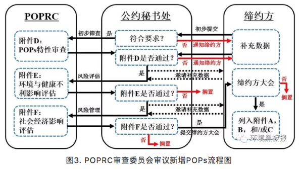
```

### POPs的持久性

“环境持久性”是POPs最主要的特点之一，是界定一种物质是否为POPs以及筛选新型POPs的重要判据，也是评价有机污染物对环境和人类潜在危害的基础以及开展化学品风险评估的关键依据。公约附录D关于持久性的评价标准为：对于通过空气大量迁移的化学品，其在空气中的半衰期应大于两天、或者该化学品在水中的半衰期大于两个月、或在土壤/沉积物中的半衰期大于六个月；或该化学品具有其他足够持久性、因而足以有理由考虑将之列入本公约适用范围的证据。

```{r}
knitr::include_graphics('images/gongyue4.png')
```

### POPs的生物富集性/放大性

生物富集和放大性是指化学物质可被生物组织吸收，并在生物体内持续累积，而且这些物质的浓度会沿着食物链/网传递（图5），随着营养级升高呈现放大趋势，在高等生物体内出现高浓度，影响高等生物的健康。公约对POPs的生物富集性/放大性的规定为：(1)表明该化学品在水生物种中的生物浓缩系数或生物富集系数大于5000，或如无生物浓缩系数和生物富集系数的数据，但有logKow大于5的证据；(2)表明该化学品有令人关注的其他原因的证据，例如在其他生物中的生物富集系数较高，或具有高度的毒性或生态毒性；(3)生物监测数据显示，该化学品所具有的生物富集潜力足以有理由考虑将其列入本公约的适用范围。

```{r}
knitr::include_graphics('images/gongyue5.png')
```

### POPs的长距离迁移能力

POPs具有长距离迁移特性，以大气和水体为载体，通过“高山冷捕集效应”和“全球蒸馏效应”到达高海拔的偏远高山地区和高纬度的极地地区，从而导致全球范围的污染。公约对远距离环境迁移的评判标准如下：

(1)在远离其排放源的地点测得的该化学品的浓度可能会引起关注；

(2) 监测数据显示，该化学品具有向环境受体转移的潜力，且可能已通过空气、水或迁徙物种进行了远距离环境迁移；

(3)环境转归特性和/或模型结果显示，该化学品具有通过空气、水或迁徙物种进行远距离环境迁移的潜力，以及转移到远离物质排放源地点的某一环境受体的潜力。

```{r}
knitr::include_graphics('images/gongyue6.png')
```

### 中国的实施计划

我国政府于2001年5月23日签署了《关于持久性有机污染物的斯德哥尔摩公约》，2004年6月25日第十届全国人大常委会第十次会议做出了批准《斯德哥尔摩公约》的决定。公约于2004年11月11日对中国正式生效。依据公约第7条要求，中国政府编制并向缔约方大会递交了履行公约的《国家实施计划》。

我国作为经济快速发展的国家，面临着极为复杂和严峻的环境问题。鉴于新型POPs的巨大累积产量，我国新型POPs引起的环境污染和健康风险问题比其它国家更为严重。目前，通过科研人才培养、建立相应的专业实验室以及设立相关的科研项目，已经大大提高了对于POPs特别是新型POPs的检测水平和防控能力。然而，作为化学品生产和使用大国，我们仍面临巨大挑战，对于新型POPs在环境行为、生态毒理、环境风险以及化学品管理等方面依旧缺乏研究基础和成熟经验，在履行《斯德哥尔摩公约》和保护生态环境上依然任重道远。

斯德哥尔摩公约的网址：

http://www.pops.int/

http://www.un.org/chinese/documents/decl-con/popsp/index.htm

参考文献：

[1] COP. Listing of short-chain chlorinated paraffins in Annex A to the Convention (UNEP/POPS/COP.8/11). 2017.

[2] Feng Y, Tian J, Xie H Q, et al. Effects of Acute Low-Dose Exposure to the Chlorinated Flame Retardant Dechlorane 602 and Th1 and Th2 Immune Responses in Adult Male Mice. Environ. Health. Persp, 2016. 124. 1406-1413.

[3] Giesy J P, Kannan K. Global distribution of perfluorooctane sulfonate in wildlife. Environ. Sci. Technol. 2001. 35. 1339-1342.

[4] Liu L Y, He K, Hites R A, Salamova A. Hair and Nails as Noninvasive Biomarkers of Human Exposure to Brominated and Organophosphate Flame Retardants. Environ. Sci. Technol. 2016. 50. 3065-3073.

[5] Pedersen K E, Letcher R J, Sonne C, Dietz R, Styrishave B. Per- and polyfluoroalkyl substances (PFASs) - New endocrine disruptors in polar bears (Ursus maritimus)? Environ Int. 2016. 96. 180-189.

[6] Vives I, Grimalt J O, Lacorte S, Guillamón M, Barceló D. 2004. Polybromodiphenyl ether flame retardants in fish from lakes in European high mountains and Greenland. Environ. Sci. Technol. 2004. 38. 2338-2344.

[7] 王亚韡, 蔡亚岐, 江桂斌. 斯德哥尔摩公约新增持久性有机污染物的一些研究进展. 中国科学. 2010. 40. 99-123.

[8] 张焘, 仇雁翎, 朱志良, 赵建夫. 有机污染物的持久性评价方法研究进展. 化学通报. 2012. 75. 420-424.

作者简介：田浩廷，山东人，博士毕业于南京大学环境学院，2016年入职临沂大学，青椒一枚，目前于中科院生态环境研究中心从事在职博士后研究，研究方向为持久性有毒有机污染物的环境界面过程、污染物界面催化降解。

校稿：yufree,大石

编辑：丫头晚安

## 日常生活中的化学品——新型有机污染物简介

### 前言

通常来说，人们对于能直接感官感受到的环境污染的危害认识较为清楚，比如灰暗的天空、黑臭的河水、以及遍地的塑料垃圾。但是你有没有想过，其实在一些表面看来极其干净的环境中也会存在高浓度的有毒有害污染物，而这些污染物对人体健康的损害可能并不比直接可感官感觉到的环境污染小。以北美五大湖为例，它风景优美，湖水清澈。可就是这样美丽的外表下却有着一颗“肮脏的心”。表面上，五大湖的湖水比国内多数湖泊、河流看上去要干净，但其中的某些持久性有机污染物 (persistent organic pollutants, POPs) 的浓度远高于国内湖泊。这也是外国人不吃淡水鱼的原因之一，因为淡水鱼体内的POPs浓度确实高于海水鱼。

POPs是指能持久存在于环境中，具有长距离迁移能力，通过食物链（网）累计，并且对生物和人体具有毒性效应的一类有机化学品。目前POPs的生产和使用已经受到《斯德哥尔摩公约》的严格限制，但在可以预见的将来，所有被列入《斯德哥尔摩公约》的POPs均会退出化学品市场。随着POPs的退出，其他新型有机污染物的研究成为目前环境化学领域的研究热点。这些新型有机污染物常常以化学品，也即是人工合成添加剂的形式出现，影响人体健康。化学品对人体造成损害有两个必要条件，其一是化学品具有毒性效应，其二是人体和化学品有接触途径。在我们日常生活中能够接触到的化学品品种众多，包括紫外线吸收剂、抗氧化剂、阻燃剂、塑化剂、光引发剂等，本文将重点介绍合成酚类抗氧化剂、双酚类物质、光固化材料等三类。这些化学品是一类富含争议的物质，它们在保障人们现代生活品质的同时，也给我们造成了一定的困扰。

```{r}
knitr::include_graphics('images/epc1.png')
```

### 实例

1 合成酚类抗氧化剂，天使还是魔鬼？

为阻止或延缓橡胶、塑料、纤维等人工合成有机高分子材料在使用过程中的氧化降解，抗氧化剂被广泛应用。由于天然抗氧化剂的稳定性较差，目前广泛使用的是人工抗氧化剂。目前我国市场上最常使用的抗氧化剂为BHT。BHT化学名称为2,6-二叔丁基-4-甲基苯酚，它是由对甲酚、异丁醇为原料，以浓硫酸作为催化剂，氧化铝为脱水剂，反应生成的产物。根据世界经济合作与发展组织 (OECD) 的统计BHT的使用主要分布在以下领域：橡胶(27%)，塑料(27%)，矿物油/燃料(17%)，食品/药品/化妆品(12%)，动物饲料/宠物食品(11%)，打印油墨(6%)。目前，BHT的污染已经非常普遍，且存在于多种环境介质中，例如河水、底泥、污泥、室内灰尘等。

在食品应用方面，最近发表在Nature Communications上的文章揭示了一个有趣的现象，给吃货们找到了一个自我安慰的理由。研究者发现，添加到食物中的BHT会干扰人体消化系统与大脑间的信号传递，从而导致人脑产生更强的饥饿感，想吃更多的食物，进而导致肥胖。好想说“真的不是我馋，是BHT让我很饿”。

没有直接研究表明BHT具有毒性，甚至有研究认为BHT可以清除人体内的氧化自由基，因此具有抗癌的功效。然而，BHT可以在生物体内和环境介质中被转化为多种产物。目前的毒理学研究表明其部分转化产物的毒性显著高于BHT。例如，BHT-Q在浓度为10-6mol/L时即可通过生成H2O2进而破坏人体的DNA，从而表现出较强的基因毒性。更值得注意的是，我们的研究显示BHT可以在污水处理厂（厌氧-缺氧-好氧的活性污泥处理系统）中转化为相应的毒性产物（BHT-CHO，BHT-Q，BHT-quinol）。经过污水处理厂处理的污水，BHT的浓度会显著下降，但相关转化产物的浓度会显著上升，增加了污水处理厂出水回用的潜在危害。

```{r}
knitr::include_graphics('images/epc2.png')
```

2 双酚类污染物，无处不在

双酚A (BPA) 是一种人工合成的化学品，作为增塑剂、抗氧剂、热稳定剂等添加剂广泛应用于塑料、纸币、热敏纸等日常生活用品中。此外，BPA也是一种重要的有机化工原料，主要用于生产聚碳酸酯和环氧树酯等聚合材料，BPA在2011年的全球产量超过550万吨。BPA的主要毒性表现为内分泌干扰效应，尤其是对婴幼儿内分泌系统的危害，能导致内分泌失调，威胁胎儿和儿童的健康。为了对塑胶进行分类，美国塑胶工业协会 (Society of the Plastics Industry) 自1988年起，对塑胶进行编码分类，塑胶分类标志的符号包含了顺时针转的箭头，形成一个完整的三角形，并将编码包围于其中，如图7所示。一般来讲，塑胶分类标志为1、2、4、和6的塑料不太可能在生产中与BPA接触，而有一些塑胶分类标志为3或7的塑料在生产中可能会接触到BPA。自2011年6月1日起，我国已禁止进口和销售含有BPA的婴幼儿奶瓶。

```{r}
knitr::include_graphics('images/epc3.png')
```

随着对BPA使用风险的关注和日趋严格的法规控制，市场上出现结构和性质与BPA相似的新型替代化合物，统称为双酚类化合物(Bisphenols, BPs), 它们在与人们日常生活密切相关的购物小票、纸币、食品包装材料中广泛使用。在日常生活中接触购物票、纸币等物质时，BPs可透过皮肤吸收进入人体。加拿大学者的研究发现手持购物小票5分钟，即可使这类物质透过皮肤吸收进入人体。因此，相关职业人群如收银员体内BPs的浓度显著高于普通人群。目前，关于BPs这类替代化合物对人体健康的影响尚处于研究当中,暂无足够的数据来判定其对人体健康的影响。基于BPs这类替代化合物与BPA结构的类似性，我们预测部分BPs可能具有与BPA类似的毒性效应。

```{r}

```

3 光固化材料--绿色化学真的绿色吗？

光固化材料是指光引发剂在光照（一般为紫外光）作用下产生活性物质（自由基等），从而引发单体发生的聚合反应所生成的聚合材料。与传统的聚合反应相比，光敏聚合反应具有反应所需能量低、无挥发性有机污染物释放等优点。因此，光固化材料的生产过程被称为绿色化学。目前，光固化材料广泛应用于紫外打印、紫外涂料、以及光敏树脂3D打印等领域。

```{r}

```

2005年，欧洲市场上的雀巢婴幼儿奶粉中发现高浓度的光引发剂污染，首次引起了科学家对光固化材料中光引发剂污染的重视。事后的研究发现奶粉中的光引发剂污染来源于包装材料中的光敏打印油墨。近年来的研究已经在食品包装材料和3D打印产品中检测到20多种光引发剂。由于光固化材料在室内环境中有大量应用，北京市室内灰尘中也检测到了高浓度的光引发剂。这类物质的毒性主要表现为内分泌干扰效应。加州大学的研究发现，使用光敏树脂3D打印器皿培养斑马鱼鱼卵，可以观察到明显的斑马鱼发育毒性。由此可见，“绿色化学”并不绝对的绿色。目前，世界各国并无关于光引发剂使用的限制。欧洲及日本的打印协会建议停止在食品包装材料的打印油墨中使用某些高毒性的光引发剂，但该建议尚未形成法律条文。

### 结语

传统的水污染及土壤污染等只会对生活于其区域的人群产生影响。即使近年来在我国北方影响范围比较大的雾霾，人们也可以通过迁移到更干净的区域进行规避。与传统的空气、水、土壤等污染不同，只要你选择现代生活，你就无法避免形形色色的合成添加剂。但我们也无需过度担心，因为污染物的毒性总是与剂量相关联。以“前言”中所述北美淡水鱼为例，尽管鱼体内含有较高浓度的污染物，但只要找到合理的摄入标准，就不会对人体健康产生损害。

```{r}
knitr::include_graphics('images/epc6.png')
```

同理，对于生活中形形色色的添加剂危害的预防，最重要的还是深化基础科学研究。由政府加大投入，相关领域科学家对添加剂的生物安全性进行评估，促进政府制定相应的法律法规。目前，我国有4.6万种化学品在生产和使用，每年还有几百种新增加的化学品进入市场，要全面评估所有化学品对人体的健康风险工作量巨大。可喜的是，近年来科学家开始重视基于计算机的定量结构-效应关系(QSPR)模型方法，QSPR可帮助我们初步筛选具有潜在危害的目标化学物质，对筛选出来的可能具有危害性的化学物质可进行进一步的实验评估。对毒性较大物质的使用进行限制或禁止，而对毒性较小且产品替代比较困难的物质可在相关标准下进行使用，从而最大限度地提升生活品质，降低化学品（添加剂）的使用风险。

作者：L润Z
校稿：看透，胜利屯屯长
编辑：李立平

## 人虎共存，举步维艰

最近，《东北虎豹国家公园总体规划》征求意见稿发布，标志着虎豹公园的范围、定位、功能分区、重点工程、体质机制等一系列重要问题基本敲定，这实属不易。其实，虎豹公园早在三年前就开始筹划建立了，而《总规》的定稿和发布却经历了漫长而复杂的过程。即使如此，对于东北虎豹种群的持久性保护而言，这也仅仅是万里长征的第一步。

```{r}
knitr::include_graphics('images/tiger1.png')
```

### 背景介绍

虎豹国家公园的缘起归功于北京师范大学的葛建平教授及其团队，经过在吉林珲春的长期观测，该团队最终确定在我国境内长期活动的东北虎共27只，东北豹42只。2015年两会期间，总书记在参加吉林省代表团审议时得知此事并给与重视，随即，东北虎豹重点保护工程开始在国家层面上谋划实施。

```{r}
knitr::include_graphics('images/tiger2.png')
```

2015年冬，我跟随规划项目组到东北虎豹在我国的集中分布区——吉林延吉考察，深入了珲春、汪清、天桥岭等地的天然林区，探访了东北虎豹的栖息地。但我们并不走运，几天下来，并未见虎豹踪影。仅看到林中野猪留下的些许蹄印，风折或腐朽掉的红松枝干，河岸边被雾凇装扮的玉树琼花，以及山丘上望不到边际的皑皑白雪。

```{r}
knitr::include_graphics('images/tiger3.png')
```

我本想，有这样美妙的自然环境，再加上虎豹带来的旅游效益，当地居民应该衣食无忧，幸福感爆棚。没成想，这看似祥和的环境却并不太平。

与美国、加拿大等国家不同，我国人口数量太大，并且分布广泛，除了沙漠和高山区，真正的无人区很少。在虎豹国家公园内，就分布有90000多人口，这无疑造成了大量的人为干扰。然而，作为“森林之王”，东北虎的活动范围巨大，成年雄虎的家域面积可达600-800km2，成年雌东北虎家域面积也在300-500 km2(马建章和金崑，2003)。即使经过几次扩增，虎豹公园的面积已经扩大至1.49万km2，但对几十只东北虎和东北豹来说，其实并不富裕，更何况同时还居住着这么多的人!于是，人虎矛盾在所难免。

### 人虎矛盾，难以调和

一、虎豹对当地居民财产和人身安全的威胁

虎豹均属于大型捕食性动物，捕杀林中野猪、狍子等是它们的日常课业，当然，也包括居民畜养的牛羊!关于虎豹猎杀当地居民家畜的报道已经屡见不鲜。当地人介绍，有农户家的羊在一晚上就被老虎咬死十几只，据说是为了给幼崽传授捕食技术，可见母爱之伟大!

但是，这里有一笔经济账，那就是：谁为老虎的“晚餐”买单，价格几何?目前，对于虎豹造成的家畜死伤，一般由国家野生动物保护部门负责补贴。可以说，虎豹是公款吃喝，好不自在。但是，补贴总归是补贴，对当地农户来说，还是会有相当一部分损失的。

至于人身安全，更是不必多说，与虎豹做邻居，但凡智商正常的人一般都不会感觉十分保险。

二、人类活动对虎豹的直接伤害

在东北林区，几乎家家都会一门简单的手艺，那就是用钢丝来制作猎套。在山林中，用猎套捕杀野生动物十分奏效，当然，也包括东北虎。

```{r}
knitr::include_graphics('images/tiger4.png')
```

虽然，以当地林业局为主的野生动物保护部门不断开展山间清套行动。巡山清套行动也写进了《总规》中，但是，要从根本上遏制套猎行为，仅仅依靠清套行动是远远不够的，因为它已经成为林区人民的生活方式和文化。要彻底消除套猎现象，应该要做出多方面的努力，包括自然教育、法制建设甚至要从社会生活理念和方式上发生转变。

三、居民生产生活方式与虎豹保护的相互影响

如今的东北林区，“棒打狍子瓢舀鱼”的生活虽然有些夸张，但采松子、打野味还是稀松平常的。无论是采集还是狩猎，都会造成虎豹生存环境的破坏和自然猎物的减少。此外，公园内的家畜散养和土地开垦同样会对自然生态系统产生重要影响。据统计，虎豹公园内的散养黄牛达到60000多头，大量的黄牛与马鹿、梅花鹿等虎豹猎物竞争了食物和生存空间，同时也是人虎矛盾加剧的潜在风险，因为虎豹并不了解吃下这些黄牛其实是违法的。

《总规》中提出要禁养退牧还草，并清收开垦土地，然而，如何进行合理的禁养退牧和土地清收，并对当地以此为生的农民做出合理补偿，又将十分复杂。

```{r}
knitr::include_graphics('images/tiger5.png')
```

### 转变思路，人退虎进

就东北虎豹的有效保护和种群延续，《总规》提出了一系列的措施，包括虎豹种群保护、栖息地保护修复、扩散廊道疏通等等。然而，在活动范围、取食范围，甚至是整个生态位，人与虎、豹都存在太多的重叠和矛盾，其主导因素，完全在人。因此，若不能实现园区人口的明显下降，将很难实现对虎豹种群的持久性保护。

然而，要90000多人搬离家乡谈何容易!如此看来，在某种程度上，虎豹保护已经超出了物种保护的范畴，并成为了一个社会问题。东北经济正值转型期，虎豹国家公园的命运也将被绑定其中。我们更希望看到的是，国家公园能在区域水平上助力经济转型。在严格保护的同时，深入发掘虎豹的社会文化价值，形成一系列的生态旅游产品和自然教育品牌。比如，依托冰雪文化和虎豹文化，在公园外围打造“特色小镇”、“田园综合体”等等，以产业发展拉动公园内部居民迁出，同时形成经济效益，反哺公园建设。

```{r}
knitr::include_graphics('images/tiger6.png')
```

人虎矛盾固然不可调和，但只要人走了，虎豹自然就来了。然而，我们也不能就保护而谈保护，不惜一切代价把人赶走，而是要转变思路，使得国家公园体系建设更好的服务于当地社会经济发展。希望东北虎豹国家公园的建立，真正能像吉林省省委书记巴音朝鲁所说的：“东北虎、豹将成为吉林绿色转型的魂。”

参考文献：马建章，金崑. 2003. 虎研究. 上海: 上海科技教育出版社.

作者简介：张雷，中科院生态环境研究中心博士研究生，生态学专业。

作者：雨田
校稿：广播站王站长
编辑：竹而乐

## 可持续社区建设案例——北京当代MOMA公寓

可持续发展是一个比较容易引起人们困扰的概念，从1987年《我们共同的未来》出版以来，可持续发展的概念已经走过了三十年。目前全世界人们最公认的可持续发展的核心思想就是“既能满足当代人的需要，又不对后代人满足其需要的能力构成危害的发展”。

2015年6月5日，联合国发布了题为《Transforming our world by 2030: A new agenda for global action》的报告，这是联合国首脑会议对于2015年之后全球发展的整体规划和展望。可持续发展目标的设立源自于被全世界人民所认可的可持续发展理念，以消除贫困和不平等、保卫地球、创建包容经济增长空间为基础构架，由17个总目标和169个子目标共同组成了一整套覆盖社会、经济、环境三个关键维度的全世界发展目标。

其中，目标11为可持续城市与社区，以建设包容、安全、有抵御灾害能力的可持续城市和可持续的人类居住社区为核心目标。在可持续城市与社区的大目标之下，设计了7个子目标和一个整体目标从多个关键方面提出了在城市和社区尺度可持续发展的要求，如住房与交通的需求，城市建设力度的要求，城市对人类的负面环境影响如空气质量、城市废弃物等的要求，以及城市居民能够在社区中享有足够的绿色公共空间和社区服务的要求。

```{r}
knitr::include_graphics('images/moma1.png')
```

社区是一个非常有意思的概念，当我们以人类聚居的角度去看，社区可以看成是城市最基本的组成单元，也是连接城市和单体建筑的人类聚居栖地，不同于家庭的血缘聚集性，社区是用一个划定的区域把一群没有血缘关系形形色色的人类和一堆单体建筑圈定在了一个概念里，在社区里往往能找到一个城市的大部分商业和社会服务功能，也能看到城市生活的最完整的缩影。在大多数情况下，城市的政策和举措需要在社区层面得到落地和实施。

我们现在日常居住的居民小区、商业楼盘甚至早一些年的街道居民委员会管辖片区，都是最为常见的社区。随着城市社会经济的不断发展，社区可以涵盖的概念也越来越广泛，商业与居住型公寓并存的CBD区域、特色产业园区及周边物业、甚至是特色小镇，谁又能说这些都不是社区的代表？这些新型地产类型的兴起，也从另一个方面极大的丰富了社区的概念，也让可持续社区的建设与实践越来越具有现实的意义。可持续社区的理念强调现在和未来、生活和工作、安全性和包容性，生活品质和环境保护等统筹协调，规划合理、建设和运营良好，为社区居民提供平等的机遇和优质的服务。

```{r}
knitr::include_graphics('images/moma2.png')
```

> 当我们讨论如何去建设可持续社区的时候，一定会有一个问题始终萦绕在设计者、建设者、管理者和居住者的心头，那就是，什么样的社区是可持续的？

嗯，负责任地告诉你，这个问题，其实全世界的研究学者、政府和企业想了三十多年其实也没有非常的想明白。为什么呢？可持续发展本身就是一个没有最好只有更好的概念，基于可持续发展的概念延伸而来的一系列的理念和要求，都在不断地要求着更加优化的发展方式。节能的要更加节能、贫困消除的要不断富裕、性别平等的要更加平等，等等等等。所以，当我们考虑可持续社区的建设实践的时候，其实就不要太纠结于到底怎么样是可持续的了，换个角度想一想，什么样是不可持续的，然后尽力避免是不是一个更为简洁的思路呢。

因而，可持续社区的建设，很多时候是遵循着避免不可持续性的思路来进行实践的。在可持续社区建设实践中，有这么几个点是比较值得关注和注意的，同时也可以看成是一个社区建设“从摇篮到成长”的生命周期，从社区建设的空间布局开始，就要求以能够持续发展的思路和原则进行设计，建筑及室内环境建设、室外环境建设、基础设施建设是从社区的实际建设方面的可持续性要求，而当社区建成之后，居民生活方式引导和社区运营管理的可持续性就是社区成长成熟过程中的可持续性的体现。

```{r}
knitr::include_graphics('images/moma3.png')
```

在可持续社区的建设实践方面，大家还是走的比较靠前的，毕竟嘛，物质基础的建设总是比精神层面的提升要来的简单一些。目前国内可持续社区相关的指标主要来自于发改委、住建部和环保部，大部分指标规定了可持续社区当中的某一个或某几个部分，而并非是可持续社区的全部内容。社区的可持续性主要聚焦于社区生态环境的可持续性，对于社区的社会系统和经济发展的可持续性的要求相对较少。从可持续的理念出发，社会公平、经济繁荣、环境优美是可持续社区三个必不可少的关键点。联合国环境规划署与佳粹（中国）环境发展促进中心共同发布的《可持续城市与社区评价标准导则》，是参考了可持续发展目标11，并同时借鉴国际标准化组织在社区可持续发展指标体系以及国际最佳范例，提出的有参考价值的发展目标、关键绩效指标和国际化考量标准，《可持续城市与社区评价标准导则》导则关于可持续社区的评判包括六个方面：可持续建筑；包容的社区服务与设施；宜居的社区景观；经济生产力；安全；自豪、高知社区。


```{r}

```

来看一个栗子吧。

### 北京当代MOMA高端综合公寓

北京当代MOMA高端综合公寓，不仅包括若干栋公寓住宅，还有影院、图书馆、酒店以及各种餐饮、娱乐中心，生活设施与休闲商业都非常完备的一个社区，为什么拿它来做一个可持续社区建设的例子呢，因为有人这么评价它的，“它构建了一个新的社区模式，将城市空间从平面、竖向的联系进一步发展为立体的城市空间，并大规模使用可再生的绿色能源，既节能又省地。它也探索了一种未来城市的生活新模式，将居住、工作、娱乐、休闲、交通结合在一起，通过空中连廊交错相连，必然加强邻里间的联系与交流。从建筑学上讲，我们依稀看到大师理念的传承与发扬，从社会角度讲，它为中国的21世纪居住树立了一个新的典范。”这是可持续社区的一次很有意思的探索实践。

在社区建设初始的设计中，以一副珍藏在俄罗斯圣彼得堡历史遗产博物馆内的镇馆画作为创意灵感（“野兽派”画家马蒂斯创作于1910年的画作《舞蹈》），同时加以北京“胡同”与“四合院”为改造元素，设计出空中连廊作为公共空间，以打造“城中之城”设计概念展开。通过连环的空中长廊将8栋公寓建筑连接在一起，加上一栋艺术酒店和一座多功能水上影院，构成一个立体的建筑空间。在建筑的外立面采用磨砂氧化铝板减轻高密度、大体量建筑的压迫感。整个社区的设计焦点是穿越空间的体验，将大楼之间的动作、时机和序列整合考虑，视点随着缓坡、转弯改变。而电梯的转换，更犹如电影里的切换镜头，从一个楼层到更高楼层的通道，平移过一些不同变化的周边景色。

```{r}
knitr::include_graphics('images/moma5.png')
```

在社区的具体建设中，有非常多的可持续性理念的体现，这个社区以“永续建筑”的理念来践行了建筑本体的建设和施工，主要包括恒温恒湿、新风置换、地源热泵、中水处理系统等。这些体现建筑可持续性细节的系统设置，更多的是从居住者的切身感官出发，保证着每个人在房间里都能感受到一种舒适的环境，恒温恒湿和新风置换系统就是从体感上给居住者这样的舒适享受。同时，当代MOMA的这些系统设计还遵循着可持续性对于资源节约和因地制宜的要求。

恒温恒湿系统采用预埋管材的水循环系统，来保证室内温度常年保持在恒定的22-26℃，不仅不会破坏室内装修，甚至连风和噪音也感受不到。这样通过水循环系统来打造室内恒温恒湿的居住环境，不仅能让居住者感受到最极致的体验，更是一种非常节约能源和水资源的方式。

新风置换系统是将经过了过滤、除尘、灭菌、控制温度和适度的新鲜空气从房间底部的送风口送入房间，经过室内循环之后从房间顶部的排气孔排除，利用空气上升的自然原理，不仅杜绝了空气之间的交叉污染，也是以非常节能环保的方式保证了即使在北京大雾霾天的情况下也能实行对室内空气质量的要求。

地热源泵采用的复合式能源系统，是通过地下100米以下的垂直换热器以矩阵的格局分布在地下车库的地板下，与土壤进行热交换后再向上传递供热或者供冷，将对周围环境的影响降低到了最少，并且充分地利用了地下温度，几乎接近于可再生能源。

中水处理系统采用膜生物处理的技术，将社区内每天产生的大部分厨房以及洗浴废水作为中水水源，处理之后全部回用于社区商业、影院、图书馆以及部分楼座的冲厕用水，剩余的用于绿地灌溉、道路浇洒以及景观补充水等。

```{r}

```

在社区尺度的可持续性建设中，有非常非常庞杂的关键节点和细节可以体现，从能源节约、资源利用、废弃物处置等诸多实际的物质节约的诉求，到社会公平、社区和谐、环境友好等精神层面的追求，无一不体现着可持续发展目标。限于篇幅，我们就重点了解了一个可持续社区在设计和建设方面的可持续性的体现。我们能看到，可持续社区的建设其实是渗透在社区生活方方面面的一个持续性改善过程，从国家和城市的规划布局，到社区建设的具体实践，再到社区居民身体力行的改善，每一个角色都对可持续社区这个目标的实现贡献着自己的力量。这其中，诸多标准帮助规范着社区建设的实践行为，价值导向指点着社区居民的日常生活，而城市上层的整体规划是引导可持续社区建设实践的方向标。

作者：爱杯子的王小咖
校稿：yufree，大石
编辑：兔
配图：爱杯子的王小咖，栟

## 环境保护，保护优先

### 缘起

2015年初春两会期间，时任环境保护部部长陈吉宁在说明环境保护与经济增长之间关系时用了环境库兹涅茨曲线概念，当时其表示我国环境污染强度已超过历史上最高的国家，成为名副其实的“第一”，我国面临前所未有的经济发展和环境保护的矛盾。

环境库兹涅茨曲线成为环境领域热点问题，2年时间过去了，在刚刚召开的两会中审议通过了国务院机构改革方案，组建了生态环境部，生态文明和环境保护被提到前所未有的高度，我国环境保护现在处于环境库兹涅茨曲线的哪里？环境保护该如何发展？

回答这些问题，需要我们抬起头来，看看前方的路，决定如何走，再撸起袖子加油干。笔者才疏学浅，尝试回答这些问题，见解如有不对，敬请谅解。

### 什么是环境库兹涅茨曲线？

环境库兹涅茨曲线概念引申于库兹涅茨曲线(Kuznets Curve)。

百度百科告诉我，库兹涅茨曲线是美国经济学家库兹涅茨于上世纪90年代提出的理论，库兹涅茨用实证数据表明收入不均现象随着经济增长先升后降，呈现倒U型曲线关系。

随后该概念被引入环境领域，通过研究发达国家经济发展水平与环境污染直接的关系发现，当一个国家经济发展水平较低的时候，环境污染的程度较轻，但是随着人均收入的增加，环境污染由低趋高，环境恶化程度随经济的增长而加剧。

当经济发展达到一定水平后，也就是说，到达某个临界点或称“拐点”以后，随着人均收入的进一步增加，环境污染又由高趋低，其环境污染的程度逐渐减缓，环境质量逐渐得到改善。

这种现象被称为环境库兹涅茨曲线（提示一下：环境库兹涅茨曲线是倒U型曲线，这是只是大致意义上的，并不是说要严格呈倒U型）。

```{r}
knitr::include_graphics('images/huanjing1.png')
```

### 环境库兹涅茨曲线拐点区间已现

改革开放以来，我们经济水平持续走高，而无可避免地，中国很多地方出现了局域性环境污染，近年来甚至一度爆发全国范围内的严重环境污染，如笼罩在京津冀地区的大气雾霾。

改革开放接近40年，中国环境治理主要以末端治理为主，也取得了一定成果。虽然我国整体环境质量仍未见好转，生态环境保护短板问题突出，但是统计数据显示环境污染物排放整体上已来到拐点区间，其中部分传统污染物已经越过了环境库兹涅茨曲线拐点，非传统污染物排放也趋近拐点区间。

笔者作为应对气候变化工作从事者，对应对气候变化领域数据较为熟悉，这里以应对气候变化工作最具有代表性的表征指标碳排放量来举例说明。

我国碳排放量与人均GDP的关系可以很好地解释环境库兹涅茨曲线。

1980年前后，我国人均GDP仅有300美元左右，随着我国经济迅速增长，碳排放量也水涨船高，我国人均GDP达到1000美元、3000美元，碳排放量分别达到了27亿吨、66亿吨。

当人均GDP超过5000美元，我国政府逐渐重视生态文明，强调经济转型升级，试图用更小的能源消费、环境代价获取更多的经济增长。

这段时间我国的单位GDP碳强度大幅度下降，到2016年前后，我国人均GDP超过7000美元，碳排放量缓增至90亿吨左右。

人均7000美元已来到环境库兹涅茨曲线拐点窗口期，碳排放量的增长也十分疲软，甚至有专家判断我国碳排放量已经达到峰值。

而笔者的判断是，不管碳排放是否已经达峰，碳排放应该是到了环境库兹涅茨曲线的拐点区间。

```{r}
knitr::include_graphics('images/huanjing2.png')
```

### 在此拐点，我们要如何走？-保护优先

中国政府在十九大报告中提出到2035年基本实现社会主义现代化，到那时，生态环境根本好转。

如何在未来不到20年内实现该目标呢？办法总比问题多，有些办法更有效果。

发达国家和我国的经济实践证明仅仅依靠技术不能够完全解决环境问题，环境改善更为重要的是要依靠正确的发展方针和政策（这句话不是我说的，是原全国人大环资委主任委员曲格平在接受某家媒体采访时说的，以此作为文献引用吧）。

因此，在环境库兹涅茨曲线拐点的重要窗口期，中国政府应树立“保护优先”的发展战略。

“保护优先”战略指环境保护和经济增长协调发展，把环境保护放在更加突出的位置，甚至在局部地区或某些时间段放在首要位置。

“保护优先”战略是习近平总书记的“绿水青山就是金山银山”科学论断的应有之义。

因为“保护优先”战略不是环境至上，而是对经济增长、社会发展提出了更高的要求。

“保护优先”战略要求正确处理环境与经济之间的关系，彻底改变以牺牲环境、破坏资源为代价的粗放型增长模式，不以牺牲环境为代价去换取一时的经济增长，而是通过转变发展方式、优化经济结构、转换增长动力赢得长期的高质量发展。

“保护优先”战略要求在加强末端治理工作的同时，更加注重源头预防工作和过程控制工作，现阶段政府要加大资金投入鼓励源头预防的技术发展，构建源头预防、过程控制和末端治理一体化的环境污染治理体系。

（保护优先思想参考了原环境科学院院长发表在紫光阁期刊上的文章）

作者：羽青空之蓝
校稿：周宁、爱杯子的王小咖
编辑：泽水之岸
原创图：羽青空之蓝

## “砷”生不息

提起砷（As），可能大家最先想到的就是潘金莲毒死武大郎的砒霜。作为一种毒性较强的环境污染物，砷不仅存在于小说和宫廷剧中，还广泛地分布于岩石、土壤和天然水体中。近年来，关于大米中砷含量超标、婴儿米粉中检测出砷的报道层出不穷，更是将水稻和砷的纠葛推到了风口浪尖。

```{r}
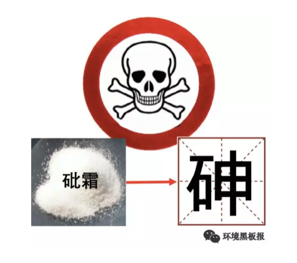
```

### 砷的来源与毒性

砷的来源甚至可能会早于你我的认知。历史上，关于砷的记载最早见于1世纪罗马博物学家普林尼的著作中，即雌黄（一种砷的硫化物）。在自然条件下，砷主要以硫化物、含氧砷酸化合物和金属砷化物等形式存在；并通过地壳运动、火山喷发等过程，从地壳中释放到地壳表层和大气中；随后，伴随岩石矿物的风化过程，被进一步释放到周围的土壤和水体中。工业革命以来，人类活动如矿物开采、工业活动、农业活动以及日常生活垃圾的排放等加速了砷在环境中的扩散，持续地将含砷化合物分散到土壤、水体和大气环境中[1]。

```{r}
knitr::include_graphics('images/as2.png')
```

砷的毒性大小和其存在形式息息相关。砷主要有无机砷和有机砷两种存在形式。其中，有机砷（氧化态）的毒性可以忽略不计，而无机砷毒性强，其中三价砷毒性比五价砷大约60倍,人口服三氧化二砷中毒剂量为5-50mg,致死量为70-180mg。因此，与人体健康相关的各类砷含量的限值通常是指无机砷含量。例如，世界卫生组织制定的无机砷对人的安全上限为“每天每千克体重的砷摄入量不超过2微克”；我国要求每千克大米中无机砷含量不超过150微克[2]，《婴幼儿谷类辅助食物标准》（GB10769-2010）规定砷含量上限是每千克300微克[3]。

### 水稻与砷

为何水稻中砷含量会得到如此广泛的关注？首先是由于我国地处东南亚地区，水稻是我们赖以生存的主要粮食之一；其次，由于水稻田的水淹种植以及水稻本身的特性，让水稻具有高富集砷的“优势”，使得大米中无机砷含量远高于其他谷物类[4]。目前，科学家已从水稻中发现两种蛋白，水稻可通过它们将不同形态的无机砷吸收至体内。其中，五价砷由于和磷酸盐具有相似的物理化学性质，通过磷酸盐吸收通道进入水稻体内；三价砷则主要通过水通道蛋白吸收进入水稻体内。

```{r}
knitr::include_graphics('images/as3.png')
```

提到水稻对砷的吸收，就不得不提“栖息”在水稻根际的高达数以亿计的砷代谢微生物。正是它们影响了水稻土中砷的迁移转化过程，促进或者抑制水稻对砷的吸收[5]。所谓水稻根际微区，即受水稻根系影响的土壤。在水稻生长旺盛时期，水稻根系不仅可分泌丰富的有机物，还具有较强的泌氧能力，从而促使根际微生物群落更加丰富和多样化。据报道，水稻根际土壤细菌的丰度比非根际土壤可高达一半以上（50.8%）。

### 砷代谢微生物

砷氧化微生物--水稻根际区“栖息”的各型各色的砷代谢微生物中，砷氧化微生物最为丰富。通常在自然条件下，无机的三价砷被化学氧化的过程是非常缓慢的。但当微生物存在时，由于微生物的三价砷氧化酶的催化作用，三价砷可以被迅速氧化为毒性较低的五价砷。这正是水稻根际砷氧化微生物的职责所在。当水稻根际的三价砷被氧化为五价砷后，不仅砷的毒性被降低，五价砷还易被存在于水稻根表的铁膜吸附，从而降低了砷的迁移性，减少了水稻对砷的吸收。

砷还原微生物--与砷氧化微生物作用“背道而驰”的即砷还原微生物。它们能够将五价砷还原为三价砷。在水稻土中，存在着两种类型的砷还原微生物。其一是可进行体外还原的五价砷呼吸还原微生物，其二是可进行体内还原的五价砷解毒还原微生物。然而不论过程如何，最终结局都是五价砷被还原为毒性较高的三价砷。非但如此，原本被水稻根表铁膜吸附的五价砷也因为还原过程被从矿物表面解吸，并释放到土壤中，增加了水稻吸收砷的风险。

砷甲基化微生物--近年来，除了砷氧化、还原微生物之外，在水稻根际土壤中声名大噪还有另一类微生物：砷甲基化微生物。与氧化、还原微生物仅局限于无机砷形态转化的功能不同，砷甲基化微生物可将无机形态的砷通过甲基化产生有机形态的砷。这部分有机砷（氧化态）毒性远低于无机砷，大大的降低了水稻土中砷的毒性。与此同时，在砷甲基化的过程中，还可产生多种挥发性的气态砷，可将水稻土中的砷挥发至大气中，降低水稻土中砷含量。研究表明，大气中的砷有62%来自于环境的自然挥发过程，其中生物挥发占了自然挥发过程的58%。

```{r}
knitr::include_graphics('images/as4.png')
```

这么看来，除了人为因素造成的水稻土砷污染，这些微小的砷代谢生物对水稻土中砷的迁移转化，以及水稻对砷的吸收也贡献了并不微薄的力量。目前，研究者们正在进一步研究如何通过调控这些砷代谢微生物群落的结构，来实现降低水稻对砷吸收的目的，争取有朝一日，让大家可以安心的“民以食为天，食以米为主”。

后记：如何降低砷摄入风险Tips，科学家表示均衡饮食很重要，除了大米，也要多吃面食以及其他谷类作物。此外，据说煮米饭前，先将生米浸泡一晚，然后用过量的水将米煮熟后，弃水食米，可大大降低米中砷的含量。但是，此法会同时降低大米中其他水溶性营养元素含量，并且笔者认为米饭口感会大幅下降，食之如“烂泥”，对食物口感有要求者慎用。

参考文献：

[1]  Zhu Y-G, Yoshinaga M, Zhao F-J, Rosen BP. Earth abides arsenic biotransformations [J]. Annual Review of Earth and Planetary Sciences, 2014。

[2]《食品中污染物限量》（GB2762-2005）

[3]《婴幼儿谷类辅助食物》（GB10769-2010）

[4]  美国食品药品监督管理局（U.S.Food and Drug Administration, FDA）:Arsenic.

[5]  Zhang S-Y, Zhao F, Sun G, Su J, Yang X, Li H et al. Diversity and abundance of arsenic biotransformation genes in paddy soils from Southern China [J]. Environmental Science & Technology, 2015.

作者：鱼小张
校稿：广播站王站长、柴胡半夏苏
编辑：李立平

## 国家公园是什么园

```{r}
knitr::include_graphics('images/park1.png')
```

国家公园，一个陌生而又熟悉的名字。陌生，是因为大家耳熟能详的公园中，好像没有哪一家叫“国家公园”；熟悉，则是因为身边好像又有很多“国家森林公园”、“国家湿地公园”、“国家地质公园”等等。

那什么是国家公园呢？想必很多人听说过美国的黄石公园，这是世界上的第一个国家公园，建于1872年。至今，全世界已有一百多个国家设立了多达1200处风情各异、规模不等的国家公园。国家公园的定义在世界各国有一定差别，但基本所指都是符合某些条件的自然与文化遗产地。例如，世界自然保护联盟（IUCN）认为国家公园指那些“被指定用来为当代或子孙后代保护一个或多个生态系统的生态完整性，排除与保护目标相抵触的开采或占有行为，提供在环境上和文化上相容的、精神的、科学的、教育的、娱乐的和旅游的机会”的陆地或海洋地区。国家公园的主要管理目标是保护生态系统和提供游憩机会。美国1970年颁布实施的《国家公园事业许可经营租约决议法案》规定：“国家公园体系是不管现在还是未来，由内政部长通过国家公园管理局管理的以建设公园、文物古迹、历史地、观光大道、游憩区等为目的的所有陆地和水域。”

```{r}
knitr::include_graphics('images/park2.png')
```

### 我国为什么要建国家公园？

目前我国保护地管理中存在着严重的交叉重叠、多头管理等问题。这是什么意思呢？就是说在一块区域内，这块土地可能既是国家级风景名胜区，又是国家级自然保护区，还有可能是国家级各种公园（下图）。管理机构呢，风景名胜区一家、自然保护区一家、国家级各种公园又分别一家，除此之外，还有地方政府的林业局、国土局、水务局等部门进行管理。

```{r}

```

基于当前重要自然生态系统保护区域的各种问题，我国党的十八届三中全会《中共中央关于全面深化改革若干重大问题的决定》（2013年11月）中，首次提出要“建立国家公园体制”，以保护国家重要自然生态系统的原真性和完整性，形成自然生态系统保护的新体制新模式，促进生态环境治理体系和治理能力现代化，保障国家生态安全，实现人与自然和谐共生。2015年，由国家发改委牵头，开始推进国家公园体制试点，提出建立“国家公园体制”，开始“国家公园体制试点”，而非简单的建立国家公园。开始国家公园体制试点，最重要的原因就在于，改革的是保护地的管理体制，而非划一块区域，挂一个牌子。截至目前，试点实施方案在国家发改委通过的国家公园体制试点共10个，分别是三江源、大熊猫、祁连山、东北虎豹、神农架、武夷山、钱江源、北京长城、南山、香格里拉普达措国家公园体制试点区。当前，国家公园体制建设已经成为生态文明体制建设的排头兵。

```{r}

```

### 国家层面的国家公园体制试点建设进展

2013年11月，十八届三中全会首次从国家层面提出“建立国家公园体制”。2015年，是国家公园体制相关文件密集出台的年份。

1月，国家发改委联合13个部委印发《建立国家公园体制试点方案》，作为国家公园体制试点的总体指导文件，其中指出试点时间为2015-2017三年。

3月，国家发改委办公厅发布《试点实施方案大纲》，提出国家公园体制机制的几大方面，为试点区体制改革指明了具体的方向：管理体制包括管理单位体制、资源管理体制、资金机制；运行机制包括日常管理机制、社会发展机制、特许经营机制、社会参与机制。

4月和9月，关于生态文明体制改革的国家顶层设计重要文件（《关于加快推进生态文明建设的意见》和《生态文明体制改革总体方案》）中均提及“建立国家公园体制”，保护自然生态和自然文化遗产的原真性和完整性。

10月和2016年3月，《十三五规划建议》和《十三五规划纲要》中，明确要在十三五期间，“整合设立一批国家公园”。

2017年，很多国家公园体制建设相关人员认为会静待试点结束，总结经验，出台《建立国家公园体制总体方案》（以下简称《总体方案》）。结果出了祁连山事件（中办国办就甘肃祁连山国家级自然保护区生态环境问题发出通报，包括3名副省级干部在内的100多名相关人员受到处理），“国家公园在不到一个月的时间里两上中央深改组会议：6月26日，祁连山国家公园试点方案在中央深改组36次会议上通过；7月19日，作为未来国家公园工作顶层设计的《总体方案》在中央深改组第37次会议上获得通过”。9月26日，《总体方案》公布于众，中国国家公园体制的顶层设计被和盘托出； 10月18日，十九大报告中又两次提到国家公园并强化了《总体方案》中的说法：“国家公园体制试点积极推进……建立以国家公园为主体的自然保护地体系”。

```{r}

```

说来有趣，《总体方案》中表述的是“理清各类自然保护地关系，构建以国家公园为代表的自然保护地体系”，而十九大报告中，说的则是“建立以国家公园为主体的自然保护地体系”，从“代表”到“主体”，普通人看来没有太大差别，但是在国家级的文件中出现，就不是那么简单了。“主体”如何体现，众说纷纭，可能意味着今后从管理模式角度看，自然保护地需向国家公园看齐；也可能意味着国家公园在面积和管理体制等方面都会引领自然保护地的建设。

机构改革为国家公园体制建设保驾护航。最初联合发布《建立国家公园体制试点方案》 13个部委包括：国家发改委、中央编办、财政部、国土资源部、环保部、住建部、水利部、农业部、国家林业局、国家旅游局、国家文物局、国家海洋局、国务院法制办公室。从这些部门联合发布，可以看出国家公园体制建设工作所涉及部门之众多、利益之复杂，由此可想相关工作推进的难度。可喜的是刚过去的两会期间，十三届全国人大一次会议审议通过的国务院机构改革方案中，为加大生态系统保护力度，统筹森林、草原、湿地监督管理，加快建立以国家公园为主体的自然保护地体系，保障国家生态安全，将国家林业局的职责，农业部的草原监督管理职责，以及国土资源部、住房和城乡建设部、水利部、农业部、国家海洋局等部门的自然保护区、风景名胜区、自然遗产、地质公园等管理职责整合，组建国家林业和草原局，由自然资源部管理。国家林业和草原局加挂国家公园管理局牌子，主要职责是：监督管理森林、草原、湿地、荒漠和陆生野生动植物资源开发利用和保护，组织生态保护和修复，开展造林绿化工作，管理国家公园等各类自然保护地等。在这统一管理的机构下，“以国家公园为主体的自然保护地体系”如何发展，让我们拭目以待！

参考文献

[1]彭琳, 赵智聪与杨锐, 中国自然保护地体制问题分析与应对. 中国园林, 2017(04): 第108-113页.

[2]苏杨，如何看《建立国家公园体制总体方案》（之一），2017，中国发展观察

作者：柴胡半夏苏
校稿：看透
编辑：栟

## 蓝藻的功过是非

### 概述及分布

蓝藻，又名蓝绿藻，是最早被发现的真核生物之一，其存在可追溯至35亿年前的化石记录[1]。蓝藻活动产生大量氧气，改变了地球原始大气层组分，为地球好    氧生命的出现和进化提供了可能。蓝藻是浮游植物的重要组成部分及水生态系统的初级生产者。现在已知蓝藻约2000种，分布十分广泛，遍及世界范围内的海洋，河流和湖泊中。

```{r}
knitr::include_graphics('images/lanzao1.png')
```

大多数蓝藻处于水体近水面，并可通过自身细胞内的空气泡囊来调节浮力。白天，蓝藻利用光照强度和营养盐水平调节空气泡囊，从而在水体中上下移动；夜晚，它们则会浮到水面上。然而，当白天风速较小，湖水扰动不剧烈时，漂浮蓝藻就会浮到水面上，从而形成蓝藻水华。正是由于这个原因，在扰动较低的水体中蓝藻相对于其他的浮游植物具有明显的优势。氮和磷是蓝藻生长必须的营养盐，但不同的蓝藻属又表现出很大的差异：一些蓝藻（例如束丝藻属）能产生碱性磷酸酶对磷具有很强的竞争力；另外有一些固氮蓝藻（例如节球藻属）对氮表现出很强的竞争力。

蓝藻的过度繁殖现已成为全世界面临的最为严重的生态环境问题之一，许多富营养化湖泊、水库、鱼塘、河口均面临蓝藻过度繁殖的问题。我国从南部广东沿海到东北吉林的松花湖、再到西北新疆的博斯腾湖均有蓝藻水华发生[2]。不过，蓝藻水华爆发严重的地区主要为长江中下游地区和云南高原地区，其中以太湖、巢湖和滇池最为严重。

### 适应策略

蓝藻独特的生理生态特性，使其在与其他种群竞争过程中起到关键作用。这些特性使得蓝藻对光照、营养盐的需求和捕食者展现出灵活的适应性，与其他浮游植物相比更具有竞争优势，使其能够快速生长并成为优势种。

1. 浮力调节机制

蓝藻中一些藻属，如鱼腥藻、束丝藻、微囊藻、颤藻(部分)、拟柱胞藻和顶胞藻属等，具有伪空泡。伪空泡可以自行调节浮力，使得蓝藻能够垂直移动。当光照条件不足时，蓝藻可以向上移动，获取更好的光照条件。当营养盐不足时，蓝藻可以向下移动，在水-沉积物界面获取更多的营养盐。

2. 胶质鞘

常见蓝藻中的鱼腥藻、束丝藻、隐杆藻和顶胞藻属的细胞均被多层胶质包被，这些胶质具有重要的生理生态功能，包括藻丝运动、调节细胞垂直分布、营养储存和加工、调节自身代谢、防御外界侵害(氧、金属毒性)、防御草食性牧食和防御被消化[3]。微囊藻的群体是被不定形的胶鞘包裹着多个细胞，最多可达数万个。群体的形成、增大和形态的持久维持是微囊藻获得种群优势进而形成水华并维持竞争优势的前提之一[4]。光照能促进微囊藻群体尺寸的增大，群体微囊藻可能由于漂浮异质性的存在而更适应不断变化的外界环境，从而成为持久维持的优势种群[5]。

3. CO2浓缩机制

蓝藻对CO2亲和力较低，但是蓝藻具有CO2浓缩机制。这种机制可以使得蓝藻在低浓度的环境中高效吸收浓缩CO2， 在细胞内积聚比外界浓度高几百到几千倍的 CO2 [6]。这种浓缩机制弥补了蓝藻对CO2亲和力低的缺陷，进而促进了蓝藻的生长繁殖。

4. 对光辐射适应机制

蓝藻对光辐射的适应机制包括两个方面：一方面是蓝藻对低光照环境的适应，蓝藻细胞内除了含有叶绿素和类胡萝卜素两个主要色素外，还含有其他色素如藻蓝素(C-phycocyanin)、藻红素(C-phycoerythrin)和别藻蓝素(Allophycocyanin)，这些色素可以在低光照环境辅助捕捉不同波长的光能，比其他浮游植物具有更高的生长速率[7]；另一方面是避免高强度光辐射的损害，蓝藻可以合成类胡萝卜素，所以对强光有较强的忍受性[8]，同时蓝藻细胞可以合成一种氨基酸，具有防御紫外线侵害的作用[9]。

5. 次级代谢产物的毒性作用

蓝藻中的微囊藻属、鱼腥藻属、颤藻属和顶胞藻属等均能产生一种次级代谢产物藻毒素。藻毒素对浮游植物、水生植物和水生动物均会产生负面影响。高浓度藻毒素可以影响浮游植物种类的多样性，从而帮助蓝藻获得竞争优势，直至形成水华[10]。水生态环境中存在藻毒素会对水生植物产生一定的危害，降低了水生植物与蓝藻在营养盐方面的竞争。暴露藻毒素会降低膨胀浮萍[11]、浮萍和芜萍的生长速率。藻毒素还会对浮游动物[12, 13]产生亚致死作用，在一定程度上减少了浮游动物对蓝藻的牧食作用。

```{r}

```

### 生态环境健康问题

1. 过度繁殖

首先，蓝藻过度繁殖，会改变浮游植物的组成和结构，降低浮游植物的生物多样性。其次，蓝藻水华爆发时，水体表面被油漆状的蓝藻所覆盖，造成底层水体缺氧，使得鱼虾等水生动物大量死亡。此外，蓝藻的过度繁殖，会使得湖泊等水体中水生植物难以生存，这样会大大降低水体的自净能力。蓝藻水华发生时会产生恶臭，破坏河流湖泊的景观，甚至引发供水危机，例如2007年太湖蓝藻爆发引发无锡的供水危机。

2. 营养价值低

作为初级生产者，蓝藻是浮游动物的食物来源之一。蓝藻营养价值低，缺乏浮游动物所必须的固醇和多元不饱和脂肪酸，所以会改变浮游动物的组成和结构[15]，通过食物链对整个水生态系统的结构和功能产生深远的影响。

3. 蓝藻毒素

蓝藻的很多藻属可以产生肝毒素、神经毒素， 其中微囊藻毒素是其中毒性最强的一类肝毒素。藻毒素在发生蓝藻水华的水体较为普遍，而且藻毒素可以在鱼、虾、贝、螺等体内累积，通过饮用水和食物链的传递进入人体，对人体健康造成极大风险。世界卫生组织将1μg/L作为饮用水中藻毒素 (以藻毒素变体之一MC-LR为准) 的暂定指导值[16]， 我国国家标准委和卫生部颁布的新版《生活饮用水标准》中也将1 μg/L作为饮用水的限值。目前还没有水产品中藻毒素相关标准，根据世界卫生组织推荐的藻毒素每天最大摄入量 (TDI) 为0.04 μg kg-1d-1， 假设某人体重60 kg，每天摄入鱼肉300 g，若鱼肉 藻毒素 (MC-LR) 含量8 ng/g，则个体藻毒素摄入量已达TDI[17]。

```{r}
knitr::include_graphics('images/lanzao3.png')
```

### 治理措施

减少蓝藻水华发生的范围和频率，最为根本的措施就是削减营养盐的负荷，降低河湖的富营养化程度。近年来政府部门做了诸多努力来降低营养盐负荷，例如关闭周边排污企业，加大城市生活污水处理力度。云南滇池经过多年治理，由富营养的状态转变为中度富营养；太湖氮磷水平均有大幅度降低，在一定程度上降低了蓝藻水华发生程度。此外，机械除藻也是常采用的方法，太湖就利用机械抽取蓝藻，并将蓝藻转化为建筑材料进行二次利用。

*参考文献*

1.	Falconer, I.R., Cyanobacterial toxins of drinking water supplies: Cylindrospermopsins and microcystins. 2005, Boca Raton, FL: CRC Press.

2.	沈强, 胡菊香, and 赵先富. 我国蓝藻水华发生格局及监控预警现状. in 中国原水论坛专辑. 2010.

3.	胡鸿钧, 水华蓝藻生物学. 2011: 科学出版社.

4.	马健荣, et al., 湖泊蓝藻水华发生机理研究进展. 生态学报, 2013. 33(10): p. 3020-3030.

5.	Xiao, Y., et al., Heterogeneity of buoyancy in response to light between two buoyant types of cyanobacterium Microcystis. Hydrobiologia, 2012. 679(1): p. 297-311.

6.	Espie, G.S. and D.T. Canvin, Simultaneous Transport of CO₂ and HCO₃⁻ by the Cyanobacterium Synechococcus UTEX 625. Plant Physiology, 1988. 87(3): p. 551-554.

7.	Chorus, I. and J. Bartram, Toxic Cyanobacteria in Water:A guide to their public health consequences,monitoring and management. 1999, London and New York: E & FN Spon.

8.	Paerl, H.W., T. Jane, and P.T. Bl, Carotenoid Enhancement and its Role in Maintaining Blue-Green Algal (Microcystis aeruginosa) Surface Blooms. 1983. 847-857.

9.	Balskus, E.P. and C.T. Walsh, The genetic and molecular basis for sunscreen biosynthesis in cyanobacteria. Science, 2010. 329(5999): p. 1653-6.

10.	姜锦林, et al., 蓝藻水华衍生的微囊藻毒素污染及其对水生生物的生态毒理学研究. 化学进展, 2011(1): p. 246-253.

11.	Saqrane, S., et al., Phytotoxic effects of cyanobacteria extract on the aquatic plant Lemna gibba: Microcystin accumulation, detoxication and oxidative stress induction. Aquatic Toxicology, 2007. 83(4): p. 284-294.

12.	Ferr ao-Filho, A.S., P. Domingos, and S.M.F.O. Azevedo, Influences of a Microcystis aeruginosaK"utzing bloom on zooplankton populations in Jacarepagu’a Lagoon (Rio de Janeiro, Brazil). Limnologica-Ecology and Management of Inland Waters, 2002. 32(4): p. 295-308.

13.	da Silva Ferr ao-Filho, A. and S.M.F.O. Azevedo, Effects of unicellular and colonial forms of toxic Microcystis aeruginosa from laboratory cultures and natural populations on tropical cladocerans. Aquatic Ecology, 2003. 37(1): p. 23-35.

14.	O'Neil, J.M., et al., The rise of harmful cyanobacteria blooms: The potential roles of eutrophication and climate change. Harmful Algae, 2012. 14: p. 313-334.

15.	Jia, J., et al., Spatial and temporal variations reveal the response of zooplankton to cyanobacteria. Harmful Algae, 2017. 64: p. 63-73.

16.	WHO, Report of the working group on chemical substances in drinking water. 1997: Geneva p. .

17.	Freitas de Magalhães, V., R. Moraes Soares, and S.M.F.O. Azevedo, Microcystin contamination in fish from the Jacarepaguá Lagoon (Rio de Janeiro, Brazil): ecological implication and human health risk. Toxicon, 2001. 39(7): p. 1077-1085.

作者简介：May，1988年05月，内蒙古人，目前就职于青海大学三江源生态与高原农牧业国家重点实验室，今后致力于研究气候变化下的三江源生态。

校稿：广播站王站长，柴胡半夏苏
编辑：Li Liping Lisa

## 雨还是酸的吗？

现如今，提到环保问题，似乎无人不知。十八大报告里，提出“五位一体”，首次将生态文明建设与经济、政治、文化、社会建设作为全面建成小康社会的重要内容。习大大说，青山绿水就是金山银山，老百姓脱口而出 “PM2.5”、“263”、“甲醛”等环保词汇。环保专业，也似乎成了最热门、最有前景的专业，垃圾焚烧、黑臭河道整治、挥发性有机物治理等项目如火如荼的开展，但是有的环保方向已经不再是焦点，如脱硫脱硝。

脱硫脱硝是脱去烟气中的二氧化硫和氮氧化物，这两种物质进入大气，会形成酸雨。正常情况，空气中的二氧化碳会不断溶解在水中，水的pH值大约为6~7，略呈现酸性。大气中存在二氧化硫、氮氧化合物等酸性气体，当雨、雪等在形成和降落过程中，吸收并溶解了这些酸性气体，那么降水的pH值就会明显减小，科学界把pH值5.6作为临界值，pH值低于5.6的酸性降水便被称为酸雨。

```{r}
knitr::include_graphics('images/acidrain1.png')
```

酸雨对于环境的危害包括森林退化，湖泊酸化，鱼类死亡，水生生物种群减少，农田土壤酸化、贫脊，有毒重金属污染增强，粮食、蔬菜、瓜果大面积减产，使建筑物和桥梁损坏，文物面目皆非。早在十几年前，当我刚刚进入环保门的时候，到处都在说酸雨问题，酸雨问题就是教科书里最典型的反面材料。经过多年的治理，现在我国酸雨问题又处于什么样的状态呢？

### 我国酸雨现状

我国酸雨污染主要分布在长江以南-云贵高原以东地区，主要包括浙江、上海、江西、福建的大部分地区，湖南中东部、重庆南部、江苏南部和广东中部。2015年，酸雨区面积约72.9万平方千米，占国土面积的7.6%，比2010年下降5.1个百分点；其中，较重酸雨区和重酸雨区面积占国土面积的比例分别为1.2%和0.1%。我国酸雨面积已大幅下降。

```{r}

```

除了酸雨面积逐渐减小，降水中的成分也在发生变化。降水中主要的阴离子为硫酸根和硝酸根，硫酸根离子含量是硝酸根离子的2~4倍，酸雨类型总体仍为硫酸型。2010年以来，我国降水中的硫酸根占离子总当量浓度百分比基本呈现逐年下降的趋势，并且下降趋势较为明显。

```{r}
knitr::include_graphics('images/acidrain3.png')
```

酸雨属于二次污染物，大气中的二氧化硫和氮氧化物为其产生的主要前驱体。大气中二氧化硫和氮氧化物的来源分为自然源和人为源，自然源包括海洋雾沫、生物分解、火山爆发、森林火灾、闪电等，人为源是煤、石油和天然气等化石燃料燃烧。因此，控制酸雨问题，就要减少二氧化硫和氮氧化物人为排放量。近五年来，我国二氧化硫和氮氧化物的排放量逐渐降低。

```{r}

```

### 我国为控制酸雨所采取的政策措施

早在1852年，英国化学家史密斯发现曼彻斯特地区的雨水中含有硫酸，20年后，他首次提出了“酸雨”一词。上世纪六十年代，欧洲设立了大气化学监测网，发现欧洲大陆存在大面积的酸雨。针对酸雨问题，我国从20世纪70年代末开始进行酸雨监测，1982年，我国建立全国酸雨监测网，80年代中期开展了典型区域酸雨攻关研究。

1988年，制定的《大气污染防治法》中规定：推行煤炭洗选加工，降低煤的硫份和灰份，限制高硫份、高灰份煤炭的开采；划定酸雨控制区或者二氧化硫污染控制区，在控制区内排放二氧化硫的火电厂和其他大中型企业建设配套脱硫装置；逐步对燃煤产生的氮氧化物采取控制的措施。随后分别在1995年、2000年和2015年，对《大气污染防治法》进行修订，每次修订，都对二氧化硫和氮氧化物减排都提出更高的要求。

2000年后，国务院和有关部门颁布了一系列规定，《中华人民共和国国民经济和社会发展第十个五年计划》、《火电厂烟气脱硫关键技术与设备国产化规划要点》、《燃煤二氧化硫排放污染防治技术政策》、《关于加快火电厂烟气脱硫产业化的若干意见》等，采取了一系列措施，如依法划定“禁煤区”、强制改用清洁能源、限期关停小火电机组、关闭非法和布局不合理的煤矿等。

近几年，国家密集出台了系列大气污染防治相关的政策类文件，大力推动大气污染防治工作，有力地促进二氧化硫和氮氧化物的减排工作。

2014年，《燃煤锅炉节能环保综合提升工程实施方案》继火电行业大幅提高排放标准后，首次针对非电行业燃煤工业锅炉的提标改造提出要求。

《煤电节能减排升级与改造行动计划（2014-2020年）》（简称“计划”）规定东部地区新建煤电机组大气污染物排放基本达到超低排放限值：二氧化硫和氮氧化物排放浓度分别不高于35mg/m3、50mg/m3（基准氧含量6%条件下）。

《中华人民共和国国民经济和社会发展第十三个五年规划纲要》（简称“纲要”）提出对二氧化硫和氮氧化物继续实施总量控制。“纲要”还提出燃煤锅炉脱硫脱硝改造、钢铁烧结机脱硫改造、水泥窑脱硝改造等重点工程。

截止2015年底，我国火电脱硫脱硝装机容量比例已分别达到总装机容量的99%和92%；钢铁烧结机脱硫设施安装率达到88%；新型干法水泥生产线脱硝设施安装产能也达到16亿吨。对于未来，火电超低排放改造、燃煤工业锅炉大气污染治理、非电重点行业脱硫脱硝及第三方专业化治理等方向将成为“十三五”二氧化硫和氮氧化物的减排工作的重要趋势。

纵观我国40年的酸雨治理历程，我国在控制酸雨问题上，取得了骄人的成绩，也积累了丰富的理论和实践经验，对当前开展的治理臭氧、黑臭河道等其他环保问题有重要的指导和借鉴意义。坚信在不久的将来，我们的生态环境一定会实现“天更蓝、山更绿、水更清”。

参考文献：

[1]中华人民共和国环境保护部，2000~2016中国环境状况公报[R]

[2]宋国君，周莉，中国酸雨控制政策分析[C]，2008年海峡两岸沿海区资源、环境与永续发展学术研讨会，台北，2008.

[3]尚光旭，司传海，刘媛，“十三五”除尘脱硫脱硝行业政策导向及发展趋势[J]，研究与探讨，2016:21-23.

[4]2017年中国脱硫脱硝现状及发展趋势预测[DB/CD]，中国产业信息网，2017.

作者：远方老友
校稿：周宁，爱杯子的王小咖
编辑：智公子

## 跟天气预报相比，空气质量预报难多了

### 前言 

近年来，秋冬季节重污染天气频发，如何有效地应对重污染天气成为环保部门的一项重要工作。建立在环境空气质量监测及预报的基础上的重污染应急预警和大气污染防控是应对重污染的主要手段，因此，环境空气质量预报工作正逐步成为环保部门的核心业务之一。 

2013年国家颁布实施《大气污染防治行动计划》（也称“大气十条”），其中明确提出重点区域和重点省市需要建立重污染天气监测预警体系。目前中国环境监测总站以及各省市按照“大气十条”要求，陆续开展了空气质量预报工作，2014年，京津冀、长三角、珠三角区域已完成区域、省、市级重污染天气监测预警系统建设;其他省(区、市)、副省级市、省会城市也于2015年底前完成了监测预警系统建设，正逐步形成区域大气污染防治协作新格局。

目前，在国家、省、各市的空气质量预报信息发布平台上可以查询到24—72小时各城市的预报信息。环境空气质量预报为公众的生活和出行可提供合理的建议，正如天气预报预测明日有雨，大家出门会带雨具一样，当空气质量预报预测到重度污染时，大家可以尽量减少户外活动，或出行使用公共交通工具，为污染减排贡献力量。

```{r}
knitr::include_graphics('images/kqyb1.png')
```

### 环境空气质量预报的关键技术是什么？

环境空气质量预报是一项极其复杂的系统工程，目前对空气污染物浓度预报的方法有两种: 统计预报和数值预报。统计预报是指利用空气质量和气象参数等历史观测资料建立大气污染物浓度与气象条件或非气象条件间的相关性、趋势性、延续性等统计关系，建立拟合方程或统计模型，从而外推得到对未来空气质量的预报结果。数值预报依赖于源清单、大气动力过程和化学机制等，通过对气象、物理、化学、地理等多学科耦合研究，建立空气质量模型，对多种大气污染物在内的不同尺度下不同类型污染过程进行模拟预测研究。目前国内常用的数值模式有CMAQ、WRF-CHEM、CAMx、NAQPMS 等。统计预报属于经验模型而数值预报属于机理模型，两者可独立运行也可综合评判。

目前，各区域、省、市建设的环境空气质量监测预报预警系统不是单纯依赖一种预报方式或者模型产品，大部分是综合了统计预报和数值预报两种方式，而其中数值预报也是集成了多种数值模式。这是由于各个模式专业性较强，且预报结果各有不同，综合各个模式的预报产品可以有助于预报员做出更为准确的预报。

### 哪些因素会影响预报准确性？

环境空气是开放的大气环流系统，风云变幻，时刻进行着物质的交换和污染物质的输送，这就给环境空气质量预报的准确性增加了难度。环境空气质量预报主要依赖于模式产品，综合分析大量监测数据以及气象数据，应用多元线性回归、人工神经网络以及化学-动力耦合模式等方式得到预报结果。其中，影响预报结果准确性的关键因素有以下几方面。


- 历史及实时环境质量监测数据

预报是要建立在已发生事件的基础上，空气质量预报则是要以历史监测数据为基础。通过将大量历史监测数据导入到系统中，为空气质量预报提供了必要的大气化学环境初始浓度场数据，通过模式对历史数据进行运算分析，寻找污染物变化的规律；同时导入实时的环境质量监测数据，对预报产品进行实时的验证以及对预报结果进行调试修正。因此，所获取的环境质量监测数据量越多、种类越丰富越有利于提高预报结果的准确性。


- 污染源排放情况

源清单是环境空气质量预报工作开展的又一基础，关注各类污染源监测数据的变化，有利于掌握大气污染物浓度水平的动态变化特征和可能的污染来源与贡献，用以判断局地污染源排放和邻近区域污染物传输变化的前期影响和后续影响，可不断提高空气质量预报的准确度。

目前大部分模型使用的还是较早之前的清单产品，这在预测未来空气质量时会有一定的误差，为了增加预报的准确性，需要实时动态更新本地源清单，因此在预报系统中导入了污染源在线监测数据，对本地的污染源的排放情况及时空分布有比较全面和准确的了解。另外在关注主要工业源、生活源、交通源规模及其季度变化的基础上，还要在特定时间重点关注突发性特定污染源排放的后续影响，如春季频发的沙尘暴传输、秋季的秸秆燃烧传输以及节假日的烟花爆竹排放等。如上周起于西北的沙尘暴，影响了我国东北、华北等多个省市。

```{r}

```

- 气象条件

气象条件对空气质量预报起到决定性的影响，对气象条件的判断准确与否，直接影响空气质量预报的准确度。我们经常说环保要“靠天吃饭”，这是有一定道理的，环境空气质量和气象存在着密切的关系，一切污染物的传输和消解都要依赖气象环境。好的气象条件利于污染物的扩散和输送，不利气象条件是重污染天气形成的外因，比如静稳、小风、高湿以及逆温等，会在排放基本相同的前提下加重空气污染，反过来大气污染积累到一定程度，颗粒物化学组分（如硫酸盐、黑碳和有机组分等）会对辐射有显著影响，在一定程度上导致大气扩散能力减弱，从而进一步加重污染。因此，为准确地预测重污染天气，环保部门应与气象部门密切合作，交换监测资料，对影响大气污染物扩散、传输、湿沉降和干沉降的大气条件进行较全面的预测分析。

```{r}
knitr::include_graphics('images/kqyb3.png')
```

- 预报员人工修正

预报员人工修订是预报工作的关键一环。多模式集成预报系统各个模式给出的预报结果往往是不一致甚至矛盾的，这种情况下就需要预报员通过分析未来几天数量众多的空气质量和气象图形及数据产品，比较不同的空气质量数值预报模式、国际主流气象机构和主要时次的气象产品，研判未来的气象条件，比如风场、温度、气压、湿度、降水、混合层高度等气象信息，充分了解当地污染源排放情况以及周边大气传输等要素，综合各种要素，并根据预报经验和大气污染规律，对预报产品进行缜密分析，最终人工订正未来几天内的空气质量等级和首要污染物。因此人工修订的工作对预报员的专业要求较高。

- 预报会商

预报会商一般是预报工作的最后一步，会商一般分为不同部门会商和区域会商，不同部门会商一般是环保部门和气象部门或者其它部门的会商，对未来几天的气象条件、污染源排放情况进行交换意见，最终得出一致的预报结果。当有重大活动举办或者区域性污染事件发生时，一般采取区域会商的方式，各地形成初步预报结果后，与区域和省级预报成员单位会商，最大可能避免预报影响范围遗漏，共同研判重污染带的扩展、传输和发展趋势，在现有条件下最大程度保障区域重污染过程预报的可靠性。

```{r}
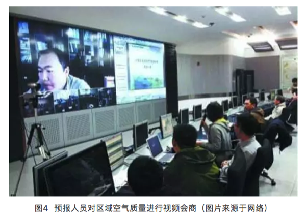
```

### 预测到重污染，环保部门怎么办？

环境空气质量预报的目的是应对重污染天气，当环保部门预测到有重污染发生时，及时发布预警和应急，采取有效的减排措施，把污染程度降到最低。大气十条明确提出环保部门要做好重污染天气过程的趋势分析，完善会商研判机制，逐步提高监测预警的准确度，及时发布监测预警信息，并制定完善的应急预案，落实责任主体，明确应急组织机构及其职责、预警预报及响应程序、应急处置及保障措施等内容，一旦发布预警，及时启动应急，并按不同污染等级确定企业限产停产、机动车和扬尘管控、中小学校停课以及可行的气象干预等应对措施，对工业源、移动源和扬尘源进行严加管控直至预警解除，对污染实施有效的防控。

在环保部《关于印发〈重污染天气预警分级标准和应急减排措施修订工作方案〉的通知》（环大气〔2017〕86号）中对于预警级别、应急响应、减排目标以及减排措施等做出了明确的规定，其中部分内容如下表所示。

```{r}

```

重污染天气预警和应急是对重污染的严加防控，是防治雾霾污染的有效途径。环保部门准确预测空气污染的发生和变化趋势，便于政府部门及时启动大气污染应急减排措施，以最低经济成本实现最大的社会效益。环境监测数据真实有效，环境空气质量预报准确可靠，发布预警及时科学，应急措施落实到位，那么大气污染防治工作的开展也会越来越顺利。

近几年，环境空气质量预报工作在全国蓬勃开展，预报准确率在逐步提高。在总站的带领和组织下，对于秋冬季节京津冀区域重污染的过程预报准确率接近100%，区域重污染的程度预报准确率接近80%，为各级政府针对重污染过程提前采取预警应急和管控措施提供了关键信息和决策依据，也为APEC会议、G20峰会、青奥会、抗战70周年阅兵活动以及十九大会议等重大活动，以及春节、国庆等重要节假日提供了有效的空气质量保障服务，发挥了积极的作用。


参考资料

1.《大气污染防治行动计划》(国发〔2013〕37号).

2.《关于印发〈重污染天气预警分级标准和应急减排措 施修订工作方案〉的通知》(环大气〔2017〕86号).

3. 柏仇勇，李健军,《环境监测预警在重污染天气应对中的作用与启示》, 环境保护, 2017(08): 45-48.

4. 曲凯等, 《山东省环境空气质量动力统计预报系统》， 环境与可持续发展, 2017(01): 54-57.

5. 王超, 《城市环境空气质量预报要点分析》， 黑龙江环境通报, 2017(04): 46-48.

作者：Amy
校稿：yufree，大石
编辑：李立平

## 作为入侵物种的人类

### 引言

如果让我列个书单，最偷懒的方法就是直接链接普利策文学奖的非虚构类获奖名单。一来这里面的作品可读性很高，也就是你不会有读维基百科或教科书的痛苦；二来就是主题都非常现实，毕竟是非虚构类，有利于从不同视角了解世界；第三个则是因为多数作品都很快会有中译本，毕竟啃外文原著需要些门槛。
其实这个书单里的很多作品例如关于逻辑的《GEB》、关于人类学的《枪炮、病菌与钢铁》、关于疾病的《众病之王》、关于历史的《拥抱战败》等都已经很出名了，但如果你不是那个领域的爱好者可能一辈子都不会去读，强迫自己读一个主题五花八门的书单有助于开拓眼界。这篇是关于《大灭绝时代》的，主题是关于第六次大灭绝。

```{r}
knitr::include_graphics('images/miejue1.png')
```

### 灭绝

灭绝这个事吧，跟灭绝师太是没啥关系的，从历史长河看过去有5次大灭绝事件，最近的一次在地质学上创造了KT带并直接把恐龙给从地球上清理没了。关于灭绝一直有个说不清的问题是是否有周期性，支持者认为每2600万到3000万年会有一次，甚至有人构思出了一颗太阳的伴星涅墨西斯星，并通过计算认为冥王星轨道外的小行星赛德娜轨道就受其影响。

当然有支持者就有打脸者，NASA（美国国家航空航天局）不光是从观测数据上否定了这事，还认为从统计学上那个周期性也没啥意义。不过这也不是结局，熟悉天文测距就知道如果真有这么一颗伴星，别看离得近，还真就不好观测，另外也有地质化学的证据来说明周期性，这会是另一个很长很长的跨天文、地质、生物、化学、物理等学科知识的故事，我就不在这篇书评里跑题了。每次灭绝的不幸原因都不是单一的，而《大灭绝时代》旗帜鲜明地提出现在有第六次大灭绝，想必是有充足的理由来解释这个大字。

### 作为入侵物种的智人

现在一个普遍的共识是现代人类都源于16万年前线粒体夏娃跟14万年前Y染色体亚当，这个结论是从人类基因组中得出的，而且这个虚拟老祖宗在非洲。也就是说，现代智人的祖先都是从非洲过来的移民。当4万年前智人进入欧洲后，原住民尼安德特人就同步灭绝了，你说巧不巧，智人某些优势可能造成了这个结果，这个优势不是体力上的，因为尼安德特人比智人更强壮，更可能是智力上的。

另一个假说是我当年在历史书上看到的所谓多点起源，例如蓝田人、北京人等，从化石证据上看确实几十万年前是有人类就生活在世界各地的，但从基因角度看当我们的非洲祖先来到新土地上后显然进行了某种降维打击把原住民给灭绝了，当然现在也有证据说存在融合现象，我们身上也会有少部分尼安德特人的基因，不过不管怎么说我觉得我是活着看到了教科书上知识被分子遗传学大概率证伪了。然而，作为入侵物种的智人所真正引发的灭绝就像是原罪一样伴随着这个扩张。

```{r}
knitr::include_graphics('images/miejue2.png')
```

### 巨兽  

恐龙灭绝这个锅是不能怪到人类的，那个年代哺乳动物长得像小野猪，掀不起风浪。但我们这个年代巨兽是不是少了点呢？虽然没赶上恐龙，但我们的祖先跟猛犸象还有大地懒可是同一时期的，有意思的是，当我们祖先登上历史舞台后，他们也灭绝了。用更近些的历史来看，当人类来到一些纽芬兰岛屿后，我们成功吃光了一种长得像企鹅的大海雀。类似命运的还有渡渡鸟、恐鸟、苏门答腊犀跟大海牛，他们本来在各自的生境已经进化到了食物链的顶端，没有天敌，而且从演化上看越大越不用怕天敌。只是他们也许有生物背景但没有工程背景，没想到有个物种是不按套路出牌的，他们会用工具。然后，巨兽基本被吃光了。

```{r}

```

生存策略在演化上有着自己的逻辑，当块头变大后繁殖速率会下降。同时，食物链顶端的生物数量也不会多，食物链富集能量的效率并不高，所以你很少能看到一个超过五层的食物链。最底端的是植物，最高端是巨兽，一只巨兽对应几平方公里的草原是很正常的，其繁殖速率也受限于这种层级能量供应，但一个小部落一年每个月捕获一只巨兽，一年就可以把方圆几十公里的巨兽灭绝掉。石器时代之前人类是搞不定规模化捕捉的，但农业革命一出现，就可以集团作战了，不过其实没等出现农业革命，巨兽就死的差不多了。我甚至怀疑农业革命的一个原因就是作为蛋白来源的巨兽的灭绝给逼出来的。巨兽灭绝生态系统就没了一级，其波动会改变物种多样性，不过农业出现直接把多样性给彻底消除了。如果我们可以灭绝所有的巨兽，那么我们就成了巨兽，蟑螂笑而不语。

### 二氧化碳 

环境化学的一个核心考点就是水环境中的碳酸平衡来讨论碳元素的形态，但我学的时候确实没想过这个水环境往大了说就是海洋，更没想过的是当大气中二氧化碳浓度升高后，它们可不会老老实实留在大气里，直接溶解进海洋里变成碳酸氢根才是扩散路径。注意我说的是根，是负离子，对应的还有个氢离子，这玩意多了有个很简单的后果，水变酸。这个酸化跟酸雨那个完全不一样，那个酸度是二氧化硫，那玩意根本就不是空气主要成分，二氧化碳却是，溶解到水里引发的pH变化是很小的，但生态系统就是这么神奇，轻微的变动对很多物种而言就是灭绝。

从质量平衡上看，我们开采矿石燃料然后烧了，相当于把累计几亿年植物固定的碳元素用二氧化碳的形式又给释放出来了，每年海洋吸收的碳是25亿顿，什么概念呢？海洋表层水pH从8.2变成了8.1，这个变化广范试纸是测不到的，但如果我们按现在的排放能力排下去，这个世纪末会变成7.8。当然还是测不到，但要知道所谓高等生物的人类要想维持内环境pH稳定搞出了多少让生物化学家赖以生存的基金，海洋浮游生物可就没那么多设备了，直接溶解掉了。对，就是类似你把糖加到红茶里那样，溶解了。这里面最倒霉的就是所谓钙化者，也就是以碳酸钙为外骨骼的动植物，中学化学我们就知道，把酸加到碳酸钙里那反应很酸爽。钙化者要想得到碳酸根要从周围海洋中找，碱性环境里碳酸根是不缺的，酸化后情况就很不理想了，被多出来的氢离子变成碳酸氢根了。生命是个工程作品，原材料短缺什么后果，豆腐渣工程，但对于生化反应就是豆腐脑工程了。书中考察了一个海底火山，然后发现喷二氧化碳的那部分寸草不生，就是个死区。

```{r}
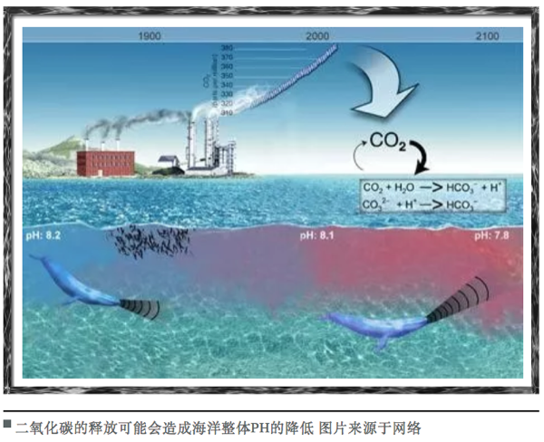
```

也许有人说地质历史上肯定也发生过，确实发生过海水酸化，但地质历史的单位都是百万年计，也就是生物会有较长时间去进化出应对机制。现在的问题是人类正在用年计的方式释放千万年计固定的碳，这个速度生物进化是来不及的，来不及就灭绝，证毕。最常见的钙化者是珊瑚礁，早在失败的“生物圈二号”的实验中，研究人员就发现空气中二氧化碳的上升导致珊瑚礁被毁了，真实世界中，珊瑚礁要拼命生长钙化才能维持现状，如果原料不足，好比让驴拉磨又喂驴，结果就是珊瑚礁这种生物多样性丰富的生态系统可能会不断萎缩然后100年后消失掉。那个时候，我觉得如果人类还没作死应该会有人问《海底总动员》场景里的珊瑚是不是远古生物了（确实是，不过刚刚灭绝掉了）。

### 交通

非洲爪蟾是一种模式生物，我原来在中科院就有养的，用来指示环境内分泌干扰物。原因很简单，非洲爪蟾对激素敏感，如果给它注射孕期妇女尿液，几小时就会产卵。因为这个特性，它们被带到世界各地。同样命运的还有北美牛蛙，他们周游世界则是因为好吃，当然是人觉着好吃。但这两个物种身上都有一种真菌，这个本身对它们无害，但当来到新世界后，直接灭绝了南美的巴拿马金蛙。《枪炮、病菌与钢铁》中钻石教授说传染病把美洲原住民灭绝了，这是从人类学角度，从生物视角看，交通工具的出现能灭绝的绝不只有原住民，所有物种都遭殃。当然，很多发生与正在发生的事我们可能没意识到也不关心，甚至也会争论责任问题，但影响是很客观的，我不清楚人能否竟做好准备去应对这些未知影响。很多繁荣与灾难没有发声系统，知道自己不知道是个很重要的态度。

```{r}

```

### 多样性

多样性目前是在锐减的，当然原因很多，但人类活动肯定是很重要的一部分。生态系统达到平衡态时会产生很多狭窄的生态位，这些位置很特殊，如果没有外来干扰异常稳定，但只要有干扰就会对系统产生一个大扰动。书里面列举了很多这样的例子，特别是高山生态系统很多植物是不长腿的，气候变化过快它们无法转移然后就灭绝，好比所有人的体温同时升高1摄氏度，体内生化反应肯定乱套，你什么时候见过天天低烧还能正常生活的，限制的不是意志，而是勒夏特列原理。现在发生在自然界的好比同时升高了10摄氏度，生化反应直接会停摆，也就是死亡。

不过肯定有人会问这个多样性究竟对人类有多大价值，毕竟生命科学的发展让我们只要保存了基因就有可能重现多样性。这个视角下那些多样性会发现新药什么的观点就很单薄了，当前技术确实可以直接设计药物，仿生很重要，但不再是唯一选择。还有些人是从景观或美学角度出发的，我只能说他们一定没真正考察过生态系统，高尔夫场平整美观的草坪跟草原是两个概念。不排除有人真的热爱自然，但更多的人所向往的田园牧歌是不适合人居的，或许你在城市里很舒服，但野外的美你只能作为过客体会，相融进去是需要勇气的。本书作者其实是有点向往田园牧歌的，他笔下的多样性充满美感，我不反对也不鼓励这种方法，衡量多样性也许我们要去了解下另一个流派：硬绿。

### 硬绿

《硬绿》这本书观点田园牧歌派环保主义者（软绿派）是很难接受的。硬绿派是不相信模型的，他们认为软绿派对化石燃料的不信任或技术的不信任毫无道理。硬绿派不相信回归节省与原始会解决当前的环境问题，他们主张农业里使用转基因、发展核能并反对有机农业，他们的绿色体现在高效高技术的利用当前资源而不是回归原始，他们不去提倡融入自然而是直接划定保护区然后禁止开发，提倡先富裕解决贫困问题再关注环保，人是高于自然的。在这套价值观下，多样性就无关紧要，灭绝也只是个生物现象，就算物种都消失人类也能借助技术活下去，绿色是个高级需求得完成生存需求后才能讨论。

```{r}

```

环境其实一直就是个伦理问题，人人平等是政治诉求但众生平等就是个伦理诉求了。很多环保主义者保护环境是相信环境中的一切有机体都与自己的人生一样重要，他们会为这个信念去身体力行。我所在课题组就有个哥们说自己不吃工业化生产的肉类，结果就是营养不良然后老老实实按照医生要求天天吃肉。他很爱大自然，喜欢野营、漂流与开车追台风，但他其实是喜欢那个喜欢大自然的自己而不是大自然，说到底硬绿就是为他们提供的理论武器。我觉得众生平等的含义是所有生命都跟你的生命一样不重要，都是这个行星的一个瞬间，因为同一瞬间能相遇，自然要平等对待，灭绝的事重要但并不需要一个硬绿理论来找理由。如果是人类导致了灭绝，那么并不意外，从走出非洲那一刻智人就满手鲜血。灭绝其他物种不需要什么情感介入，承担多样性缺失的后果同样不需要什么情感介入，因为与被灭绝的生物一样，我们都不重要，我们都是在面对生存问题而想多坚持的物种。但是，对于灭绝这件事人类不能视而不见，用理论麻痹自己拒绝思考原因是有害的。或许多样性对于人类实质上没有意义，但这个结论现在说有点早，先不要着急盖棺定论。

### 谁是赢家

在灭绝这件事上似乎所有参与者都是输家，物种正在快速萎缩，我们似乎也失掉了未来。作为入侵物种的人类似乎也难逃被其他物种替代或一同灭绝的命运，但其实如果不考虑我们自己是人类，这个游戏最后还是有赢家的。农业革命中我们驯服了农作物，但其实是农作物驯服了我们，所有的组织生产模式都成了为农作物基因延续服务。现在这个大灭绝活动又是谁在驯服我们？

现有药物中有近70%来自细菌、真菌还有植物产生的活性组分，从这个视角看，人类其实充当了它们之间化学战争的载体，把原来发生在土壤底层、海沟、火山口的局部冲突搞成了全球尺度的世界大战，也是这类物种基因全球化的执行者。盘尼西林等抗生素曾经是需要重新萃取病人的尿来给重复使用的，后来产量上来了循环就断了，然后自然环境中积累的抗生素驯化出了更强抗性的细菌，所谓特效药大概都是拿未来换现在。看明白了吗？赢家是我们在复制的基因，当我们自以为复制或创造出了为我们服务的基因去执行某个任务，实质上是基因的某种排列组合被超量保存了。所谓文明，不过是基因延续的手段。

### 小结

这本书揭示了一个现状：物种正在用自己反应不过来的速度走向灭绝，主因是某些环境因子的变化率超过了物种自身进化适应的机制，这个过程入侵物种出身的人类功不可没，当这个灭绝开始启动，终点就不知道在哪里了。我觉得现阶段人类没有阻止这个过程的能力，也不用虚伪地悲哀，众生平等但都无一例外是基因的奴隶。关于这一点，可以速度去读《机器人叛乱》。

作者：yufree
校稿：广播站王站长
编辑：智公子

## 作为工业品的人类

### 人口多少是个顶

在《人口原理》这本书里，马尔萨斯对于人口增长有两个基本假设，一个是人类生存靠食物，另一个则是人类的情欲不可消除。而食物的增长是算术级数，但人口的增长是指数级数。因此，人口的增长早早晚晚都会被食物的增长限制住。应该说这是一个非常社会物理学的推论，在当时也确实很有说服力，因为实证数据确实展示出了当人口增长超过农产品增长时，就会出现饥荒来降低人口；反之当农产品过剩后，人口会迅速增长且发展出繁荣的文明。前者几乎贯穿了整个人类农业社会，后者则几乎贯穿了现代社会。也就是说，现代社会开启了某种机制，这种机制保证了农产品可以不断地满足需求。

```{r}

```

要知道，世界人口在出现农业之前没有超过1500万，农业社会出现后到第一次工业革命中的1804年，世界人口才达到10亿。之后的两百多年里，这个数字变成了70亿。但并不是说1900年达到40亿，事实上这个时间是1974年，甚至达到30亿都是1959年的事。数字归数字，10亿人口需要的食物可都得从地里长出来，从1959到2018这60年里，地球上多了40亿人口，配合现代医学对平均寿命的延长，每年张嘴吃饭的人可以说是几何级数在涨了。传统农业的生产率肯定赶不上，甚至都赶不上为人类提供肉食的畜牧业所需的饲料供应，这中间的绿色革命默默承担了所有的问题。

绿色革命就发生在世界人口快达到30亿的时间点上，最著名的案例就是墨西哥，墨西哥在1910年结束独裁统治后打了近二十年的内战，到了1956年，因为接受了发达国家推广的杂交小麦，农业上终于实现了自给自足。时至1964年，墨西哥甚至开始出口农产品了。也就是说，绿色革命实际上是农业工业化进程的一部分，农业机械、农药、灌溉系统甚至新育种技术都从底层推动了产量的提高。绿色革命革的是农作物，但动力其实是技术、煤炭、石油与钢铁而不是辛勤劳作，本质是农业工业化，后果就是发展中国家普遍在这个时期迎来了人口高峰，毕竟是养得起的。中国也不例外，不过那年代政治运动也产生了很深远的影响，这个就不细讲了。

```{r}
knitr::include_graphics('images/renkou2.png')
```

### 人类是工业衍生品

但环境研究是什么时候开启的呢？大概是上世纪70年代左右起，不论发达国家还是发展中国家都迅速出台了环境保护的法规，学术界也开始认真研究环境问题。这里面《寂静的春天》与《增长的极限》对舆论氛围的形成起了关键作用，有意思的是，这两本书里提到的很多案例都有绿色革命的影子。《寂静的春天》大量使用关于农药滥用的案例而罗马俱乐部的《增长的极限》则回归马尔萨斯，认为地球资源会最终限制经济增长而引发了关于可持续性的讨论。农药是绿色革命的燃料之一而绿色革命对化石燃料这一自然资源的需求自然也会被经济增长限制。换句话说，绿色革命在解决口粮问题的同时也开启了环境科学相关研究的讨论。

绿色革命与环境保护背后的讨论实质上是关于工业而不是农业的讨论，作为农业的直接消费者，人类可以说就是某种意义上的工业品。农药生产的本源就是石油煤炭化工业提供的原材料，化肥的生产则牵扯到工业固氮与大量元素矿石的开采，农业机械则需要强有力的制造业支撑，这些过程对环境造成的影响不次于消费工业品与服务业产生的影响。而且很多影响就是灰犀牛式的，从我们开启这种发展模式就注定要应对相应的问题。这里我们讨论两个方面：氮循环与磷循环。自然界里可以说从来都不缺氮元素，空气里比重最大的就是氮气。但对于生物体中所需的氮，氮气实在是活性太低，要想创造更多的生物，活性氮就不可或缺。放到农业里，农作物要想长起来，碳氢氧氮磷一个都不能缺，碳氢氧通过自然界里到处可见的空气与水就可以得到，氮却需要别的物种，那就是固氮菌。固氮菌固然是种天然方法，问题是效率比较低，要求比较高，然后化学家就闪亮登场了，最著名的就是哈柏法，反应及其简单，用氮气和氢气在铁催化剂高温高压下就可以得到氨气，这就是活性氮了。氮气直接空气里就有，而氢气则可以通过水煤气或甲烷与水反应制备，就是这么几个简单的化学发应使得工业固氮进行了100年后，产量就超过了自然固氮。同样的，我们现在体内蛋白质里氮元素有一半也是这个反应制造的，追根溯源，我们自己就是固氮工业制成品的衍生品。

```{r}
knitr::include_graphics('images/renkou3.png')
```

### 化肥的威力

且不论工业固氮的能耗，在化肥的使用里，氮肥的效率差距比较大。碳酸氢铵属于比较容易吸收的，但问题也容易分解成氨气跑了，江湖人称“气儿肥”。相比之下，尿素含氮量更高，但问题不是铵态氮，吸收效率不高且比较贵。硝态氮倒是不会变成气跑了，但硝酸根决定了含氮量比较低。这个低效率其实也没什么，如果用精耕细作的方式打理田地，化肥就会合理施用。然而，农业在发展中国家一般拿不到补助，经济上不如工业来钱快，这样现在很多人务农其实很豪放，也就造成了氮肥的滥用。中国用全世界7%的耕地养活约世界五分之一的人口是大家都知道的，但问题我们用了全世界化肥产量的35%。虽说平均主义害死人，但质量平衡上看，多用出的那部分就都成了污染源。

前面说了，工业固氮产品是氨气，但化肥里一般是硝酸根或铵根，铵根可以变成气态跑了，硝酸根可是强酸根，土壤中碱性离子很多是弱碱性，强酸弱碱盐的过量存留必然让土壤酸化。其实我国土壤酸化问题是很严重的，跟发达国家的工业硫酸型酸化不同，我国的土壤酸化大部分是化肥滥用导致的。这个影响其实非常恶劣，因为不同于工业三废，这个污染源的化肥还属于花钱买来的，长远造成的经济影响比短期利益大很多。但是你又不能强制农民合理施肥，这提高了劳动力成本，属于发展中必然出现的问题，本质上需要更健康的财富分配体系，公平合理的分配有利于共同福祉的实现。

然而除土壤酸化外，过量的活性氮释放到水环境里还会导致水体富营养化。富营养化并不是人造的，实际上，富营养化是生物对地球改造工程的一部分，在地质运动过后会形成天然的静态水体，此时水体中营养元素比较少，生态系统单薄。伴随风化与冲刷，地壳中氮磷可能被释放，这样水体就会适宜浮游生物生长，然后在水中形成健全稳定的生态系统，一般来说，淡水湖缺磷而海洋缺氮，生态系统规模被营养元素所限制。不过假如这个水体只进不出，生物质就会沉积，时间长了水体就会沼泽化，如果水分进一步流失甚至可以形成新的陆地。很多小区里建的人工湖或水库，时间长了几乎都会富营养化，不过还有更快的方法，就是前面说的滥用化肥。

当农田施用的化肥不能被有效利用时，这些营养元素很容易随雨水冲刷进入自然水体。对自然水体而言相当于补足了营养短板，同前面所说的人口一样，马上指数扩增。白天指数扩增，相当于无机营养有机化，充足有机质又推动了水体细菌生长，到了晚上没了光合作用，大量浮游生物会消耗水中溶解氧。这样就促进厌氧菌的生长，而水中原有生物也会因缺氧死亡腐烂，整个水体会发臭，最终变成死水。富营养化一个直观体现就是水华，当水面布满一层藻类时，这潭水基本就没救了。这种化肥滥用并不是发展中国家的专利，实际上发达国家的水体富营养化状况也并不好。用质量平衡的观点去看，我们工业固氮生产的活性氮必然要最终矿化或惰性化才能维持生态系统平衡，不过固氮是个生意但矿化氮没有经济利益，因此这部分只能靠天吃饭，如果超过自然承载力，对地球而言当然不会有什么影响，但人类水资源的处理成本就会上升，毕竟地表水是人类很重要的淡水来源。

```{r}
knitr::include_graphics('images/renkou4.png')
```

### 有机肥怎么样

那么所谓有机农业是不是个好的解决方案呢？比如我们不用化肥，只用农家肥。好，我来问你，农家肥哪里来？自产自销理论可行但现实肯定不够用，最直接的来源是养殖场的动物粪便。养殖场动物粪便的源头是饲料，但其实要命的不是饲料，而是养殖时为了防疫加的兽药或抗生素，这其实是抗生素滥用的重灾区。同时动物粪便大都重金属超标（也是超量补充这种偷懒养殖策略导致的），这样的农家肥用出去且不论超低的肥效，光是附赠的抗生素跟重金属就够受的。你可以去搜一下新闻与论文，有机食品的重金属超标情况是很常见的，也不缺乏抗生素对农作物的生态毒理学研究。反正我个人对有机食品一贯不感冒，价格死贵不说，食用风险还挺高，北美这边很多超市专卖有机食品，在我看来只是营销手段与中产阶级的刻奇，只是所谓优质生活的象征与自我感觉良好，甚至起作用的就是自我感觉这部分。

### 人和磷污染

氮是可以固定的，那么磷呢？磷主要来自于磷矿石。不过这个说法也不准，大洋洲的瑙鲁出口的磷酸盐其实就是鸟粪，这个国家在澳大利亚买了一栋楼，准备鸟粪挖完了就举国搬迁，不过后来又给抵押出去了，现在矿开的差不多了只能靠给澳大利亚修建监狱过活，而且海平面如果上升，这个国家还有灭国可能，可以说是个现代版的复活节岛。磷元素的地球化学循环因为速度太慢事实上是不完全的，当我们不断开采磷矿石时，事实上是把陆地上磷给搬到海底沉积物里去了，一时半会是搞不回来了，这事倒也是绿色革命搞出来的。磷矿也用来做化肥，同样存在严重浪费，不过化肥不是主要污染源，动物粪便才是磷污染的大头。这跟氮污染并不一致，氮污染里化肥的比重是很高的，仅次于生物污染。磷污染里的关键问题在于磷元素利用率，而这个利用率是可以通过转基因或补充植酸酶来调节的，只要让猪鸡等生物的磷利用率提高，那么也就相当于可以减少用量。

磷元素排放的一个大头还在于人，现代社会给人提供了更多的衣着选择，要知道这多出来的几十亿人除了天天要吃饭还得穿衣服。而且现在一个人几十件衣服都很正常，同样也就造成了洗衣服的需求，而洗衣服是需要洗衣粉帮忙的，好巧不巧三聚磷酸钠作为一种助剂被用到了洗衣粉里来络合水中钙镁离子，辅助表面活性剂去污。人们在用洗衣粉时其实也没比用化肥强多少，都是过量用的，后果就是全随着生活污水排到自然水体促进富营养化了。不过也可以用酶来替代表面活性剂来去污，但酶本质上多半是蛋白，需要温度合适，洗衣粉不靠谱但洗衣液更适合含酶洗涤剂，不过这又牵扯到人们的生活习惯了，北美这边大都喜欢用洗衣液与烘干机，而国内洗衣粉与晾衣绳更多些。

```{r}

```

### 结语

总之，我们要感谢绿色革命，没有农业现代化我们多半还被马尔萨斯陷阱所限制而根本没机会出现在人间。但绿色革命也带来了巨大的生存需求，仅关注两种元素的使用，人类的影响力就已经超过自然本身了。而且更尴尬的问题在于使用元素可能并没有污染问题，污染更多出在使用者对工业品的滥用上，这就成了个复杂的经济-技术-社会问题了。这就是很多环境问题的缩影，简单的政策或技术或宣传对于问题解决都是不充分的，而环境问题的复杂性更多是人性复杂性的体现，总想既…又…是不靠谱的，更常见的是按下葫芦瓢起来，而这就需要鸡尾酒式的组合拳了。 

作者：yufree
编辑：丫头晚安

## 丛枝菌根真菌：“微”小生物，大有“名堂”

大家都知道豆科植物如大豆能够与共生固氮细菌（俗称根瘤菌）形成共生关系。根瘤菌能够固定空气中游离的氮（$N_2$），并转变为植物可以吸收利用的含氮化合物（$NH_4^+$）供给植物生长发育所需，同时又能够从豆科植物中获取碳水化合物，以利于自身生长和繁殖。其实，自然界中还有另外一种更为广泛的、能够与植物共生的土壤真菌，那就是丛枝菌根真菌（AM 真菌）$^1$。

### AM真菌是什么？

AM真菌是一种单系球囊菌门真菌，其可以和70-90%的陆地植物形成菌根共生体。也就是说，如果你随意在路边发现一朵野花，或一些野草，顺便挑些根上来，碱煮后用染色剂（如台盼蓝，墨水等）染色后在显微镜下就有可能看到这些奇特的生物 （图1）。AM真菌与植物形成共生关系后，真菌菌丝能够侵入到植物根系内部，游走在细胞间，一部分菌丝进入植物细胞内部，形成一种像“丛枝”（arbuscule）一样的结构，丛枝菌根便得名于此。可别小觑这个特殊的结构，AM真菌诸多功能都与其息息相关。“菌根”一词源于希腊语“mycorrhiza”，意思是真菌（“mycors”）和根系（“rhiza”）组合体$^2$。

```{r}

```

### AM真菌“前世今生”

AM真菌和植物的共生关系是亿万年自然演化而来。故事可以从4.6亿年前说起，那时我们人类还远未出现，恐龙也没有开始称霸，一些原始植物只能在水域生长，而这些菌根真菌即已经出现了，它们很可能对于植物入驻大陆具有重要的作用 $^3$。大概过程可能是这样的：很久很久以前，一些藻类、植物等都在汪洋大海中生存，他们大多数只能“望陆兴叹”，因为陆地上没有充足的游离态营养离子供他们“食用”。其中有一些不“安分守己”的家伙总是跃跃欲试，一次又一次凭借着物理的力量“随风顺雨”（潮汐）来到陆地上。那个时候陆地上光秃秃的，可谓“前不见古人，后不见来者”。就在某个时候，旁边的AM真菌发来信号，“嗨，老兄，咱们合作吧”（信号传递），“我可以帮你吸收陆地上难溶态的营养物质（比如磷），开拓适宜你生存的沃土，你只需要给我一部分你的光合作用产物（碳水化合物），如何？”原始植物觉得：“互惠互利，好！（受体应答）”于是，二者开始合作，他们形成了明确的分工：真菌发展地下空间，为双方寻找矿质营养资源；植物拓展地上，利用阳光转化成碳水化合物构筑自己强大的躯体并传递一部分碳水化合物给真菌同伴。就这样，几亿年过去了，恐龙来了又灭绝了，“小强”（蟑螂）来了，猴子诞生了，人类诞生了，沧海变桑田……。他们没有“海枯石烂”，而是世世代代生存延续了下来。时至今日，陆地上的植物“老兄”已经发展成为成千上万植物群落，AM真菌也发展出了好几百种。

起初人类并未意识到植物根系周围还有菌根真菌这种微小的生物。1885年，一位叫Frank A.B.的德国人才发现植物根系上侵染的菌根真菌$^4$， 并命名为“mycorrhiza”。 九年后，Frank 又发现菌根真菌能够促进植物吸收氮素营养$^5$。其实最初的研究更多关注的是外生菌根真菌，并没有认识到AM真菌。直到1957年，Mosse B第一个观察到了AM真菌, 并发现其能够改善植物对营养元素的吸收$^6$。此后六十年间，AM菌根研究被越来越多的人所关注。笔者2015年曾去美国北亚利桑那大学参加第八届菌根大会，期间大咖云集，研究涉及菌根的方方面面，而以AM真菌研究最多。好不热闹！

### AM真菌有哪些功能？

那么，为什么AM真菌研究能够获得如此多的关注呢？这源于其多方面的功能作用。

```{r}

```

### AM真菌与植物营养吸收

AM真菌最广为人所知的功能是帮助植物获取矿质养分（如磷，氮等）。比如，AM真菌依赖其合成的磷酸酶（碱性磷酸酶或酸性磷酸酶）促进土壤中难溶解态磷溶解，从而利于植物吸收。与此同时，根外菌丝也能够直接从土壤中吸收磷并转运给植物搭档。一直以来，学界认为AM真菌与植物搭档之间的磷传递是以碳水化合物的交换为前提的。这些碳水化合物主要是各种糖类如葡萄糖、蔗糖、淀粉等。但在去年（2017年），中国学者的一项研究发现，在AM真菌与植物的共生过程中，除了糖类，脂肪酸也是植物传递给菌根真菌的主要碳源形式之一$^7$。这些磷和碳水化合物的“交换”就是通过“丛枝”这一结构进行的$^8$。前面提到的AM 真菌促进植物“登陆”，也得益于AM真菌能够给植物传递紧缺的磷营养。其实植物与AM真菌二者的交易并不是互相忍让，而是时时刻刻在“斗智斗勇”，“谁都不愿意吃亏”。有研究称，菌根真菌与植物的交易是依据具体情况而定的$^8$。当真菌能够给以植物更多的磷营养时，植物也愿意把更多的碳水化合物馈赠给真菌。反之，如果植物发现AM真菌不能够供给足够的磷，其也在“盘算着克扣粮食”，给真菌搭档更少的碳水化合物$^8$。如果土壤中有大量的可被植物利用的磷营养，植物根系不需要AM真菌就可以获得足够的磷，那么植物就会调整自身策略，对AM真菌的入侵及发展进行防御，这样AM真菌就不容易侵染根系了。甚至有时候，如果给以植物更多的磷，已经形成的丛枝结构就会被迅速分解$^9$。

除了吸收矿质养分以外， AM真菌还有哪些功能呢？可别小觑，AM真菌“能耐”大着呢。此真菌还能够促进植物吸收水分，调控植物干旱胁迫相关的生理过程，从而增强植物抗旱性。此外，菌根还可以增强植物耐盐性，抗病害，并能够帮助植物适应众多环境污染物的胁迫，如重金属、有机污染物等。另外，庞大的菌丝网络利于改善土壤结构，促进团聚体形成。因而AM真菌在农业生产，污染土壤复垦及生态恢复中具有极大的潜在应用价值。

### AM真菌与植物重金属耐性

重金属污染是工业革命之后带来的问题，一百余年来一直困扰着人类，而今在发展中国家（如我们中国）愈发严重。一些科学家发现，在一些重金属污染的土地上往往存在着菌根真菌。也就是说重金属胁迫并没有“杀死”真菌，它们勇敢的活了下来。科学家们把这些真菌分离出来，并在温室里面给植物接种。惊奇的是，大家发现重金属污染下（Cd, Cr, As, Pb, Zn, Cu 等）接种AM真菌的植物明显比不接种植物长得好（图3）。

```{r}
knitr::include_graphics('images/am3.png')
```

于是大家很感兴趣，这些真菌是如何作用的呢？笔者参与的一篇综述文章$^{11}$，详述了AM真菌对植物耐受重金属的作用机制。AM真菌通过间接作用和直接作用缓解植物重金属毒害。（1）间接作用：AM真菌通过扩大植物根系吸收范围，促进植物矿质养分的吸收（如磷和氮等的吸收），进而增加植物生物量，而植物生物量的增加往往稀释了重金属（表现为植物重金属浓度降低，称为“生长稀释”效应）；（2）直接作用：AM真菌直接影响重金属在土壤-植物系统中的迁移转化。AM根外菌丝直径仅有数微米，能形成发达的菌丝网络，进而吸附固持重金属。如笔者研究发现重金属铬主要聚集在丛枝菌根根外菌丝表面（图4）$^{12}$。此外，根内共生结构（根内菌丝、泡囊、丛枝等结构）也能够将重金属“区隔化”，阻止重金属进入植物细胞胞浆，减轻其对植物的生理毒害$^{13}$。此外，AM真菌还能够通过菌丝分泌物等影响根际微环境，进而影响重金属的化学形态和生物有效性。需要指出的是，作为一种富含脂肪族烯类和亚甲基的糖蛋白，AM真菌分泌物球囊霉素相关土壤蛋白（Glomalin-related soil protein, GRSP）$^{14}$对重金属具有较强的结能力(强化学络合作用)，因而对土壤重金属的生物有效性有重要影响。

```{r}

```

### AM真菌与土壤团聚体形成

土壤团聚体是土壤结构的重要组成部分，直径大约为0.053-10mm。其主要由矿物质/有机质及生物结合而成的一种有多孔结构的综合体。团聚体在稳定土壤碳库，促进根系发展，调节水分及养分可利用方面具有重要作用，是土壤结构功能评判的重要指标之一。AM真菌与植物形成共生关系后，能够在菌根周围形成庞大的菌丝网络，这些菌丝往往有4-5微米，能够进入到植物根系所不能到达的空隙中，与土壤矿物相互作用，深刻影响着土壤团聚体的形成。AM在植物群落/植物个体/菌丝等多个层面影响着团聚体的形成$^{15}$，其中菌丝的直接作用最为注目。例如，菌丝通过网捕作用将矿物及小团聚体聚集，通过影响微环境水分含量以影响团聚体的形成。菌丝分泌物（如球囊霉素相关土壤蛋白（Glomalin related soil protein, GRSP），多糖/铁载体及其他胞外聚合物疏水蛋白等等）能够作为胶粘剂与矿物或其他有机质作用，促使团聚体凝聚。其中一些主要分泌物如GRSP稳定性很强，可以存在甚至数十年，因而有利于维持团聚体的稳定。此外，菌丝及其生理活动能够通过食物链影响众多细菌群落甚至土壤动物的活动进而影响团聚体的形成和发展。

### AM真菌与植物抗病性

AM真菌能够通过与病原菌竞争侵入位点或者宿主植物传递的营养物质来降低病原菌对植物根系的侵染。AM真菌同时能够增加根系分支，增强植物吸收营养能力，缓解因感染病菌造成的根系功能下降，增强植物营养吸收，调节根系分泌物合成，以及诱导植物病害预防体系，调控关键基因表达和激素合成来增强植物抵抗病害。此外，AM真菌能够通过影响根际微生物群落来抑制病原菌的发展$^{16}$。

### AM真菌与植物耐盐及抗旱性

AM真菌通过促进植物吸收水分及矿质营养 （P, N, Mg 和 Ca等），减少盐离子（$Na^+$）累积，促进渗透调节物质（脯氨酸，甜菜碱， 多胺）以及碳水化合物及抗氧化物质的累积从而增强植物耐盐性。此外，AM 能够增强植物光合作用，调节气孔导度和激素水平（如脱落酸），调控水通道蛋白基因表达，维持细胞结构等，进一步增强植物耐盐性。$^{17}$ AM真菌不仅能够促进植物吸收水分来缓解干旱胁迫，而且还能够通过促进营养吸收，调控脱落酸水平，调节植物抗旱生理生化过程从而增强植物抗旱性。$^{18}$

```{r}
knitr::include_graphics('images/am5.png')
```

值得指出的是，AM真菌不仅在个体水平上促进宿主植物抗逆生长，而且在群落甚至生态系统水平上发挥作用。例如，研究发现地下AM真菌多样性会影响地上部植物群落多样性，进而影响生态系统结构和功能$^{19}$。

### 总结与展望

AM菌根研究发展到今天，共经历了一百三十多年，人们对菌根的鉴定由最原始的形态分析，到而今的高通量测序分析$^{20}$，由简单的元素及碳水化合物传递研究到而今的共生界面基因调控及信号转导研究，由单方面的营养吸收功能研究到如今的多功能多角度研究，由异位个体尺度的定性研究到而今的纳米尺度原位定量研究，由温室盆栽实验研究走向大田/区域/甚至全球尺度的研究。人们对菌根的认识，由模糊而逐渐清晰。就像对整个世界宇宙的认识（寻找“上帝粒子”与系外星球并存）一样，人们对菌根的认识也向微观和宏观两个方向发展。微观方面，调控菌根形成及功能的信号传导/基因调控/蛋白解析渐入佳境，而宏观上，全球区域尺度上菌根真菌多样性及其在连接地上地下生态系中的桥梁作用如火如荼。菌根虽小，但其研究涉及了各个学科/领域，如生物物理学/化学/遗传学/植物学/微生物学/地统计学/生态学等等，注定将继续在学科交融中蓬勃发展。而众多的基础研究注定会进一步揭开菌根不为人知的面纱，为其在生态修复和农业生产中发挥重要作用。

参考文献：

1. Smith, S. E.; Read, D. J., Mycorrhizal symbiosis. Academic press: 2010.

2.Wu, S.; Zhang, X.; Chen, B.; Wu, Z.; Li, T.; Hu, Y.; et al. Chromium immobilization by extraradical mycelium of arbuscular mycorrhiza contributes to plant chromium tolerance. Environ Exp Bot, 2016, 122, 10-18.

3. Jermy, A., Symbiosis: Soil fungi helped ancient plants to make land. Nature Reviews Microbiology 2011, 9, (1), 6-6.

4. Frank, A. B., Uber die auf wurzelsymbiose beruhende ernahrung gewisser Baume durch unterirdische pilze (on the nutritional dependence of certain trees on root symbiosis with belowground fungi). Berichte der Deutschen Botanischen Gesellschaft 1885, 3, 128-145.

5.Frank, A. B., Forstwissenschaftliches Centralblatt Die bedeutung der mykorrhiza-pilze fur die gemeine Kiefer. Forstwissenschaftliches Centralblatt 1894, 16, 183-190.

6. Mosse, B., Growth and chemical composition of mycorrhizal and non-mycorrhizal apples. Nature 1957, 179, 923-924.

7. Jiang, Y.; Wang, W.; Xie, Q.; Liu, N.; Liu, L.; Wang, D.; Zhang, X.; Yang, C.; Chen, X.; Tang, D.; Wang, E., Plants transfer lipids to sustain colonization by mutualistic mycorrhizal and parasitic fungi. Science 2017, 356, (6343), 1172-1175.

8. Kiers, E. T.; Duhamel, M.; Beesetty, Y.; Mensah, J. A.; Franken, O.; Verbruggen, E.; Fellbaum, C. R.; Kowalchuk, G. A.; Hart, M. M.; Bago, A., Reciprocal rewards stabilize cooperation in the mycorrhizal symbiosis. Science 2011, 333, (6044), 880-882.

9.Parniske, M., Arbuscular mycorrhiza: the mother of plant root endosymbioses. Nature Reviews Microbiology 2008, 6, 763-775.

10.Wu, S. L.; Chen, B. D.; Sun, Y. Q.; Ren, B. H.; Zhang, X.; Wang, Y. S., Chromium resistance of dandelion (Taraxacum platypecidum Diels.) and bermudagrass (Cynodon dactylon [Linn.] Pers.) is enhanced by arbuscular mycorrhiza in Cr(VI)-contaminated soils. Environ Toxicol Chem 2014, 33, (9), 2105-13.

11. 伍松林; 张莘; 陈保冬, 丛枝菌根对土壤-植物系统中重金属迁移转化的影响. 生态毒理学报, 2013, 8, (6), 847-856.

12.Wu, S.; Zhang, X.; Sun, Y.; Wu, Z.; Li, T.; Hu, Y.; Lv, J.; Li, G.; Zhang, Z.; Zhang, J.; Zheng, L.; Zhen, X.; Chen, B., Chromium immobilization by extra- and intraradical fungal structures of arbuscular mycorrhizal symbioses. J Hazard Mater 2016, 316, 34-42.

13. Wu, S.; Vosátka, M.; Vogel-Mikus, K.; Kavčič, A.; Kelemen, M.; Šepec, L.; ... & Michálková, Z.; Komarek M. Nano zero-valent iron mediated metal (loid) uptake and translocation by arbuscular mycorrhizal symbioses. Environ. Sci. Tech. 2018, DOI: 10.1021/acs.est.7b05516 (in press).

14.Rillig, M. C., Arbuscular mycorrhizae, glomalin, and soil aggregation. Canadian Journal of Soil Science 2004, 84, (4), 355-363.

15.Rillig, M. C.; Mummey, D. L., Mycorrhizas and soil structure. New Phytologist 2006, 171, (1), 41-53.

16.Schouteden, N.; De Waele, D.; Panis, B.; Vos, C. M., Arbuscular mycorrhizal fungi for the biocontrol of plant-parasitic nematodes: a review of the mechanisms involved. Front Microbiol 2015, 6.

17.Evelin, H.; Kapoor, R.; Giri, B., Arbuscular mycorrhizal fungi in alleviation of salt stress: a review. Ann. Bot. 2009, 104, (7), 1263-1280.

18.李涛; 杜娟; 郝志鹏; 张莘; 陈保冬, 丛枝菌根提高宿主植物抗旱性分子机制研究进展. 生态学报, 2012, 32, (22), 7169-7176.

19. Van der Heijden, M.G., Klironomos, J.N., Ursic, M., Moutoglis, P., Streitwolf-Engel, R., Boller, T. et al. (1998) Mycorrhizal fungal diversity determines plant biodiversity, ecosystem variability and productivity. Nature 1998, 396, 69.

20.Opik, M.; Vanatoa, A.; Vanatoa, E.; Moora, M.; Davison, J.; Kalwij, J. M.; Reier, U.; Zobel, M., The online database MaarjAM reveals global and ecosystemic distribution patterns in arbuscular mycorrhizal fungi (Glomeromycota). New Phytol 2010, 188, (1), 223-41.

作者：松之映
校稿：广播站王站长，柴胡半夏苏
编辑：竹而乐

## 人人争用显著性，p值心事几人知

读论文结论时其实我们都在跟着作者的事实推理逻辑进行决策，而决策就会有对有错，这与事实或规律本身无关，只代表当下的认知水平。正是因为承认这一点，科研才不会纠结于错误，或者说科研就是在错误中前行的。

同样的数据是有可能得到完全不同结论的，这是个时间的函数，逼近而不是揭示真相。所以，在这个有决策的过程中错误是可以用概率来描述的，p值的流行很大程度上是因为它给了一个通用版的决策方法与阈值，但随之而来的就是两种可能性的错误，一种是假阳性，一种是假阴性。

所谓真假，必有对照，多数假设检验的空假设就是个对照基础，这个基础一般是一个分布或就是随机条件。大多数对这种判断诟病的根源也在这里，因为真实实验或观察中基线往往不服从分布或随机，为此统计学家提供了大量手段来平衡掉不随机的部分让随机成为基线，在此基础上进行的差异比对就是一个令人信服的相对正确结论。在结论的修饰语中，相对正确是理想化的，令人信服才是被发表出来的原因，多数人没搞懂这一点去解读文献其实是一种科黑。

```{r}
knitr::include_graphics('images/pzhi1.png')
```

显然，平衡掉不随机的部分需要你事先知道这部分是什么，很遗憾，目前科研特别是基于观察的研究并不能事先知道。有时候科学研究就是想发现这些不知道自己不知道的东西，这种情况下基于p值或空假设的假设检验其实是不应该用的。

举例来说：你发现观测数据中A基因与甲疾病相关，但究竟是不是A基因引发甲疾病还是需要用控制变量来验证的，很有可能A基因与甲疾病同样被B基因调控，但你根本就没测B基因，所以研究本身就是不完整的。

那么通过组学技术知道的不知道的我一起去测不就完整了吗？也不是，当你测量数量增加时，假设检验的个数也增加了，此时你的p值阈值如果是0.05，那么10000个测量变量中会有500个即使随机测定都会出现差异的基因。去年有人建议把p值阈值设到0.005，但这根本不解决问题，只是把需要核实的数量减少了，虽然这也有一定意义。

10000个基因中有一个是真实的，你测定后按照0.05发现了501个，按照0.005发现了51个，也就是说需要验证的数量从501减少到了51个。但真实研究中，你会遇到0.05只发现了480个但0.005只发现了48个的情况，真实的差异由于效应量或造成的差异量不够大而被你的决策方法给漏掉了。也就是说，当你观察的问题效应不大时，p值有可能不管怎么调整都无法发现。这个锅不在p值，在于你要研究的效应效应太低而你用了不恰当的研究方法与假设来检验这个现象，通俗来讲，就是前期研究方法不当导致你无法发现问题，后续用什么样检验都无法找出真实原因。这类效应大小问题就是 type M 型错误，而只要你假设检验很多，这个问题就很难规避。

读博期间跟室友卧谈时我曾说过，现在只能相信强结论，也就是说无论你用哪种统计方法去进行检验，这个现象都是客观存在的，不会因为决策方法的变化而出现结论差异。不过这个提法现在看还是太理想了，因为强结论真的很强或显而易见，属于科研里低垂的果实，前人都摘的差不多了。如果一个现象足够强，p值一定会发现，贝叶斯方法也一定会发现，此时不存在效应大小问题。但更多的事实或规律是埋藏在当前认为的随机或噪音之中的，我们的分析水平也就刚刚好能把疑似信号与噪音进行区分，而这个区分是否靠谱则完全成了迷，统计学在这里帮不上忙，技术进步倒成了关键。我看到一些研究寄希望于数据挖掘技术解决学科内现象发现问题，这里我只能说对于显而易见但被忽视的现象是有帮助的，但对于高噪音数据，降低测量噪音对结论的帮助要远大于遴选能发现差异统计方法的努力。数据迷信会让你看到伪规律，而测量技术进步才会真的发现价值规律。我曾经也想把生活完全量化，但后来发现测量与传感方面的误差会让量化数据变成垃圾，大数据很美但也可能很虚。

```{r}

```

另一个则是方向问题，p值经常是双边概率取中间那一部分，所以当你看到一个很小的p值时，你并不知道这个效应的方向是更大还是更小，此时你还是需要去看效应值。在这个情况下，如果报导p值不报道效应，那么就好比我告诉你明天要变天但又不告诉你变成什么一样毫无意义。在多数实验设计中，变化几乎是一定存在的，例如我敲掉了某个基因去验证功能，基因的变化与功能肯定有区别，大都来源于观察实验，更有意义的是影响大小，这个大小更多需要专业判断而不是简单的p值。如果理科学生学了半天最后就知道用p值来判断结论，那么这个学位不给也罢。这类搞不清楚效应方向的问题是 type S 型错误，验证性实验特别需要注意。

今天特意讲这个是因为我去年年底看了一篇论文，上面测量了很多种污染物的浓度，然后就对着很多健康指标进行了相关分析。这是一种多对多的结果遴选，在组学研究中也很常见，需要承认的是这是很多环境健康研究的惯用套路，然后只报道那些差异显著的结果。我将这篇论文转给了哥伦比亚大学的 Gelman 教授，询问他从数据分析角度有没有什么建议，他告诉我会在半年后在博客上公开回复这个问题（他档期真的很满）。然后这个月我看到了回复:

Gelman 教授认为1）显著性检验是不靠谱的；2）通过多层模型来减小M型错误影响（这是一种我认为很符合中庸之道的模型）；3）尽可能多的平衡掉已知效应。更重要的是， Gelman 教授指出这属于探索性分析而非验证性分析，对于结论不应该太过信赖。

这个回复是很中肯的，但一线研究人员能否理解并应用就不好说了。如果把对当今科研中的问题理解程度量化为“研商”，我想国内对于研商的培养是缺失非常严重的，从学生到老师职业功利性都远大于 对研究本身的理解，或者说我们缺少一个氛围。如果你去看 Gelman 教授的回复，你会发现博客下面的评论中引发了更多对科研成果报导、开放获取期刊等问题的讨论。而国内的科研博客评论里普遍理性讨论少，简单评价多，这个氛围的形成需要包括你我在内的一代甚至几代人的努力。 

总结下：

- 除了假阳性与假阴性错误，科研结论中还存在效应大小错误与方向的掩盖。

- p值对于后面两种错误的解决帮助不大，贝叶斯分层模型有助于问题部分解决。

- 强结论很美好，但同时依赖数据分析与测量技术，后者容易被忽略但更为关键。

- 研商是区别科学家与科研从业人员的重要指标，国内对此培养欠缺。

- 在线公开讨论问题对于问题的理解与解决是有帮助的，这是互联网时代的研究红利。

作者：yufree
校稿：广播站王站长
编辑：智公子，次要男主角

## 青蛙的科研之旅

大家好，我是一只热爱科研的青蛙。我的中文名是非洲爪蛙（曾用名非洲爪蟾），英文名South African clawed toad，拉丁名是Xenopus laevis。在受到科学家关注之前，我的祖辈主要生活在非洲撒哈拉沙漠以南地区，这也是我们名字的由来。我们在环境领域的出镜率不高，很多朋友不认识我，但是在发育生物学领域我可是无人不知的模式生物！在科技如此发达的今天，让我坐上时光机穿梭回到19-20世纪，带领大家回顾我的科研之旅。

### 从非洲沼泽地进入欧洲实验室

最初，我们生活在非洲撒哈拉以南的沼泽地、池塘或者河流中。时间定格到1802年，在一个浪漫的城市（法国巴黎）的自然历史博物馆中，一位文质彬彬的博物学家对着我们的标本观察了很长一段时间，他就是Daudin。他第一次向世人详细描述了非洲爪蛙的形态，为了纪念他，现在我们的名字后面常常缀有他的名字。匆匆一瞥之后，时光机把我带到十九世纪的大英帝国，我看到博物馆和动物园的研究人员正在对我们的身体结构和分类进行研究。这些研究，打开了我们进入科学殿堂的大门。二十世纪三十年代，英国的HogBen发现怀孕的哺乳动物尿液中的人绒毛膜促性腺激素能够促使雌性非洲爪蛙排卵，用于早期妊娠的诊断，于是将我们引进实验室饲养和繁殖，供医院使用。就这样，科研人员将我们从非洲沼泽地运送到欧洲实验室和医院，开启正式的科研旅程。

```{r}
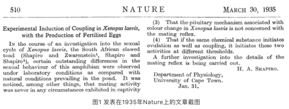
```

### 生物学领域的科研之旅

妊娠测试实验表明，通过注射激素可以随时诱导非洲爪蛙产卵，不受季节限制。这一发现为我们后来的科研之旅铺平了道路。我们的卵细胞非常大，在体外进行受精和胚胎发育，易于观察和操作，弥补了哺乳动物子宫内发育不宜观察的不足。从二十世纪五十年代开始，我们逐渐成为发育生物学研究的模式动物。1956年，荷兰发育生物学家Nieuwkoop和Faber合作发表了非洲爪蛙的发育图谱，规定了我们的“年龄”及每个年龄对应的形态特征，他们为推动我们在科研中的应用做出了重要贡献。发育生物学家利用我们的受精卵和胚胎开始了对脊椎动物发育机制的研究，如对胚胎发育组织者的研究，细胞核移植的研究，微重力环境下胚胎的发育，克隆动物等等。实际上关于动物早期发育的知识绝大部分来自我们的贡献。除了发育生物学，我们在细胞生物学领域也表现的游刃有余。科学家们利用卵母细胞外源表达特定蛋白，研究目的蛋白的生物学功能。除了构建卵母细胞表达系统，我们的卵母细胞也是研究细胞分裂和细胞周期调控的重要材料。随着分子生物学的发展，我们在生物学研究中的地位变得更加突出，1988年我们被美国国立健康研究院（NIH）评为基因功能研究的非哺乳动物最佳模型系统之一。为满足众多研究人员的需求，一些国家相应建起大的培育中心，像美国的Xenopus Express, Xenopus 1, NASCO；中国的生态环境研究中心正在建立培育中心。

```{r}
knitr::include_graphics('images/qingwa2.png')
```

### 生态毒理学领域的科研之旅

乘着时光机，我来到了二十世纪末，在一个年轻的科研领域启航。随着环境问题的日益突出和人类对其的重视，我们逐渐引起了生态毒理学研究者的兴趣，目前有越来越多的实验室将我们引入生态毒理学的研究。作为两栖动物的成员之一，我们一直被人类称为环境污染的“前哨动物”，这是因为我们对环境中的污染物非常敏感。在北美出现大量畸形青蛙的背景下，1997年美国NIH组织了一个专门讨论畸形蛙所暗示的环境问题的会议，讨论将我们引入生态毒理学领域中。在此之前，美国已经建立了一套以受精卵为受试材料的标准方法（FETAX），评价化学物质的早期发育毒性。

```{r}
knitr::include_graphics('images/qingwa3.png')
```

时光机带我来到Kloas教授的实验室，这是最早用非洲爪蛙研究内分泌干扰物的单位之一。我们的性染色体是雌性异型配子，自然条件下拥有ZW性染色体的受精卵发育成雌性，拥有ZZ性染色体的受精卵发育成雄性。然而，环境中的雌激素干扰基因雄性的性别决定和性腺分化，导致性腺异常，出现雌雄同体，甚至性别逆转为雌性。利用这一特点，我们曾用于检测环境中的多氯联苯（PCBs）、双酚A、任基酚等污染物的雌激素效应。美国Hayes教授也是较早用非洲爪蛙开展内分泌干扰研究的知名学者，他的团队发现阿特拉津的雌激素效应引起了热烈的讨论。我们在中国生态毒理学领域的应用，起步较晚，目前中国科学院生态环境研究中心的研究团队确定了雌性化发生的关键窗口期，并开展了深入探索雌性化分子机制的研究。

我们的变态发育直接由甲状腺激素（TH）调控。科研人员利用我们的变态发育可以反映出TH系统受到干扰的特点，筛查和评价环境中可疑的具有甲状腺激素干扰作用的污染物。美国科学家建议使用我们的尾吸收实验评价环境污染物的甲状腺干扰作用。美国的Yunbo Shi教授深入开展了肠重塑的发育生物学研究。生态环境研究中心的研究人员利用我们变态发育过程中的尾吸收、肠重塑、脑重塑的特征，建立了标准评价方法，系统评价了双酚A及其替代品的甲状腺干扰作用。

```{r}

```

### 回到现代，展望未来

短短几分钟，和大家一起回顾了我们非洲爪蛙家族在两个多世纪的科研之旅：从非洲沼泽地到欧洲医院，再到世界各地的实验室；从简单的形态学描述到复杂的分子机制研究；从检测妊娠到检测环境中的内分泌干扰物。作为实验动物，我希望未来可以更多的被用于有益于环境健康和生态保护的科学研究中。

参考文献：

[1]秦占芬,徐晓白. 非洲爪蟾在生态毒理学研究中的应用:概述和实验动物质量控制[J]. 科学通报, 2006, 51(8):873-878.

[2]毛炳宇.非洲爪蟾:模式生物里的青蛙王子[J]. 生命世界, 2008(5):60-63.

作者简介：圆圆，环境科学博士，硕博连读毕业于中国科学院生态环境研究中心，现继续在本研究所做博士后。研究兴趣是环境内分泌干扰物对两栖动物的生殖和发育毒性及其分子机制。

## 投稿那些事儿

### 引言

做科研工作，总免不了需要发表文章，以呈现自己的结果，与同行共享，同时让更多的人了解最新的研究成果。其实科学发现和进步都是一直伴随着文章发表和著作出版。

```{r}
knitr::include_graphics('images/tougao1.png')
```

文章， 尤其是SCI 文章，已成为全世界科学研究交流的重要组成部分。因此，SCI文章写作，投稿，发表等一系列过程成为科研工作必不可少的一部分。笔者从业若干年，也经历了一些文章的投稿，想分享一下投稿经历（要“班门弄斧”，勿喷！谢谢！）。实验数据得到后，整理数据，讨论，文章撰写等等在这里不做论述。在要投稿的时候一般考虑以下几个问题。

### 期刊选择

这是最重要的一环。首先必须选择合适的范围，否则容易浪费时间，走弯路。比如做污染物迁移转化，一般考虑环境口的期刊，比如ES&T，EP， Chemosphere， STE， ETC等，这些期刊一般关注化学过程多一些。如果研究是关于污染物与植物生理基因调节方面的，那么最好考虑偏植物生理方面的期刊，比如plant方面的， plant and soil， plant physiology， New phytologist 等。有些期刊范围会广一些，比如Chemosphere有时也会收录一些植物生理基因调控方面的研究报道。如果是水处理方面的，可以投EST，WR；环境健康方面，EST、EHP都是顶级期刊；如果是环境催化方面的，除了以上一些综合性期刊，偏化学或材料领域的综合性杂志也是可以投的，比如JACS， Angew，AM，再往下ACB，JMCA等等。其次，也要考虑自己做的东西的创新度和深度。有些时候，你投稿到一个期刊，然后很快会受到回信“I am afraid that a more specialized Journal is more appropriate for this article”，也许并不是真的不符合期刊范畴，而是编辑觉得深度或新意不够。

```{r}
knitr::include_graphics('images/tougao2.png')
```

### 格式修改

选好期刊后，就是认认真真看几篇目标期刊上面类似方向的文章，了解写作风格，结构特征及格式细节。有时候，细节很重要，比如不同期刊参考文献格式不同，有些期刊不需要单独列出conclusion，有些期刊不需要写abstract等等。文章的字数很重要，尽量不要超限。有的期刊要求如果字数超限，而且无法缩减，需要详细说明原因。我之前的一篇文章把拉丁文写错了一个字母，弄得审稿人很恼火，明确在意见里提出来了好几次。那篇最后也是被拒了。Cover letter里面一定就是要写清楚文章的新意在哪里，为什么符合目标期刊的范畴，以及一些期刊明确指出需要提供的东西。比如ES&T要求作者投稿时要明确指出graphic abstract 中每个图片的作者，并同时把所有共同作者的名字，联系方式和单位信息一并写上；nature系统的期刊也要求说明图片原创作者。

```{r}
knitr::include_graphics('images/tougao3.png')
```

### 投稿

投稿一般要花一些时间，有的时候需要半天时间，有的时候则需要好几天。不同的期刊系统都有自己的投稿网站，需要严格按照网站上说的进行，否则容易被撤回来。每个作者信息都需要认真检查，不能有差错。此外，一般期刊都需要提供审稿人，最好选择本领域的审稿人，如果选的太离谱，可能会引起编辑的注意和反感。然后就是一些细节，如实作答就是，这里不细说。

### 与编辑的交流

文章投出去后，然后就是等待了。相信投过稿的人，都有一种期许，希望能快出结果。这时候心态很重要。如果干等待，会影响工作进程。所以就未雨绸缪，何不利用这个等待时间继续自己的工作，酝酿下一个工作。投稿后，第一步往往是查重，格式筛查，字数检查等等，如果任何一项有问题，一般会很快收到消息，让修改。这个步骤，多数环境期刊应该比较快，一两个星期吧。但也有例外，比如我了解的Journal of Hazardous Material一般要等至少一个月才会出格式审查结果。这一过程通过后，文章会进入编辑手中，决定是否送审。文章到编辑手中后，如果超过半个月没有消息，那应该就是送审了。RSC的期刊一般一周之后没消息说明送审了，ACS的如果10天没消息也基本送审了。然后就是等待。现在很多期刊对审稿人的审稿时间都有时间限制，而且越来越短。比如，笔者曾经收到过Science of Total Environment的审稿邀请，要求15天内返回审稿意见。但有的就需要等待。据笔者的经验，貌似主流期刊的速度往往会快一些，因为审稿人重视。

> 一般情况下，如果三个月没出结果，是要催一催的，这都是情理之中，但措辞要注意态度，毕竟编辑和审稿人都是无偿做这项工作的，要尊重他们的付出。比如我之前投的一篇文章等了三个半月还没有消息，于是去信催稿：” Dear..， Sorry for disturbing you. I am not sure if it is the right time to contact you to inquire about the status of my submitted manuscript entitled “??” (ID:??)， although the status of “Submitted to Editorial Office” has been lasting for more than 3 months…I am just wondering if you could have a check on the progress of this manuscript?...”结果，没两天就来了结果，要求大修。

编辑收到所有审稿人意见后会根据意见来决定是“接收”，“修改后接收”，还是“拒稿”。一般比较好的期刊都会请3个及以上的审稿人，最少的也要两个审稿人。比如环境类的ES&T最少也是三个审稿人。如果三个审稿人意见都很正面，那么恭喜你，应该会有修改机会，如果其中有一个人意见比较负面，那么这个时候就看编辑的决断了。很多时候，如果编辑不了解你做的工作，就会选择拒稿。

> 以前投稿到一个期刊，收到三个审稿意见，第一个审稿人意见“Although， the rationale for the study is good， the particular experiments were reasonably well conducted， and there looks to be some new information generated by the study， the data were not appropriately analysed…”然后主要是统计分析不规范之类的；第二个审稿人意见“This is a good paper…. ”然后提了一堆小问题，第三个审稿人意见“This is an interesting， well written， manuscript…”然后也是一些小问题。编辑最后决定“Reviewers' comments on your work have now been received.  You will see that they are advising against publication of your work.  Therefore I must reject it。我觉得这个判决有些重，因为这些问题都是可以修改的。这个编辑主要做植物细胞抗氧化系统的，并不涉及微生物-植物互作，也不关注污染问题。所以，笔者认为编辑自身对这个方向的认识决定了“拒搞”的结论。后来这篇稿子投到JHM，隔一个月回来字数超限，立即改完再次提交，然后进入审稿阶段。过了两个月，结果出来。“rejection”，“The reviewers indicate that the manuscript is not suitable for publication in terms of presentation， content， and description. As a result， I regret to inform you that your manuscript is declined for publication”只有一个审稿意见，感觉很草率的意见，只说四个重复太少，需要至少五个重复，然后说文章没有新意，再就是一些语句拼写问题。基于此，笔者认为这个审稿人并没有认真看论文。所以决定上诉。于是当天写完反驳信，回复审稿人意见，并向编辑提出要求更换审稿人的邀请，第二天发给编辑。编辑第三天就回复了，他把信件又转给了那个审稿人，审稿人这回又改口了“The authors did a good job of designing a well thought-out experiment… I may be mistaken but… it is not of great interest to other researchers，…My inclination is  this topic is too niche and will have a "Low/No Impact" level of impact”据此，编辑认为“I am afraid that a more specialized Journal is more appropriate for this article”。很显然，这次审稿人和编辑都改口了，认为文章有新意，但没有影响力，所以不符合期刊要求……这个编辑主要关注化工污水处理过程，也会关注一些微生物，但主打是水污染处理，而我们做的工作是重金属污染与植物生理，领域不一样。编辑的看法再一次决定了文章的命运。之后，我们再仔细改了一遍论文，然后继续投稿到另一个期刊，这一次就很快，一个半月出结果“minor revision”，两个审稿人都对文章赞同，只提了一些小问题，修改后返回，第二天（周六）接收。这次的编辑是同领域方向的，关注土壤-植物系统重金属污染问题，编辑和审稿人都很认同这篇稿件，所以迅速接收。。

### 对结果的决定

上文已提出，结果一般会有三个，“接收”，“修改后再审”，“拒稿”。直接接收极其少见，笔者未曾见过。第二条“修改后再审”又分为好几种类型“Minor revision”“middle revision” “major revision”以及“reject and resubmission”。这四种类型都是给了修改机会的，只要认真修改，还是有机会接收。重点说一下第三种类型，当收到“reject”决定的时候，未免有些失落，但最重要的是看有没有可以提高的地方。有的审稿人会提出一些重要的意见，这对于后续发表非常重要。当然，如果就像我上问题出的那样，对审稿人的意见表示相当不满，那么就要提出来，反驳一下，争取一下机会。当然，一般希望渺茫，但并不代表没有。不管哪种情况，审稿人的意见或多或少都会对文章提高有所帮助，所以请抓住机会认真修改，然后迅速转移到下一个期刊。切记，不要在一棵树上盘旋太久。

### 后记

发表文章很重要，对于科研工作者来说，发表过程很曲折，但也是一个提升的过程。工作做细了，心态摆好了，文章写好了，投稿终归会有好结果。现今，在以SCI文章为导向的科研评价体系中，世界范围内论文数量与日俱增。发文章心态似乎也发生了变化，记得从前，人们都是做出了一定成果，比如屠呦呦发现了青蒿素，于是以“一种新型的倍半萜内酯—青蒿素”为题撰写论文并发表于《科学通报》（1977年第3期）。而今，貌似只要有结果就可以发，即使真正的成果并没有做出来。昨天看到一个院士写的一个文章，觉得句句戳中要害。文章题目为《以SCI为主导的论文挂帅扼杀了科技创造力》，发表在公众号“战略前沿技术”上面。作者指出“巨额投入带来了低产出，以SCI论英雄，论人才，论业绩，这类量化指标的局限性，欺骗性已开始暴露出来”。笔者认为SCI并不是无可是处，适当的SCI发表有利于科学的交流和传播，但过度强调SCI数量和影响因子，走极端化的评价道路势必会对科学的发展造成负面影响。

作者：松之映
校稿：yufree/公子小智/眼神防守
编辑：次要男主角

## 城市道路移动监测展望

### 前言

随着大气污染治理的日益深入，不仅社会成员对自身所在城市的大气环境越发关注，各部门对大气污染源的研究和监管也越来越细分。其中道路污染是引发城市空气质量问题的主要因素之一。城市道路的污染主要来自机动车尾气排放和道路扬尘。道路污染对大气污染的贡献已不容忽视，北京最新一轮PM2.5源解析结果表明，北京市当前本地大气PM2.5来源中，机动车等移动源占比最大，达到45%。

```{r}
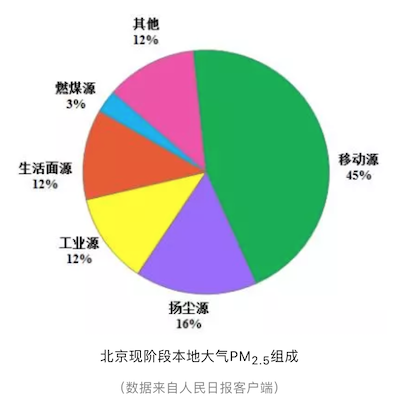
```

但是目前道路污染依旧存在许多悬而未决的问题。例如其他地区道路污染对环境影响尚缺乏有力的数据支撑；“机动车限行”的效果如何？对降低城市污染物浓度的贡献度具体有多大？另一方面，从道路抑尘的角度来看，为了保障秋大气污染防治工作，多地开展道路抑尘工作，如何将抑尘工作做到精准有效？能否有一个系统可以为工作人员提供准确的指令，例如应该在哪里采取抑尘工作？什么时间抑尘？抑尘频率和抑尘方式是什么？除此之外，随着物联网、大数据应用的不断完善，服务于交通的大数据越来越多，然而融合环境空气质量的交通大数据并不多。如何建立环境交通大数据，并且如何基于获得的数据开展道路排放的精细化管理？基于以上这些问题，“城市道路移动监测网络”的概念应运而生。

### 概念

移动监测，即利用社会化资源，在移动车辆上搭载空气质量传感设备，增加城市空气质量监测网络的密度。例如，将颗粒物传感器安装到了出租车上，数据通过无线传输方式，上传到云平台，在云平台上实现数据的展示与分析。或者以城市公交车为载体，将空气质量传感器安装到了公交车上，跟踪公交车路线上的城市空气质量变化，对城市的空气质量指标进行动态分析，指导城市空气的优化提升。美国德州大学奥斯汀分校(University of Texas at Austin；UT Austin)的研究人员在Google Street View街景车上配置传感器公司Aclima快速响应的空气质量传感器，期望透过每天到处移动的Google街景车收集高质量的空气污染监测数据。

### 优势

更新频率快：移动监测可以早到秒级数据监测。

监测范围广：车辆所到之处都可以检测到。

在线时间长：监测时间可以做到全天候，道路监测时间与车辆运营时间一致，车辆停止时，又可以作为固定点进行监测。

```{r}
knitr::include_graphics('images/dlyd2.png')
```

### 应用展望

通过移动监测，可以及时发现局部道路污染源并报警，同时还能绘制出整个城市的污染物分布图，为大气污染管控提供了科学高效的管理手段。

- 环境质量管理

移动监测可以整合道路影像监控及行车记录仪数据，看到整个城市的全貌，随时调取城市中任何一个地点的空气质量实况。充分利用社会资源，鼓励更多的车辆加入到城市移动监测的行列中，可以对任一附近车辆进行“派单”，前去污染事发地确认现场情况。这就是移动监测的优势所在，可以深入到城市的任务一个角落，现场考察和取证。可以实现街区道路空气质量排名、污染溯源分析、内源定位分析、区域热点分析等多项数据分析。

- 环境污染源管理

为了贯彻落实大气污染防治工作要求，各地方纷纷出台道路运输扬尘污染治理方案，采用多种措施进行监察和整治。但是扬尘管理的效果如何呢？移动监测能够以秒级的监测精度收集全市各条道路上的空气质量数据，从而绘制出不同时段、不同车辆的扬尘浓度曲线，对道路限行效果进行评估；同时能够通过监测数据分析出道路扬尘规律，指导抑尘工作；还能对道路段进行污染排名和考核，有效地将道路交通扬尘治理工作制度化、规范化、常态化。

```{r}
knitr::include_graphics('images/dlyd3.png')
```

- 交通精细化管理

有了城市移动空气监测网，从环境管理的维度上丰富了交通大数据，可以分析出道路拥堵状况和空气质量之间的关系，可以对限行效果进行评估，从而进行道路限行方案优化。为交通管理方案的计划与实施提供数据支持。

```{r}
knitr::include_graphics('images/dlyd4.png')
```

- 数据开放共享，建立大数据生态

城市移动空气监测网获得的交通环境大数据，不仅可以用于自己城市的空气质量分析，还可以将数据共享开放给需要的机构和个人。为科学研究和个人生活提供便利。

```{r}
knitr::include_graphics('images/dlyd5.png')
```

移动监测有在道路环境监测方面有很大的优势，不过目前是只是作为环境大气监测的补充，在数据分析和推广应用方面还需要一定的努力，笔者相信，通过技术的进步，以及数据应用方面的扩展，移动监测最终会在道路空气质量管控以及人体暴露量评估等方面发挥更为重要的作用。

作者：大石
校稿：次要男主角
编辑：栟

## 潜在身边的环境危害：噪声

北京小伙伴九月份的朋友圈很多被蓝天幸福感霸屏，直至今日，北京的空气质量仍在刷新连续优良记录。这可能会给大家一种感觉，北京的空气污染治好了！但由于三、四、五月份雾霾加沙尘的肆虐，并随着十月份后秸秆焚烧、秋末供暖的开始，今年空气质量的整体情况如何还尚未知！
人们现在关心呼吸的空气（大气污染），喝的水（水污染），吃的食物（土壤污染），其实360度的环境可不止这些，比如灯光，人工白昼会伤害人的眼睛和皮肤，也会影响到其他物种的生活规律，比如电磁辐射，能够紊乱我们的中枢神经系统。

今天我们来说说另一大环境公害：噪声。

### 噪声的污染现状

噪声是指人们不需要的声音，或者说凡是妨碍到人们正常休息、学习和工作的声音，以及对人们要听的声音产生干扰的声音，都属于噪声。对声音的感受因人们年龄、职业、时间、所在地点及状态和心情的不同而有不同的主观判断，“小楼一夜听春雨，深巷明朝卖杏花”，“二十四桥明月夜，玉人何处教吹箫”，这些熟悉的声场景诗人觉得很美很有生活气息，但如果你楼下广播着“小店清仓甩卖，二十元一件”，你会觉得聒噪。

```{r}
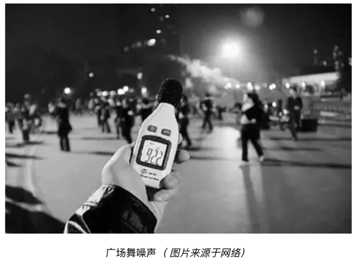
```

空气越来越好，水质逐渐改善，土壤开始修复，接下来民众会关心哪些呢，按照我们新时代的说法，人们群众开始追求美好生活，关乎民众日常生活质量的噪声污染问题应该会逐渐引起管理层关注。数据显示，噪声投诉历来比例较高，且一直是管理部门面临的一个问题，在2017年中国环境噪声污染防治报告中提到2016年全国环保投诉119万件，其中噪声投诉52.2万件，占比达43.9%。像海南等地，噪声投诉比例高达70%。

### 噪声管理存在问题

但是为什么管理部门一直不下决心整治呢，有人调侃说噪声跟空气不一样，是可以享受特权的一个环境要素，比如有钱人或者有权人住的环境比较优雅，没觉得吵，所以上层的关注度不够。哈哈，我觉得这是一方面，另一方面，噪声污染有其特征如即时性、分散性、反复性和不确定性，确实不好管，除了一些典型的噪声源如道路、地铁可以加声屏障进行隔声处理，其他尤其是社会生活噪声，突然很吵，但是管理部门过来，它停了，无法追溯责任了。

```{r}

```

再者，噪声法律法规存在一些问题，其实噪声污染由来已久，在二三十年前与水污染、空气污染、固废污染并称四大环境公害，1997年时我国正式实施《中华人民共和国噪声污染防治法》，与《中华人民共和国大气污染防治法》不同的是，后者从1988年正式实施以来，分别在1995年、2000年和2015年进行过修订，而噪声法未进行过修订，目前法律约束在一些方面已经无法满足管理需求或者说民众要求，比如处罚标准不明确，噪声污染损害赔偿不便操作。

另外法中第六条规定的管理部门职能划分上，并不够全面且过于笼统，多头管理、错位和缺位的现象较为普遍，虽然规定环保部门对环境噪声污染实施统一监督管理，但根据其他的法律法规，规划、建设、工商、文化、城管、质检以及公安、交通、民航、铁路等部门也对环境噪声污染具有一定的监管职能。

发达国家在噪声污染治理方面先行先试，取得了不错的成效，最主要的经验就是加强立法并制定严格的标准体系，有比较明确的职责部门，且高昂的噪声罚款使污染主题充分落实主体责任，自行开展噪声监测并执行标准要求。另外政府依据噪声法律和标准进行城市的规划建设，环境影响评价执行到位，这在我国实现起来较为困难，一是政府规划滞后，像北京首都机场到目前尚未确定机场周围飞机噪声环境标志适用区域，二是一些污染企业惟利是图，违规乱建，如一些地产开发商明知有公路规划建设，仍在附近建设住宅楼。

### 遇到噪声污染如何自救（民众的力量）

跟大气、水环境一样，声环境管理也需要一定的时间和空间，作为民众，在环境管理上的事情我们无法干预，自救有没有途径呢。或者说我们受到了噪声污染该如何处理，拨打12369吗，做过噪声投诉的同学应该知道，在12369平台进行噪声投诉时，会有明显的分类提示，某些污染类别环保部门是不受理的，比如别人家空调室外机太响，吵着你了，你找环保是没用的，这应该找公安部门。

今天给大家整理一下，如果遇到噪声扰民想投诉找谁。

首先你如果不知道谁是最终来帮你处理的，找12369是可以的，虽然有的内容环保部门不受理，但是会提示你找那个部门，就噪声而言，环保部门是总负责，其他部门各司其职。

```{r}
knitr::include_graphics('images/zaosheng3.png')
```

城管部门：

1、基建工地噪声（晚22：00-次日6：00）

2、临街门面、道路、公共场地使用发电机、音响等设备产生噪声

公安部门：

1、商业经营过程中使用高音广播喇叭或者采用其他发出高噪音的方法招揽顾客

2、学校和幼儿园使用高音喇叭；市区街道、广场、公园等公共场所组织娱乐、集会活动使用音响器材发出噪声污染（如广场舞）；家庭装修、家庭音响等室内噪声

3、燃放烟花鞭炮噪声

文化、工商部门：

居民小区内及其周围小歌厅、茶座、棋牌室等产生噪音的经营场所。

其他类型的噪声一般都是环保部门在管了。一般工业企业、建筑工地施工、KTV音响归环保管。这里面有个问题，就是KTV、商店等的噪声，按照规定，放在店外（或者向店外播放）招揽顾客的喇叭产生的噪声归公安部门管理，店内噪声由环保部门管理。所以12369也提示了，有些类型环保只管一部分。

是不是投诉了就解决了问题了呢，如果效率真有这么高就好了，如果未能够解决问题，在我国我们常见的一种公众参与的处理方式就是聚众上访，这种方式一般是不提倡的，而且不一定有成效。在国外，比如美国对公众参与采取了法律保护，社会公众是噪声控制法的执法主体之一，美国公众可在任何情况之下，就噪声控制的措施提出质疑并加以干涉。

```{r}
knitr::include_graphics('images/zaosheng4.png')
```

```{r}
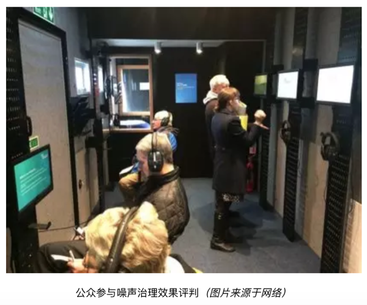
```

### 后记

总之，在我国，噪声污染形势较为严峻，噪声管理存在很大的提升空间，据笔者了解，生态环境部已经有意对噪声进行加大管理了，其中对噪声法修订已经在人大立项，虽然可能最终出台至少在2020年，但是前期的一些基础工作需要着手准备了，就环境监测而言，需要对监测技术规范进行调整，对推行噪声自动监测进行要求等等。作为噪声监测业务人员，也想早日感觉到宁静美好生活，人说去了东京能明显感觉比北京低几个分贝，安静的环境人不容易聒噪，生活舒适，产出也高。

俗话说，静下心来干事情。

作者：次要男主角
校稿：周宁，爱杯子的王小咖
编辑：丫头晚安

## 暴露组学的黎明

最近参加了西奈山医学院举办的第二届暴露组学会议，暴露组学从名词提出到现在大概过了10年有余，若从论文数量来看，大约从去年开始进入高速发展阶段。应该说今天的暴露组学大致处于20年前基因组学的发展阶段，方法还未成熟，标准尚未确定，不过都快成形了。

### 暴露组学是什么？

美国这边最早提出暴露组学的是美国国立卫生研究院，加州伯克利、埃默里大学都是暴露组学起步比较早的地方，西奈山医学院 2017 年成立了美国第一家暴露组学研究所，借助美国医学院间的网络来推动暴露组学研究。从参会情况看也是很多其他高校附属医学院过来的同行，相信在接下来的10年研究经费与成果可能出现井喷，现在都是天使轮。

暴露组学研究什么呢？这里的基本问题跟基因组学差不多，是关于健康的。基因组学认为一个人健康与否更多依赖基因，而且伴随测序技术的进步，针对个人的测序已经是可负担的了。但暴露组学认为人的健康状态除了基因外还要考虑表观遗传、蛋白组、代谢组与日常暴露，甚至还要考虑诸如地理位置、社会经济地位、肠道微生物组等的作用。总体来看，健康是目标，预测变量却非常多，很明显不是一个单因素模型。

```{r}

```

暴露组学属于面向问题的高度综合性学科，基础包括但不限于统计学、生命科学、数据科学、社会科学、环境科学、分析化学、毒理学、公共卫生、医学、遥感、传感、自动化、信息科学等诸多学科，我们目前并不知道哪个学科更重要，但很明显任何一个学科都可能成为回答终极问题的短板，而且就我个人观点而言，几乎每一个学科都有短板且学科间交流壁垒不是一般的高。

### 目的性分析难题1：峰真实性问题

这里从环境分析化学与数据科学这两个学科来说下目前的问题。首先，当前如果要评价暴露水平，首先你得知道有什么，也就是目的性分析。但很遗憾，就暴露组学而言，我们并无法事先知道样品里有什么，所以更多研究是借鉴代谢组学的方法利用高分辨质谱来对未知物进行信息采集。信息采集的终点是色谱质谱峰，然而高分辨质谱全扫描的结果往往混杂大量源内反应形成的加合物、碎片或物质本身的同位素峰，这导致虽然我们可以同时收集上万峰，但形成这些峰的化合物可能只有峰数的十分之一且这些峰会共相关，如果你想讨论物质间的相关性而使用了峰数据，那么估计会有偏差。同时，峰识别的算法也通常对全扫数据很不友好，你会看到大量不应该被当作峰的数据被选成了峰，积分效果也是一塌糊涂，这一点从分析化学角度是不可接受的。

```{r}
knitr::include_graphics('images/expo2.png')
```

### 目的性分析难题2：峰解析问题

另一个问题是对未知峰的标注，现在流行的方法是先跑全扫筛出差异峰，然后把那些峰去打二级质谱，有的则直接对差异峰去标注。这里我们暂时不讨论气相色谱质谱联用的数据，因为一般硬电离模式下碎片的特异性还算好，甚至可以用来定性。然而，就液相色谱而言，如果我们不考虑APPI这种非主流电离源，一般来说液谱往往使用ESI或APCI源，这两种都算软电离技术，一级质谱几乎看不到太多有价值的定性信息，此时使用一级质谱定性是风险很高的，下游的通路分析会因此不靠谱。而且就算找到一级质谱的匹配，你也无法确认是否是同分异构体，而同分异构体的生物活性千差万别，更不用说当前主流数据库各搞各的，覆盖范围有局限性，唯一的标注也并不意味定性。二级质谱定性当前有很多软件可以做，但基本都是欠拟合状态，训练用的数据基本依赖可获取标准或社区用户共享，想做未知物十分困难。

```{r}

```

这是当前主流物质数据库的覆盖情况，其实最大的三个物质库（PubChem/Chemspider/CAS）我没列，因为数据搞不到或搞得到但处理起来太费劲，最大的应该是CAS，有1.4亿种物质，当然我们能接触到的应该只是其中很小一部分。代谢组学里用的最多的应该是 HMDB ，不过暴露组学看来这都属于生物内源物质，外源有生物活性物质也有诸如 DrugBank 或 ChEBI 或 T3DB 的库，工业品也有 HPV 库等等，但这些还算是有信息可查的，有些物质最多能生成个 InChIKey ，别的啥资料也没有。目前能汇总整理这些信息的地方并不多，而且我在处理有些库的数据时发现他们的数据整理问题很大，格式不标准，如果不是专业人士光是数据提取就得懵圈。

### 目的性分析难题3：分析通量限制

另外，分析通量也是一个容易被忽略的问题。假如你的样品有100个，每个样品30分钟，加上质控样品后一个序列大概能到150，这就是3-4天的连续分析，色谱柱会老化，甚至质量轴都会漂，当然你可以不断去校准。但最后的结果就是即便不是分批测样，同一批内部都会存在明显的批次效应。我常看到文章里说都控制好了，实际这个过程其实很难控制，随机化序列在一定程度上可以缓解但很难消除分析通量带来的定量不准。

### 统计学分析难题1：模型的选择

即使分析上的问题都解决了，下面的问题就是统计分析了。用什么模型，为什么用这种模型眼下都没法进行检验，你也说不上哪个好哪个坏，其实都不怎么样。我看到过买几千个标品来检验的，但问题是你设计非目的检测是想测未知的，也就是标品根本不可能覆盖过来。而且统计模型的复杂性可高可低，一般来说，高了会过拟合而低了欠拟合，不是说不能一次性尝试几百种统计模型或机器学习模型，关键如何解释？线性模型与层级模型是两种最有解释力的模型，但预测性能谁用谁知道，直接上神经网络不是不行，就是不好解释。精巧的统计模型应对错综复杂的数据，难怪临床上喜欢多元线性回归。

```{r}

```

### 统计学分析难题2：结构-性质关系

另一个相关问题是QSPR（Quantitative Structure-property Relationship），代谢物或暴露物有差异一般都要反推回结构，通常临床研究是有明确终点的，但环境研究可能没有分组或者说分组后并无法进行效应预测。这个角度看是可以用效应诱导分析来做的，但效应终点还是相对固定。此时可以借助QSPR来同时预测多个毒性终点，不过如何把荷质比转成结构，前面说了，一团乱麻。其实多个毒性终点也意味着不同的健康模型，那么问题来了，有没有基于多个健康模型的宏模型呢？回答这个问题只能依赖合作研究了，单一领域其实都没搞特别清楚。

### 结语

跟健康相关研究还有个问题就是无穷混杂因素，有的你知道例如年龄、性别、种族等，有的在建模时是忽略的，甚至根本意识不到可能是混杂因素。传统研究喜欢点对点做相关，组学研究是点对多做相关，健康研究的真相是多对多互相影响，控制实验当然是必要的，但如果数据是来自观测研究，那这问题就几乎无解，受研究共同体的视野限制。如果我们只关心那些强信号，可能忽略了那些弱信号，但这里的强弱是仪器决定的，不是生物学意义决定的。或许很多人的研究可以讲一个故事，但很难回答一个真实的问题。

前面说的问题只是现存问题的很小一部分，每一点的进展都可能对上下游研究产生颠覆式影响，对研究方法论的标准化、可重复化及与对基础研究进展的快速整合是必要的。或许十年后回看今天的暴露组学，很多人可能惊叹于为什么大量的资源被浪费在了毫无意义的研究上，不过这就是科研的现状，我们无法预知今天的愚蠢，但更重要的则是要意识到当前的问题。

处在新研究的黎明期即幸运也不幸，幸运的是大家起跑点都差不多，不幸的是只要你跑，摔跟头几乎是必然的。

作者：yufree
编辑：竹而乐

## 垃圾渗滤液为什么会爆炸？

```{r}
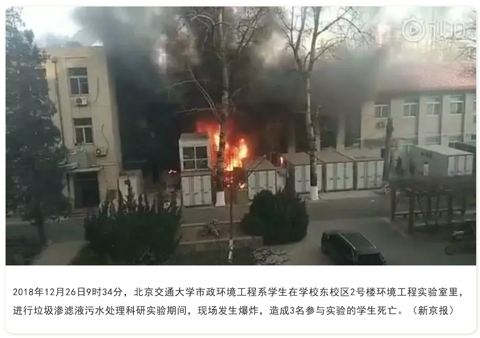
```

### 什么是垃圾渗滤液

垃圾在经过填埋处理后，因为降水等原因，垃圾中的某些物质会随着雨水淋溶渗出，进而成为垃圾渗滤液。垃圾渗滤液不仅会污染地表水，也会穿过土层影响到地下水水质。

```{r}
knitr::include_graphics('images/slybz2.png')
```

### 垃圾渗滤液的污染特点

因为垃圾渗滤液大都跟降水有关，因此垃圾渗滤液最大的特征是水量不固定，就是雨水多的时候，垃圾渗滤液的量大，雨水少的时候，其量就小。同时因为城市垃圾中有很多生活垃圾，因此其渗滤液中有机物含量高。而垃圾中的含氮、含硫有机物在腐败的过程中会产生氨氮、硫化氢等物质，因此渗滤液中氨氮的含量很高，并伴随有腐败的臭味。同时，我们平时乱扔的电池、金属制品也会引起渗滤液中的重金属含量偏高。

因此垃圾渗滤液的处理其实就是针对这种高有机物、高氨氮、高重金属的不稳定进水的废水进行处理。

### 垃圾渗滤液的哪步处理会引起爆炸

一般来讲，污水的处理的大部分工艺其实都跟火灾挂不上钩。垃圾渗滤液的处理方法有很多，但引起爆炸的可能性就是厌氧氧化处理。

```{r}
knitr::include_graphics('images/slybz3.png')
```

从厌氧氧化的原理可以看到，这个过程中是会产生氢气H2和甲烷CH4的。这两种是易燃气体，但需要注意的是，实验室规模的实验一般量都很小，能产生这些气体的量和在家里打开煤气并不是一个量级，而且这个过程一般会伴随着恶臭气体H2S，是很容易被人所警觉的。因此完全是因为沼气爆炸的可能性不大。 

但是也可能，这个反应器做的相对巨大，能运转的量大，同时26日北京天寒地燥，操作人员禁闭实验室，关闭通风，同时反应的条件控制不当，也不排除爆炸的可能。

而根据科学网的消息，该实验室内存储有镁粉，如果情况属实，这就太可怕了。因为活泼金属不仅自己易燃，而且遇水反应，会生成更加容易燃烧的氢气。也就是说如果是活泼金属引起的火灾，用水灭火，只能是增加悲剧，15年天津港812事故就是如此。

关于镁粉的使用问题，科学网推断是进行氨氮处理，进而形成鸟粪石回收。但实际上这个论点未必成立，因为这个反应使用价格更加低廉更加稳定的镁盐就可以实现，完全没必要使用金属镁。当然也不排除实验室条件进行高成本的探索，但是存储了三桶……实验设计者、管理者难辞其咎。而这引发的问题不仅仅是安全问题防护，也应该思考什么是有意义的研究。

根据新闻报道，有学生听到了三声爆炸声，我们怀疑，渗滤液的处理可能只是一个引子，在通风不好，又有明火的情况下发生了一次小爆炸。进而扩溅到镁粉上，然后大家齐心协力用水灭火的时候，又泼到了燃烧的镁粉上……

### 实验室防护我们该怎么做

这里我们不去谈细节上如何一步一步去做，也不谈如何进行安全防火教育。这里想说的是，大家如果有良好的实验室习惯，比什么都重要。因为实验室的药品管理问题，不仅仅会引起大火等灾害，还可能出现药品流失，清华大学的铊中毒，复旦大学的投毒案，我们关心的不仅仅是我们自身的生命，还有我们室友的生命。

对于经常操作反应釜的同学，尤其是会涉及高温的仪器，比如烘箱、马沸炉、自制的一些反应器等，一定需要注意操作安全，送给大家一句话。

```{r}
knitr::include_graphics('images/slybz4.png')
```

在反应釜运行温度高的时候，一定要有人守在反应釜跟前或者监测其基本数据变化！严格注意实验室安全，提高安全警惕，注意仪器操作，发现问题及时断电断热，发生火灾要思考一下该条件下能否用水灭火，勿再出现“釜毁人亡”悲剧！

作者：广播站王站长
校稿：看透/小祁/阿布呆
编辑：次要男主角

## 风口浪尖的新烟碱

在农药行里，大多数农药的名字都取得简单粗暴，比如有机氯、有机磷、氨基甲酯、拟除虫菊酯……基本就是“要你命三千”的既视感。因此，“新烟碱”在农药名称中，简直就是一股清流。鲁迅先生说中国人的想象力在某一层是跃进的，比如我一看到新烟碱，就想到神经亢奋；一想到神经亢奋，就想到摇头摆臀；一想到摇头摆臀，就想到夜店，一想到夜店，就想到纸醉金迷……这对一位科研搬砖工来说，无疑是有很大慰藉的——虽然和大多数科研人员开展研究的原因不同，但这确实是我最早接触新烟碱类农药的原因。

不做不知道，一做吓一跳。从2013年开始到2018年，Nature和Science上几乎每年都会有一篇关于新烟碱农药的报道；而从去年两个课题组就申报了四项关于新烟碱类的自然科学基金来看，新烟碱类在农药研究当中一时间风头无二。

### 新烟碱类杀虫剂为什么会大规模使用？

农药的环境毒性可以说让人谈虎色变。环境界无人不知的《寂静的春天》讲的就是农药带来的环境危害，而以DDT为代表的高毒农药甚至都漂洋过海富集到了南极企鹅兄弟身上。然而现代农业的高速发展依旧离不开农药的使用，因此人们一直致力于开发高效低毒的农药。新烟碱类恰恰是高效低毒农药的完美代表。

新烟碱类，顾名思义区别于烟碱，烟碱就是我们常说的尼古丁，是烟草中让人产生依赖并缓解压力和空虚的重要物质。烟碱类显然对人类高毒，不适合作为农药开发使用，因此新烟碱类应运而生。

新烟碱农药的药效基团“=NNO2”（或者=CNO2、=N-CN等）又被称为“神奇硝基”，它对昆虫烟碱型乙酰胆碱受体的亲和力远远高于其他物种，尤其是哺乳动物，这让新烟碱类农药在环境中表现出卓越的效力和安全性。目前新烟碱类农药已经成为世界上增长最快的杀虫剂，占据了世界1/5的杀虫剂市场。

### 新烟碱类为什么只对昆虫起作用？

烟碱类和新烟碱类农药都是神经兴奋类物质。它们都作用于烟碱型乙酰胆碱受体（nAChR），它们与nAChR结合后，就会让受体构象发生变化，进而引起细胞对Na+、K+和Ca2+的通透性迅速增加,引起自主神经节的节后神经元兴奋。往简单了说，它们的杀虫机理就是让昆虫嗑药磕多了，过度兴奋爽死了。

一般认为，烟碱、新烟碱和受体的结合是一种多位点的氢键作用。烟碱容易和哺乳动物的nAChR结合，而新烟碱容易和昆虫的nAChR结合。把这个过程简化来说，这种差异性表现在两个方面。一方面烟碱具有能被质子化的N原子（带正电），而新烟碱是带负电的硝基或腈基结构以及胍或脒结构的共轭体系（如下图），两者在末端的电荷属性不同。另一方面，这种选择性与昆虫和哺乳动物nAChR结构的差别也有很大关系。例如nAChR的β1 亚基Loop D 区的 R81 残基对调节新烟碱类化合物与 nAChRs 的结合尤为重要。而大多数脊椎动物的R81位残基是苏氨酸，大多数昆虫的R81位残基是精氨酸，这让脊椎动物和昆虫nAChR在结合位点上的电荷属性也不同。与动物世界不同，电荷世界遵循严格的同性相斥和异性相吸，因此烟碱和新烟碱就对哺乳动物和昆虫表现出了两种截然不同的选择性。 

### 风口浪尖的新烟碱？

新烟碱目前之所以处于风口浪尖，是因为它对非靶标生物（主要是蜜蜂）的影响。靶标就是目标，靶标生物就是新烟碱农药施用的过程中想要针对杀灭的害虫；非靶标就恰恰相反，不是施用农药想杀灭的物种。简单来说，我用农药是为了杀死害虫，结果把蜜蜂也杀死了。因为蜜蜂在植物的花粉传播中具有重要的生态意义，蜜蜂种群的衰退可能会引起严重的生态问题，因此新烟碱农药的使用问题就成了关注的焦点。

我们来回顾一下Nature和Science上关于新烟碱的报道

```{r}
knitr::include_graphics('images/xyj1.png')
```

但实际上一些农药制造、经销商（例如拜耳作物科学和先正达公司）以及一些科学家仍然对这些报道持质疑态度，关于新烟碱类农药的真实环境风险仍然争论不断。当然这很好理解，因为农药开发商开发一款新药，需要付出巨大的人力、物力和财力，经过了很严格的毒性评价，而且新烟碱在杀虫剂市场占据巨大的市场，你说禁就禁了？

目前这些报道最为诟病的是两个方面。一是使用剂量的问题，反对者认为这些评价报道使用的剂量远远超过了环境残留剂量，因为抛开剂量去谈毒性都是耍流氓。但从Science2017年的研究来看，现在的研究已经开始趋向于模拟真实环境的影响。另一个方面是评价方式，目前来看所有的研究都还局限在很表观的种群数目、死亡率等方面。并没有更加深入、更有说服力的机理证明以及对其他影响因素效应的剔除。

就我个人而言，鉴于新烟碱对蜜蜂毒性的报道层出不穷（当然，这跟跟风Nature和Science有很大关系），目前来看，这种报道的真实性要大于无害性。因此需要有重量级的单位（比如美国EPA，OECD等）进行长时间真实环境的效应评价，并避免主观和其他客观因素的干扰。如果确实有明显的毒性作用，则可以提高该种农药的使用风险，甚至采取禁用的方式。

但仍然需要注意的是，新烟碱类对蜜蜂的影响可能并不是一个简单的过程，比如说蜜蜂对新烟碱的偏好不仅与新烟碱的种类有关，也和施药植物的不同有关（比如花菜、玉米似乎影响更大一些），这个过程是值得进一步去研究的。同时，新烟碱类水溶性很强，因此很容易通过淋溶作用进入到水体中，因此新烟碱类对水体中的非靶标昆虫类可能会具有相似的毒性作用，这个方面更值得被关注。

同时，新烟碱类在自然界和生物体内很容易发生羟基化、去饱和化、去烷基及硝基还原等代谢反应。新烟碱的易代谢性对新烟碱的毒性效应影响很大。因为尽管新烟碱被认为对哺乳动物低毒，但新烟碱类的代谢产物表现出了比母体化合物更高的毒性。比如说吡虫啉的脱硝基代谢产物和哺乳动物α4β2 nAChR的结合能力比母体吡虫啉高300多倍；噻虫嗪的去甲基代谢产物对鼠类、鱼类来讲具有潜在的致癌性。因此关注新烟碱的同时不能忽略其代谢产物带来的影响。

### 结语

我在大学学习专利法的时候，老师提出过一个辩证的思维：专利的核心价值并不在于保护，而在于传播。换句话说，就是用补偿来换取技术的推广和进步。同样，我们也需要明白，农药毒性研究的目的并不在于去禁止一种农药，而在于如何在将来新农药的研发中做更好的设计。

因此，新烟碱类农药的毒性到底是因为母体还是代谢产物？造成危害的是新烟碱类农药的共有基团引起还是自身特异基团引起？引起毒性的机理效应什么，如何在一代的新烟碱农药开发中进行优化……这些都还需要研究积累。

那些处在风口浪尖的事物，通常都需要交给时间来沉淀。 

作者：广播站王站长
校稿：yufree
编辑：栟
