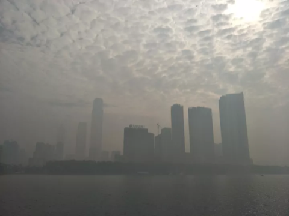
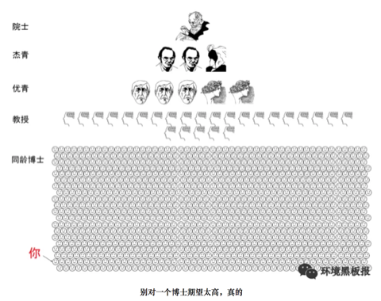
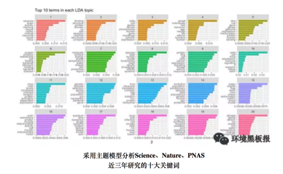

# 学理研究

## 混沌的冬日

### 序

1962年，美国海洋生物学家 Rachel Carson 出版了《寂静的春天》，这本书展示了农药污染下没有虫鸣的春天。在其影响下公众开始关注环境污染问题并开启了环境科学研究的序幕。然而，国内公众对于环境污染的关注也许并不用等到春天。近几年，每每国庆刚过，雾霾就会几次三番的席卷全国，呈现出混沌的冬日。

```{r}

```

有人说发展的问题会在发展中解决，例如发达国家也经历过类似的阶段，但伴随产业转型与法规调控，污染问题都会自然而然地消亡；又有人说虽然城市会被雾霾笼罩，但从统计数据上看居民平均寿命其实比所谓田园风光的乡村更长；还有人说大气污染相比土壤、水还有固废污染都不算严重，只是可见度更高（也就是能见度低）……的确，雾霾这个现象背后有着错综复杂的社会经济影响，从不同的角度去看会发现不一样的东西。多一个角度看问题并不会让你过的更好，但至少更明白些。

下面我将给出一些非技术与法规调控的视角，希望对读者理解雾霾以及其他一些环境污染问题能有帮助。

### 研究增长的极限

```{r}
knitr::include_graphics('images/cw2.png')
```

上图是生物资讯数据库 Pubmed 上用颗粒物（particulate matter）作为关键词得到的论文数量，一百年来可以说是持续增长，特别是21世纪以来增长尤为迅猛。但需要注意的是到2015年达到了峰值（3429），16年已经明显下降（3134），今年还有两个月（2348），但不出意外也不会超过16年。至于为什么会有少量18年文献（26），这是学术界硬通货论文的通货膨胀，透支未来可以说是现代社会最伟大也最危险的发明，学术界亦然。也就是说，对于颗粒物的研究兴趣实际已经在降低了。

这个现象可能有点反直觉，因为近几年大气环境污染的公众关注度非常高，经费投放也很可观，但学术界却降低了学术交流频次。无独有偶，使用传统研究热点例如汞、铬、二恶英、基因组、纳米颗粒去进行检索，都会发现研究在2014-2015年间出现了峰值。但同时如果去看一些新兴研究例如3D打印，颗粒物中的细颗粒物（fine particulate matter），则增长还是非常迅速的（下图是以细颗粒物为关键词的文献发表状况）。

```{r}
knitr::include_graphics('images/cw3.png')
```

如果把学术界所有人的研究精力看成是总量稳定的，那么论文数可以看成精力的指标，对于包括大气颗粒物在内的很多环境研究课题而言，学术界正在把蛋糕切给更新的技术与概念。同样是进行雾霾研究，如果你从事微米尺度研究，而学术界却更加认可纳米尺度的研究，那么你的文章就很难发表，然后就是经费紧张，如此循环；进而使得新概念也不断变成老概念。

就颗粒物研究而言，目前学术圈总体关注度已经在下降，但分支中却有上升的。那么可想而知，学科内存在激烈竞争，并不是所有的颗粒物研究方向都是热点。而且还可以预期的是少数研究方向的异军突起会吸收更多学科内的研究资源，很多优秀的研究人员可能一开始选错了研究方向，最终的结局就是转行。研究的增长极限是客观存在的，所以如果你在这个年代打算去找专家咨询，最好去问上升期的新人，因为很多概念从出现到流行不到三五年，有经验的专家反而可能因为有学科内竞争关系而给出带有其自己都意识不到的感情色彩的论断。

### 有原罪的雾霾

如果某天PM2.5爆表，然后你又恰好感觉到嗓子不舒服，那么很自然你会认为这是雾霾的锅。这符合情理，但不一定符合事实，雾霾跟健康是有联系的，但跟健康有联系的可不仅仅是雾霾。即使仅仅考虑大气污染，颗粒物也只是能够产生爆表AQI的一个因素，其余的例如工业主导的硫酸型烟雾或汽车尾气主导的光化学烟雾都会影响健康，都能让嗓子不舒服，此时你会把原因归到哪里？

进一步讲，环境因素也只是影响健康的一个方面，遗传也起作用。假如你在雾霾天听到一个有气管炎家族病史的患者在咳嗽，你会认为是环境影响还是遗传作用？而根据最近Science的一份研究，即便你排除掉环境因素与遗传因素，仅仅是新陈代谢过程中DNA的复制次数就可解释癌症的发病率的66%，而这个过程根本就无法用先天后天因素来解释，就是个生长问题。

在中国，雾霾是有原罪的，它实际承载了社会转型期人们的一部分焦虑。如果其对健康的总影响是十，那么其中真实作用可能也就二三，替遗传和其他污染物背了三四的锅，还有三四则可以说是心因性的。今年柳叶刀上一篇文献就提到，中国PM1跟PM2.5大概贡献了医院急诊的4.47%与5.05%。这种研究有两个问题，第一，即使排除了意外导致的急诊（例如车祸），就诊行为本身就会受天气影响；此外就是 type M 型错误（效应数量级错误），也就是说这个效应是真实的，但是影响不一定大。
 
这其实是目前环境研究的一个通病，找一组病人和一组正常人（有的连这个也省了）采集样本，然后一把测定几百上千种污染物（这个现在技术上是没问题的），然后算相关系数，这种情况随机你都可以发现几个的，而这样做出的发现有个通病，那就是效应通常不大，很难重现。一个小而真实的效应或许有学术价值，但舆论一放大就会产生公众心理焦虑，而心理状态又会影响生理状态，这类影响可能并不比真实影响小。

雾霾是有原罪的，但被过度聚焦了，由此产生的焦虑与恐慌本身也会产生健康影响。如果公众可以更好理解科学研究现状与其中的问题，这并不能客观降低空气污染的健康影响，但在实际意义上却可能减轻雾霾的心因性副作用。

### 万金油的幻象

不知道从什么时候开始，万金油的心态重新出现了。以前如果我告诉你有一种方法可以让你永远远离雾霾危险，你肯定说我瞎扯。好，现在我换一种说法，在人工智能+区块链+可穿戴设备+大数据的实时监控下，我可以给你一副智能眼镜，上面会实时反应你现在的风险指数，如果指数超过80%，那么你就应该进入室内。逻辑上来说，如果你按照超过指标就躲到室内，那么这个风险永远不会变成100%，也就是说，这跟我刚才说的永远远离雾霾危险实质等同，但是这样的产品你多半不会觉得是瞎扯，甚至会愿意付高价购买，这又是为什么？

万金油思维从来都没远离过我们，只是从熟悉的名词变成了看似专业的术语。人们有一种看起来很理性但又很荒谬的行为：乐观而盲目地相信着未知的科技。雾霾来了，那就买个最好的空气净化器；外面看不见了，那就来个3M口罩；嗓子不舒服了，那就去搞点清肺的保健品。其实很多人都知道这些科技可能还不成熟，但只要花钱了就有种事情完结可以甩锅的想法。真实的情况往往是越是大家关注的事物，就越有人去贩卖这种包装过的万金油，你买到的更多只是一个确定性的心态。

```{r}
knitr::include_graphics('images/cw4.png')
```

在这个分工细致的现代社会里，绝大多数的服务业出售的都是经过专业化包装的确定性，用来抵消分工后一颗颗螺丝钉无法感知全局的焦虑。雾霾就是个全局问题，涉及很多不同专业的知识，当个体被复杂性搞晕时，最简单的方法就是掏出一把钞票买个心安理得。即使问题不能在当前根本解决，但生活总要继续，或许这就是万金油思维在进化上的意义。在雾霾这种大IP下，科学家、政府、骗子、掮客、投机商你方唱罢我登场，过分认真你就输了。

### 混沌的冬日

回溯千年，宋代诗人陆游在《秋霁》中提到:“驱除云雾极知难”，除了难在技术与法规，雾霾也是直指人心的。

看看窗外，凛冬将至

```{r}
knitr::include_graphics('images/cw5.png')
```

作者：yufree
编辑：栟

## 幻化残生

幻化残生，也就是环境、化学、材料跟生物这四大学科的近似谐音，都属于实验比例比较高的专业。这些专业的研究生生存现状都——并不乐观。

### 现状

首先，这四个学科属于建立在脑力劳动之上的体力劳动。例如前处理、过柱、表征、养细胞、涂板子、野外采样等等，流程性非常强，到时间点上不论节假日还是凌晨饭点都得待命；但有时又会发现这些工作找个本科生带上两天也能做出来。一个尴尬的事实是，实验学科一个重要研究方向就是取代人工操作实现流程自动化与便携化，当实验简单到轻轻一按时，研究生训练得到的技能瞬间贬值，更尴尬的是实现这个过程需要的背景知识是物理、机械跟电子工程而不是幻化残生，掌握某项实验技能短期可以使你取得不错的成果，但长期看几乎一定会过时。

其次，特别拼先进仪器/技术，进而导致平台建设重于人才培养。今年这个技术能发顶刊，明年就可能被取代了；有些特殊资源例如光源没有背景想约个机时难得要命，但如果不进行一些高开支实验可能编辑就直接拒稿；而先进仪器装备的价格往往奇高，所以从经济角度，这四个学科都属于很烧钱的。那么这里的尴尬就是，你的才能可能受限于仪器平台；而从研究机构角度看，投资仪器显然比投资人才培养在初期更有效果，而人才培养初期其实也就是仪器操作。这个没啥办法，现在很多科学问题的回答其实早就脱离了理论导向阶段，而是我有一个问题想回答，但目前技术回答不了，也就是假设早就有了，就等着新技术检验。你去看这些年诺奖，很多是技术获奖而不是理论获奖。也就是说，实验学科比起人才更需要仪器平台资源。

```{r}
knitr::include_graphics('images/hhcs1.png')
```

再次，这几个学科产业转化基本停留在前言里，毕业后除了年龄比同专业本科生大了不少，在满足业界要求上本质区别并不大，这进一步导致本应分流到业界服务社会的博士硕士继续留在学术界造纸，而想从学术界熬出头你看前人经验借鉴意义不大。很多人没考虑时代造就的红利窗口期而大谈特谈自己的奋斗，但要知道此一时彼一时，目前学术界的门槛比10年前高了很多，同样的奋斗强度10年前进高校很容易，现在可能去做博士后都没人要了。如果本科转行也就算了，但到了博士转行就真的是在奉献青春了，当然这可能是无法避免的。

### 前景

我们其实可以把做学术类比创业公司，博士学位前都是导师投天使轮，博士后相当于找风投，找到教职算是有投行介入吹喇叭，常任轨留下来才算上市。论文就像每年的财报，表现不好还可能停牌退市，当然不上市被收购做小老板也行，但那时候学术方向就会完全被大老板把持了。这个过程就是现状，目之所及很多人迷迷糊糊就上道了，而其中沉淀下来的所谓“人生赢家”却没有一个是迷糊的。这里我建议读下 Philip Guo 在斯坦福刚拿到博士学位后写的《The Ph.D. Grind》，虽然他是搞计算机科学的，但对幻化残生的研究生了解整体学术圈现状还是很有帮助的，很多观点也会有共鸣。

```{r}
knitr::include_graphics('images/hhcs2.png')
```

此外，我也可以给出一个基于估计的现状，如果成为院士（中国科学院／中国工程院）算达到学术巅峰的话，那么院士的选拔可以看作到达顶峰的路径。选拔方法是什么呢？两年一次，一次总共大概150人，工程科学对半分，平均一年75人。我们假定若干年后每年还是75人，且平均看每一年参与竞争的都是同年级的博士同学。而目前每年全国土鳖博士毕业生6万多人，算上海归，同一年龄组大概7万人应该比较合理。那么你看到了，你需要在同年级博士毕业生里成为千分之一的精英才算有希望。

这个似乎有点丧气，可能院士这个比较难搞，那么准院士的杰青呢？全国每年选拔200人为杰青，那么成功概率乐观估计是千分之三，杰青其实也很难了，我们再放宽到优青。全国每年选拔400人为优青，那么乐观估计成功几率大概是千分之五。我们大胆认为博士中有一半人毕业后不再从事科研工作，那么几率翻倍成为优青也要是百里挑一。即便是成为教授／研究员，我估计概率也是小于5%的，这个基数不是所有人，而是跟你同级的博士。

```{r}

```

所以其实我挺理解很多劝博士毕业转行或毕业不做学术的看法的，那怕你手握博士学位，在国内想走到教授也是个p<0.05的事，大概20个人里有一个。考虑到一般博士同学同院系大概也就是20个人，如果学术水平不在前面，基本可以重新考虑下人生规划了，因为此时你选择科研就真的需要兴趣激发了，不然身边的落差会折磨你几十年。而且上面的估计有个严重的问题，那就是大量使用了均匀分布，但真实的情况却是极不均匀分布，你的师承关系跟毕业院校都会把这个分布搞得更加极端，而且后发者优势在科研里面非常常见。同时，目前教职数目趋稳，如果你没赶上窗口期大爆发，基本就是这个竞争强度了，只会更强不会更弱。具体到幻化残生这四个学科中的环境，虽然国家很重视，但在杰青或优青的名单中每年能分到多少个这都是一个巴掌数的过来的，各位可自行倒推下看看竞争强度。如果眼光放远些，其实别的学科的竞争压力也好不到哪去，但对于知识迭代比较快的幻化残生，很多压力与鸿沟可能你没毕业就已经出现了，更糟的是你毕了业才发现。

```{r}
knitr::include_graphics('images/hhcs4.png')
```

### 求索

这些现状经常搞得研究生自身怀疑人生，看着转行金融、咨询、IT的同学心有不甘；即便可以用学术理想充实的生活把自己隔离在实验室内，但走出实验室的柴米油盐变量太多，控制不来。同时，你又会很惊奇地发现，这些年报道的学术界年轻有为的青千、优青与各路人生赢家基本都是这四个学科的；而且从经费分配跟论文影响力上看，这四个学科也是超级大户；再从经济学角度去看，你会发现围绕这四个学科的仪器、耗材甚至样品测定跟论文润色服务都已经形成了成熟产业链，行业利润十分惊人。注意，这些产业是对科研进行支撑的而不是业界，如果只是这些行业高速发展而产业界没有起色，那事实上是在用纳税人的经费吹肥皂泡，不会长久。

这并不奇怪，实验学科的知识与技术更迭速度是非常快的，从走进实验室那一刻，你就会发现师兄师姐用的技术学校里根本就没教过或仅仅做了个展望，系统的学习基本上都被传帮带模式替换。如果你自己不去问为什么，大概率你师兄走的弯路你还得走一遍，你师姐画不出的图你也画不出来。更尴尬的是，有时候你会发现，如果你的想法是属于排列组合出来的，那么其实仪器公司完全可以替你做，他们不做并不是不会，而是等着收服务费，你发你的纸，我赚我的钱，各取所需。在这个场景下如果还没意识到自己的民工本质，那大概率是要做一辈子民工的。

曾经有人提过学术界存在生态位，大家各做各的相安无事，但这个想法现在看比较天真，因为现在竞争者基本都不是来自学科内，而是其他学科的入侵，如果这个问题你自己学科的人搞不定，别的学科就会过来。例如做材料的发现一种新材料，如果你觉得意义不大不掺合短期没啥问题，但做材料的表征完了得找应用出口啊，环境、生物、化学都有，技术有自己的生命力，总有人会转过去。你是无法约束某种研究只去关注自己学科内的问题的，事实上这可能是目前科学进步的一个范式：个别学科突破，带动其他学科发展。

基础学科对新技术的接受度要快于应用学科，一个常见的模式就是某个数学模型首先应用在物理领域，然后化学，然后生物，然后是边缘综合学科例如环境、医学，然后就是社会科学。当然也存在某些从应用角度出发的模型后来被应用到其他领域，金融与生命科学中经常出现这样的案例。但你应该发现一个问题，要想解决现在的问题，通常老路是不通的，要么回归基础学科，要么从别的学科借鉴，不论哪一种都需要你持续学习新知识，特别是外学科知识。有一个最简单的办法就是你去看看那些最聪明的人在用什么，然后想想能不能用到自己的学科框架里。

```{r}
knitr::include_graphics('images/hhcs5.png')
```

实验学科的发展有时候是很残酷的，初期势必牺牲掉一批掌握过时技术的研究生，这个国内外都很常见。通常国外业界会吸收一部分且通过较成熟的职业教育与培训体系来解决问题，国内则是依靠学术界大面积收留；这个问题的后果就是现在很多教授对于学生无力指导，看到概念就回来让研究生试，研究生自然苦不堪言，毕业后就业方向非常窄。但同样是实验学科，高能物理、生物统计的毕业生转行就相对容易些，因为可以去做码农，至少生活水平对得上学位。而很多实验学科的研究生对此并不感兴趣，甚至完全不懂，思想上停留在努力实验发论文拿教职的简单规划上，不喜欢接触社会就只接触仪器。这其实是最大的偷懒，科研是需要脑力持续投入的，如果是实验学科还要加上体力。不但要持续学习，还必须要主动学习，关心前沿，而这又与繁重的实验任务竞争着的研究生们的精力。在前沿知识的探索中没有固定的方法与理论，经验主义横行，也恰是前沿科研的魅力所在，混杂了无穷的乐趣与苦涩。

### 前沿

学科前沿是一个很模糊的东西，对幻化残生而言，教科书上的实验技术是一定落后于科研的，此时对学术前沿的感知往往要么来自文献，要么来自会议或培训，坦白说，这两个方法都具有很强的主观性，夹杂很多人的小算盘。好比你想在微信里打开淘宝链接，不是不行，就是要通过复制过程恶心你一把，但其实这种经验过程你也没啥办法。

除此之外，还有一个方法是各种文献信息学指标，例如H指数，被引率等等，但这些指标属于后验指标，你得至少等文章发表过去两三年才能开始评价，但这两三年中也会有一大把新趋势出现。另外一个方法就是自己当期刊编辑或审稿人，其实这个是很多教授的独门秘笈，因为你会比其他人早好几个月知道新研究的动向，但研究生拿到的审稿机会本来就少，高水平期刊更是不会找研究生审稿。所以其实对于很多研究生而言，想了解前沿跟他人的研究动向几乎不可能，而根据我的观察，如果同行坐到一起聊天你对新动向一无所知，那么对方也就不会在你身上浪费时间了。有些出版方跟研究机构也会发布一些热点文章，但多数基于编辑经验，并不一定准确。一个相对靠谱的方法是借鉴搜索引擎排序的思路，通过文本分析的角度从统计模型上探索趋势，这里并不是说那种通过词云这类描述性统计量，而是基于主题模型、时序分析等手段的探索分析，但手段其实是次要的，是服务你的问题的，如果问题没搞清楚，用什么都是错的。  

```{r}

```

其实，对于幻化残生的研究生而言，主动了解科研趋势只是一方面，了解你自己才是更重要的。当你觉得不好时，不要总是怪罪时代跟环境，也想想自己身上的问题；当你一帆风顺时，不要总觉得这是自己勤奋与努力的结晶而忘记了科研浪潮的背后推手。随波逐流不会过的太差，但放弃思考是绝难在学术界生存下来的，不要真的幻化残生了。

师兄只能帮你到这了，剩下的，我也没想明白。

本文首发于我的科学网博客（yufree），改编首发于环境黑板报。

作者：yufree
编辑：栟

## 北京的空气变好了，但是……

早在2009年，美国驻华大使馆便自设空气监测站，并对外发布PM2.5数据。而直到2011年以后，随着微博、微信等自媒体的蓬勃发展，一些微博大V、微信公众号开始关注并转发美国驻华大使馆的空气监测数据。这引发了公众强烈热议，什么是PM2.5也成为一时关注焦点，环保等相关政府管理部门也不得不对此有所回应。2013年，国务院发布《大气污染防治行动计划》（就是所谓的“大气十条”），提出十条具体措施，明确经过五年努力，全国空气质量总体改善。而北京随后制定了《2013-2017年清洁空气行动计划》，明确了到2017年底PM2.5年均浓度控制在60微克/立方米左右的“京60”目标。

——写在最初

今年，是“大气十条”的收官之年，北京市空气质量是否明显好转？“京60”的目标是否已经实现？带着这些问题，我们采访了北京某环境监测部门的工程师及中科院某所大气环境研究人员，并对北京市市民进行了街访。

### 北京的空气质量到底变好了没有？

北京某环境监测部门工程师(以下简称“监测部门”)：从总体上来看，北京市空气质量呈现逐年转好的态势。以PM2.5为例，自2013年开展监测以来，2013-2016年PM2.5年平均浓度分别为89.5、85.9、80.6和73.0微克/立方米，下降的趋势非常明显。

根据北京市环保局发布的监测数据显示，2017年1-10月份，北京市PM2.5累计浓度为64微克/立方米，同比下降8.6%;空气质量达标，也就是我们所说的“1级优”或“2级良”天数172天，同比增加11天。这些数据均体现了北京市空气质量正逐年好转的特征。

下图是2013年1月-2017年10月北京市PM2.5日平均浓度的热度图（单位：微克/立方米），我们可以看出，这几年，PM2.5高浓度天数确实在减少，低浓度天数在增加。

```{r}
knitr::include_graphics('images/air1.png')
```

中科院某所大气环境研究人员(以下简称“科研所”)：空气质量变好还是变坏，污染物的浓度水平是一方面，污染物的成分变化更需要我们的关注。

举例来说，在1998年，北京主要遭受严重的燃煤和机动车排放混合型污染。自1998至2013年的15年期间，我们国家主要在燃煤电厂的脱硫脱硝技术方面做了很大的改进，使酸雨问题得到了控制。

```{r}
knitr::include_graphics('images/air2.png')
```

而且，这15年期间，北京的CO、SO2、NO2和PM10的年均浓度均有显著下降，下降比例分别为58%，78%，24%和42%，尤其是CO和SO2基本稳定在国家空气质量标准值内。

但是，为什么最近几年，雾霾的问题反而更严重了呢？高效的除尘工艺只对粒径大颗粒物具有良好的去除效果，对于数量浓度较高的细小颗粒物去除率还有待提升。尤其在高湿环境下，大气中的多种污染组分如NOx、O3和光照条件促进SO2和VOC等的均相和非均相反应，促进新粒子的生成及细粒子的老化，形成成分复杂的较高浓度的细颗粒物（PM2.5）飘散在空气中，可由呼吸道直接吸入肺部，增大对人体的危害程度。同时，这些细小的颗粒物对阳光的吸收散射增强，降低大气能见度。

这几年随着环保力度加大，尤其是“大气十条”的落实，京津冀、长三角、珠三角PM2.5的浓度比2013年同期分别下降了38.2%、31.7%、25.6%，下降幅度均大幅高于考核标准。“京60”目标也有望实现。

近几年，VOC的排放呈显著增长趋势，或许会成为未来大气污染治理的又一难点。

小编言：随着我们环保治理力度的不断加大，北京空气中PM2.5确实在不断减少，蓝天的数量在不断增加，我们政府下了大决心，打了场胜仗，但是空气质量是否真的变好了，可能还有待研究。

### 目前，对于PM2.5浓度评价的标准使用的都是均值，如2017年，北京年均值达到60微克每/立方米左右，这样设置是否合理？

监测部门：目前的标准，使用的是均值，每日空气质量评价参考的是日均值，年度目标的完成情况参考年均值。各行各业很多和实际生产生活相关的标准都不需要特别精细化，虽然说设立置信区间能够更精细化，但是在当前的实践中可能比较有难度。标准就是个标尺作用，要满足大部分需要，在满足日常需求上，我认为用均值就够了。不过科学的标准更应该是根据人体健康效应来设置。

科研所：我不认为均值是一个很好的统计量，打个比方，如果只用一个标准值去衡量，那就相当于默认均值背后的分布或者污染特征是一样的，但实际数据的分布并不一样。如果能够精细化一些，可能会更加准确，说服力也更强一些。当然，这也是当前科研出现危机的一个例子，现实的复杂并不适合用简单统计量来描述。

```{r}
knitr::include_graphics('images/air3.png')
```

现在环境监测能力越来越强，获得的数据越来越丰富，加上越来越先进的数据处理手段，有实现精细化展示的可能性。标准的制定最好通过置信区间来定义，例如考核指标改为90%的分时浓度区间，也可以考虑工作日与双休日制定标准。

```{r}
knitr::include_graphics('images/air4.png')
```

小编言：均值作为标准，应用和管理起来或许会很方便，但是会隐含一些我们看不到的分布特征，而这些特征对于精细化管理大有裨益。

### 按照《北京城市总体规划》（2016-2035年）要求，到2020年PM2.5浓度下降到56微克/立方米左右，对此，您持何种态度，判断依据？

监测部门：我对此还是持乐观态度的，主要原因为：(1)目前的高压态势环保治理已经成为常态，而不是部分时期采取的临时措施，污染源减排力度将会持续加大。(2)国家正积极加大能源结构调整，目前清洁能源的使用率和使用范围越来越大。(3)民众的环保意识越来越强，自身参与环保的行动也越来越多。在政府和民众的不懈努力下，北京市PM2.5浓度会越来越低。

科研所：对于这个观点，我持乐观态度。首先，政府、民众都很关心，科研人员也在污染源解析、气象模式预报、大气污染追因等方面做了很多的研究工作。其次，治理污染需要一个过程，在2015年以前，重点在酸雨的调控，近几年，重点在PM2.5的调控，未来还有VOC和O3问题也需要解决。根据目前的数据和政府的决心来看，我是持乐观态度的。

小编言：对于未来，我们多是持乐观态度，一方面我们对现在的政府充满了信心，“绿水青山就是金山银山”理论正在引领新实践，另一方面我们自身也深感美丽生活环境的重要性，环保意识不断增强。

听了政府监测部门和科研机构人员的回答，我们已经感受到了政府和研究机构在改善北京空气质量方面所做的努力。那么作为北京市居住的老百姓，作为空气质量改善的最直接受益人，他们的感受是怎么样的呢?

### 您好，您觉得北京的空气变好了吗？

蓝天：感觉今年蓝天确实比去年多了，是不是跟今年风多有关系啊。不过也听说最近环保搞的力度挺大，又是督察又是巡查的，空气污染严重还问责，今年还轰轰烈烈的搞了煤改气，听说周边农村里煤不让烧，气供不上，挨冻了都，好在听说环保部紧急发文，让一些没改好的地方接着烧煤。今年天儿好可能这些治理法子还是起了作用吧。

白云：感觉今年重雾霾好像是好了一点，以前雾霾严重的时候，窗户外面都几乎看不见。其实我对雾霾真是没怎么关注，感觉对自己影响不大，主要是考虑到孩子，希望每天都可以看到蓝天，这几年的雾霾让人有些麻木了吧，到哪里看到雾霾都不觉得吃惊了，反而连续出现蓝天倒是觉得不可思议。

青山：这个我还真关注了，毕竟跟咱北京人儿息息相关么。北京现在空气肯定是在慢慢变好，但是大家感觉不强烈。感觉政府宣传的不好，一方面是老百姓不信，另一方面政府没有转变思维，还是封堵，而不是疏通，预警措施也不够。

### 按照目前北京市环保局网站公布数据，北京市今年很有可能达到年均值60微克每立方米左右，北京市空气质量逐年改善，您对此怎么看？

绿水：其实吧，我不清楚60微克是啥概念，天天听人说，也没有人科普过，如果说就是雾霾好一点，今年感觉是比去年强点，但要说强多少，也没有吧，前两天不还雾霾来着。

阳光：达标能怎样，数据可以求平均值的，总共有个30天极其严重，而其他天数全是好的，一平均不就是好了，但是老百姓的感官还是不好的。

鲜花：恩，现在政府抓环境抓的紧，我们那片好几个小工地都关了。政府立了指标，老百姓就好监督嘛。而且现在市长是搞环境出来的，又是从环保部过来的，我觉得在改善北京空气方面，还是能有所作为的。

小编言：看来，民众的感受也是因人而异啊，不过总的来说，政府的努力还是得到了认可，民众提出质疑的同时也对政府对科研部门寄予了厚望。

```{r}
knitr::include_graphics('images/air5.png')
```

经过几年的努力，北京的空气改善明显，但是否有新形式的污染物出现危害公众健康，是否在目前认为的质量改善背后隐藏着其他的隐患，作为政府工作人员还是科研工作者亦或是你我，都仍需负重前行，不忘初心。

作者： 次要男主角
校稿：周宁，王小咖
图片：yufree
编辑：竹而乐

## 一滴水的故事

曾几何时，一滴水随着千万个同伴出现在这个星球。他们开始塑造这个星球，改变着地貌，孕育着生命。人类从出现的那一刻起，就开始了与水相爱相杀的历史。从两河流域的空中花园到尼罗河流域的金字塔，从马拉松的烽火到牧野之战的硝烟，水，孕育了地球最初的文明。同时，人类早先的传说，从诺亚方舟到大禹治水，又无处不在昭示着人类对水的敬畏。

水与人类的相爱相杀一直在进行着。有一滴水躲在茶壶里变成了蒸汽，告诉一位叫瓦特的人这样的力量可以推动机器运转，于是推动了轰轰烈烈的工业革命；有一滴水和同伴们一起构成了江、河、湖、海，让人类可以物流南北、货往东西，文明的火种得以靠水传播。

人类使用着水，也污染着水；净水养育着人类的同时，污水却时刻威胁着人类，这样的相爱想杀更是直接催生了我们的专业——环境科学与工程。此刻我们对水充满敬畏，毕竟水撑起了整个产业链上的勤劳的人们。水进入大气在不利的气象条件和污染物参与的情况下，形成雾霾，这一点我们在《混沌的冬日》里已经写过；水进入城市，若无法正常下渗、排除，则形成内涝，这直接催生了海绵城市的建设思路，这一点我们在《城市之殇》中已经展现；即使不听话的、因污染而变坏的水，工程师们不死心，坚信每一滴水都是清纯的，于是我们人类建立了污水处理厂，通过活性污泥法和生物膜法等工艺，使受污染的水改头换面，还清还纯，而这在《污师私房菜》中，我们也有所提及。

地球的水储量是巨大的，然而淡水资源却是如此的稀缺，环境工程师们在累死累活守护净水的同时，一个“开源”的灵感开启了水资源的另一段神奇之旅：

### 海水淡化

海水淡化方法主要分为热法和膜法。

热法：海水的盐度很高，直接饮用只会越喝越齁，但早在公元前1400年，海边的居民便学会了在锅内把海水加热到沸腾，使海水蒸发变成水蒸汽，盐分留在锅底成为垢，并使水蒸汽遇冷成为可饮用的蒸馏水。这也是今天常用的蒸馏法海水淡化的原型。而现代常用的热法海水淡化主要有多级闪蒸和低温多效两种。

```{r}
knitr::include_graphics('images/seawater1.png')
```

膜法：1950年美国佛里达大学瑞德（C.E.Reid）教授在无意间发现了一个奇怪的现象。他观察到海鸥在海上飞行时从海面啜起一大口海水，隔了几秒后，吐出一小口海水，这个现象引起了他的思考。后来经研究发现，海鸥体内有一层薄膜，该薄膜非常精密，海水被海鸥吸入体内后，经过压力作用使水分子穿透薄膜转化为淡水，而含有杂质及高浓缩盐分的海水则吐出嘴外。于是，受此启发，瑞德教授提出了反渗透的基本理论。反渗透膜如同一只特殊的过滤筛子，在压力下过滤掉了水，而留下了盐（看到这里我觉得瑞德教授至少不是一个喜欢吃野味的人）。运用这一原理，我们就可以利用反渗透膜从盐水中获取淡水了。

```{r}
knitr::include_graphics('images/seawater2.png')
```

我国人口占世界22%，淡水占有量却仅为8%，世界排序名列109位，是世界上12个严重贫水的国家之一。而海洋中蕴藏着丰富的淡水，其总量约占海水的97%，相当于13.3亿立方公里之多，是一个巨大而又稳定的淡水储库。海水淡化作为水资源的开源增量技术，具有稳定供水、应急供水和战略性供水的特点，是解决沿海水资源短缺问题的重要途径。笔者收集了我国沿海地区人均水资源情况，发现沿海地区由于经济发展水平和人口密度较高，缺水情况反而高于全国平均水平，形成了靠水没水的情况。海水淡化成为了一些沿海地区解决缺水问题的关键手段之一。

```{r}
knitr::include_graphics('images/seawater3.png')
```

我国海水淡化的历史始于上世纪五十年代。至2015年，全国总产能已经超过百万吨，约为全球海水淡化总产能的2%左右。随着经济的发展，我国在国际海水淡化市场的比重逐渐增加。如下图所示，我国在这一年的产能增长约为中东地区的一半左右。中东地区存在一些自然条件上的限制，促使他们更加积极地开发海水淡化技术，因此中东地区历来是海水淡化最重要的市场，所以我们国家海水淡化产能比不过这些土豪真的不丢人。

```{r}
knitr::include_graphics('images/seawater4.png')
```

目前我国已建的海水淡化产能主要集中在辽宁、天津、河北、山东等北方省市，这四省市产能占我国海水淡化总产能的81.9%（2014年数据，见下表）；与此对应的是不同省份对于海水淡化的关注度，下图是来自海水淡化的网络搜索指数，排行前五分别是北京、广州、浙江、江苏、山东,从中不难看出，海水淡化的关注度和接受水平也与地区的经济发展状况息息相关。

```{r}
knitr::include_graphics('images/seawater5.png')
```

2016年12月，国家发改委和国家海洋局联合印发的《全国海水利用“十三五”规划》指出，到“十三五”末，全国海水淡化总规模拟达到220 万吨/天以上，其中沿海城市新增海水淡化规模105 万吨/天以上，海岛地区新增海水淡化规模14 万吨/天以上。而海水直接利用规模拟达到1400 亿吨/年以上，海水循环冷却规模达到200 万吨/小时以上。新增苦咸水淡化规模达到100 万吨/日以上。海水淡化装备自主创新率达到80%及以上，自主技术国内市场占有率达到70%以上，国际市场占有率提升10%。相信未来海水淡化会有更快的发展。海水淡化项目在某种程度上是一种基础建设项目，与各级政府的施政方向密不可分，所以虽然国家出台了一系列的规划政策，具体落地还是需要很长一段路。

### 后记

2010年，我们像一个一个水滴汇入了中科院这个汪洋大海，拥有了这片汪洋大海里的化学物质。随着时间的推移，我们又流到了其他地方，在各自的岗位上吸收了新的化学物质。不同物质间的反应总能产生新的物质，所以我们决定讲我们的源，讲述我们每一滴水的故事。

作者：yy 
校稿：胜利屯支书，看透 
编辑：栟

