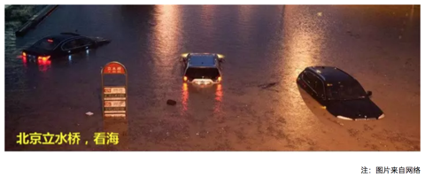
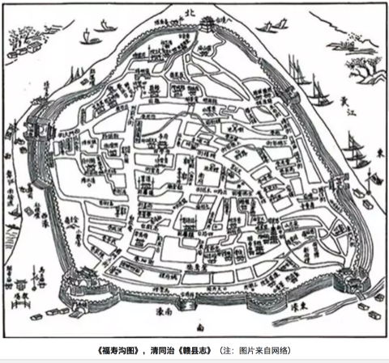
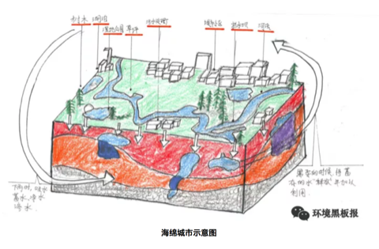
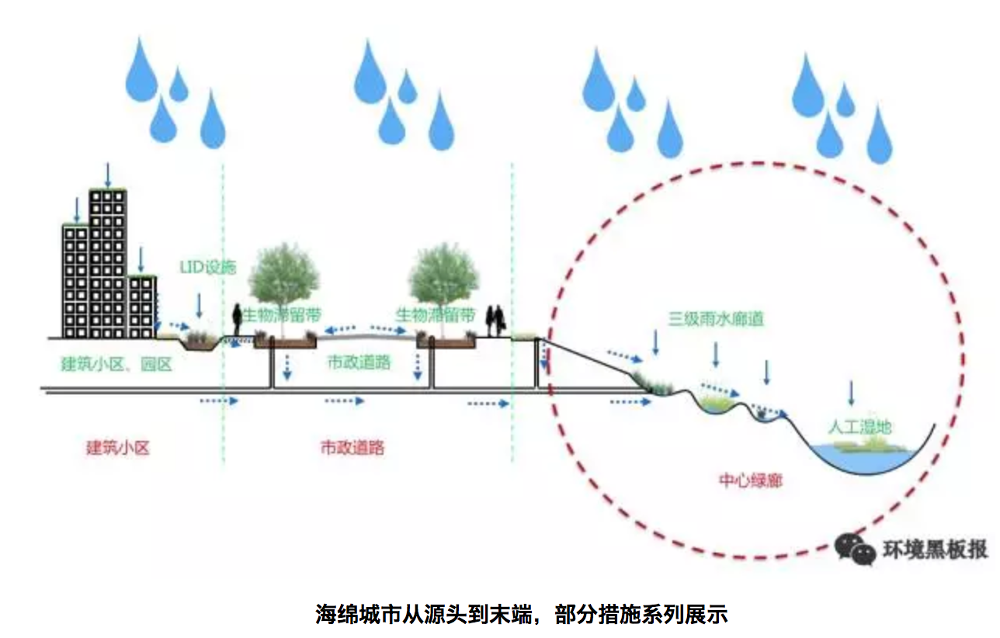
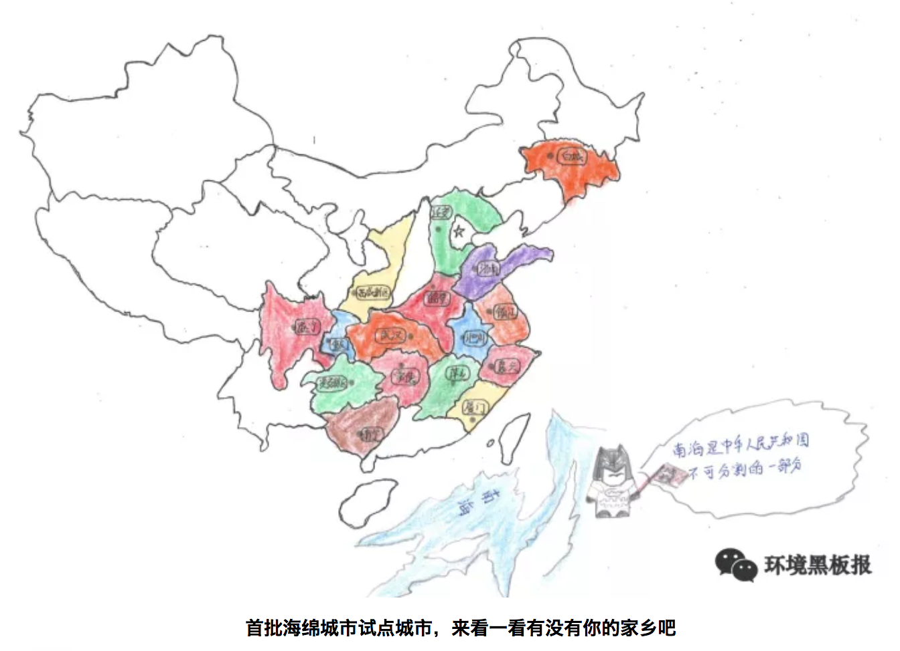
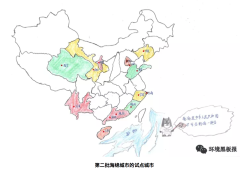
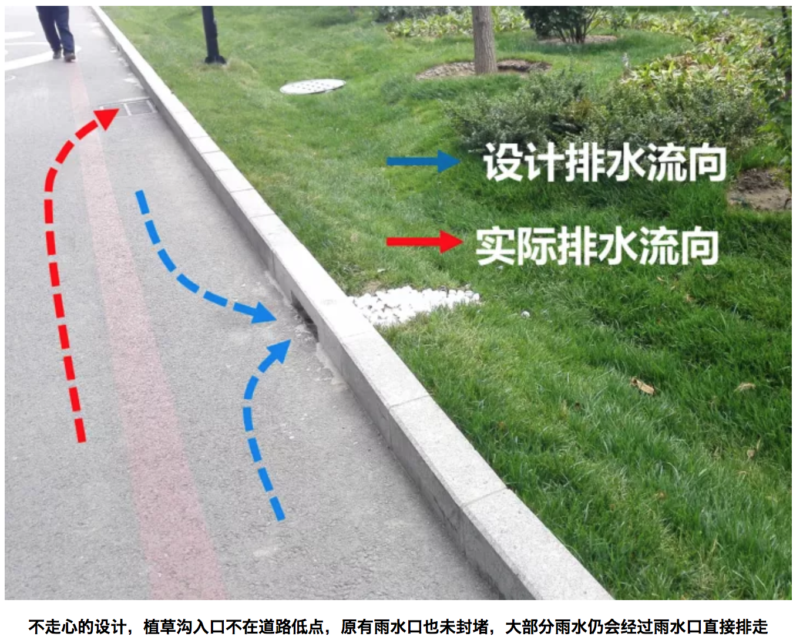
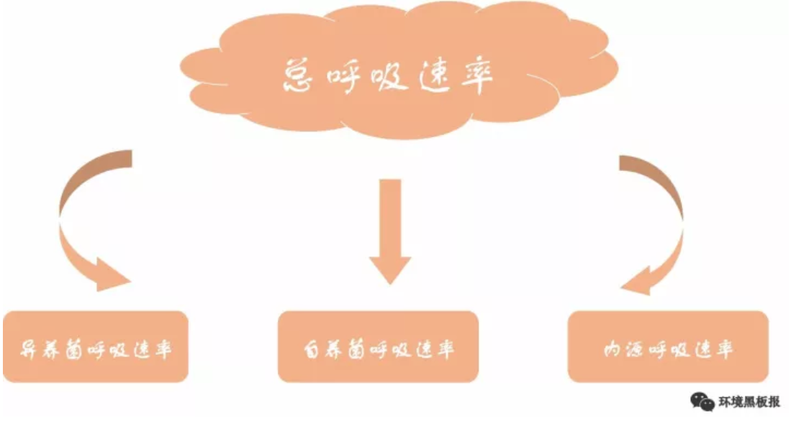
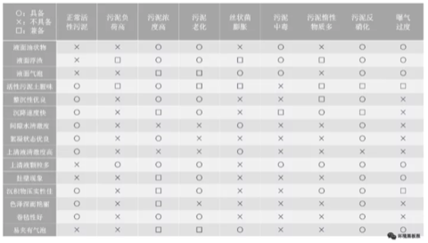

# 工程实践

## 城市之殇

### 序言

2012年7月21日，一场61年一遇的大暴雨让北京成为“汪洋水城”，想不到有生之年居然可以在帝都这个缺水的城市同时实现了“山盟海誓”。无独有偶，不仅北京遭遇了这样的窘境与困惑，其他城市诸如南京、武汉、广州、杭州等也先后开启了“看海模式”，这种“城市之殇”已经成为近年来城市发展挥之不去的阴影。

```{r}

```

那么，为什么我们城市的排水能力一遇到暴雨甚至中小雨就原形毕露？这就有必要来聊一聊本期的话题：“海绵体”。海绵体，顾名思义，是一种对蓄水的形容，自然界原本是一个巨大的海绵体，而如今城市的爆发式发展建设已严重破坏了自然的海绵体，损害了自然的水循环系统。传统的城市建设模式根本不具备应对超标雨水的能力，那么必然会导致“逢雨必涝”，同时还会带来水环境污染、水资源紧缺、水安全缺乏保障等问题。

2013年12月12日，习近平总书记在《中央城镇化工作会议》的讲话中强调：“提升城市排水系统时要优先考虑把有限的雨水留下来，优先考虑更多利用自然力量排水，建设自然存积、自然渗透、自然净化的海绵城市”。海绵城市顺应时代号召应“运”而生。

### 海绵城市是什么

海绵城市的理念其实在我国古代早已践行，比如故宫的排水系统、云南的“哈尼梯田”模式、赣州的“福寿沟”蓄排系统等，都算作是早前的雏形。若要刨根求底地问海绵城市是什么，海绵城市更多的是一种新型的城市发展模式。

```{r}

```

海绵城市的初衷是让城市能够像海绵一样，在适应环境变化和应对自然灾害等方面具有良好的“弹性”。简单来说，下雨的时候，城市可以像海绵一样吸水、蓄水、渗水，防止洪涝的出现；在雨水过后，干旱的时候，又可以将蓄存的水“释放”并加以利用。但同时，我们又希望这个“海绵”能发挥更大的作用，比如说还可以净化水体，让雨水在城市存积、渗透的同时得到净化，以利于进一步的雨水资源利用和生态环境保护。这就为海绵城市的设计、建设提出了更高的要求，不单是依靠恢复或构建自然途径来蓄水、存水，还应当结合人工措施来辅以完成水资源的净化、利用和排放。

```{r}

```

因此海绵城市的具体建设既不能“窄”，也不能“宽”。太窄就会回到植树造林搞绿化的老路子上去；太宽就会变成“海绵城市一个框，啥都可以往里装”。其实海绵城市建设还是要以目标与问题为导向，运用“源头、中途、末端”的措施，使绿色设施与灰色措施相结合，才能实现真正的目标。

简明地讲，源头主要以低影响开发设施（LID）为主，包括植草沟、雨水花园、生物滞留设施等，中途主要包括：雨水廊道、管网、沟渠等，末端主要包括：湿地、调蓄塘、调蓄池、水系等。

```{r}

```

### 海绵城市试点

海绵城市的建设借助国家重视生态环境的东风，目前共执行了2个批次、30个城市的试点，试点期3年。期内国家将给予直辖市每年6亿专项补助，省会城市每年5亿，其他城市每年4亿元。

```{r}

```

```{r}

```

目前来看，海绵城市建设还没有一个全国性的“统一标准”，主要是因为我国地域差异大，东西南北中，面临的问题与挑战各不相同。比如北方地区多为缺水的寒带地区，南方地区则更容易发生内涝，西部地区多属于湿陷性黄土地区，也极度缺水。因此不同区域的海绵城市建设也应因地制宜。

### 浅谈海绵感悟

笔者从2015年开始从事海绵城市建设方面的工作，先后参与了多地的海绵城市试点建设的咨询、设计等工作，主要涉及海绵城市建设系统方案编制等方面。这里跟大家分享一下三年多来笔者对海绵城市建设的一些想法与感悟，希望能对现在或将来参与到海绵城市建设中的同仁们有所帮助。

#### 从管理部门的角度

如果您是一位相关部门的负责人，笔者虽人微言轻，但也愿意提供一些思考供您参考。
海绵城市的建设是一个很复杂、庞大、时间跨度也大的系统工程。而且里面涉及到很多学科和部门，简单数数就需要规划、市政、园林、水利、道路等专业；住建、水利、园林、环保等部门来互相配合。因此如何统筹规划，通力协作，避免形成各自为政、“九龙治水”的局面，是一门很深的学问。

同时，很多城市现在都有新、老城区，新城区建设制约少、阻力小，一旦方案设计得当，大可一马平川。但是老城区就不一样了，不仅居民多、遗留矛盾和问题多多，牵一发而动全身，搞不好容易激化矛盾。这个时候，就不能只顾海绵城市建设的目标，还要考虑经济承受能力、轻重缓急、资金利用效率、建设时序、社会影响等方面。
千万、千万不能不分轻重地全面开工建设和盲目翻挖。最好可以以解决城市内涝、雨水利用、黑臭治理为突破口，结合棚户区和城乡危房改造、老旧小区有机更新等工作同步推进。

#### 从项目公司负责人的角度

当前海绵城市的建设基本上都以项目打包的形式交由PPP公司全权负责建设。如果您是一位项目公司的负责人，首先恭喜您拿下了海绵城市的项目，但是接着愁人的事情来了。在很多项目管理过程中，一些PPP公司“当家不做主”，没有自主权，项目的管控不是由PPP公司独立操作，而会受到相关部门的干预，导致指挥不合理的局面。因此，如果您能在项目开展前和相关部门做好充分的沟通，对您后续工作的开展会有很大帮助。
同时，虽然目前海绵城市都处在建设之中，但是即使这样，试点期也已经过了2-3年，后期的运营维护也该做一些考虑了。如果您公司还没有做这方面的准备，那可千万要小心了，现在环境追责可是很严重的哦。

#### 从设计师的角度

如果您是一名规划师或者设计师，请一定要“迈开腿，管好嘴”。一定要多去现场，没有调查就没有发言权，不能板凳一坐就站不起身，嘴皮一碰就出方案。曾经有一位设计院的设计师理直气壮地反驳说没必要去现场看这么细，走了个过场回来，后来设计的时候全部依靠业主来提供信息作为依据。结果可想而知，做出来的设计方案根本经不起推敲，漏洞百出，更别说拿去指导施工建设。

```{r}

```

同时也提醒大家，海绵城市建设不只是“搞种植、搞绿化”。“花花草草”固然重要，但我们也不能天天搞“拈花惹草”的老一套。海绵城市的实质应该是绿色设施（雨水花园，植草沟，下凹式绿地等）与灰色设施（管网，泵站，调蓄池等）相结合，让它们在不同时间与空间上起到相应的功能与作用。

### 结语

海绵城市的概念一经提出，就在全国迅速地铺展开来。国内新事物的出现，不像国外“自下而上”的推进模式，而是“自上而下”的运动式推动。然而，没有前期多年的研究数据作为支撑，直接开展工程实践难免会面临各种各样的困境。
目前，“海绵城市”的提法基本已家喻户晓，无人不谈“海绵”；然而能真正潜下心来认真对海绵城市进行系统的研究与梳理的人却少之又少。一个新的领域，往往需要十年甚至更长的时间来形成系统性的理论与技术体系，之后才有可能更高效、更全面指导工程实践。希望各位海绵同仁，我们一起潜心努力，为这个领域尽自己的绵薄之力。

作者：王宇
校稿：广播站王站长
编辑：栟
手绘美图：丫头晚安

## 污师私房菜之OUR 和 SV30 的应用

在污水处理领域，活性污泥工艺可谓无人不知无人不晓。活性污泥吃着排泄物，干着体力活，最终为我们产出清水，真乃当下“撸起袖子”的楷模。说到活性污泥真是让人既爱又恨，爱的是它能帮我们处理污水，恨的是它不善于表达，和人类语言识别系统无法链接，当污水处理系统出问题的时候，初入运维界的你却无法第一时间判断活性污泥究竟为什么罢工，只能求爷爷告奶奶的到处请教大神。

```{r}

```

今天通过**活性污泥呼吸图谱**和**污泥沉降性比**的应用介绍，通过熟练掌握这两个污水处理厂运维秘籍，让你可以和活性污泥随时交流，对污水处理厂的运行维护清晰把脉，及时准确解决出现的问题，让你的格调得到迅速提升，变身污水处理领域的运维大神。

### 呼吸速率的前世今生

话说20世纪50-70年代，国外有一群水处理界的大神（Eckenfelder，Mckinny，Lawrence-McCarty）闲着没事东看看西瞅瞅，就弄了个活性污泥模型出来，在里面就提到了**呼吸速率**（Oxygen Uptake Rate, OUR）的概念。所谓**呼吸速率是指单位时间内活性污泥消耗的溶解氧的量**。呼吸速率的概念由来已久，关于测量呼吸速率的专利也是层出不穷。然而呼吸速率一直应用于模型理论层面，在实际指导污水厂的运行方面却是凤毛麟角。（如何测量OUR就不在这里赘述了，请大家自行查阅相关秘籍）

我们知道在活性污泥工艺中有两种主导微生物：异养微生物和自养微生物。**异养微生物**需要消耗外部碳源维持自身生长（不给肉吃，它就死给你看）；而**自养微生物**就是楷模了，可以通过分解无机物获得能量维持自身生长（真是吃着土，干着活）。这两种微生物都有各自的呼吸速率，异养微生物降解有机物时的呼吸速率称为**异养菌呼吸速率**；自养微生物降解氨氮时的呼吸速率称为**自养菌呼吸速率**。有时活性污泥闲着无事也会吃些自己身上的东西，把微生物利用细胞内含物质作为基质进行新陈代谢过程中的呼吸作用称为**内源呼吸速率**。图谱如下图所示：

```{r}

```

### OUR应用的理论介绍

上面介绍了呼吸图谱的组成，下面来谈一谈呼吸图谱的作用。为了更清楚的起到对比，我们需要在污水处理厂正常运行时，刻苦用心的你日常闲来无事多测测好氧池OUR，建立一个污水处理厂的OUR数据库，对正常情况下的OUR烂熟于心，只有这样你才能了解你自己一亩三分地的情况。

通常，**活性污泥OUR值的大小及其变化趋势可对好氧池负荷的变化情况起到预警作用，同时OUR的变化也间接反映出活性污泥自身的健康情况**。我们分两类情况进行分析：

#### OUR异常高于正常值的情况

如果OUR若大大高于正常值，表示活性污泥需要消耗大量的溶解氧，表明优秀的活性污泥小伙子们正在撸起袖子加油干，这也往往预示着污泥负荷过高，可能超过污水处理厂的处理能力，这时出水水质可能超标。

> 你可以脑补一下这个场景：一个房间里面有十个饥饿的小伙子，你拿来十个馒头，他们能以迅雷不及掩耳盗铃响叮当之势把这十个馒头干掉，可如果你拿来一千个馒头，就算是吃到怀疑人生也吃不完。 

#### OUR异常低于正常值的情况

如果OUR长期低于正常值，表示活性污泥消耗的溶解氧较少。这就需要分两种情况来分析了，一种情况是活性污泥精神抖擞，战斗力强，污染物负荷较小，污染物降解好，出水水质好；另外一种情况就是污泥活性差，污泥本身对污染物的降解性能不良，这可导致出水水质不达标。

> 第一种场景是这样的：一个房间里面有十个饥饿的小伙子，你就给五个馒头，估计最后盘子都会被吃掉；

> 第二种情况是这样的：同样是这个房间，同样是五个馒头，但是吃馒头的人变成了十个胃口欠佳的病人，结果可想而知。

### OUR应用的实战演练

上面对OUR应用的理论介绍还是比较笼统的，下面详细讲解一下如何利用OUR来判断出水水质，针对OUR的应用进行实战演练。

#### 实战场景1

用心的你费了九牛二虎之力测定了好氧池的OUR，发现OUR值比较低，根据理论分析，你记住了OUR异常低于正常值的第一种分析情况，认为活性污泥小伙子们战斗力强，降解能力个顶个，赶紧跟领导汇报说出水达标没有问题。你刚汇报完，厂里就通知你出水超标了，这脸被打的啪啪响。

这时,你一定会问，OUR值低，说明出水水质好，怎么出水还超标了呢。少年不要急，听我慢慢说来。

在OUR值比较低的情况下出水超标，说明此时的活性污泥并没有正常工作，那该如何解决呢？这种情况下你只需要往装置内部补充**足够的碳源**，最常见的是投加乙酸钠，看看**投加碳源后的OUR值变化**，如果OUR值还是很低，说明你的活性污泥活性差，大多都是老弱病残，再怎么给他们喂食碳源也不能发挥他们的作用；如果OUR值在投加碳源后明显升高，说明你的活性污泥是健康的，他们只不过是饿了，需要饱食一顿接着好好干活。

**因此，在好氧池OUR值比较低的情况下，判断出水是否达标的时候，需要结合好氧池当下的OUR和投加完碳源后的OUR进行判断，才能准确对污水处理厂的运行状态进行评价。**

#### 实战场景2

勤快的你这天又测定了好氧池OUR，发现OUR值很高，结合OUR异常高于正常值的情况分析，你下结论说出水水质达标。

少年你又要被打脸了。

**好氧池当下OUR值高，说明好氧池中污染物负荷高，表明好氧池需要消耗大量的溶解氧，为了保证出水达标，你需要做一系列应对措施，比如增加曝气，减少排泥量等等，只有这样才能保证你的出水达标。**

#### 实战场景3

就是这么巧，你们公司属于水处理界佼佼者，你一亩三分地里面管辖着若干个污水处理厂，你也坚持着建立了各个污水处理厂OUR的数据库，你也是一个闲着无聊喜欢翻数据的人。有一天，你发现针对不同污水处理厂，即使在进水和出水水质相差不大的情况下，好氧池的OUR差别仍然很大，这时你又迷茫了。

不要迷茫少年，因为在测量OUR时并没有考虑**污泥浓度**的因素，**污泥浓度高的，表明污泥中活性微生物较多，OUR值较高，污泥浓度低的，表明活性微生物少，OUR自然就低一些**。你可以想象一下，10个人和100个人的体重还是有很大差别的。

那如何采用一个统一的评价指标来评价呢？我们在污水处理厂的运营维护过程中，善于发现问题的同时，还要善于解决问题。这时，我们引入一个叫**比呼吸速率**（OUR/MLSS）的评价指标，你就会发现在入水水质和出水水质相差不大时，各个水厂的比呼吸速率相差也不是很大，是不是完美的解决了你的困惑呢？

### SV30的应用实战

上面给大家讲了比较高大上的OUR，接下来再给大家讲讲污泥沉降比的实战应用。SV30，在污水处理界的地位，犹如《天龙八部》中的扫地僧。可谓是量筒在手，天下我有。

做过污水处理的人应该都知道，**污泥30min沉降性能**，可以一定程度上说明污泥的性状，所谓画虎画皮难画骨，具体判断污泥处在哪个状态却不是一件容易的事。可能或许也许maybe只有真正达到扫地僧的级别才能通过SV30一眼识别出污泥的性状来。

少年也不必灰心，鄙人在藏经阁翻阅典籍无数，浏览宝典若干，给大家总结了一些关于SV30的要点。大家理论联系实际，在测试SV30的时候，通过实际观察并结合我提供给大家的要点，相信大家早晚能达到扫地僧的级别。

```{r}

```

这里告诉大家一个小诀窍，千万别告诉其他人。

在测试SV30的过程中，重点观察**前5min的沉降效果**，活性污泥沉降实验的前5min往往可以完成沉降过程的80%，此阶段的沉降效果好坏往往可以指导对活性污泥性能的判断。

你可千万别取完样定个时间，先睡他半小时。所谓武功再高也怕菜刀，在测SV30的时候**量筒的选择**很重要，建议大家选用1L的量筒，量筒过小可能会发生污泥挂壁现象影响效果。再次重申，这些小诀窍千万别告诉其他人哟。

### 结语

以上算是给大家介绍了关于污水处理的两个秘籍，

一个是修炼较困难的葵花宝典——OUR，

一个是老少皆宜的太极拳——SV30。

所谓难易结合才能事半功倍。当然，掌握了以上两个技能也不能洋洋自得，天下之大，无奇不有，只有不断充实自我，才能屹立在污水处理行业的尖端。

```{r}

```

作为一个21世纪的污水厂操作人员，作为一个生活在大数据、物联网、云计算时代的污水厂操作人员，作为一个人工智能正在逐渐取代你饭碗的污水操作人员，仅仅依靠设计规范上面的知识已经难以追上时代的列车了。只有与时俱进，汲取新知识，用知识的力量将命运牢牢把握在自己手里。

成神的道路注定是孤寂乏味的，成神的道路注定是披荆斩棘的，成神的道路注定是一往无前的。少年，抓住当下，紧跟大师步伐，成神指日可待。

作者：阿布呆
校稿：看透， yufree
编辑：智公子
美图：丫头晚安，智公子

## 纳米非米

随着“水十条”、“气十条”和“土十条”的出台，我国已全面启动了“向污染宣战”的环境大战。那么纳米材料如何在环保领域掀起新潮呢？本文以碳纳米材料为一个视角，从选料-制备-应用的角度浅谈一下纳米材料在环保领域如何小试牛刀。

### 碳纳米材料

相信在很多读者的印象中，“纳米（Nanometer）”一词总是披着神秘的面纱，影影绰绰，忽远忽近。那么纳米到底是什么？实际上，它与毫米、厘米和分米一样，也就是个长度单位而已，十亿分之一米，即一纳米。

纳米尺度的物质在性质上，跟宏观物体表现出巨大的差异。比如纳米级的金子不再是金色而会失去光泽呈现黑色，纳米级的导电体会变得绝缘，坚硬的金属在纳米级会变得柔软。实际上，无论是人工纳米材料还是天然纳米材料，我们经常与它们亲密接触。大家几乎天天使用的数码电子产品的中央处理器就是用纳米材料制备；iphone的疏油涂层、国家大剧院的穹顶都与纳米材料有关；军事里的隐形战机也是涂了一层吸波纳米材料；甚至大气里的雾霾也包含了各种尺寸的纳米颗粒。可以说纳米材料已经与我们的生活息息相关了。

碳纳米材料的重要性和应用潜力已在最近20年的最高科学奖项中得到承认，包括1996年诺贝尔化学奖（富勒烯）、2008年卡弗里奖（碳纳米管）和2010年诺贝尔物理学奖（石墨烯）。由于其独特的理化性质，碳纳米材料在环境治理领域的应用研究一直是热点之一。然而由于目前的碳纳米材料制备方法成本高、产率低、条件苛刻、生产过程会伴有有毒副产物，极大地限制了其在环境领域的实际应用。因此，迫切需要开发高效、绿色、低成本的材料制备技术。在此背景下，该领域里近年来兴起的“以废治废”新概念逐渐引起了注意。意即将人们通常视作废弃物的材料（如富碳生物质）加工处理成碳材料，再投入到环保相关领域里使用。

```{r}
knitr::include_graphics('images/nano1.png')
```

### 哪些废弃物可以加工成纳米碳材料？


一般来讲，可以加工成纳米碳材料的废弃物，可以按其环境价值分为两类。一是低值类废弃物。如秸秆、稻草、稻壳等植物类废弃物；动物粪便、剩余污泥等有机质废弃物；以及甘蔗渣、甜菜渣等工业废弃物；二是负值类废弃物，如塑料袋、塑料瓶、海绵、轮胎等。

这两类的大多数废弃物都未得到合理利用，以此类废弃物作为原料制备碳纳米材料，一方面可以降低大规模生产时的成本，另一方面也可解决传统处置方式可能引起的环境污染问题。例如我国农村地区的秸秆（环境黑板报后续会有关于农村秸秆的专题文章）和农膜问题，大量焚烧会造成严重的空气污染和资源浪费。

```{r}
knitr::include_graphics('images/nano2.png')
```

### 如何将废弃物加工成纳米碳材料？

一般有水热碳化法和直接碳化法。

水热碳化法是指在密闭环境中，以水溶液为介质，使原料在高温（100-300°C）高压下经过一系列复杂反应生成碳材料的过程（实际上就是将原料洗好、称好，放铁罐子里扔烘箱里反应半天左右就行）。用水热碳化法制备碳材料，因其操作简单、无污染、对仪器要求低、转化率高等优点被广泛应用。此外，水热法合成的碳材料表面通常会含有丰富的官能团，特别有利于其应用在工业废水的处理中。目前，包括木屑、树叶、稻壳、松针、塑料袋、废报纸等废弃物都被成功地通过水热法碳化成碳材料，还有研究通过此法成功地将草变成了荧光碳量子点。

直接碳化法是指将原料置于无氧条件（惰性气体）下，高温（>600°C）裂解成碳材料的过程。（实际上也很简单，就是将原料放到管式炉中通氮气或者氩气加热一段时间就可以）在高温条件下，原料中的挥发性有机物会逐渐被分解直至留下碳骨架。通常，直接碳化法还需加入一些化学活化剂或者氧化性气体来活化碳材料，以使其表面孔隙度和比表面积增强。碳化温度、升温速率、碳化时间等因素都会影响碳材料最终的形貌和性质。用此法合成的碳材料，表面会具有较强的疏水性，所以对有机污染物的吸附能力很强。

### 纳米碳材料在环保领域有哪些用处？

1. 土壤修复

以废弃生物质制得的碳材料具有发达的孔隙结构，当被添加到土壤中时，可以明显改善土壤结构，降低土壤的体积质量[1]。另外，生物质以生物质碳材料的形式贮存在土壤中，Ｃ元素被固定，减少了向大气的排放；另一方面，生物质碳材料也可以为土壤提供Ｎ等营养元素，提升土壤肥力[2]。上海交大曹心德教授认为生物质碳材料还可以用于土壤污染物的稳定化修复，他将具有独特吸附性能的碳材料形象比喻为“吸盘”，对土壤中重金属和有机污染物进行吸附“封锁”，从而阻碍植物对污染物的吸收。Puga A. P.等人将甘蔗秸秆制成碳材料用于土壤中重金属钝化研究，发现其可将Cd、Pb 和 Zn 的有效态分别降低 56%、50% 和 54%，并抑制它们向地上部的迁移[3]。Khan. S.等人使用盆栽试验研究证实， 用污泥制得的碳材料能够减少水稻对As、Co、Cr、Cu、Ni、Pb的吸收[4]。当然，不同的废弃物原材料、碳化温度、碳化方法制得的碳材料物理化学性质不同，其土壤修复的效果也有差异。

2. 污水处理

废水中常见的污染物有重金属离子、染料及其他有机污染物。吸附法处理废水由于工艺简单、成本较低、可利用吸附剂来源广泛等优势倍受青睐。废弃物加工制得的碳材料比表面积大、孔隙度高、表面基团丰富，对吸附废水中的污染物十分有利。研究表明，以废弃物为原料制得的碳材料不仅可以通过表面作用（静电吸引、疏水作用、π-π作用等）对重金属离子和有机物分子进行吸附（adsorption），还能凭借较高的孔隙度对油类污染物进行吸收（absorption）。例如新加坡南阳理工大学张华教授课题组成功将废报纸制得碳气溶胶材料用于油类物质和有机溶剂如氯仿等的去除，取得了较好的处理效果[5]，这为解决海洋原油泄露污染提供了一个潜在的解决思路。印度理工学院鲁尔基分校Vinod K.教授将废轮胎制得的碳材料作为吸附剂处理水中重金属离子，发现其对Pb2+、Ni2+有非常好的吸附能力[6]。陕西师范大学张志琪教授课题组成功将香蕉皮碳化为多空碳材料，发现其对水中典型染料分子亚甲基蓝有较好的吸附去除能力[7]。

3. 能源应用

此种碳材料由于较高的石墨化程度，其电子传递能力较强。又由于生物质中还有大量的N，P，S等杂原子，使得由其制备的碳材料导电性进一步增强。因此此种材料在电化学上也具有广阔的应用前景。例如碳材料因为比表面积大、稳定性好、导电性好、价格便宜、来源丰富而成为超级电容器电极材料的首选。我们日常生活中的新能源汽车、数码相机，甚至楼道应急灯都有超级电容器的身影。例如大连理工大学邱介山教授课题组将虾皮制备成氮掺杂碳材料用作超级电容器，其在电流密度为50 mA/g时，比电容可达357 F/g[8]。利用西瓜皮、麦秸、绿茶、柚子皮、稻壳等制成的碳材料也可作为性能优异的负极材料用于锂离子电池。例如新加坡南洋理工大学于霆教授将竹筷碳化成碳纤维用于锂离子电池，其首次放电和充电质量比容量值分别为500mAh/g和283 mAh/g，且循环稳定性较好，有望替代传统石墨电极在锂电池中的作用[9]。

```{r}
knitr::include_graphics('images/nano3.png')
```

### 结语

以废弃物为原料制备的碳材料已被广泛研究用于土壤修复、污水处理和电化学领域，展现出了广阔的潜在应用前景。废弃物来源广泛、价格低廉的性质也使得此概念为大规模商业生产提供可能。然而目前对废弃物碳材料的研究才刚刚起步，处于发展阶段，很多碳材料仅限于实验室制备而没有进行大规模的工业化生产，距离大规模实际应用还为时尚早。

此外，在大规模应用之前，其对环境可能造成的潜在风险也有待进一步研究。这也正是纳米科技目前的发展缩影。正如中国科学院院长白春礼所说：“纳米科技发展方兴未艾，基础科学研究领域中新原理不断建立、新功能材料的涌现与可控制备技术的发展、纳米生物医药的应用探索都体现出纳米科技对人类知识体系的极大拓展以及对生活方式的潜在推动作用。尽管纳米材料显示了产业化以及临床应用的巨大前景，但多数材料目前仍处于实验室研究阶段，如何实现这些材料的功能化、推动商业化应用、相关的生态影响和生物效应是纳米科技发展面临的关键问题”。中国科学院生态环境研究中心江桂斌院士曾将基础研究形象比作翻书：“当书本一页一页翻至最后时，就是量变到质变的时候”。这也同样适用于纳米领域，或许质变之时我们就能用上充电几秒即可充满的电子产品，纳米机器人实现药物精准输送、有的放矢。

文献引用

[1]:陈心想，耿增超。西北农林科技大学学报（自然科学版），2013，41: 167-174．

[2]:Kezhen Qian, Ajay Kumar, et.al.  Renew. and Sustain. Energy Reviews, 2015, 42: 1055-1064.

[3]:Puga A P, Abreu C A, et al. J. of Environ. Manage., 2015, 159: 86–93.

[4]:Khan S, Cai Chao, et al． Environ. Sci. & Technol., 2013, 47 : 8624-8632．

[5]:Bi H, Huang X, et al. Small 2014, 10, 3544.

[6]:Gupta V K, Ganjali M R, et al. Chemical Engineering Journal, 2012, 197: 330.

[7]:Liu R L, Liu Y, et al. Bioresourse Technology 2014, 154: 138.

[8]:Gao F,Qu J Y, et al. Electrochim. Acta 2016, 190: 1134.

[9]:Jiang J, Zhu J H, et al. Energy Environ. Sci. 2014, 7: 2670.

作者：眼神防守
校稿：柴胡半夏苏，yufree
编辑：栟
