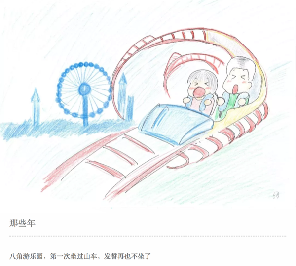
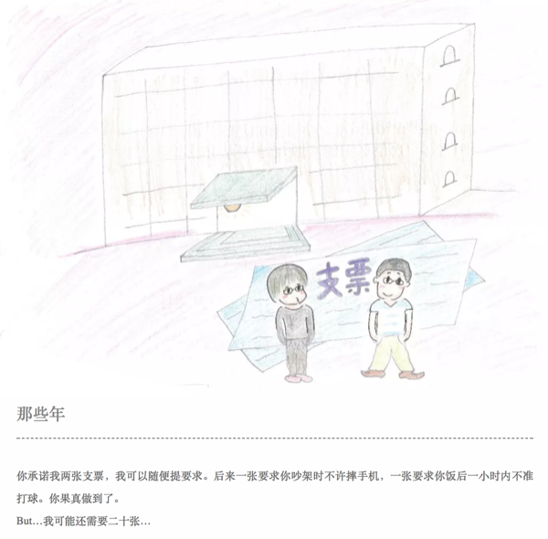
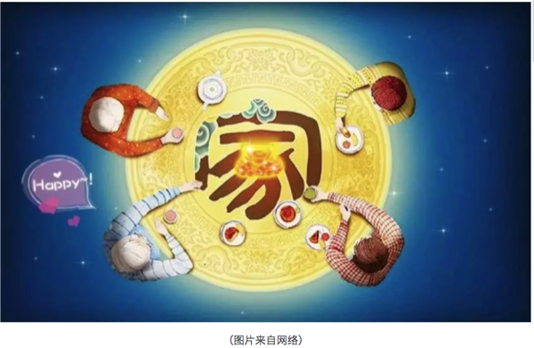
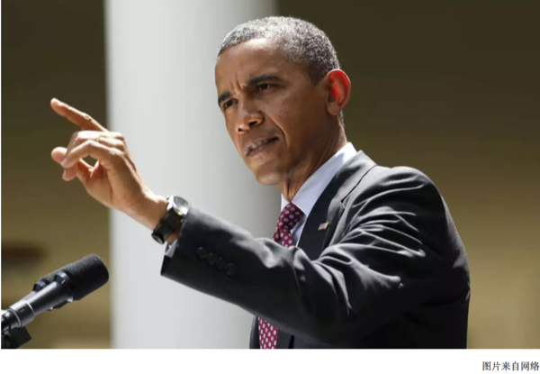

# 岸芷汀兰

## 念念不忘 必有回响

**广播站王站长**

行走在市区的环路上，穿插于市郊的街巷间，随处可见十九大的最新标语：“不忘初心，牢记使命”。环路上，有车水马龙的喧嚣；街巷间，有贩夫走卒的吆喊。初秋的北京，雄心壮志也很难抵挡供暖前的寒冷。在这座底蕴深厚、庄重方正复又灯红酒绿的都市里，每天面对拥挤的人潮和日复一日的生活，我常常会扪心自问：“究竟何为初心？”

初心常常不语。

要说来，环境专业其实是一个偏于冷门的小专业，在我刚上大学那会，环境学院一届就两个班，五十几号人；上研究生的时候一届也不到一百个学生。这么小的学院，如果非要说有什么优势，那就是女生比男生多，而且质量还不错。读博期间，那些二十七八岁，脱去白大褂立刻成为泪朱砂的妙龄女博士们，着实是枯燥科研生活中的一道风景。

随着北京雾霾的爆发，环境问题开始越来越被人们所熟知，然而环境这一行当却并没有跟着一起爆发式成长起来，因此对于环境人来说，就业常常是一个痛苦的选择。我大学里特别好的一哥们，也是我的室友，他留学日本，在土壤修复上苦读五年，博士学成归来，毅然决然地前往了——碧桂园。当他拿着大约是我三倍的工资，在世界各地自由飞翔的时候，我依然在这半径半里的地方，重复着读博时的生活，这大概就是所谓一花一世界，一叶一菩提。

如今大学时一个学院的同学少有还在环境这个相关的行当里，因为这个行当既苦且窄。若从进入这个专业算起，已经过了大约十二年的时光。十二年，足以让你当年暗恋的女孩嫁为他妇；足以将年轻的校草喂成油腻大叔，但同样的十二年，如果我们还坚持在这个最开始的选择上，能不能算作是初心不改？如果可以，这大概能作为我们办这个公众号的一个初衷吧。

初心不改，就应该完成一些使命。是的，北京雾霾的时候，你知道了雾霾的可怕，那南方空气中的氮、硫化合物就不可怕么？室内空气中的甲醛和VOC就不可怕么？土壤中迁移的砷和汞就不可怕么？你知道每年有多少的农药、重金属和持久性有机污染物进入到环境么？你知道每天在聒噪的声环境状态下生活对身心会造成多大的创伤么？……是的，真相常常触目惊心，我们不能等到雾霾来袭的时候才知道治理大气，更不能等到水源枯竭的时候，才知道珍惜水源。如果作为环境人我们也回避这些责任，那人与自然和谐相处的中国梦恐怕也只是空谈。

正因为如此，作为一群正在三十岁当口的环境人，我们有气力、有精力更有愿望撸起袖子干起来。在我们的队伍中，有在海外读博后，随意一篇随笔就能被科学网主页转载的科院小飞侠；有在高校里谈笑间文章与项目齐飞的青年才俊；既有从环保机关到地方监测站的一线骨干；更有大国企到民营企业环境项目的一手负责人；最不济的大概就是我这样留在科学院里，守着自己一亩三分地的人了。我们愿意用一个平台去展示一下我们的工作，不需要一定摆出科学的姿态佩戴高大上的光环，我们更愿意去讲述一些故事，如果把我们的心路历程呈现出来，其实是一部环境人的血与沙。

因此我们更想去展示一些实实在在的东西，更希望推送的每一篇文章都言之有物。环境访谈、热点解读和前沿动向将是这个公众号最主要的推送方向。这些东西，或在天边、或在眼前、或有所耳闻、或已然亲历。这些内容，科研的、政策性的、工程项目的、经历感悟的，简而言之，我们希望来访的每一个人都能在公众号的不同模块中找到一些共鸣、读出一些趣味，都能感受到作者撰写每一个字的用心。如果一不小心，刚好帮助到解决你的困惑或者其他实际的问题，那对我们而言，真的是初心有值了。

在这之外，我们是一群很有趣也很有范的人，同时也为了增加公众号的受众，我们也愿意分享一下环境人的生活日常。我们的生活也许不尽如人意，但我们的文字一定充满情趣，疲劳之余来此闲读，倒也是消磨时间的好去处。同时更希望这个公众号能成为一个交流的平台，我们可以在这里谈天说地、交友论道而共同进步……但我们拒绝黄、拒绝赌、拒绝黄赌毒。

鲁迅先生说：“愿中国青年都摆脱冷气，只是向上走，不必听自暴自弃者流的话。能做事的做事，能发声的发声。有一分热，发一分光。就令萤火一般，也可以在黑暗里发一点光。不必等候炬火，此后如竟没有炬火，我便是唯一的光。”我们不奢求去做唯一的光，但我们愿意和大家一起发光来照亮前路。

开篇数语，不过投瓦砾以引玉珠，愿这个公众号能越办越好，也希望再过十二年，眼前的这些人能够依旧初心不改。

黑板报计划一周一更，多谢关注，我们下周见......

## 一封来自环保工作者妻子的信

BYE，五年。HI，十年。

嗨，我亲爱的你。

今年12月18日，是我们领证的五周年纪念日，我们在一起也马上迈入第十个年头。

```{r}
knitr::include_graphics('images/wife1.png')
```

这天，你去了西安培训，我在北京忙着手头的工作。下午时分，我发微信给你，“培训怎么样”，过不久，你消息发过来，“还不错，可以淘到宝”。本来还担心你前阵子工作中的挫败感会持续很久，不过看到你的回复，就心安了，这位同志工作热情还在。热情还在，那生活就还是很多盼头的。

记得，前年的12月18日我在武汉出差，你在北京准备博士毕业论文，当时你说这关过了老子就要去怒闯天下，我说不管你是老子庄子还是韩非子，大哥你早该出来了，姑娘我独闯天下都快撑不住了。

```{r}
knitr::include_graphics('images/wife2.png')
```

去年的12月18日，那时候你闯天下已经大半年了，不过第二天你就折戟沉沙在林大篮球场，扭了脚，肿成馒头大，我也记不得18日是个什么光景，只记得19日我和衍博推着你在北医三院的急诊室拍片子，我急得团团转，你却抱着手机坐在轮椅上刷着新浪体育。我当时真是哭笑不得，要不是看你脚肿的太厉害，我肯定会再给你一脚！

```{r}
knitr::include_graphics('images/wife3.png')
```

这日子都不知道怎么过得，一年又过去了。时间对我们来说好像变快了很多。

前几日读到一句话觉得很对，它说，你觉得时间越来越快，是因为时间对你越来越重要。是啊，尤其对你我而言，没有完成的事情还有很多，我们似乎比同龄人慢了许多。很多次和别人提及未来，心中自是诸多忧虑，但所幸没有绝望过，我想，也许是你源源不断灌输给我的对这个世界的感恩与善意，让我与这个城市的一切过招，乐此不疲。

```{r}

```

过去一年，我的工作生活学习都经历了很大的变动，有好有坏。好的，你夸奖我；坏的，你支撑我。很多时候，我们是战友，更是彼此的诤友。在我崩溃的时候，最给我力量的，还是你的坦然和坚定。有时候，真羡慕你这种性格，任何时候都那么坦然，你说大山里的孩子都这样，有什么怕的。是啊，你带我走过你的家乡的那些山，我都记得。

你还记得我们初识时，我在信中给你抄过一段波伏娃的话吗？

“那个比我更加灵活，更强壮的伴侣帮我步步攀高，我显得比较贪心而又不怎么慷慨，我渴望接受而不是施与。如果我必须拖着一个落后者，我会由于不支而憔悴，我命中注定的人应该既不比我弱小，又不过分强大，而是应具有相当的卓越来担保我的生存。”

当时奋不顾身，也许就是为了你这颗强壮的灵魂，这些年过去，最让我安定的却还是你那没变的灵魂。

```{r}

```

余光中先生说，孩子，希望你自始至终是个理想主义者。

我想说，你，千万保持内心的火焰与坚定。因为我不够坚定，所以需要你的坚定。

圣经中说婚姻是一种盟约，在这个盟约中，责任义务履行的好，爱就会延续。那今天，就祝我们永远不会是彼此猪一样的队友，而是可以并肩作战，一起升级打怪兽，听主席的话，共同奔小康。

作者简介：一个环保工作者的妻子，哇咔咔。

作者：薇薇安 
校稿：看透
编辑：智公子
手绘美图：DG, XJR

## 天道酬勤 日新月异

### 辞旧迎新，鸿运当头

2017年11月9日，一篇名为“念念不忘，必有回响”的文章发布，微信公众号环境黑板报正式对外亮相，至今，平台已发布15篇原创文章，文章内容秉承着环境科普和环保人风采的宣传主题，收到诸多好评，更是得到中国科学院生态环境研究中心副主任吕永龙研究员的认可和祝福！

```{r}
knitr::include_graphics('images/2018.png')
```

环境黑板报以生态环境研究中心学生为创作主体，这个团队100%为兼职作业，一部分已就业于科研机构、政府机关、企事业单位，一部分仍是努力追求的学生；文案编写之余、工作报告之余、外勤奔波之余总有些闪光火花被抓取记录下来，并整理成稿成为了我们的推送内容。

正如下文提到的，“这个公众号的成立，正契合我们当下的需求，大城市的生活可能让你迷失方向，来这里，让你找到自己的初心；工作的繁忙可能让你已经疲惫，来这里，让理想为你打气；残酷的现实可能让你心灰意懒，来这里，你有一帮同呼吸共命运的朋友支持你。”

这是一群不忘梦想，砥砺前行的年轻人，是我们，也是你们，祝大家新年快乐！

新年之际，一位年轻人为大家呈现一段自己作为环保人的心路历程史，真是所谓的天道酬勤，日新月异。

“道虽迩，不行不至，事虽小，不为不成”。虽然现在被各种“男到中年，不如狗”的焦虑充斥，但我一直坚信，不论何时，倾听自己内心的声音，不忘自己当初的梦想，一定能够收获自己满意的结果。

当初的一个机缘巧合，进入了环保圈，说实话，一开始都不知道环保是干什么的，我以为是扫大街的。直到工作之后的第四年，有一次我听我妈跟她的朋友说起我是干什么的，我妈的回答让我差点喷饭。“我儿子好像是整天在处理脏水和垃圾的地方卖表的（自动化设备仪表( ╯□╰ )）。”我的亲妈，作为一个环保人的优秀母亲，竟然到现在了还说不清楚我干的环保到底是干什么的。

不过话说回来，我干的环保到底是干什么的呢？第一份工作是处理污泥的，我告诉你我在现场都干了什么，每天拉泥的卡车来了，我要去现场手动开打污泥仓的大门，戴个大猪鼻子。没了，真的，这就是我在现场唯一的工作——看大门的。于是我毅然离开，现在呢，污水处理厂，各种与水有关的处理厂和工厂，包括牛奶、啤酒、碱液、污水、自来水。太多了，就是只要有液体，都是我的工作范围。要是硬要往环保上靠，我是可以讲出来一大串故事的，不过我觉得这就像是碳纳米材料之于环保一样，故事可能动听，感觉都是高高在上，不切实际。所以，我是在环保圈吗？我迷失了。

就在三天前，一个香港来的朋友找到我，说是想进入环保领域工作，问我建议。我也是一脸疑惑，你不是金融圈的么？为什么要来环保？你跟钱有仇吗？干环保不赚钱你知道吗？卧槽，真是心里面一万头草泥马，竟然还有这样的人。然后我让他听了所里各个研究组的报告（每年中科院生态中心的年会），他竟然专程从香港赶回来，听完第二天飞回香港，就这热情，我不敢比。跟他聊天，知道他周围的人在得知他想转到环保专业之后也是很疑惑，要知道，香港可是个物欲横流的社会，基本没有人干环保。可是他告诉我，觉得我们应该保护环境，保护我们人类赖以生存的环境，自己赚钱赚的再多也只能为自己牟利，可是如果可以为环保事业做出贡献，则不仅自己受益，周围的朋友，自己的子孙都可以受益。这高度，我确实没他高。心里想，你丫真是有钱人，不愁温饱。还真是无独有偶，一个在英国留学的学生，学的金融专业，回来进了首创工作，觉得自己专业技能不够，想要再去进修。

现在各种各样的人都在涌向环保，作为本身就在环保领域的我们，真的需要再次给自己明确一下方向了。没错，就是那个曾经的梦想，就是我们共同的梦想。说为了祖国的碧水蓝天有点扯，我们只求能喝到干净的水；说为了祖国大好河山有点远，我们只求能呼吸到新鲜的空气。

这个公众号的成立，正契合我们当下的需求，大城市的生活可能让你迷失方向，来这里，让你找到自己的初心；工作的繁忙可能让你已经疲惫，来这里，让理想为你打气；残酷的现实可能让你心灰意懒，来这里，你有一帮同呼吸共命运的朋友支持你。

世界上最快的速度不是每天疲于奔命，总是徘徊于现状，而是冲着目标一直努力前行。纵使进展再慢，也终能实现梦想。

谨以此文献给那些不忘梦想，砥砺前行的伙伴们。

### 吕永龙研究员简介

吕永龙，博士，研究员，博士生导师，发展中国家科学院(第三世界科学院，TWAS)院士，国家有突出贡献中青年专家。国际环境问题科学委员会(SCOPE)前主席，世界自然保护联盟(IUCN)科学顾问，太平洋科学协会(PSA)主席，联合国环境规划署(UNEP)国际专家组(IRP)成员，罗马俱乐部(Club of Rome)正式成员，中国生态学学会副理事长，中国可持续发展研究会常务理事兼生态环境专业委员会主任委员, 中国科技大学、中国人民大学兼职教授等。入选国家百千万人才工程，享受国务院政府特殊津贴专家。先后获中国科学院科技进步二、三等奖各1次，省级科技进步三等奖1次，中国环境科学学会首届青年科技奖，BHP Billiton导师科研奖，中国科学院朱李月华优秀导师奖，国家科技进步二等奖1次，SCOPE杰出成就奖等。

作者：三界妖仙
编辑：智公子

## 生态•五行•人伦

```{r}
knitr::include_graphics('images/swr1.png')
```

```{r}
knitr::include_graphics('images/swr2.png')
```

往事有时令人不忍直视。想当初，环境保护也曾贵为与计划生育相互比肩的两项基本国策之一。然而，一直以来，世人只知后者威加海内，却与前者对面不识。三十年河东，三十年河西。现如今，环境保护俨然已成尚方宝剑，坐拥一票否决权，何止扬眉吐气，大快人心。人们对生态环境保护的关注前所未有。本文也顺着风向，用陈词旧调来赶一次时髦。

一般来说，人们生活的环境通常分为自然环境和社会环境。自然是天与地，天与地之间的万物按照“道”的规律循环不息的现象和状态，包括人类和其他生命世界、物质世界的一切活动。生态是指生物在一定的自然环境下生存和发展的状态。我们人类研究生态，也就是要研究怎样保护和利用自然环境以服务人类的发展，也就是要弄清楚自然是怎样在影响着人类的活动。

研究生态的原理和方法很多，无论东方和西方，还是古代和当代，都有自成体系的表达。本文主要介绍一下在中国古代的五行理论中环境是怎样影响人的。

150年前，马克思提出：“运动着的物质世界是普遍联系和永恒发展的”；3000年前，五行系统理论把这些运动、联系和发展以取象的方法做出了精致的总结。

在五行理论中，根据运动和显现的方式将事物分为木火土金水五类。五行包括气（炁）和象，属于同类五行的事物相互感应。所谓的“天人合一”、“天人相感”，在这个角度讲就是天、地、人、万物之间是一体的，是一直在相互感应的。

为了问题聚焦，我们在这里不具体讨论感应的媒介是电波、磁场，还是量子纠缠，只强调说当某一类五行出现问题的时候，属于这一类五行的所有事物都会受影响。也就是说天地间某一类五行的气（炁）出现问题了，那么赖以这一类五行的气（炁）所支撑的象必然也就要出现问题。我们也不在这里科普具体的五行系统理论，只是应用五行的理论来探讨生态与人伦的问题。这里的人伦包括人的社会伦理和家庭伦理。

```{r}
knitr::include_graphics('images/swr3.png')
```

限于篇幅，此次只简单讲一个离我们最亲近的五行：大地母亲——土五行。

当前，土壤中重金属超标、农田里化肥农药高残留等问题，导致土地受到了普遍破坏。因为破坏的规模和程度足够大，引起了“土”五行气（炁）和象的破坏。

土对应信。所以，当前社会诚信普遍缺失。具体表现为：人们说过的话容易变卦，谈好的事兑现不了（谈十个事情甚至成不了一个），签过的协议无法履行，约定的日期时间不能遵守，制售贩假货泛滥。这里的真实情况不一定是人们主动的不讲诚信，有很大部分是环境在对事件本身产生影响。

土对应怨、脾胃、祖辈、口、安全感。土德受损，人们遇到问题容易怨天尤人，脾胃功能不好，与祖辈少有连接和沟通（包括祭祖），容易打妄语（恶口、两舌、绮语、诳语），贪吃、什么都吃而且吃不到什么好东西。人们普遍缺乏安全感。

土地肥沃、平坦、无污染的地区，人们则是讲信用、不怨人（心胸开阔）、与祖辈亲近（老人容易有儿孙绕膝的天伦之乐）、饮食有节制、不妄语、脾胃好，有安全感。

当土地出了问题，其生长出来的食物自然就要受影响，导致人吃了之后也就有问题。土地贫瘠，土壤中某些元素过剩、毒素残留，会导致食物营养成分不全或者有毒素，人吃了之后自然就会在心理和行为上有相应的表现。吃水培（无土栽培）食物也是如此。长期如此，整个社会也就出现变化。

土地缺失或者供应不足，土地状态被破坏，都会对当地的人和社会状态产生相应影响。

另一方面，一方水土养一方人。医院里的营养师都知道，北方人需要补充维生素的话要吃苹果，而吃香蕉的效果就不如苹果理想。但陕西的苹果的营养对陕西人最适用，本地人最适应本地的农作物。转基因的农作物结出的果实因为无法再当作种子进行发芽生根，所以人吃了会影响生育。

脾属土，主肌肉。人是父精母血交媾而成，从父亲那得了骨，从母亲那得了肉。断奶之后，我们靠土地长出的食物来长肌肉。断奶前应该食母乳。现在人们都是给孩子喂牛奶。而牛奶适合牛的胃，适合牛的营养需求。当前婴儿普遍吃母乳不足，容易导致肌肉和脾胃系统出现问题，长大与母亲不太亲近，也会影响孩子土五行的运转和土德的圆满。

土五行就是这样影响着人与自我的和谐、与家庭的和谐、与社会的和谐。有一个好的生态系统，首先是有好的土地，因为土地不仅是五行之一，还担当着万物的生化、收纳和承载。

```{r}

```

作者：含章
编辑：栟

## 在设计院工作是一种怎样的体验

### 毕业这几年，我都干嘛

自2013年6月毕业，我已踏入职场四年有余，最初的一年半在首钢鲁家山垃圾焚烧厂当技术员，想那时，真是躲在荒无人烟、连农田都看不到的山区，一心只想烧好中国人的垃圾。

```{r}
knitr::include_graphics('images/sisi1.png')
```

后来因缘际会到了现在的设计单位，主业是垃圾焚烧发电厂的设计，在业内还算知名。虽然角色不同，但上手还算比较快。一晃三年过去了，在设计院忙忙碌碌的加班生活还是比较充实的，毕竟还算得上适合自己的工作。可能大家对我的工作了解不多，就让我给大家介绍一下。

### 我理解的设计院

设计院，不管叫咨询设计院还是设计研究院，其实本质上大约都可统称为画图院，虽然可能某些设计院可能会有一大批做前期，比如规划、可行性研究、环评等，可如果你敢称自己为设计院，我相信你的主业一定是画图的。不得不说，设计院这一称谓原本就有浓浓的社会主义经济的气息，虽然多数设计院早就走上自负盈亏的市场化道路，在许多设计院里仍然可能看到国企式办事准则的影子。

就说画图，作为设计狗的我，也不是什么都能画的出来的，我们的专长是画垃圾焚烧方面的管道，你让我画个房子，我是没有这个本事的，那是结构建筑专业的事；那你说让我把你屋里的暖气管，水龙头，淋浴头画下，我也只好尴尬的说，那是暖通和给排水专业的事，我也不会干。进行到当下的信息时代，多数行档的设计院已经发展到一个极其成熟的规范化状态，工作如流水线一般。

现在大的设计院的专业划分都极其细致，除了总工，其他人可能都是螺丝钉，可即使是总工甚至行业大拿，也不可能做到各个专业门门通，大家各司其职。有时候参加的一些项目，直至项目完工，可能项目组的成员都还没有认全呢。

### 设计工作不是一蹴而就的

作为普通的设计狗，每天的工作就是画图，但画图不能瞎画，得有依据，要满足客户的需求，需要审阅业主的任务书；如果你是配合专业，就需要接受上游专业的要求；同时，政府的相应文件（环评报告，能评报告，稳评报告，审批报告）和现场实地条件（地勘报告，工程场地自然环境，水土保持状态，场地供排水状况，电网接入条件）也对我们的设计起了约束性作用。像我们是机务专业，平时还要接触不同的设备厂家，不仅要向他们提自己的工艺要求，还要接收他们的要求，交流一定是双向而反复的。不同专业的侧重各有不同，但总归是在做一道优化题，可遗憾的是我们经常没有找到全局最优解，而只找到了局部最优解，在解题的过程中经常就是与时间赛跑，与各方交流甚至争吵中度过的。以下是我以前项目某一图册的截图。

```{r}
knitr::include_graphics('images/sisi2.png')
```

如果蓝图完成，这个项目的工作就相当于告一段落了，当然也不是万事大吉的，业主也能再让另外的公司（项目地的相关企业，同行业的竞争对手）对我们的工作进行审查，发现问题还会要求修改完善。施工前主要的设计人员还要到工地现场进行交底，就是把自己的工作交待给相应的施工单位，解答他们的问题。下图就是在广州某项目拍到的现场施工场面，当天我向施工单位进行了交底。

```{r}
knitr::include_graphics('images/sisi3.png')
```

施工过程中，出现问题，业主会要求监理单位出具工程联系单，我们就需要提出解决方案，并发出设计变更单；即使设计人员个人认为没有问题，但如果业主强行要求，许多情况也不得不出具设计变更。不能小看了这几片纸，只要出了变更单，施工单位就能用它向业主要求增加费用，许多施工单位甚至采用投标前低价竞标，中标实施时通过多出变更单盈利的工作方式来实施项目。

举某个例子吧，某施工单位做了一个4000万标价的项目，最后做下来亏损了300-400万，但通过变更增加费用，能多得1000万，最后才净赚了700多万。

到了工程快完工的时候，我们还需要根据变更的状况出最终的竣工图，也宣告这一番折腾终于结束了。但不要高兴得太早，因为领导是见不得我们闲着的，你还没长舒一口气，新的工作就来了。但更常见的情况是，你同时要面临几个项目，担任的角色即使各有不同，其中一个的结束并不能给你的工作带来太多变化。

### 我对设计工作现状的理解

现在设计这一行的确也是越来越难做，钞票也越来越难赚。原因有很多，有内部的也有外部的，我个人认为更多来源于外部，环境的变迁远比设计院自己内部的变化来得剧烈。

首先，投标报价阶段设计费压低得太厉害。设计院是每个工程必须的单位，但许多业主是看不起设计院，主要原因是现在许多同仁把整个环境搞坏了，相互压价，却不重视设计自身能力和效率的提升，只能让基层人员通过加班或用一些新人来练手来填平这一亏空，效果当然不乐观了。

其次，业主一直在学习，在进步。业主也加强了专业的学习，一直在向前迈进，甚至大量招揽有设计背景的人才，如果你某天从微信朋友圈上看前同事说自己换到业主单位上班了，你千万不要奇怪，这也使得设计院在工作上的智力或信息优势在许多行业都不复存在。

第三，业主要求越来越高。从时间上来讲，要求今天的事今天就办，不然就扣钱或都让你直接来现场处理。虽然大家对此颇有怨言，但只要是想在这行干的，都还是想自己的单位能多揽活，毕竟，大家无活儿的时候，也就是树倒猢狲散的一天。下面是某业主给我们单位发的两份函件的截图，有没有感觉业主的杀气腾腾呢？

```{r}
knitr::include_graphics('images/sisi4.png')
```

第四，设计需整合多个功能。从技术角度，现在许多工程不仅仅只是一个工程，尤其是我们做垃圾焚烧厂的，本身就有教育和参观功能，把一个工业化的建筑变成了一件工艺品来雕琢，这就给我们的工作带来了新的挑战，你原来只是个画平面或立面图的，工程经验丰富却无艺术家的气质，但现在你得有，这会让你们的设计更具优势。下面的主厂房是我们公司在宁波的一个项目，外立面做的非常漂亮。其中上面两幅图为鸟瞰效果图，下面一幅图为施工完成后的实景图。两者效果还是很接近的，但美中不足的是部分区域的灯光有色差，留下一点遗憾。

```{r}
knitr::include_graphics('images/sisi5.png')
```

第五，设计师责任意识增强了。有设计师就因为错误的设计受到了刑法的制裁（举例如近一段时间在工程师微信朋友圈里热议的合肥公交站倒塌事故，相关的设计负责人就被刑拘了，虽然网上为她鸣冤叫屈的同仁不少，可说到底即使是主要责任不在设计方，连带责任也是逃不掉的），这点毋庸置疑，如果没有责任意识，做出来的工程质量实在没有办法保证。如果自己都不敢在自己的设计上签上自己的大名，估计谁去施工、运营都不会太放心。

### 我理解的设计院未来

近年来设计院招人呈现两极化趋势，新毕业学生进单位普遍比较难，要么要求名校，学历，要么就是得走关系，提前实习；但设计院想要的人多是能力强，经验丰富，能迅速上手干工作的人，这种的招揽并不是那么容易的。一些大院经常开出很好的收入，但经常也招不到合适的人，许多单位人员流动性也很频繁，甚至影响了工作质量。

年轻人做几年设计一步一步向上爬，做得好做升为专业负责人，接着是项目负责人，再往下只能惦记下所长，所总工的位置。但一个设计院少则三四十人，多则百人千人，领导就那么一点比例，也是很困难的。而多数设计院除了少数大院，许多是扁平化管理，上升的阶层并没有那么多，你会经常看到自己的领导背个书包去出差，亦或是晚上熬夜出方案，更加能感觉领导不过是能管人的设计罢了。工作到退休的时候，许多老同志会愿意返聘回单位，给年轻人做做指导，忙得时间太多了，反倒闲不下。给人的感觉，设计院不似计划经济时期那么让人能安稳地做设计了，但如果你想做得好，有一份沉静稳重的心态是非常重要的，毕竟这个是需要你勤加思考的工作。

现在许多设计院也在转型，某个知名钢铁的设计院甚至想触及养鸡厂的设计，大家别笑，最后的结果是他们发现自己可能真做不了。垃圾焚烧行业不是现在很红火嘛，许多设计院也想分一杯羹，动手早的还有希望，动手晚的只能看别人摘葡萄了。设计行档是遵从经验和历史的，规范大家都有，但照本宣科就能做好设计是不可能的。这也使得设计行业具有一点投机的味道，做得早就奠定了在这个行业的优势，近来，PPP模式、海绵城市、综合管廊在市场上叫得很火，各个设计院也具此拨出人来进行相应调研，积极参与新形势下工程项目的设计工作，积极拓展业务。

路不能越走越窄，学会与时俱进方是生存之道，权当以此为结语，若是你需要设计垃圾焚烧厂，记得联系我，尽管我只负责摆设备和画管道。

作者：小祁
校稿：看透，胜利屯屯长
编辑：智公子

## 行走天际 俯瞰生灵

在这个忙碌的社会里，记录片开始越来越被人们所津津乐道。记录类的综艺节目《国家宝藏》，以新颖的形式展现我国悠久的文化历史。《舌尖上的中国》3虽然不复当年舌尖1播出时那样的万人竟看。但食材、做法、菜肴的360度大特写，依然震慑着我们的味蕾；食物文化也在代代传承。

```{r}
knitr::include_graphics('images/xf1.png')
```

不管怎样，民以食为天，以“吃”作为题材的纪录片深得人心，人们现在已满足温饱（已经进入了新时代），更多的追求生活质量（追去美好生活的向往）。而生活质量已不在是简单的衣食住行，随着近几年空气质量污染的关注，人们也越来越关注自己的生存环境。空气、水、土壤、噪声等都是与人生活息息相关的，而更大尺度的生态和谐是追求人类生存的较高境界。

```{r}
knitr::include_graphics('images/xf2.png')
```

2016年，一部《航拍中国》大火，该片囊括了地形地貌、气候环境、自然生态各不相同的6个省级行政区域，积累了大量珍贵的4k空中影像。高科技手段使得人们更加清晰的看到祖国的大好河山，看到家乡的人文景观。

```{r}
knitr::include_graphics('images/xf3.png')
```

在刚刚公布的豆瓣2017年度电影榜单中，腾讯视频纪录片《蓝色星球2》以9.9分的超高评分，获封年度评分最高的纪录剧集。自开播以来，《蓝色星球2》的总播放量已经突破2.2亿，豆瓣评分人数过万。该片于2017年10月30日登陆腾讯视频，同步BBC全网独播，引发了国人对于海洋和自然的深层次认识和持续性反思，真正地掀起了全民对于海洋的关注和热爱。

```{r}
knitr::include_graphics('images/xf4.png')
```

是的，自然环境类的纪录片能美到你睡不着觉，美到你怀疑人生，美到你想立即背上行李去远方。在这些摄像机下面，我们除了看到我们美丽的大自然，我们还看到了与我们一同生存在这个星球的生物，其实有很多画面是可以细细品味的。比如用高清摄像机记录下来的一些小瞬间，让你能看到动物之间爱的本能反应。

今天就带你来看看南太平洋托沃多夫斯基岛上的帽带企鹅，本视频摘自BBC《行星地球2》。

```{r}
knitr::include_graphics('images/xf5.png')
```

我们环境人不断的努力，也在不断的思考，初心是什么，我想从视频中我们能得到一些答案。为了我们美丽的星球，为了我们爱的本能。我们呼吁人们一同关注我们身边的环境，一同关爱这个星球上的生物。

当你看到开的小企鹅为了生存而做出的艰辛努力，你不会想去破坏他们本已险象丛生的世界。如果人人拿出购置“章丘铁锅”的热情来保护我们的生态环境，那追求美好生活的向往一定会实现。

作者：次要男主角
校稿：广播站王站长

## 个人知识管理(PKM)的未来

### 问题的引入

搜索引擎出现之后，知识的本体记忆变得不那么重要而快速搜集资料并内化学习的能力越来越成为现代社会的必备生存技能。这种技能早期被称为个人知识管理（PKM），对于每个人而言都是不一样的，有的崇尚工具，有的依托记忆，其实本质上都是一套方法论体系。

```{r}
knitr::include_graphics('images/gtd1.png')
```

邮件日记、GTD、番茄时钟、康奈尔笔记法、晨间日记、紧急-重要四象限法则、甘特图、香肠战术……各种体系都有着自己的拥趸与应用场景，一般人从无到有时任何体系都会很大的改变工作效率，但一段时间后可能每种方法都不那么灵光了，方法本身可能没什么问题，更多的不协调可能是使用者本身过于依赖方法来实现目标而没有真正思考目标本身究竟是否适合方法背后的假设。

就算我列出每种方法的适用场景恐怕也不能解决方法失灵问题，因为任何机械查表式的套用都有着大力丸跟万金油的嫌疑，属于思想上的懒惰，多半还会遇到使用者对场景的混淆。这方面我的建议是先随意找一种方法论完全吃透，然后在实践中发现其局限性，然后能动改进，形成自己的套路。今天想分享下我在信息处理角度下关于PKM的一些想法。

```{r}

```

人脑就是一个信息输入-输出系统，且能够即时反馈出的信息量有生理上限。知识管理的核心就是在有限的信息容量里装入尽可能多的信息，其实就是输入信息的压缩与解压方法。

由此可以设想如果信息间是零散独立的，那么并不存在压缩信息的可能。不过如果很多信息可以抽象成一条信息，那么大脑的负担就可以迅速降低，但每次抽象都会损失信息量。同样，在使用或输出信息时，需要解压为具象的语言，此时知识需要增加信息量。

当前流行的 PKM 更多关注了信息了整理与抽象，但对知识的使用缺少关注。我在很多MOOC笔记网站看到了很多归纳十分精彩笔记，但是感觉过于专注笔记的逻辑结构了，这样在严谨的逻辑框架下很难使用这些知识。有时候理科思维是需要工科思维来落地的，最简单的方法就是进行知识输出的场景训练。

写作、演讲与教学是目前我认为最好的让知识解压的训练方法。当你看到一个好的创意或工具，简单的收藏与归类并不能让知识变成你的，得用作者的思路重新走一遍，想象自己提出了这个方法并要教给别人，然后在教的过程体会方法局限性。这个过程知识从抽象变具象，增加的信息量就是你使用这个知识的自由度。

```{r}

```

其实写作好比一个翻译过程，把别人的话变成自己的话，同时包括了信息输入与输出过程。以我的经验，只有走这么一出，这个知识点才会真正被掌握，随时可以自由使用出来。从这个角度看，应试教育最大的问题可能是学生可通过技巧在不理解知识的情况下取得高分，等到了无法直接套公式的应用场景就只能抓瞎了。

其实这个问题最严重的情况是出在科技论文的写作上，以我有限的审稿经验，经常发现作者在使用一些方法时只是单纯山寨了其他论文的方法模版，也就是通过排列组合把自己的研究嵌入到一个固定的模式中去，然后就认为一劳永逸了。这样的论文在逻辑严谨性上会继承已发表论文的所有问题，但很难产生新的知识，因为没有新思考来增加信息量。

新的问题总是需要新的知识与思索来论证，论文不是让你阐述事实而是论述新知识，所有的手段都是在说服读者认同你的观点，很难想象在根本不理解方法的情况下单纯追求方法本身有多大意义，特别是数据分析方法。我们不仅需要可重复性的研究，更需要有思考的解压式研究，这部分才是科研里最有意思的部分。

回到PKM，单纯追求效率意义同样不大，一年读几百本书或几分钟读一本书都是在刷数据，舍本逐末。PKM 最好的验证不是数据，而是不断问自己我的知识与思考自由度是否更大了？从知识的应用角度进行验证是最简单的，或者说带着问题去求知是最有效的，让知识压缩进头脑，然后解压成行动，每一步都有思考反馈才是对知识本身的尊重。

现代社会的压力让所有人都焦虑，最开始是害怕自己落后，后来是害怕孩子落后。解决焦虑的方法是购买确定性，例如学个高薪专业、买个学区房、考个证、嫁个有钱人…这也是拒绝思考的表现，所有现阶段的确定性都存在未来的不确定性，不是说你花了钱就安全了，最多是感到安全而已。对知识的追求也是如此，很多人只是为了缓解焦虑而求知，没用的，只有理解并拥抱不确定性才能真正解决焦虑问题，体会知识本身乐趣。

```{r}
knitr::include_graphics('images/gtd4.png')
```

如果你的求知目标是确定的，例如升职加薪，那这个问题就是AI可解可优化的，那么只要计算能力在提高，总有一天AI可以帮助你，然后替代你。但AI是无法提出并优化求解一个不存在或矛盾的问题的，不信你可以问AI电车难题，是要一个胖子死还是四个瘦子死，AI解不了这类逻辑悖论或伦理问题，写不出代价函数或只能写一种原则下的代价函数或加权几种原则下代价函数，原则还是要人提出来。这类充满矛盾与不确定性的原则才是应该花费时间去思考的，焦虑未来的不确定性实在多余，未来总是有不确定性的，正是有不确定性人才不是机器。

```{r}

```

其实只有一种 PKM 原则，那就是拥抱而不是放弃思考。

作者：yufree
校稿：yufree
编辑：泽水之岸

## 我的匹兹堡会议

匹斯堡会议可能是分析化学领域里最大的学术交流会与仪器展览会，这个会议起源于美国宾州匹斯堡市，每年春天召开，基本就在几个美国会展城市里轮转。匹斯堡会议规模近年来虽然在缩小，但去年也有来自88个国家和地区的14144人参会。今年在奥兰多举办，参会人数也在万人以上，要知道虽然坐拥环球影城与怀特迪士尼乐园，这个佛罗里达小城人口也不过二十多万，要不是有发达的服务业支撑，这种规模的会议是很难协调的。

```{r}
knitr::include_graphics('images/pittcon1.png')
```

匹斯堡会议有几个显而易见的功能，第一就是评奖，很多分析化学领域的奖项都是在这个会议上颁发；第二则是为了买卖仪器设备，很多仪器公司会选择在这类规模很大的会议上发布新品，而确实也会吸引潜在买家，所以你可以预期这个会议的赞助费到最后是谁掏的；第三则是学术交流，除了学术报告、研讨会与展板外，很多课题组或研究机构会选择在匹斯堡会议上组织为期一两天的短期课程来推广自己的分析技术或理念，我目前所在课题组本来也准备了一组课程，但因为报名人数少而被取消了，不过会议方很大方地免了课程讲师的住宿与注册费用，虽然我不参与课程但也蹭到了很低廉的住宿协议价；第四则是为分析化学方向的学生找工作提供面试机会，学生的注册费只有25刀，可以提前注册提交简历，然后开会时招聘公司会给心仪的学生发面试通知，当场面试；第五则属于带动当地旅游业发展，会议会提供团体票去环球影城且一万多人一来一住一走，留下的都是开支，我从机场打车去酒店，当地司机都很清楚我是来参加哪个会议的并推荐购物中心与游玩景点，整个 international drive 上的酒店都有免费到达会场的大巴，15-25分钟一班，会场也有电视直播且可以在酒店特定频道看到，感觉套路已深，好听了说是服务到位，不好听就是宰客一条龙，因为有天坐 UBER 时司机小哥很直白的说很多地方就是宣传出去让你们外地人消费的，当地人根本不去，听着耳熟吧？

```{r}
knitr::include_graphics('images/pittcon2.png')
```

其实国内也有个会议几乎完全借鉴匹斯堡会议，没错，就是北京分析测试学术报告会暨展览会（BCEIA），同样的评奖、展览及学术交流整合于一体，我在北京读博时就参与过，不过真的就是打酱油到展台收集小礼品去的，啥报告也没有。相比原版会议可以发现匹斯堡会议的组织运营更为专业，如果你想到展区买东西已经不需要留名片了，参展人员直接扫你胸前的挂牌，会议结束后垃圾邮件就到了。不过我不确定国内现状，毕竟手机支付目前还是国内更强，只是不知道策展人有没有深度整合。另外会议每天都会印发昨日的焦点内容，会议结束后也会有针对性地回访调查，国内的会则并不太在意这些，其实有时候生意就是这种细节催生的。

```{r}

```

这次来奥兰多开会，老板非要求投两个摘要以防万一，结果一个口头报告一个海报报告，还都在一天，我又是刚从国内休假回去加拿大当天就又飞的美国，时差不说报告都是前一天晚上才作出幻灯片，一遍没练就上台讲了（其实之前的报告也都是一遍没练，不过起码都会提前做好）。后果倒也没啥，因为报告在早上，听的人少，主要就跟其他报告人交流了。但我发现海报报告其实更有利于学术交流，因为要立在海报边上两个小时而海报可以放一整天，其实曝光率比口头报告更高也更累，而我以前国内开会都是贴上海报就跑了，没意识到其交流的重要性。

我这次最大失误就是在家过年过懒了，什么也没准备就跑来开会了，其实可以提前下载会议的手机应用标记想听的报告，这样可以省大量闲逛的无用功。不过好在还有个展览，所以闲逛也不那么无用，毕竟可以开开眼界，至少会议方提供了虚拟现实体验区、答题抽奖与盖章等游戏供玩乐。此外，如果有打算联系的合作导师也可以提前邮件约见面，我则完全忘了半年后要失业这茬了。但其实还有个亡羊补牢的方法，我在听完报告后会把问题记下来但不当场问（时间一般不允许），晚上回旅馆写邮件询问，虽然找工作是没啥用，但至少通过邮件交流可以让对方知道你的存在。而且他们也确实会回邮件，毕竟你能提问题就说明去捧场了，在会议这种众星云集的场合有个听众也不错。

然后就是社交了，我这个人比较独，所以一般不会主动去跟人交流，这不是啥优点，不交流谁也不知道谁的。但开会忌只跟一同去的人在一起，那就完全丧失交流意义了，一般要趁会议跟之前认识的人打招呼然后去结识自己认可的人，像我这样端着实际是吃了哑巴亏。不过好在我酒店跟其他同组的人不在一起，所以行动比较自由不用协调，这次会议国内的博士导师、答辩时主席及一些朋友都来了，异地见面更觉亲切。此外也结识了一些新朋友，基本都是做报告认识的，有很多前辈，也有博士生。交朋友这事是这样的，一定要互相认可，否则交流起来会很不舒服，所以姿态是要低一些的，但如果感觉对方不吃这套，也没必要死磕。桃李春风一杯酒，江湖夜雨十年灯，很多人这辈子可能都不会再见到了。

```{r}
knitr::include_graphics('images/pittcon4.png')
```

其实来开开会也是了解学科动向的好机会，我观察到很大的仪器公司似乎开始缺席匹斯堡会议了，一方面是可能赞助费要的多而回报反馈不够，另一方面则是分析技术目前似乎到了一个瓶颈。现在分析技术两极化发展很明显，要么就是大到类似光源、冷冻电镜这种根本没法展出，要么就是往模块化、OEM、微型化及便携化发展，大仪器公司在前者上有优势，但会展上更多的却是各种小公司，做的东西也都比较专一。值得一提的是大概有50多家中国公司参展，不过我感觉很多公司显然没啥经验，对于会展中吸引有效客户的手段完全没有，但愿他们能从海外同行那边吸取点商业经验，毕竟仅靠技术是卖不出去东西的。我个人比较感兴趣的是一些微型泵，7号电池或 USB 供电，只有啤酒瓶盖大小，感兴趣的原因则是我一直觉得对于可穿戴分析设备，如果没有稳定的采样结果可重复性就有折扣，而微型泵就很有必要，特别是能跟充电宝等其他日常设备偶联的接口对于野外采样或可穿戴采样非常有利。

其实我15年后就一直没参加会议，一方面是我自己也在转行，另一方面则是我一度觉得学术会议很低效。其实即使参加完匹斯堡会议，我依旧感觉学术会议上的交流是相对低效的，但很多会议模式确实比我之前参加的会议要更好一些，不过我觉得实时在线交流其实更合适，很多学科有着自己的邮件列表几乎每天都在交流，而实验性学科因为属于劳动密集型的所以会议交流可能更多，但伴随技术进步，会有新交流方式出现的。
