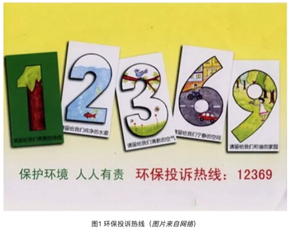
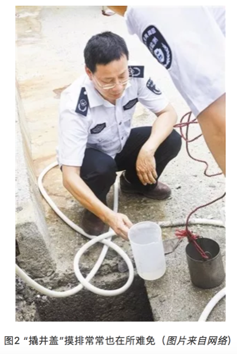

# 就业咨询

## 幻化残生

幻化残生，也就是环境、化学、材料跟生物这四大学科的近似谐音，都属于实验比例比较高的专业。这些专业的研究生生存现状都——并不乐观。

### 现状

首先，这四个学科属于建立在脑力劳动之上的体力劳动。例如前处理、过柱、表征、养细胞、涂板子、野外采样等等，流程性非常强，到时间点上不论节假日还是凌晨饭点都得待命；但有时又会发现这些工作找个本科生带上两天也能做出来。一个尴尬的事实是，实验学科一个重要研究方向就是取代人工操作实现流程自动化与便携化，当实验简单到轻轻一按时，研究生训练得到的技能瞬间贬值，更尴尬的是实现这个过程需要的背景知识是物理、机械跟电子工程而不是幻化残生，掌握某项实验技能短期可以使你取得不错的成果，但长期看几乎一定会过时。

其次，特别拼先进仪器/技术，进而导致平台建设重于人才培养。今年这个技术能发顶刊，明年就可能被取代了；有些特殊资源例如光源没有背景想约个机时难得要命，但如果不进行一些高开支实验可能编辑就直接拒稿；而先进仪器装备的价格往往奇高，所以从经济角度，这四个学科都属于很烧钱的。那么这里的尴尬就是，你的才能可能受限于仪器平台；而从研究机构角度看，投资仪器显然比投资人才培养在初期更有效果，而人才培养初期其实也就是仪器操作。这个没啥办法，现在很多科学问题的回答其实早就脱离了理论导向阶段，而是我有一个问题想回答，但目前技术回答不了，也就是假设早就有了，就等着新技术检验。你去看这些年诺奖，很多是技术获奖而不是理论获奖。也就是说，实验学科比起人才更需要仪器平台资源。

```{r}
knitr::include_graphics('images/hhcs1.png')
```

再次，这几个学科产业转化基本停留在前言里，毕业后除了年龄比同专业本科生大了不少，在满足业界要求上本质区别并不大，这进一步导致本应分流到业界服务社会的博士硕士继续留在学术界造纸，而想从学术界熬出头你看前人经验借鉴意义不大。很多人没考虑时代造就的红利窗口期而大谈特谈自己的奋斗，但要知道此一时彼一时，目前学术界的门槛比10年前高了很多，同样的奋斗强度10年前进高校很容易，现在可能去做博士后都没人要了。如果本科转行也就算了，但到了博士转行就真的是在奉献青春了，当然这可能是无法避免的。

### 前景

我们其实可以把做学术类比创业公司，博士学位前都是导师投天使轮，博士后相当于找风投，找到教职算是有投行介入吹喇叭，常任轨留下来才算上市。论文就像每年的财报，表现不好还可能停牌退市，当然不上市被收购做小老板也行，但那时候学术方向就会完全被大老板把持了。这个过程就是现状，目之所及很多人迷迷糊糊就上道了，而其中沉淀下来的所谓“人生赢家”却没有一个是迷糊的。这里我建议读下 Philip Guo 在斯坦福刚拿到博士学位后写的《The Ph.D. Grind》，虽然他是搞计算机科学的，但对幻化残生的研究生了解整体学术圈现状还是很有帮助的，很多观点也会有共鸣。

```{r}
knitr::include_graphics('images/hhcs2.png')
```

此外，我也可以给出一个基于估计的现状，如果成为院士（中国科学院／中国工程院）算达到学术巅峰的话，那么院士的选拔可以看作到达顶峰的路径。选拔方法是什么呢？两年一次，一次总共大概150人，工程科学对半分，平均一年75人。我们假定若干年后每年还是75人，且平均看每一年参与竞争的都是同年级的博士同学。而目前每年全国土鳖博士毕业生6万多人，算上海归，同一年龄组大概7万人应该比较合理。那么你看到了，你需要在同年级博士毕业生里成为千分之一的精英才算有希望。

这个似乎有点丧气，可能院士这个比较难搞，那么准院士的杰青呢？全国每年选拔200人为杰青，那么成功概率乐观估计是千分之三，杰青其实也很难了，我们再放宽到优青。全国每年选拔400人为优青，那么乐观估计成功几率大概是千分之五。我们大胆认为博士中有一半人毕业后不再从事科研工作，那么几率翻倍成为优青也要是百里挑一。即便是成为教授／研究员，我估计概率也是小于5%的，这个基数不是所有人，而是跟你同级的博士。

```{r}
knitr::include_graphics('images/hhcs3.png')
```

所以其实我挺理解很多劝博士毕业转行或毕业不做学术的看法的，那怕你手握博士学位，在国内想走到教授也是个p<0.05的事，大概20个人里有一个。考虑到一般博士同学同院系大概也就是20个人，如果学术水平不在前面，基本可以重新考虑下人生规划了，因为此时你选择科研就真的需要兴趣激发了，不然身边的落差会折磨你几十年。而且上面的估计有个严重的问题，那就是大量使用了均匀分布，但真实的情况却是极不均匀分布，你的师承关系跟毕业院校都会把这个分布搞得更加极端，而且后发者优势在科研里面非常常见。同时，目前教职数目趋稳，如果你没赶上窗口期大爆发，基本就是这个竞争强度了，只会更强不会更弱。具体到幻化残生这四个学科中的环境，虽然国家很重视，但在杰青或优青的名单中每年能分到多少个这都是一个巴掌数的过来的，各位可自行倒推下看看竞争强度。如果眼光放远些，其实别的学科的竞争压力也好不到哪去，但对于知识迭代比较快的幻化残生，很多压力与鸿沟可能你没毕业就已经出现了，更糟的是你毕了业才发现。

```{r}

```

### 求索

这些现状经常搞得研究生自身怀疑人生，看着转行金融、咨询、IT的同学心有不甘；即便可以用学术理想充实的生活把自己隔离在实验室内，但走出实验室的柴米油盐变量太多，控制不来。同时，你又会很惊奇地发现，这些年报道的学术界年轻有为的青千、优青与各路人生赢家基本都是这四个学科的；而且从经费分配跟论文影响力上看，这四个学科也是超级大户；再从经济学角度去看，你会发现围绕这四个学科的仪器、耗材甚至样品测定跟论文润色服务都已经形成了成熟产业链，行业利润十分惊人。注意，这些产业是对科研进行支撑的而不是业界，如果只是这些行业高速发展而产业界没有起色，那事实上是在用纳税人的经费吹肥皂泡，不会长久。

这并不奇怪，实验学科的知识与技术更迭速度是非常快的，从走进实验室那一刻，你就会发现师兄师姐用的技术学校里根本就没教过或仅仅做了个展望，系统的学习基本上都被传帮带模式替换。如果你自己不去问为什么，大概率你师兄走的弯路你还得走一遍，你师姐画不出的图你也画不出来。更尴尬的是，有时候你会发现，如果你的想法是属于排列组合出来的，那么其实仪器公司完全可以替你做，他们不做并不是不会，而是等着收服务费，你发你的纸，我赚我的钱，各取所需。在这个场景下如果还没意识到自己的民工本质，那大概率是要做一辈子民工的。

曾经有人提过学术界存在生态位，大家各做各的相安无事，但这个想法现在看比较天真，因为现在竞争者基本都不是来自学科内，而是其他学科的入侵，如果这个问题你自己学科的人搞不定，别的学科就会过来。例如做材料的发现一种新材料，如果你觉得意义不大不掺合短期没啥问题，但做材料的表征完了得找应用出口啊，环境、生物、化学都有，技术有自己的生命力，总有人会转过去。你是无法约束某种研究只去关注自己学科内的问题的，事实上这可能是目前科学进步的一个范式：个别学科突破，带动其他学科发展。

基础学科对新技术的接受度要快于应用学科，一个常见的模式就是某个数学模型首先应用在物理领域，然后化学，然后生物，然后是边缘综合学科例如环境、医学，然后就是社会科学。当然也存在某些从应用角度出发的模型后来被应用到其他领域，金融与生命科学中经常出现这样的案例。但你应该发现一个问题，要想解决现在的问题，通常老路是不通的，要么回归基础学科，要么从别的学科借鉴，不论哪一种都需要你持续学习新知识，特别是外学科知识。有一个最简单的办法就是你去看看那些最聪明的人在用什么，然后想想能不能用到自己的学科框架里。

```{r}
knitr::include_graphics('images/hhcs5.png')
```

实验学科的发展有时候是很残酷的，初期势必牺牲掉一批掌握过时技术的研究生，这个国内外都很常见。通常国外业界会吸收一部分且通过较成熟的职业教育与培训体系来解决问题，国内则是依靠学术界大面积收留；这个问题的后果就是现在很多教授对于学生无力指导，看到概念就回来让研究生试，研究生自然苦不堪言，毕业后就业方向非常窄。但同样是实验学科，高能物理、生物统计的毕业生转行就相对容易些，因为可以去做码农，至少生活水平对得上学位。而很多实验学科的研究生对此并不感兴趣，甚至完全不懂，思想上停留在努力实验发论文拿教职的简单规划上，不喜欢接触社会就只接触仪器。这其实是最大的偷懒，科研是需要脑力持续投入的，如果是实验学科还要加上体力。不但要持续学习，还必须要主动学习，关心前沿，而这又与繁重的实验任务竞争着的研究生们的精力。在前沿知识的探索中没有固定的方法与理论，经验主义横行，也恰是前沿科研的魅力所在，混杂了无穷的乐趣与苦涩。

### 前沿

学科前沿是一个很模糊的东西，对幻化残生而言，教科书上的实验技术是一定落后于科研的，此时对学术前沿的感知往往要么来自文献，要么来自会议或培训，坦白说，这两个方法都具有很强的主观性，夹杂很多人的小算盘。好比你想在微信里打开淘宝链接，不是不行，就是要通过复制过程恶心你一把，但其实这种经验过程你也没啥办法。

除此之外，还有一个方法是各种文献信息学指标，例如H指数，被引率等等，但这些指标属于后验指标，你得至少等文章发表过去两三年才能开始评价，但这两三年中也会有一大把新趋势出现。另外一个方法就是自己当期刊编辑或审稿人，其实这个是很多教授的独门秘笈，因为你会比其他人早好几个月知道新研究的动向，但研究生拿到的审稿机会本来就少，高水平期刊更是不会找研究生审稿。所以其实对于很多研究生而言，想了解前沿跟他人的研究动向几乎不可能，而根据我的观察，如果同行坐到一起聊天你对新动向一无所知，那么对方也就不会在你身上浪费时间了。有些出版方跟研究机构也会发布一些热点文章，但多数基于编辑经验，并不一定准确。一个相对靠谱的方法是借鉴搜索引擎排序的思路，通过文本分析的角度从统计模型上探索趋势，这里并不是说那种通过词云这类描述性统计量，而是基于主题模型、时序分析等手段的探索分析，但手段其实是次要的，是服务你的问题的，如果问题没搞清楚，用什么都是错的。  

```{r}
knitr::include_graphics('images/hhcs6.png')
```

其实，对于幻化残生的研究生而言，主动了解科研趋势只是一方面，了解你自己才是更重要的。当你觉得不好时，不要总是怪罪时代跟环境，也想想自己身上的问题；当你一帆风顺时，不要总觉得这是自己勤奋与努力的结晶而忘记了科研浪潮的背后推手。随波逐流不会过的太差，但放弃思考是绝难在学术界生存下来的，不要真的幻化残生了。

师兄只能帮你到这了，剩下的，我也没想明白。

本文首发于我的科学网博客（yufree），改编首发于环境黑板报。

作者：yufree
编辑：栟

## 在设计院工作是一种怎样的体验

### 毕业这几年，我都干嘛

自2013年6月毕业，我已踏入职场四年有余，最初的一年半在首钢鲁家山垃圾焚烧厂当技术员，想那时，真是躲在荒无人烟、连农田都看不到的山区，一心只想烧好中国人的垃圾。

```{r}
knitr::include_graphics('images/sisi1.png')
```

后来因缘际会到了现在的设计单位，主业是垃圾焚烧发电厂的设计，在业内还算知名。虽然角色不同，但上手还算比较快。一晃三年过去了，在设计院忙忙碌碌的加班生活还是比较充实的，毕竟还算得上适合自己的工作。可能大家对我的工作了解不多，就让我给大家介绍一下。

### 我理解的设计院

设计院，不管叫咨询设计院还是设计研究院，其实本质上大约都可统称为画图院，虽然可能某些设计院可能会有一大批做前期，比如规划、可行性研究、环评等，可如果你敢称自己为设计院，我相信你的主业一定是画图的。不得不说，设计院这一称谓原本就有浓浓的社会主义经济的气息，虽然多数设计院早就走上自负盈亏的市场化道路，在许多设计院里仍然可能看到国企式办事准则的影子。

就说画图，作为设计狗的我，也不是什么都能画的出来的，我们的专长是画垃圾焚烧方面的管道，你让我画个房子，我是没有这个本事的，那是结构建筑专业的事；那你说让我把你屋里的暖气管，水龙头，淋浴头画下，我也只好尴尬的说，那是暖通和给排水专业的事，我也不会干。进行到当下的信息时代，多数行档的设计院已经发展到一个极其成熟的规范化状态，工作如流水线一般。

现在大的设计院的专业划分都极其细致，除了总工，其他人可能都是螺丝钉，可即使是总工甚至行业大拿，也不可能做到各个专业门门通，大家各司其职。有时候参加的一些项目，直至项目完工，可能项目组的成员都还没有认全呢。

### 设计工作不是一蹴而就的

作为普通的设计狗，每天的工作就是画图，但画图不能瞎画，得有依据，要满足客户的需求，需要审阅业主的任务书；如果你是配合专业，就需要接受上游专业的要求；同时，政府的相应文件（环评报告，能评报告，稳评报告，审批报告）和现场实地条件（地勘报告，工程场地自然环境，水土保持状态，场地供排水状况，电网接入条件）也对我们的设计起了约束性作用。像我们是机务专业，平时还要接触不同的设备厂家，不仅要向他们提自己的工艺要求，还要接收他们的要求，交流一定是双向而反复的。不同专业的侧重各有不同，但总归是在做一道优化题，可遗憾的是我们经常没有找到全局最优解，而只找到了局部最优解，在解题的过程中经常就是与时间赛跑，与各方交流甚至争吵中度过的。以下是我以前项目某一图册的截图。

```{r}
knitr::include_graphics('images/sisi2.png')
```

如果蓝图完成，这个项目的工作就相当于告一段落了，当然也不是万事大吉的，业主也能再让另外的公司（项目地的相关企业，同行业的竞争对手）对我们的工作进行审查，发现问题还会要求修改完善。施工前主要的设计人员还要到工地现场进行交底，就是把自己的工作交待给相应的施工单位，解答他们的问题。下图就是在广州某项目拍到的现场施工场面，当天我向施工单位进行了交底。

```{r}
knitr::include_graphics('images/sisi3.png')
```

施工过程中，出现问题，业主会要求监理单位出具工程联系单，我们就需要提出解决方案，并发出设计变更单；即使设计人员个人认为没有问题，但如果业主强行要求，许多情况也不得不出具设计变更。不能小看了这几片纸，只要出了变更单，施工单位就能用它向业主要求增加费用，许多施工单位甚至采用投标前低价竞标，中标实施时通过多出变更单盈利的工作方式来实施项目。

举某个例子吧，某施工单位做了一个4000万标价的项目，最后做下来亏损了300-400万，但通过变更增加费用，能多得1000万，最后才净赚了700多万。

到了工程快完工的时候，我们还需要根据变更的状况出最终的竣工图，也宣告这一番折腾终于结束了。但不要高兴得太早，因为领导是见不得我们闲着的，你还没长舒一口气，新的工作就来了。但更常见的情况是，你同时要面临几个项目，担任的角色即使各有不同，其中一个的结束并不能给你的工作带来太多变化。

### 我对设计工作现状的理解

现在设计这一行的确也是越来越难做，钞票也越来越难赚。原因有很多，有内部的也有外部的，我个人认为更多来源于外部，环境的变迁远比设计院自己内部的变化来得剧烈。

首先，投标报价阶段设计费压低得太厉害。设计院是每个工程必须的单位，但许多业主是看不起设计院，主要原因是现在许多同仁把整个环境搞坏了，相互压价，却不重视设计自身能力和效率的提升，只能让基层人员通过加班或用一些新人来练手来填平这一亏空，效果当然不乐观了。

其次，业主一直在学习，在进步。业主也加强了专业的学习，一直在向前迈进，甚至大量招揽有设计背景的人才，如果你某天从微信朋友圈上看前同事说自己换到业主单位上班了，你千万不要奇怪，这也使得设计院在工作上的智力或信息优势在许多行业都不复存在。

第三，业主要求越来越高。从时间上来讲，要求今天的事今天就办，不然就扣钱或都让你直接来现场处理。虽然大家对此颇有怨言，但只要是想在这行干的，都还是想自己的单位能多揽活，毕竟，大家无活儿的时候，也就是树倒猢狲散的一天。下面是某业主给我们单位发的两份函件的截图，有没有感觉业主的杀气腾腾呢？

```{r}
knitr::include_graphics('images/sisi4.png')
```

第四，设计需整合多个功能。从技术角度，现在许多工程不仅仅只是一个工程，尤其是我们做垃圾焚烧厂的，本身就有教育和参观功能，把一个工业化的建筑变成了一件工艺品来雕琢，这就给我们的工作带来了新的挑战，你原来只是个画平面或立面图的，工程经验丰富却无艺术家的气质，但现在你得有，这会让你们的设计更具优势。下面的主厂房是我们公司在宁波的一个项目，外立面做的非常漂亮。其中上面两幅图为鸟瞰效果图，下面一幅图为施工完成后的实景图。两者效果还是很接近的，但美中不足的是部分区域的灯光有色差，留下一点遗憾。

```{r}
knitr::include_graphics('images/sisi5.png')
```

第五，设计师责任意识增强了。有设计师就因为错误的设计受到了刑法的制裁（举例如近一段时间在工程师微信朋友圈里热议的合肥公交站倒塌事故，相关的设计负责人就被刑拘了，虽然网上为她鸣冤叫屈的同仁不少，可说到底即使是主要责任不在设计方，连带责任也是逃不掉的），这点毋庸置疑，如果没有责任意识，做出来的工程质量实在没有办法保证。如果自己都不敢在自己的设计上签上自己的大名，估计谁去施工、运营都不会太放心。

### 我理解的设计院未来

近年来设计院招人呈现两极化趋势，新毕业学生进单位普遍比较难，要么要求名校，学历，要么就是得走关系，提前实习；但设计院想要的人多是能力强，经验丰富，能迅速上手干工作的人，这种的招揽并不是那么容易的。一些大院经常开出很好的收入，但经常也招不到合适的人，许多单位人员流动性也很频繁，甚至影响了工作质量。

年轻人做几年设计一步一步向上爬，做得好做升为专业负责人，接着是项目负责人，再往下只能惦记下所长，所总工的位置。但一个设计院少则三四十人，多则百人千人，领导就那么一点比例，也是很困难的。而多数设计院除了少数大院，许多是扁平化管理，上升的阶层并没有那么多，你会经常看到自己的领导背个书包去出差，亦或是晚上熬夜出方案，更加能感觉领导不过是能管人的设计罢了。工作到退休的时候，许多老同志会愿意返聘回单位，给年轻人做做指导，忙得时间太多了，反倒闲不下。给人的感觉，设计院不似计划经济时期那么让人能安稳地做设计了，但如果你想做得好，有一份沉静稳重的心态是非常重要的，毕竟这个是需要你勤加思考的工作。

现在许多设计院也在转型，某个知名钢铁的设计院甚至想触及养鸡厂的设计，大家别笑，最后的结果是他们发现自己可能真做不了。垃圾焚烧行业不是现在很红火嘛，许多设计院也想分一杯羹，动手早的还有希望，动手晚的只能看别人摘葡萄了。设计行档是遵从经验和历史的，规范大家都有，但照本宣科就能做好设计是不可能的。这也使得设计行业具有一点投机的味道，做得早就奠定了在这个行业的优势，近来，PPP模式、海绵城市、综合管廊在市场上叫得很火，各个设计院也具此拨出人来进行相应调研，积极参与新形势下工程项目的设计工作，积极拓展业务。

路不能越走越窄，学会与时俱进方是生存之道，权当以此为结语，若是你需要设计垃圾焚烧厂，记得联系我，尽管我只负责摆设备和画管道。

作者：小祁
校稿：看透，胜利屯屯长
编辑：智公子

## 科研与钱

上学的时候还是很单纯的，真的以为做科研就是做科研，以为这就是象牙塔，虽然也会帮老板们写项目申请书，毕竟感受不到实打实的项目压力。反而是在毕业后，跟组里老师还有清华的老师一起共事的过程中，能够感受到他们对于科研经费争取的压力，没钱还怎么做科研。现在回头看看，当年老板们还是为我们能好好在这里学习科研付出了很大的努力，每年课题组的人头费都是不小的压力，所以现在还在读书的师弟师妹们，珍惜最后的几年时光吧。

——爱杯子的王小咖

### 先说说科研经费

经费是搞科研永远也绕不开的话题，就像上面所说的，没有钱，如何开展实验呢?其实仔细想一下，钱这个东西，放到社会哪一行都不会是个可以轻松处理的问题。

科研经费来源，不过是纵、横两项，可惜的是这里的纵横可没有纵横捭阖的潇洒。纵向经费就是来自国家的课题，且不谈后面花钱的时候各种限制、各种审查，申请的时候对内容和形式的要求也不亚于当年的八股取士。横向经费就是来源于企业的项目，比如说第三方检测、技术转化等。这个钱花起来就方便多了，因为服务对象是企业，有明确的任务性，企业要的只是你能达到当初许诺的要求，至于合同里面钱怎么花，它们是不care的。

纵向课题的钱虽然难花，一般的项目钱也不多，但是否主持过纵向课题常常会和科研人员的职称评定息息相关，职称又对应着待遇和名声;横向课题的钱虽然好花，但是通常只是解决问题，研究的深度方面一般很难出很好的成果。这时候不禁有好事者要问了，难道就不能在解决实际问题的时候发现研究的价值，然后在深入研究的时候出国家级、世界级的成果，最后又能应用指导于实践呢?恩，有当然是有的，不是还有句诗叫“不负如来不负卿”嘛，有几个人能做到?

### 国家鼓励科研人员创业

当国家出台这个政策的时候，下面的发声是不同的。比如说施一公就曾说过我们目前欠缺的并不是技术转化，而是我们的技术根本达不到转化的程度，同时，科研人员去创业其实也并不明智。而高晓松也曾在节目说，名校是镇国重器，培养的人才不应该只局限在找一个好的工作，要有更大的胸襟。这满满的鸡汤，当然对，也未必都对。成功的路无法复制，大佬们的话，听听就好，太当真你就输了。

```{r}
knitr::include_graphics('images/kq1.png')
```

认可的一面，搞研究都是有科学与工程之分的，你让搞理论研究的一群人跑去拉横向，搞转化，这本来就是强人所难。同时，科学家应当有一点担当和骨头，因为科学家毕竟不是政客也不是商人。科学家应该是什么样子呢?我研究生室友(一个读博期间发了七八篇IF>5的文章，写《纳米非米》的那位)曾跟我说过一个故事，他参加过的一次毕业答辩，请了一位老先生，老先生来的时候，抱着那天要答辩的几个人的纸质版毕业论文，颤颤巍巍地说，这几位的我已经看完了，需要修改的都在上面做了标注，还有几份我实在看不过来了，跟你们先说一下。

汗颜吗?我所经历的几次答辩就好像小孩子在过家家，达到毕业要求，大家按照流程行事，最后皆大欢喜。这个世界，你当然可以有一套自己钻研出来的规律在里面游刃有余，但这并不是世界需要价值统一的地方。毕竟“文章千古事，得失寸心知”。我当然也知道长袖善舞的人在哪个行当都不会混的太差，但问题就在于，这个世界的诱惑实在太多，一旦你走向聚光灯下舞起了长袖，是否还能记得住自己最开始的一些想法。而更大的危机是，很多的科研人员从最开始就不知道自己的想法，他们贪图的不过是科研圈的安逸。

```{r}
knitr::include_graphics('images/kq2.png')
```

因此就要看到刚刚那些鸡汤不适合的一面。那就是目前中国科研背后的现状：转化难产。虽然很多的工程研究标榜了各种各样的创新，也发了一堆的SCI，但其实，这些论文的最大贡献不过是推动了造纸事业的发展。碳纳米管的确高大上，但几个人用的起?电辐射、电氧化处理废水确实干净，几个水厂能这样干?唉，更不要说还有一群玩概念科学的人了。从这个角度来讲，国家所期望的不过是拨乱反正。毕竟，我们距离把科学技术转化为生产力还有很远的距离。

所以说还打着我们科研圈子就要不食人间烟火的口号就显得不合时宜了。因为我们不仅没有好的基础研究可以转化，我们甚至都没有往这个方面去想。再者“鼓励”你去，并不是说，“逼迫”你去。想不想和行不行总是人，尤其是男人要面对的大问题。

### 横向的去向

我并不认可大家对科学家的想法，要么是傻子要么是疯子，人足够专情的时候，都很傻，足够坚定的时候，都很疯。我更不认可一个社会观念，就是搞科研的人就应该甘于清贫。他可以选择清贫度日，但你不能认为这是理所当然。因此，我是主张把那些“镇国重器”啥的都收一收，能做横向就做一些。一旦一个人可以实现财富自由和时间自由，他的思绪是可以飞翔的，毕竟贫穷限制了我们的想象嘛，而科研人员很需要这个。

这时候，就需要去辨明一个问题，一个东西到底是手段还是目的?比如说，斗争。斗争是为了作为一个手段，让整体有一个更好的发展;还是作为目的，去清除掉意见不合的人?纵看古今，横看中外，搞不清这个问题的，最后都只是倒历史的车轮。同样，搞横向赚钱，究竟是作为一个手段，还是一个目的?尤其是改善了自己的生活，可以自由探索以后。

这就涉及到一个价值取向问题了，看你认可的东西。你当年选择了搞科研，就应该知道自己的收入和金融、IT行业差的不是一个级别。可是你总不能拿自己的短处去跟别人的长处比吧，尤其你对象天天叨叨你的时候。这个时候，情怀和价值观就显得非常重要了，简直就是精神吗啡。

```{r}
knitr::include_graphics('images/kq3.png')
```

突然一天，你横向做起来了，你成暴发户了，你土豪了，你……还能记起科研的初衷在于探索未知世界的乐趣吗?如果不能理解这个问题，你就该知道，你把做横向的情商拿去搞金融，你早就和马云、健林一起指点江山了，是科研拖了你后腿。

于是又有好事者问，站长你现在科研到什么地步了?恩，隔壁工头又叫了，先回去搬砖了。

作者：广播站王站长
编辑：竹而乐

## 中文学术和研究生教育

### 前言

我本科就读于环境科学专业，硕士考进去的时候也是环境科学，但是毕业时却阴差阳错地变成了分析化学专业。毕业后的第一份工作又进入水利行业，如今却成了一名期刊编辑。我的专业跨度虽然看起来很大，但其实始终没有离开“环境”这个大专业。我的分析化学是环境分析化学，在水利行业也是从事水质检测，如今编辑的也是环境类的学术期刊。个人的一些琐碎经历暂且不说，作为过来人，我想从一个编辑的角度来谈一谈目前硕士生培养中可能存在的问题。当然，我的看法也许非常片面，对于很大一部分人来说，可能是班门弄斧或者是老生常谈，献丑了。

很荣幸，本科和硕士阶段遇上了两位非常负责的导师，时至今日，他们的指导还让我感到受益匪浅。本科的导师曾对我们说，一名硕士生只是刚刚踏入学术的门槛，所以对其的要求应不同于博士，首先是应该让其了解如何做学术，而不是研究的有多深入。

众所周知，国内绝大部分高校硕士毕业的硬性要求是发表1篇国内核心期刊论文（个别学校不做要求或要求更高这里不作讨论）。从我们杂志社的稿件来看，我发现很多硕士生（当然也不乏第一作者是博士甚至是教授副教授）撰写的学术论文中存在一些非常普遍的问题，这很值得拿出来和大家探讨一下。

总体感觉，很多导师并没有尽心尽责地指导一名硕士生。我猜测原因可能是多数导师对于中文文章不够重视，因此不是很负责任，发中文文章只是为了让学生能够满足毕业条件。导师尚且如此，更不要说学生们了。而对于部分有追求的学生，虽然“师父领进门，修行靠个人”，但是师父连门都不领进的话，除个别天才外恐怕是很难自己完成修行的。这也是为什么国内中文学术期刊面临着稿源质量堪忧的问题。

```{r}

```

### 那么为什么我会有这种感觉？我看到的这些文章到底存在什么样问题呢？

第一，写作目的并不明确。

学术论文的目的本应该是把自己最新的研究成果公诸于世，与同行交流，不断地推进该领域的研究进步。但是，现在可能目的仅仅是为完成毕业要求或者职称需求，这其实是舍本求形。

仅以环境实验科学为例，从选题到实验设计到数据处理与分析，最后撰写论文，经过同行评价，公开发表，是为学术研究的一般过程。那么，这个过程是否已经了解，从他的论文中基本可见一斑。一篇中文学术论文，通常包含标题、摘要、关键词、引言、材料与方法、结果与讨论、结论和参考文献。很大一部分硕士生毕业了可能都不知道为什么要写这些要素。所以我觉得，硕士生导师首先应该指导硕士生将这几个要素弄清楚，明确每一个部分分别是什么目的。这些如果指导清楚了，其实学术研究的整个过程也就指导清楚了。

```{r}

```

科学研究的第一步是发现问题和提出问题。因此，文献调研在科学研究的过程中必不可少，在前人研究的基础上找到研究意义与当前热点，在热点中发现需要进一步解决的问题。发现问题后，进行实验设计和验证，具体来讲，实验的整体思路是否合理；变量控制是否得当；以及实验过程中容易出现操作失误的细节等对于一个训练时间不长的硕士生来说都是一道道需要跨过的门槛。这就需要导师给予必要的指导和指正，指导和指正的过程其实就是从理论到实践跨越的过程。如果缺乏必要的指导就会出现做完实验不知道为什么做；做的过程中不知道实验的风险点在哪里；做完实验也依旧茫茫然不知所措，这其实很难进入科学研究的大门。实验完成后就是数据资料的整理、分析以及学术论文的写作。数据的处理会涉及到软件的使用或者方法的开发，这些可能是一个师门里代代相传的东西，虽然软件和方法可以依靠师兄师姐们口口相传，但是当年创制这些方法时灵光乍现的想法以及方法学背后体现的原理和思想其实更应该是一个导师传承给学生的。

```{r}

```

第二，逻辑常识存在问题。
这其实涉及了从小学到研究生阶段学习过的方方面面的知识。有时，看似都知道的东西，在学术论文的写作过程中也会出现各种可笑的问题。如果导师在硕士研究生写作过程中认真负责的指出这些早已学过的知识和问题，就能使他们的认知产生飞跃，而不至于出现一些啼笑皆非的低级错误。

```{r}
knitr::include_graphics('images/edit4.png')
```

第三，语言表达能力欠佳。

许多研究生论文写作的语言组织千篇一律，讨论分析阶段的阐述能力还停留在高中语文水平甚至还有退步。一个受过十几年高等教育的学生进入社会后，居然连一篇本专业的科普文章都写不出来，这不能不引起我们对平时论文写作的思考！

```{r}
knitr::include_graphics('images/edit5.png')
```

中文期刊的学术水平是否应该提高，是否应该与国外期刊去比较和竞争，这里我不做讨论。我想强调的是，在语言便利的情况下，中文期刊至少应该成为硕士研究生科学研究训练的基本阵地，起码起到通道的作用将他们引入科学研究之路，这就需要导师正确看待中文期刊，摆正对研究生培养的心态。

### 那么学术论文到底该怎么写呢？

如果前面这些工作都能很好地完成，暂且不去考虑创新性有多少的问题，仅从学术论文写作的角度来考虑，论文该怎么写呢？其实很简单，把论文的各个要素像流水账一样写下来就可以了。

引言阐述清楚相关领域的最新研究进展，发现问题，提出自己的设想；

材料与方法讲清楚作者自己的研究方法；

结果和讨论，其实就是对所获得的数据资料进行分析、提炼和总结。


值得注意的是引言与讨论的写作逻辑是相反的，引言是从大放小，从研究重要性讨论到具体做什么，而讨论则是从小到大，从具体实验结果到对学科共同体的贡献。这样基本就把学术论文的逻辑结构和顺序问题解决了。

作为一名中文学术期刊的编辑，我可以接受中文文章的深度和创新性略逊色于英文论文，或许英文的传播力可能更为广泛。但是对于中文文章的写作、思路和目的应该完全与语言是没有关系的。不管是导师还是学生，如果中文文章的每个要素的目的不明确，那么只能说明你根本没有跨入学术研究这个门槛。如果是因为态度的问题，那么不管你外文文章写得有多好，学术造诣有多么高，我想这其实也是件蛮可怕的事情。

此外，英文期刊内其实也存在鄙视链，期刊分区与影响因子对投稿人也有很不好的引导。有时候会出现分区靠后或影响因子较低的期刊无人问津，甚至有些有缺陷的论文投不了所谓顶级期刊就全投到这类期刊了。但问题在于，错误的实验设计与跑偏的科学问题无论放到哪里都不会有人重视，条理清晰的论文总是容易受到关注。研究生阶段不应该在文章质量与期刊影响力上产生理所当然的联系，毕业压力不会跟你一辈子，但你发表的论文上总是有名字的，如果存在显而易见的缺陷，说不定哪天就在新语丝上被方舟子曝光了。

总之，不论做什么吧，态度很重要。

作者：伯腾
校稿：yufree, 大石
编辑：智公子

## 基层环境行政执法工作简介

通常来说，生态环境保护领域的法律、法规、标准一般都由“县级以上人民政府环境保护主管部门”监督落实，而县（区）一级的环境保护部门，是生态环境保护工作中各项法律、法规、标准的“执行者”，在整个生态环境保护工作中扮演着最重要的角色。一般而言，县（区）环保部门主要由局机关及下属的环境执法机构、环境监测机构组成，如果用人体的某部分来形象说明其中的关系，那么局机关可以算是人体的“神经中枢”，执法机构则可以看成“牙齿”，而监测机构就成了雪亮的“眼睛”。本文结合笔者对环境执法工作的实际了解，着重介绍一下县（区）一级的基层环境行政执法情况。

### 1.执法队伍组成情况

县（区）环境行政处罚权一般由县（区）环保局委托给下属的环境监察大队行使，在需要监测的时候监测站也会派人配合。各地的监察大队人数、年龄结构、专业背景不尽相同：人员数量组成上，有的仅有2到3人，有的多达20到30人；年龄组成上，有马上就要退休的“老环保”，也有刚刚大学毕业的年轻人；专业构成上，环保类专业的有，生物、林业、化学等相近专业的有，法律、历史等专业的也不少。随着国家对生态环境的重视，加快推进执法队伍建设将是未来各区县重点工作之一。

### 2.执法队伍的主要工作

县（区）环境行政执法机构的工作繁多，其中主要工作一般包括处理各类投诉、处罚环境违法行为，同时还可能承担应急处置等职能（地市以上的环保部门一般有专门的环境应急机构，县（区）一般都由监察大队兼职）。

#### 2.1 投诉处理

```{r}

```

目前，常见的环境污染投诉方式包括：电话（12369专线、各类公开电话）、网站（各级各类政府网站专栏）、微信、微博以及传统的来信等，这些投诉最终都会按程序转给监察大队去处理。引发环境污染投诉的原因有很多种，可能是在家里闻到了臭味，可能是在河边散步看见了污水流到了河里，也可能是半夜睡觉时旁边工地还在浇筑混凝土......不同的投诉就会有不同的诉求，可能是要求不打扰自己的正常生活，也可能是要求工厂搬迁，或者是要求给予赔偿，等等。

接到投诉处理任务后，执法人员必须到被投诉单位现场调查、了解。那是不是执法人员开个执法车、穿套执法制服就能如天神降临一般突然出现在违法企业、抓他们排污现行呢？NO,NO,NO，很有可能你连人家大门都进不去！看门的大爷会说“我不认识字，你们是干什么的？”“有没有预约？”“老板说了，他不出来接，我们就不能开门”……最经典的是当你问员工老板的电话时，他们的统一回答是：“我不知道，我昨天才来上班的。”就算进到了厂区，你可能看见的是废气、废水这些污染防治设施全部都在运行、固废也按要求堆放、台账记录也很规范等等。但是，有可能你的脚下就埋得有一根暗管、有可能你没有来的时候他们设施完全没有开、也有可能危废台账存在造假.......那怎么办呢？可以仔细检查各类档案、台账。具体来讲，执法人员进入厂区后，需要对企业的环评手续、排污许可、污染治理设施等方面进行全方位的检查，执法人员需要携带影像设备、测距仪、流量计、勤务随录机、便携式打印机、环境执法管理及移动执法系统、标准采样设备等必须设备和仪器。如果有需要，还会核查电费单据、水费单据、生产记录等资料。当然也有可能会沿着管网撬开每一个井盖进行摸排，以查清投诉是否属实，这些 “下河”“翻围墙”“钢钎撬下水道井盖”的绝技向来都是“传男不传女的”！

```{r}

```

#### 2.2行政执法

如果执法人员在处理投诉或者日常监管过程中，发现被投诉企业或个人确实存在环境违法行为，那就得固定证据，严格依照法定程序对违法企事业单位或个人进行立案查处，并责令其改正环境违法行为。

但是，环境行政查处并不是直接在现场就开具罚单，需要严格履行一整套行政处罚程序，既要保证实体合法，又要保证程序合法。以企业超标排放污染物为例，环境行政处罚一般流程包括以下几个步骤：第一步案件立案，若已有证据（比如监测报告）能表明涉案企业涉嫌环境违法，经审核符合立案条件后就可以立案。第二步调查取证，制作调查询问笔录，了解企业基本情况、生产工艺、产排污环节、当天采样情况以及超标原因等，同时收集企业营业执照、环评批复、排污许可证以及陈述申辩材料等佐证材料。第三步责令改正，根据法律法规要求，对环境违法行为进行处罚的同时必须要责令企业改正环境违法行为。第四步处罚告知，行政处罚做出前要保障企业享有的陈述申辩、举行听证的权力，且不能因为企业提出了申辩或者听证而加重对企业的处罚。第五步决定处罚，经过集体研究后向企业下达处罚决定书，同时告知企业享有行政复议和行政诉讼的权力（即企业若不服本次处罚决定，可以在60天之内向上级环保部门或本级人民政府提起行政复议，也可以在六个月内直接向人民法院提起行政诉讼）。第六步处罚履行：没有异议的，企业直接改正违法行为，缴纳罚款；有异议的，企业提起行政复议，由复议受理机关裁定，或者是企业直接向人民法院提起行政诉讼，由法院判决；如果企业在法定期限内既不提出复议也不提起诉讼的，由环境执法机构提交人民法院申请强制执行。第七步案件结案：自觉缴纳罚款、法院判决生效或者提交人民法院强制执行后，本次行政处罚就完成结案。

```{r}

```

#### 2.3环境应急

投诉处理和行政查处属于环境监察大队的日常工作，除此之外，还可能会遇到企业起火、油罐运输车侧翻或重污染天气等突发情况，这些情况往往是突然发生、高度被关注、急需稳妥处置。接到此类事件报告后，第一要务是应急处置、减少人员财产损失。以火灾为例，要第一时间拦截消防废水，防止消防废水携带油污等污染物进入外环境，且需同步开展应急监测，为接下来的应急处置提供一手数据；第二是要及时向本级政府和上级环保部门上报突发环境事件应急信息，包括事发企业名称、行业、事件起因、目前态势、人员财产损失等情况，供应急处置决策参考；第三是要采取合适的方式通报周边可能受影响的人，必要时还要考虑进行人群疏散。当事态基本得到控制，环境污染得到基本消除后，应急现场处置工作暂时告一段落。

```{r}

```

现场处置结束后，还有后续工作要开展：一是要做损害评估，就是要找第三方机构来评估突发环境事件造成了的经济损失，包括直接经济损失和间接经济损失；二是损害赔偿，比如说某个运输硫酸的罐车翻到池塘里面后因硫酸泄漏导致鱼死亡，该运输公司要依法赔偿池塘主的经济损失；三是调查追责，还是以拉硫酸的车翻进池塘为例，要调查交通管理部门危险货物运输许可发放情况、安监部门对危险化学品监管情况、环保部门对运输公司应急预案备案情况等... 

### 3.结语

投诉处理、行政查处以及环境应急，只是基层环境行政执法工作中的一部分；而执法工作也仅仅是基层环保部门众多工作的一部分而已。生态环境保护工作是一个复杂、复合的事物，既涉及自然科学，又涉及经济分析，还涉及社会管理。单单靠环保部门去做远远不够，需要靠全社会的共同参与，才能真正把环保工作做好。希望大家能共同努力，从点滴做起、从小事出发，各部门能更好的履行环境保护监管责任，企业能更加严格地执行国家环境保护制度，公众更大程度的参与环境保护，那么“天更蓝、水更清、地更绿”的美好生态环境目标也将实现并能更好的持续。

作者：小小小屁孩儿
校稿：看透，胜利屯屯长
编辑：丫头晚安

## 去国外做科研？先了解下环境吧

### 引子

出国工作已经快两年了，时间过得真快！这近两年来，先后在捷克共和国和澳大利亚做科研工作，一方面为项目不停忙碌，一方面在想着怎么出成果、发文章、以及下一步如何发展。在国外（这里的国外主指西方发达国家，下同）做科研的近两年中，感觉研究硬件（仪器设备、分析平台）和软件（时间管理、学术交流）上和国内还是有所区别。硬件方面，国内许多地方平台已超国外，但似乎利用率不高，而且对仪器维护管理不够重视。软件方面，国外较国内更重视时间管理和学术交流，但做事情速度不及国内。

本文主要讲讲国外科研的时间管理观念。

```{r}

```

### 长期工作计划

在西方国家，科研工作者非常重视计划。

我所在的科研组里，年初都会将未来一年需要做的主要事情逐月列出来。研究组长给我们看了他的计划表，哪个月份开会，哪个月份矿山试验，哪个月份项目总结等都很清晰。在组长的建议下，我在1月份花了一天的时间做计划，根据实际情况，清晰列出每个月需要完成的任务。当然，我既要完成项目要求，又要把握基础科研问题，比如就微生物与矿物作用机理方面展开若干研究，尽可能详细可行。后来组长也将我的计划与他的计划综合起来，进行规划。

这个计划虽然比较宏观，但至少，当做完逐月的计划单时心情是愉悦的，因为在这个过程中对未来12个月的使用有了一个纲领性的思考。当然，有人会说，“计划赶不上变化”，事实很多时候也是这样。但有了一个大概的表，会不至于因迷茫而浪费时间，因为当松懈下来的时候，这些表会告诉自己该做什么了。

记得在国内做学生的时候，每年也会做个计划，但都是非常笼统的计划，当任务一样交给导师了。所以时间利用不够合理，在年底的时候往往非常忙碌，加班加点到通宵工作的事情时有发生。

```{r}
knitr::include_graphics('images/osre2.png')
```

### 短期工作计划

西方国家一个很大的特点是做任何一件事情都需要提前预约。

如果开展一个实验，一般需要提前好几个月去准备，比如一个小小盆栽实验，尾矿准备，植物种子育苗，营养液准备，温室台面使用预约，还有安全培训（澳洲做什么都需要安全培训（INDUCION）。比如需要用到温室，就需要提前预约，然后有专人讲解这个温室的构造，需要注意的安全和环保事项等）。

很多培训都需要至少提前两个星期去准备。因为这些都涉及到与人打交道，需要预约时间。我们试验的尾矿，都得从澳洲某矿山运回来，在特定仓库中心储藏，有专人管理，如果需要取用，就提前联系负责人，然后约车过去取。在取之前需要做仓库中心的安全培训（要去现场接受安全培训，通过之后方可进入仓储区域）。

试验药品订购很慢，源于较慢的快递速度，西方人力成本高，快递速度简直“蜗牛”，这与国内差别甚大。我之前订购了些铁化合物（硝酸铁、氯化铁、硫酸亚铁之类），足足等了三个月才收到。这个在国内读书的时候是很少出现的，记得在国内读博士期间，我们有时候“很任性”，比如临近做实验了，突然发现缺这个少那个，然后一个电话打给供应商，让尽快送来，很多时候普通药品当天就送来了，这在澳洲和欧洲一些国家几乎是不可能的。

去年刚来昆大工作的时候，因为可能做一些分子实验，用到另一个研究中心的实验室，所以需要做那边的培训。由于那个实验室经常会处理一些废水（包含医学废水），所以要求试验者必须已接种上一些必要的疫苗（比如乙肝疫苗）。可惜我以前接种的疫苗未达要求，于是费了好多周折，终于在培训计划开始后第10个月的时候接上了所需要的疫苗。但以前已做完的培训此时又需要更新，所以直到现在也没能够通过安全培训。幸运的是有几个同事和学生可以帮忙在那个实验室做一些分析。

所以，在国外工作，一定要提前计划好，如果没有注意这一点，效率可能会非常低。

```{r}

```

### 时间利用观念

在博士期间，很多时候都是起早贪黑，所谓“科研狗”，起得比鸡早，睡得比狗晚。我也见到不少“夜猫子”（包括我自己），这些人在白天工作时间，谈笑风生或是被各种电脑网页里弹跳出来的新闻所吸引。等到夜深了，回顾一天的生活会有一种惭愧感，于是开始奋发工作到凌晨直至通宵达旦。

来到国外后发现，老外时间观念普遍很强，晚上实验室和办公室都是漆黑一片。和老外预约时间都是精确到分钟，一般提前几分钟过去，不要过早，也不要迟到。

我在2016年五月份去德国亥姆霍兹地学研究中心（GFZ）面试时有一个切身经历。之前已经通过了两轮面试，第一轮在二月份，和那边教授skype视频聊意向，第二轮在4月份与那边课题组成员在网上面试，后来教授又通知我去德国面谈。对于那次面试，我也准备了很多，认真看了她们组发的文章，准备了一个博大的PPT，甚至也专门花精力去了解组里每个成员是做什么的。我前一天晚上就到了波茨坦（第一次去欧洲心情很忐忑，恰逢瓢泼大雨）。第二天10点的面试。结果由于时差早上5点就起来了，一个人在小镇上逛悠，9点走到GFZ，在里面晃悠了一圈，9：30分很快找到了那个教授的办公室并敲门进去。教授正在忙碌着什么，看到我提早来有些惊诧。随便问两句后，便开始咄咄逼人的追问各种极其细微的实验操作问题。后来我想了想，可能不应该提早去，那半个小时她应该在做计划中的其他事情。第二天安排我和实验室其他四个博士后交流，时间依然是10点。不幸的是，我依然提前了半个小时过去。最先约见的那个博后说他目前暂时没时间，后面的也都在忙自己的事情。显然，他们在那个时间点都安排了需要做的事情，不容打扰。我只好在走廊里面等了半个小时，然后再进去和他们交流。

虽然最后未能有幸进入那位德国教授的研究组工作，但第一次感受到了他们时间利用观念的强烈。澳洲这边合作导师，每天工作时间利用效率非常高，各种科研行政事情都很快摆平，同时还能抽出时间和同事聊聊天，到下午下班时间就完成任务回家了。

以前有一个舍友的合作导师是在CSIRO（联邦科学院，相当于中科院）工作，研究领域为动物代谢学，主攻蛋白质组学。年纪40出头便是正教授了（澳洲拿正教授是非常不容易的，很多人终其一生也就到副教授）！这个教授成果斐然，工作时间从来不允许被打扰。无论大事小事，都先发邮件，如果能很快解决，她会在喝茶的功夫过去分分钟帮你解决。在繁忙的paper工作之余，她每周都会抽出一到两天时间亲自做实验！可能是受这个教授的影响，从国内研究机构过来交流研究的一位舍友，在澳洲CSIRO这9个月期间累积了数篇SCI 的数据，在他回国之前已经投出去一篇并收到了返修意见。

此外，西方人很重视学术研讨会的成效，很多时候，研讨会结束的时候，一个标准版的会议纪要会发与会者。甚至不少时候，一个高质量会议结束的时候，一篇文章的稿子也就出来了，再润润色就可以投稿直至发表了。我博士导师合作的一个德国教授就是这样（此教授在菌根生态学研究领域处于国际领先水平）。

我曾试过这样去高效利用时间，但发现很难执行，往往在一件事情上“卡壳”，后面的事情就无法完成。但当某一天“突然”完成既定任务的时候，内心是喜悦的。

```{r}
knitr::include_graphics('images/osre4.png')
```

### 契约态度

国外科研工作者很注重契约态度。

此前在捷克的时候与斯洛文尼亚及捷克的好几个研究所有合作。有个实验需要用到不同方面的测定（电镜、光谱、微生物、基本理化测定等等），由于所在大学不具备电镜和光谱平台，所以千方百计找了好几个合作者。不过，还好的是，老外比较乐于合作。比如捷克科学院物理所的一个老师同意帮忙分析矿物形貌晶体TEM，查理大学一个老师愿意合作进行微生物测序分析，（当然作为无名小卒，我的面子没这么大， 这些都是依托组里的研究基础）。于是2017年1月份分别把样品送给这两位合作者，后面就是等待。物理所的那个老师一直到8月份才把数据发我（汗啊）。但不得不说，她做得非常认真专业，每个样品都有从不同角度分析的图片，而且还额外做了EDS，EELS， SAED分析等。文章写出来后，她还对相关的描述进行了详细修改（外国人的文章署名很重视，没有贡献是不能随便加的）。

其他的几个数据也分别等了近一年才有结果（目前依然有数据在等待中）。速度堪比蜗牛爬行，但质量很高。从这里可以看出，西方人很注重契约，只要答应了，就一定会去认真做，不管用多长时间。当然，澳洲这边也是，很多实验都需要等等等。但完成质量很高。

国内很多时候相反，听有个师兄说过，他们给一些公司送样，测试速度很快，但得出来的结果效果很差，几乎无法使用。从这件事情，我发现，老外做事很认真，完成工作不疲于应付，但速度也确实慢了许多。国内在一些时候确实是快，但缺少认真劲儿，貌似只把任务当任务去应付，完成就行了，并不关心质量。

目前国家提倡工匠精神，也应该就是看到了这一点吧。

```{r}
knitr::include_graphics('images/osre5.png')
```

总之，这些也并不是说西方科研环境就好，硬件不一定比国内好，软件有值得学习的地方（比如时间管理和利用、契约精神），也有不好的地方（比如做事速度慢）。

作者简介：伍松林，笔名松之映，生态学博士，毕业于中国科学院生态环境研究中心，现为澳大利亚昆士兰大学博士后。研究领域涉及菌根真菌生理生态研究，土壤-植物系统生物地球化学过程，根际矿物及金属转化研究等等。

作者：松之映 
校稿：周宁、爱杯子的王小咖
编辑：泽水之岸

## 环保企业研发入“坑”指南

### 前言：盛世危局下的就业选择


2018年是环境行业波云诡谲的一年。一方面，“两山论”下蓬勃而起的各类环保概念，力度空前的环境督查，让环保正式走入公众和各类资本的视野，变成了众人眼中的“朝阳产业”和 “香饽饽”；另一方面，从年初开始引爆的多个环保圈巨头的债务风险问题，一直在挑动整个行业的神经。“乖孩子”东方园林那次10亿融资却只拿到0.5亿的“笑话”，到神雾环保的封楼，说“产业看好，行业看空”可能还真的不是危言耸听。而面对着众多强势跨界的央企，不断拉低的项目报价，环保产业难以竖起的技术壁垒也带给了很多企业一种不断加深的焦虑感。

```{r}
knitr::include_graphics('images/qiye1.png')
```

时值九月，又一个校园招聘季即将拉开序幕，相信今年在各环保公司的招聘计划上，“精兵简政”，“存量优化”，“技术转型”的需求将逐渐取代原有的规模性扩张的需求。在这个大家都要勒紧裤腰带过日子的时候，技术型人才作为满足建立技术壁垒和实现创新性领跑迫切需要的核心力量，可能是最有望在企业日趋激烈的竞聘潮中生存下来的。那么，对于即将走出校园，特别是想要离开高校学术体系的高学历人才而言，进入企业的技术/研发部门是否是一个好的选择？请先随笔者一起，掀开环保企业的一角，去一窥神秘的“研发部门”的究竟，再来决定吧。

### 设计与研发


了解企业研发，首先要分清的就是设计与研发的区别。在很多环保企业内，往往会颇具误导性地把设计人员/设计部门称为“技术口”，听上去像是和研发有很深的关系，但实际上一般是什么关系也没有。在实际的技术生命周期里，设计多存在于末端规模化应用领域内，一般是不介入最前端的研发过程的。笔者在下面的这张示意图里简述了技术生命周期内设计团队和研发团队的一个基本分工模式，有助于大家对两者的关系有一个基本认识。

```{r}
knitr::include_graphics('images/qiye2.png')
```

当然，上面这个模式不一定严格，一般越是小公司，设计和研发团队间的区分越小，有时往往是一波人；这个时候技术研发和转化的能力是最强的，因为遇到问题和解决问题的是同一拨人，设计上的不足可以随时通过研发改进，研发出的成果自己就能设计，置信度上完全不存在问题。而公司越大，分工往往越开，一旦形成部门墙，或者设计工作交到设计院手中，沟通起来就变的非常困难。对于设计团队而言，他们没有参加过新技术的研发过程，对于研发提供的导图、参数、条件会有天然的不信任（这很正常，眼见为实，我没参与过开发的技术，你让我出设计图还要签字负责，Excuse Me?），即便采信也容易乘个大系数，加个保险措施什么的，冲抵了新技术的应用优势。

由此，也引出了对于设计和研发在职业生涯上各自优劣势讨论：对于设计而言，由于生存在技术生命周期的末端，技术已然成熟，面临的实操风险相对较小，而在文章、专利等成果的获取上变的较为困难；对于研发而言，前端的成果产出相对容易，但要承担技术开发失败的风险，特别是如何克服作为企业研发要面临的“死亡之谷”的问题。

```{r}
knitr::include_graphics('images/qiye3.png')
```

上图中的红线代表着技术开发过程中所能获得资源加持的程度，横坐标代表着技术开发的阶段，其中1-5一般在高校和实验室完成，是高校学术体系的分内之事；8-9已经进入了商业化应用阶段，一般是设计人员生存的技术阶段；而5-7的深谷便是对于技术转化而言最难的“死亡之谷”——由于技术产品的产业化应用面临不低的试错成本和大量的条件实验，高校的研究人员一般缺乏热情进入第5阶段之后的领域，而企业有追求利润最大化的本能，不愿意承担科技成果应用的诸多风险，不会轻易触碰低于第7阶段，也就是还不够成熟的技术。而企业研发（如果存在），恰恰生存在5-7阶段，负责完成技术的转化这最难的一部分。而这一部分的资源加持一般是非常有限的。

```{r}
knitr::include_graphics('images/qiye4.png')
```

所以，在面临就业选择的过程中，大家一定要明晰自己在“技术型人才”的发展方向上打算走哪一条路，如果走设计之路，去设计院打个底子是非常有必要的（具体可以参见环境黑板报之前的文章《在设计院工作是怎样一种体验》）；如果走研发之路，则应当认清自身的优势与劣势，选择合适的领域和模式切入。当然，去小型技术企业（比如学校老师合伙开的公司、技术孵化器孵化的公司等等）进行双修也是个选择，就是要承担一定的机会风险和沉没成本。而作为一篇“企业研发”的入“坑”指南，笔者也就斗胆凭着自己在企业研发混迹的几年经验，给大家谝谝如何在这个“死亡之谷”里找到适合自己的生存模式，同时为行业做出应有的贡献。

### 企业研发的分类与生存指南

企业研发不是一块盘古大陆，而是分为大大小小很多个板块，一般可以依照企业性质的不同，或者企业内职能方向的不同，分成几个大类。据笔者几年的观察与总结，分类包括但不限于产品/设备型研发、技改型研发、工艺/模式型研发、课题配合型研发这四大类。可能大家加入不同的企业，会面临一个或几个不同的类型，而对于每一种类型，都有着对应的优势、劣势和应对策略。

```{r}

```

#### 产品/设备型研发

产品/设备型研发是最容易体现企业特色的，很多国内的小型环保公司，特别是环保装备类的公司，和很多国外以技术产品起家的公司，都会在这个类型的研发上投入不菲。这些公司往往依靠某一方向上的技术产品或者设备在业内立足，依靠出售自己研发的产品进而伴随推广技术服务或总包服务实现创利。

- 生存指南

压力与收益并存的类型，对于产品依赖型的企业，由于生存压力的驱使，产品/设备需要不断迭代开发进行更新；对于研发人员来说这是一个不错的选择，但一般要背一些阶段性任务。对于投资和运营为主体的企业，进行产品型研发的动力往往不足，然而即便如此，作为研发人员还是建议大家去努力推动产品型研发的实现和立项，或者依照“形成产品进行推广/销售”的思路去包装自己手中的研发成果。一方面，这是最容易实现成果价值的方式，任何时候拿出一件可以摆到展台上的产品/设备都是价值的体现；另一方面，功利的说，产品往往等于专利，哪怕只是拿个实用新型，对于个人发展都是百利而无一害的。

#### 技改型研发

技改型研发是解决企业实际问题，解决客户实际问题的研发，可以说是最接地气的。但由于其成果普适性差、研发以问题为导向的根本缺陷，使之很难成为技术突破的关键点。在设备类企业中，技改研发很多伴随着设备售后问题的解决和反馈；而在运维类企业中，则偏向已有难点痛点问题的攻关。

- 生存指南

大多又苦又累，需要深入一线，但一般比较受客户/工人的青睐（特别是你解决了人家的问题之后）。个人感觉适合作为接地气和进行技术历练的方式，不过做久了容易变成老师傅。这里给大家提的建议，就业之初可以多做，做的时候一方面要多倚仗经验丰富的老师傅，另一方面是要注重从量变到质变的积累，多寻找经验背后的规律。虽然有时候人家的经验就是比你的理论管用，但并不是每个人都能把经验上升成为理论，如果你能在一线工作中善于总结问题，然后想到办法解决问题，那肯定是单位的一宝啦。

#### 工艺/模式型研发

工艺型研发主要针对具有普适性的技术进行开发，包括重要的工艺流程开发、参数率定、设计的规范化和标准化指导文件的形成等，无论对于产品类（一般指带总包服务的）还是运维类的企业而言，都是技术实力的基本盘之一。模式型研发则特指一些非传统技术类的研发，如利用多种技术集成为一套解决方案，虽然自己不开发新技术，但同样提出了解决问题的办法，具有自己独到的价值。

- 生存指南

这类研发一般是系统性工程，投资大、周期长、见效慢，多依赖于大企业或课题类项目的支持。说实在的如果是生存在团队底层的新人是很容易产生螺丝钉的感觉的，要想办法并找到或者试着认同自己的价值。对于环境工程（各种治理）类的工艺开发，一定要想方设法结合设计部门来进行研发，有些实验方案最好根据设计提出需要验证的边界条件来规划，这是未来技术落地的关键。就笔者而言，已经看过不止一个在实验室、中试做的都很好，但因为没有联合设计人员，最终死在生产性实验转化路上的技术了。

#### 课题配合型研发

很多企业为了增强商誉和体现社会责任，会去配合一些高校、国家部委的项目进行示范工程或者落地，这本是件利于技术转化好事。但是在现实中，由于高校、部委在科研上的强势和企业对课题配合认知的不充分，企业往往是开始的时候不走心（人家说怎么就怎么，自己没有顶层设计），做起来了不上心（数据结果很多自己都没有系统掌握，被动听人使唤），做完之后很伤心（钱花了，人力费了，收益很小）——也就做成了单纯的“课题配合型”研发。这种研发在国内很多环保企业，特别是大企业内可以说是相当普遍的。

- 生存指南

功利的说，课题类研发一般伴随着不错的成果产出，又是名声很大的项目（自然科学基金，重大专项等等），做起来对个人有好处。但要想作为一个合格的做企业研发的员工，就必须要仔细考虑实施过程中如何落地一些于企业有裨益的技术方案，在一些该争的地方和牵头单位去争取技术权益。比如，参与一项节能降耗先进运行方式的示范工程，能不能从成果中转化出企业有用的操作指导手册？诚然，这里面容易牵扯一些知识产权和利益的问题，但这是一定要考虑的。不然，几次三番给他人做嫁衣，你的老板就该把你当“衣服”了。

### 写在最后的实在话

想必能坚持看到这里的，不是非常想入企业研发这个坑的，就是已经在坑里摸爬滚打着的了，作为一个同行，写给大家几句大实话，可能句句扎心，但保证有用。

```{r}

```

- 企业的研发一定是要追求利润产出的，即便眼下没有也要讲出未来可以创利的点，指望靠着老板的情怀拿个项目混口饭吃，不是你不成熟，就是你老板还没吃够亏。

- 研发，要有自己的想法和目标，认准企业/行业的痛点发力，相信自己的成功一定能带来不同。切记不要用完成任务的心态来做研发这个苦差事，首先创新是很花时间又很大概率失败的，其次它需要你投入大量精力日夜不停的思考（环保研发基本都是读过理工科硕士/博士的，你懂的），你需要兴趣（有时候还要一定的家庭条件）来支撑，要不然绝对撑不久。

- 目前的大环境对研发是不友好的，浮躁的资本浮躁的社会，很多其他岗位的人干上2-3年跳个槽，职级/薪资都会有显著提升。而对于从事研发特别是工艺型研发和新技术开发等等，往往需要5-6年甚至更久的积累才能真正有所斩获；在此之前，几乎不会有太多提升的机会（成果没出来领导想给你加薪都没法平众人之口啊）。如果企业画不好这张饼，留不住关键技术开发方向上的核心成员，也就枉谈什么技术引领和技术创新了。所以企业老板要选对人，研发人员也要定好位，读完第2条感觉合适再往核心位置上去，不然干两年耐不住寂寞想跳了，项目半途而废，对个人、企业、行业而言都是损失。

- 都说中国的环保行业难以竖起技术的壁垒，我觉一方面是因为行业内过去的生存艰难和近期的资本膨胀使得投资、买办型企业普遍存活的比技术型企业好，技术迭代更新源动力不足。另一个非常重要的方面就是企业研发型人才的缺位导致行业端创新能力的不足。在这里我也衷心希望能有更多有才华、有能力、有情怀的年轻人能勇敢的走入这个行业，加入到企业研发中来，用点滴之行，撑起这个行业的技术蓝天。

作者：天枫
校稿：看透
编辑：智公子

## 考证那些事儿

0月过后，中国人事考试网上2018年的考试安排也算是基本到头了，有一部分考友在讨论某一科目放水的同事，一本正经地预测这次考试自己及整体考生的通过率，还有一部分考友则拍完大腿，继续展望新一年的考试。而很快2019年的考试计划就要出来了，乘此机会，今天和大家聊下考证那些事儿。

### 为什么要考证

对于大多数人来说，考证是一种能力的认定。在同等条件下，手持证件的伙伴，无疑会受到企业更多的青睐。所以，考证在学生党中很鼎盛，无非就是找工作时候有更多的机会，更多的选择；同理，考证在我们工程狗中更是咸鱼翻身的必备，很多公司内部对证件都有明码标价，考过了，一方面在经济上会有所改善且幅度不小，另一方面有利于自己岗位级别的提升。因此，不少人都花了大量时间在上面，有的在工作间歇看看书，甚至辞职考证。

```{r}
knitr::include_graphics('images/kaozheng1.png')
```

### 考证选择及简单的价值分析

通常，不同的序列下，如工程师、政工师、经济师等，对应不同的证件要求。作为工程狗的我们比较熟悉的也就是和工程师相关的职业资格证了。工程师的职业资格证书可谓多如牛毛，建造师、环评师、注册设备名目繁多，在行业中的地位和市场价值（以某些的论坛挂靠价值来算）各有不同。

选择考哪门子证件也和个人的发展规划有密切相关。若是未来规划是想做项目经理，那就得把一级建造师好好考过了才行。特别想在环境行业在迅猛发展，项目也是越来越多，如果具有一级建造师证再配上注册环保工程师证，对个人发展大有用处。当然了，直到现在，注册环保工程师的注册，也是云里雾里没有个准。从经济分析上来说来说，电气一般最贵，建筑结构最通用，设备中给排水暖通也不错。一般只要证件的需求量大，就有市场。总的来说，工程狗的证书在社会上应该算中等偏上价值的，当然了，比不得有些高端的证比如什么金融的CFA，或者外语的口译证，人家拿下就相当于骧了金字招牌。虽然工程狗的证没那么浮夸，可是见的到的利益还是使得年年考证的人依然络绎不绝。

```{r}
knitr::include_graphics('images/kaozheng2.png')
```

```{r}

```

### 关于考证的一些个人经验

因为本人属于设计院设备专业，所以也就不在不懂的区域卖弄了，就只说我接触比较多的注册勘测设备工程，给排水，热能，暖通以及建筑、结构电气等专业。当你大学选择了自己的专业的时候很大程度就决定了你可能考哪个方向的证书，毕竟各个专业考试都需要较广的知识功底，不仅要熟悉基本知识，还需要熟悉各种规范。不同的学习经历对考试的帮助也是不同的，如同样考给排水的，相近专业环境工程的学生如哈工大、天大（老八校之类）几乎没有什么问题，因为学的课程与给排水专业极为类似，可对于我们华电的同学，大学课本上的内容最多只有20%见识过，而更奇葩的是有一个学给排水的同事也称他一多半的东西他没有接触过，不禁让人想到我们是不是读了一个假的大学。

另外，不同的工作经历也对考试有一定的影响，大家同在考场，水平各有不同，有一部分本身就在设计院工作，建水，市政给排水本来就有一定水平，有时候甚至还挑起授课老师或是出卷老师的毛病，让人感觉真是山外有山、人外有人。当然，听老一辈的工程人说起，考证得在工作最初的几年着手，因为一方面脑子好使，所学的知识还是新鲜热卖；另一方面，工作久了，有的工程实际情况和书本所写标准答案并不一致，过多的工程野路子经验反倒偏离了标准答案，所以好多老工程人年年考，年年不过。

```{r}

```

我们单位本身有证的人不多，所以当宝贝似的用着，后来听闻考过的人说过证书在最初的几年还是比较好考的，出题不绕弯子，甚至第一年考的许多是领导，还有人划重点，着实令人羡慕。现在则是一年比一年难考，当然不排除某年放水，那就是交到好运了。

### 证书的实际用处

至于证书的用处，许多项目硬性要求有注册的人承担专业负责人和项目负责人；在许多投标中属于加分项，多一个注册加若干分；如果是建筑结构，没这个证你都没法出这个蓝图，没法用到施工。有一个注册证书在许多单位是大的加分项，在有的单位也无关痛痒，一般来说，越牛，越有底蕴的单位，应该攒了不少这样的证书，相应的注册证书越不被人重视。考证这个事和各个单位的工作氛围有关。例如我们单位各个证书保有量很小，就两三个，有时候还得用完这个赶紧拿去用另一个，所以会出现一个单位30-50%的项目都是一个项目负责人，鬼都知道这不可能，所以好多项目负责人都不知道自己手下多少项目，也就不知道头上顶了多少雷。有的单位就比较牛，可能百分之三四十都有注册。一些小的设计单位如果没人有这个证，还要借一个证书，让人家挂名，当然了，本着设计终身制的原则，这是有一定风险的。所以许多人精明一些，说证书可以给你，但章在我手里，不让你随便乱盖，可这也防不住用人单位搞一个萝卜章，毕竟这个是一个“民不举官不纠”的事。这个事情全靠自觉和诚信，有人为了不给盖章，把一年挂靠费减了几万（15万/年降到10万/年，旧事五年前听朋友说过）。

不得不说多数证书带有浓厚的计划经济特色，说起来就是政府部门虽然对技术有些欠缺，但依然觉得通过证书与其它审批许可能够最大限度地规范市场。当然了，证书不是天然存在的，许多国家的工程技术资格证书没有如我国这样与许多审批许可勾连在一起。在这里不对此进行赘述，可考虑到国内工程领域的现实状况，注册工程师证书依然早就成了市场的必需品，即使将来要淡化其作用甚至想使它一步一步退出历史舞台，这是一个循序渐近的过程。至少它的作用需要以别的形式的证明进行替代。

```{r}
knitr::include_graphics('images/kaozheng5.png')
```

### 证书管理路还长

在我国，通过了考试，取得《执业资格证书》后，要在规定的期限内到指定的注册管理机构注册登记手续。所取得的执业资格经注册后，全国范围有效。超过规定的期限不进行注册登记的话，执业资格证书及考试成绩就不再有效。注册制度催生了许多挂证的不正之风，好多设计院的证书实际上是借来的，人家都不在这里工作，当然现在许多单位也很精明了，如果没社保当作你的证书不算。可是考虑到现在全国社保没联网，证挂在另外一个省还是没法查到。

之前有人批评注册师制度，说歪曲了它原本的意义，扰乱了正常的市场；也有一些比较优秀的工程师宣称考证只是卷上英雄拿不上台面。个人觉得有些片面，一个专业能涵盖的工作太多，考了证虽然无法提升自己的工作能力，但对自己专业的一个广度的拓宽，是很有帮助的。毕竟，我见到了太多平时说自己如何水平高、如何懂，让他往深里讲，就吐不出墨水的专家了。2016年注册勘测考试停考了，最近国务院也宣布了一批证书以后不会再用了。但再怎么变化，考虑到工程行业市场的情况，注册证书的作用近年内还不会受太大影响，真正受影响的只是它在市场中所谓的价格；可在影响他价格的因素里，除了经济学中的供求关系，还有国家相关行业的整体发展形式。

最后，如果考证过程中能多学点有用的东西，终归没有坏处。

最后祝大家： 逢·考·必·过

作者：小祁
校稿：看透
编辑：栟
