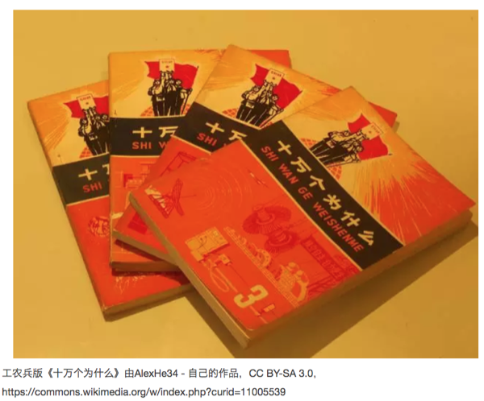
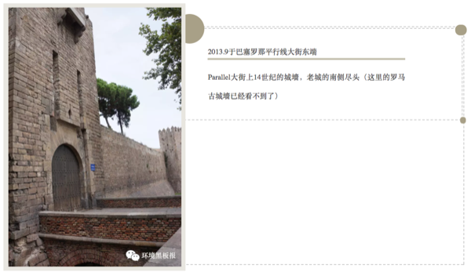
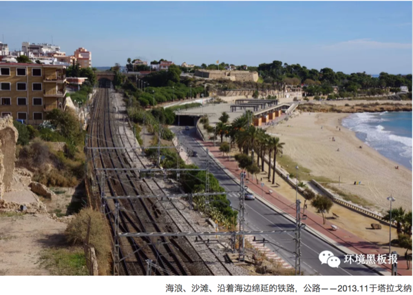

# 朝花夕拾

## 听花杂记之晚清四名臣

作者按：在中国历史上有两个思想动荡的年代，一个是随着分封制瓦解，国家向帝制过渡，整个社会礼坏乐崩的春秋时期；另一个就是晚清。要说来，晚清时代的动荡要远远大于以往任何一个朝代。延绵了几千年的封建制度已经日薄西山，那些祖祖辈辈相传的至理竟然在列强的纷争中无从适用，而新的思想还没有开始萌芽。那无尽的黑暗，给晚清人物的性格烙上了复杂而深刻的两面性，每每读起，都唏嘘不已。

### 胡林翼

> 挥金如土、杀人如麻、惜才如命

胡林翼的才华有多大呢？他有一个号，叫润芝，是的，太祖后来取了一个和他一样的字（后因太祖不想被人称作草头司令，去掉了“芝”的草字头——小编按）。这位晚清的中兴之臣是曾国藩最忠实的盟友，也是曾国藩二次出仕前最大的润滑剂。尤其他开创的“夫人外交”极大地缓解了新兴汉人将领和满清贵族之间的矛盾。

胡林翼是湘军将领中最有人情味的人，但他又是镇压太平天国最无情的刽子手。不论流连花间，还是重赏将士，他挥金如土；而面对敌人和对手，他杀人如麻；遇到才华出众的人物时，他又倾心相交，惜才如命。**“挥金如土、杀人如麻、惜才如命”**胡林翼以此“三如”名动天下，为曾国荃所膜拜，真是好一个屠夫手段、菩萨心肠！

1861年的时候，常年的征战和纵情声色极大地损伤了胡林翼的身体，然而谁也不会想到这位不到五十岁的封疆大吏甚至没能熬过这个秋天。时值九月，岁在三秋，身体有所好转的胡林翼在曾国藩、彭玉麟的送行下由安庆乘船返回武昌，长江上本来一派祥和的气象，忽然一声汽笛声破空而入，抬眼望去，洋人的巨船逆江而上，转瞬间便已经去远。胡林翼悲从心生，竟生生咯出了一口血来。“洋船其快如斯，如若开战，我辈如何能敌？”这一咯，竟就断送了胡林翼的性命。

```{r}
knitr::include_graphics('images/his1.png')
```

这个故事当然可能是杜撰，而我却宁肯相信这个故事是真的，因为洋务和国家一直是胡林翼的一块心病。这是一种无比深切的怅恨，是一种亲眼所见又知道终其一生甚至往后百年都无法赶超的悲哀。正所谓，哀莫大于心死！这一咯，咯出了多少仁人志士的心声，不管他们有这样或那样的缺点，他们前赴后继，就能顶起中国的脊梁。

### 左宗棠

> 天下不可一日无湖南 湖南不可一日无左宗棠

四名臣里，左宗棠的才华是最高的，也是自视最高的，他在给友人的信里，常常署名叫今亮，也就是当今时代的诸葛亮。他一生未中功名，后来以幕僚出道。普通幕僚的命运都是和提携他们的人紧紧捆绑在一起，明朝有一位很出名的文人，叫徐渭，也叫徐文长，他是浙闽总督胡宗宪的幕僚，在擒拿倭寇上曾风光无限，后来胡宗宪下狱，徐文长便开始了潦倒的后半生，成了“南腔北调人”。

然而左宗棠却摆脱了这一命运，他才高不可一世，以举人身份怒斥总兵樊燮的怠慢，却反被恼羞成怒的樊燮弹劾，以至于被定罪下狱，上谕“有不法事，就地正法”。然而，历史并没有放弃这个真正有才华的人。

左宗棠被下狱的事情犹如一石激起千层浪，不仅郭嵩焘、胡林翼、曾国藩等多方保举，探花郎潘祖荫更是写下了足以流传百世的奏折：

“以本省之饷，用本省之兵，不数月肃清四境，其时贼纵横数千里，皆在宗棠规画之中。设使易地而观，有溃裂不可收拾者。**是国家不可一日无湖南，湖南不可一日无左宗棠也**。”

这段话奠定了左宗棠一生的基调。

19世纪五十年代末，沙俄开始了他们疯狂的领土扩张，他们先后在我国东北部割占了大约100多万平方公里的土地，以至于时到如今，我们还要靠放养大马哈鱼来维持图们江的出海权。然后，沙俄又罪恶地将手伸向了伊犁。

沧海横流，大厦将倾，世需英雄！1876年，已经64岁的左宗棠抬棺出兵，成就了他一生最大的功绩。壮士长歌、老当益壮，能在那个积贫积弱、边防海防争论不休的年代，为祖国守卫住西北广袤的土地，左宗棠是理应流芳千古的。

```{r}
knitr::include_graphics('images/his2.png')
```

左宗棠一定还能记起，26年前，一位即将走到生命尽头的老人与他舟中长谈，这位遍行西域三万里的老人曾大声呼吁西北边防的重要和沙俄的强烈隐患。然而，直到那晚，这位老人才在精明强干的左宗棠身上看到了可以托付边防思想的希望。

1850年11月，66岁的林则徐不甘地离开了人世。26年后，66岁的左宗棠收复了伊犁。

如果有东西可以谓之为传承，这想必便是了。

### 曾国藩

> 萃六州之铁，不能铸此一错

曾国藩是一个以善写挽联著称的人，他曾经有一个侍妾，后来这位侍妾过世后，曾国藩写过一个挽联，里面有两句：“未必有情，对帐冷灯昏，一别竟伤春去了。”

这世间绝大多数最后没有走到一起的感情，都适用于这句话吧。未必有情，两人之间未必真的有那么深的感情，否则就可以越过世俗的一切。然而呢，一别竟伤春去了，这一别未必是生离死别，却也足够令回忆时，伤感不已。

曾国藩早年时以儒学出道，后来二次再起时兼用庄老，为官为人都到了化境。然而，却不想在天津教案上，遭遇了人生的滑铁卢。

```{r}
knitr::include_graphics('images/his3.png')
```

天津教案上到底谁有错在先，已经很难分辨了，但分析史料，我们的责任恐怕还要居多。教会不管有没有错，都成为了中国人民发泄对洋人愤恨的窗口。政府的无力和国家的贫弱，成了压在人民心口挥之不去的阴影，于是捕风捉影便让20余位法国人和30余位中国信徒命丧黄泉。如果说那些持枪威胁，飞扬跋扈的外国领事死不足惜，可是剩下几十位无辜人的性命又该如何说清？

身为直隶总督的曾国藩，力排主战派的意见，首先以死囚替换成凶手，为这起事件买单；然后和天津知府张光藻、知县刘杰谈心，先行流放平息舆论，将来留做后用；最后赔偿法国损失：46万两白银（对比庚子赔款4亿五千万两）。曾国藩的处理不得当吗？不，处理的合情合理，也恰到好处。然而他却忽略了最重要的一件事情，那就是中国人民的魂。

是的，中国几千年历史沉淀下来，就像一个大染缸，谁进去都很难独善其身；是的，中国人喜欢窝里斗，喜欢贪小便宜，还麻木不仁；可是这个泱泱大国矗立在东方几千年间始终未曾间断它的历史，就一定有他的原因。这个民族的人有魂，他们在大部分时间里沉默，也终会在一个瞬间爆发出来，这足以去改变历史。虽然天津教案爆发的方式不对，但这件事情已经折射出那个时代背景下人们迫切想要去打破封建和外来殖民双重压迫的意愿，而这样的历史潮流是无法阻挡的。

所以当张光藻和刘杰被发配的时候，天津人民自发相送，人山人海，宛如送别自己的英雄。此时，即将被舆论扣上卖国贼帽子的曾国藩已经预感到自己一生的清誉将尽毁于此，不禁一声叹息：

**“萃六州之铁，不能铸此一错！”**

初读此句时，曾隔越时空，给我以强烈的震撼。这一句话也改观了我对曾国藩一生的看法。

他原名叫曾子城，后来自己改为国藩，号涤生。为国藩篱、涤尽众生！也许今天我们跳出在历史之外看他们当时做的努力似乎都无关痛痒，但局限于特定历史格局里的曾国藩却的确在用一生实践着他的名和号。天津案后两年，曾国藩与世长辞。

那位曾经不可一世且后来与曾国藩交恶到无以复加的左宗棠赠挽联写道：

> 知人之明，谋国之忠，自愧不如元辅

> 同心若金，攻错若石，相期无负平生

这一刻，是失去惺惺相惜之人的落寞吧，不管是曾经的朋友还是后来的对手。

### 李鸿章

> 秋风宝剑孤臣泪，落日旌旗大将坛

太祖曾说：余于近人，独服曾文正。但我总觉得这中间少不了出自湖南的同乡之嫌；因此身为安徽人，我一直都试图去理解这位“合肥”宰相。

李鸿章在征讨捻军时实现了自己的独当一面，后来天津教案事件后，接任老师出任直隶总督，完成了权力上的接替，同时接替的，还有后来那无数的外交事宜。李鸿章一生大大小小的条约签了三十几个，如果说胡林翼留下的是虚名；左宗棠留下的是美名；曾国藩留下的是盛名；李鸿章却是实实在在背负了后来所有的骂名。

在我小的时候一直不能想明白一件事情，有一个叫美利坚合众国的国家，他们建国了两百多年，是一个从殖民地独立的国家，因此特别地强调民主与自由。在晚清时候，美国正从世界的另一端兴起，一个如此民主的国度，也有能力左右世界格局，为什么不能像春秋时候的霸主那样来维持正义呢？如果说鞭长莫及，那为什么还要加入到侵略者的队伍里去呢？后来我明白，无论是国家、家庭还是个人，不自己努力而把希望寄托于他人身上，永远是一件很可悲的事情。因为嘴上标榜的和实际去做的，常常相去甚远。

李鸿章就犯了这个错误，他过度相信了和伊藤博文这个一生之敌的友情，也错误地低估了沙俄喂不饱的野心。

北洋水师是命运跟李鸿章开的一个笑话，他像爱惜自己的孩子一样爱惜着这支队伍，可是过度的溺爱却最终导致了它的覆亡。当他让自己的心腹、不懂水军的丁汝昌作为水师提督的时候，北洋水师在很多人眼中便成为了另一个淮军。于是翁同龢老师傅在后来的过程中，对北洋水师的供给百般刁难：颐和园要翻修了，哪有那么多的钱再给到你李鸿章的水师里？于是这支建造时属于世界先进水准的水师，在七年后的甲午中日战争中已然全面落后于对手。技术的革新是一种无形的力量，一旦被淘汰，就再也追赶不上了。李鸿章太了解后来的现状，不忍心这支队伍损失太大，寄希望于调停，尽量避免主力对决，龟缩于港口，却给了对手合围全歼的机会……不论如何，1895年，李鸿章创办北洋水师的功与过都已经在血与火中灰飞烟灭了。但我们仍然需要记住的是，水师提督丁汝昌、管带邓世昌以及北洋的那些将士们，他们仍然奋战到了生命的最后一刻。

```{r}
knitr::include_graphics('images/his4.png')
```

那以后的李鸿章，像他的老师一样，舆论成为朝廷制衡他们的最好的工具，需要时就重新启用，不用时，便顺应民意罢免。后来舆论压力太大，李鸿章只好借出访海外暂避风头，想不到他在国外竟然享有比在国内更高的名誉，这不能不说是一种悲哀。然而现在就好了吗，一个已经被诺贝尔奖认可的科学家，在国内还混不到一个某某学者或者院士，这就是进步了吗？历史从来都不会消失，它们只是换了一个面孔，不停地上演。

1901年，俄国人还在步步紧逼，这位即将年满80岁的老人却已然行将就木，人之将死，其言也善，弥留之际，老人喃喃道：

> 劳劳车马未离鞍，临事方知一死难。

> 三百年来伤国步，八千里外吊民残。

> **秋风宝剑孤臣泪，落日旌旗大将坛。**

> 海外尘氛犹未息，诸君莫作等闲看。

切莫管宰相合肥天下瘦，李鸿章是想为这个国家做出一些改变的，只是无法触及到根本，结果一生都在跟内外妥协。跟左宗棠相比，他性格中少了一些刚强；跟曾国藩相比，他头顶上少了一些神明。在李鸿章死后的第十年，清王朝连同两千多年的封建帝制一起轰然倒塌。

我最喜欢的词人辛弃疾有名句：“道男儿到死心如铁，看试手，补天裂！”当封建势力和帝国列强两头撞向不周山时，中国的天已然千疮百孔。

这天，很多人去补过，李中堂一定是其中之一。

然而中堂失败了，中正也失败了，太祖却成功了。

李鸿章曾在面对伊藤博文的嘲讽时，问道，倘若我们易地而处会如何？伊藤博文回答道，倘若易地而处，你不会比我差，而我却未必能如你。是时耶？运耶？命耶？

唉，时来天地皆同力，运去英雄不自由！

#### 站长自述{-}

科研时候搬砖，闲来无事读史，兴有所致填词。偶有“花开本无声，花落亦无痕，无可寻迹处，谁解听花人？”四句，乃谓书房听花榭。有逸闻趣事、论史谈词，入归听花杂记。又因喜闻乐见，好传八卦，人送外号广播站站长。

作者：广播站王站长
编辑：栟

## 听花杂记之初唐四杰

初唐推开了唐朝辉煌艺术的大门，四杰是透出的一缕光。四杰虽不是唐朝艺术的巅峰，却也足以让我们细细品味，娓娓道来。

先说杨炯，因为他“愧在卢前，耻居王后”，说一可以引三。初唐四杰开始以文著称，后来以诗文传世。但杨、卢文的成就显然低于王、骆，并不是说他们的文不好，而是没有能够千古流传的名作，因此逐渐淹没在历史的长河里。

从诗上来讲，杨炯是有独到之处的，他是唐朝最早并有一定成就的边塞诗人。这里不得不说一句，诗人中，“田园诗人不田园，边塞诗人不边塞”。怎么说呢，那些隐居田园的人并不真的就是农民了，他们很多时候只是把锄头当拐杖用而已。要是“草盛豆苗稀”是会饿死人的，要是面朝黄土背朝天劳作了一天，晚上是不会有精力跑出去看“明月松间照”的。

同样那些写边塞的诗人并不一定真正经历过战争，很多时候只是去任个职，出个使，旅个游，面对边境就开始展开无尽的幻想。那真正经历过战争的人写出的诗是什么样子呢？一根齐眉棍，打平天下四百州郡的赵匡胤：“一轮顷刻上天衢，逐退群星与残月！”；战斗损伤比小到是历史奇迹的戚继光：“一年三百六十日，多是横戈马上行！”；而我曾读到惨烈到极致的战争诗是明朝万历年间的抗倭英雄陈麟的：“绝发结绳拉战马，拆袍抽线补军旗！”而诗因为体裁短小，因此绝大多数名篇都是以意境取胜。边塞诗的开篇和压卷之作：“秦时明月汉时关，万里长征人未还！”“黄河远上白云间，一片孤城万仞山！”莫不如此。

```{r}

```

因此从这两个角度来讲，杨炯的诗都达不到边塞诗的绝佳之作。既没有深入一线的切身体会，也没有广阔震撼的时空隔绝感。那杨炯的诗大概是一个什么地位呢？他最著名的是那首《从军行》，名句是“宁为百夫长，胜做一书生！”一个满身书卷气的才子依旧有一腔男儿的志气，这无疑是很容易引起共鸣的。每每读起，我都会想到曹植的《白马篇》：“捐躯赴国难，视死忽如归！”虽然曹子建一生不曾真的动过刀枪，但这个才高八斗的才子，在除了“洛神嫂子；煮豆兄弟”之外，还能借幽并游侠之口，说出这两句豪气冲天的诗，真的是让我刮目相看。杨炯和曹植大概在一个水平线上。但其实杨炯这首诗的前两句“雪暗凋旗画，风多杂鼓声。”写的异常精彩，每当有暴雪狂风的时候，我都会不自主想到这两句，画面感扑面而来。

```{r}
knitr::include_graphics('images/ctsj2.png')
```

杨炯说他“愧居卢前”并不是没有原因的。卢照邻是一个长者，他患有“风疾”大概是小儿麻痹症一类，有说他四肢萎缩，也有说他因误食丹药终至手足残废。我总觉得他身上有点脱俗的感觉，不仅仅因为他身体的伤病，更因为他的老师，药王孙思邈。人们常常去寻仙，寻不到时，便把一些长者当成寄托。这在魏晋时，是葛洪，唐初的时候，孙思邈也有点这个意味。在我读来，卢照邻的诗歌成就在四杰中是最高的，后人说他的诗不让子山，子山就是庾信。杜甫评价李白，说他“清新庾开府，俊逸鲍参军！”大意就是李白诗清新的一面就像庾信，这样一对比，足以见到卢照邻诗的造诣。

```{r}
knitr::include_graphics('images/ctsj3.png')
```

一个身患病痛的人，依旧可以写出如此清新雅致的诗，卢照邻一定是爱过生活的，虽然在孙思邈过世的那一年，他追随了老师的脚步。与其他三杰特点鲜明对比，卢照邻的诗更加的温和，也更加值得品味。“常恐秋风早，飘零君不知。”“雪处疑花满，花边似雪回。”“云疑作赋客，月似听琴人。”“别有千金笑，来映九枝前。”更不要说：“得成比目何辞死，愿作鸳鸯不羡仙。”了。他的才和杨炯不相上下，可是他一生折于病痛，又于四十岁左右自杀身亡，这让杨炯深深的惋惜，他在给卢照邻集序中称赞其为：“人间才杰”。人在自己欣赏的人没有达到自己的高度时，总是不吝于去给予赞美。因为再愧居，可还是排在了前面。

```{r}
knitr::include_graphics('images/ctsj4.png')
```

但杨炯说自己“耻居王后”其实就有点意思了，因为王勃毕竟是天纵奇才。这个世界上有一类人是“学胜于才”，例如历朝历代的大儒，博古通今，满腹经纶，写的东西可称佳作，但总少了一些灵性。还有一类人是“才胜于学”，这句话我最早是在一篇写徐志摩的文章中看到，毕竟，不是读再多的书就能写出那低头一瞬的温柔，而王勃则是“才胜于学”的典型代表。一篇《滕王阁序》，几乎古文的巅峰，文笔优美、对仗工整、起笔不俗、立意高远；典故频引，有述己之感伤；名句迭出，兼叙怀之豪情！更难得最后的滕王阁诗，依旧能写出时空变换的情怀。仔细读《春江花月夜》的前半段，借月抒发时空无垠的情境，很难讲张若虚没有受到滕王阁诗的影响。

```{r}
knitr::include_graphics('images/ctsj5.png')
```

王勃这么大才气，那为何杨炯会“耻居王后”呢？其实杨炯的文大都写的很平常，他写的最神采飞扬的文恰恰是《王子安序》，杨炯是认可王勃的才，但作为一个写边塞的诗人，他看不上王勃的“气”。

孟子说：“吾善养吾浩然之气！”这气究竟是什么？后来，苏轼写道：“一点浩然气，千里快哉风！”这气，就是你站在峰顶，张开双臂让风从你肋下穿过的感觉；这气，就是快哉，就是爽。这气，哪怕柔弱如易安，也有：“九万里风鹏正举，风休住，蓬州吹取三山去！”；这气，哪怕抑郁如纳兰，也有：“不恨天涯行役苦，恨西风，吹梦成今古！”正是因为有气在，李清照可以直面不纯粹的感情，毅然地离婚；纳兰可以与友纵酒，潇洒地死去。王勃身上有没有气呢？有！“老当益壮，宁移白首之心？穷且益坚，不坠青云之志。”但可惜的是，王勃身上的气终究太狭窄，当他写出《斗鸡赋》的时候，已然无法融于“不为五斗米而折腰”的清流了。而后来，他收留又杀害家奴，反反复复，在回乡途中落水受到惊吓而亡，一个须眉男儿竟然以如此结局收场，实在是有点让人大跌眼镜。这，你让志在边塞的杨炯如何能服气？

```{r}

```

我曾看过一篇文章，大意是说，如果王勃没有死的那么早，那么唐诗中，李白就要退居次席了。这实在有点太抬高王勃了，因为王勃差李白的可不仅仅是少活了几十年而已。王勃的诗整体来讲，有点两极分化的感觉，他的滕王阁诗、落花落、“海内存知己，天涯若比邻”、“寂寂离亭掩，江山此夜寒”、“况属高风晚，山山黄叶飞”等都是难得的上乘之作，可是其他的诗呢，就显得很一般了。而反观李白，从开元写到天宝；从洛阳写到咸阳；写将进酒也写行路难；写清平调也写秋风词。才气之绵长实在让人叹为观止！如果要找一个人来对比李白，那就是乔丹之于篮球，职业生涯一直行走在巅峰的男人，阉割了一个时代的篮球。

那如果王勃能继续创作下去，最终能达到什么高度呢？坦然来讲，我觉得可能和李商隐不相上下。要知道，虽然我不怎么爱读李商隐，但他在我心目中可是排在唐代前五的诗人。不爱读并不是因为不爱，而是读李商隐常常会有猝不及防的感觉。李商隐的诗带着点魅的味道，空灵、惊艳、疏离、伤感。而王勃的才也有类似的意味，足以让人感伤和惊叹，当然，前提是王勃可以看开他那狭小的格局。

最后写骆宾王，最爱的人总是留到最后。

他是骆宾王，是“鹅、鹅、鹅，曲项向天歌”的无邪稚子；是“此地别燕丹，壮士发冲冠。昔时人已没，今日水犹寒”的潇洒少年；是“喑呜则山岳崩颓，叱咤则风云变色”的无畏将军。后来，一说他捐躯在自己选择的事业上，一说他隐居世外，多一位得道僧人。无论那种，留下盛名，拂身而去，世间只留有传说，这是如何不让人喜爱的格调？

```{r}
knitr::include_graphics('images/ctsj7.png')
```

四杰的排名其实有很多种说法，骆宾王有被排到过第一位，但大部分的时候，他都安静地排在最后。但其实不论是排在第一还是排在最后，他和王勃都有很多相似的地方。

他们都盛名于一篇骈文。王勃的是《滕王阁序》，骆宾王的是《为徐敬业讨武曌檄》；两人各有一句神来之笔，王勃的是“落霞与孤鹜齐飞，秋水共长天一色”，骆宾王的是“一抔之土未干，六尺之孤何托？”；两人都曾让天子叹息，王勃引得高宗三声长叹；骆宾王则让武则天叹息宰相的失职。这两篇文章所达到的高度，不要说唐朝，放之中国几千年的历史里，都是名篇中的名篇。

```{r}
knitr::include_graphics('images/ctsj8.png')
```

单论才华，骆宾王比王勃似有不及，但骆宾王诗文里流露出的豪气，是纯才子类的杨炯所无法比拟的。他的诗艺术成就最高的莫过于《帝京篇》，卢照邻的《长安古意》对仗严谨，是一位端庄的姑娘；而骆宾王的《帝京篇》五七言夹杂，律动性上则有点长短句的味道了。有唐一代，长篇诗自此二人始。骆宾王非常善于去发觉生活中的小细节，进而展开到一个大的境界。他看到萤火虫，写“类君子之有道，入暗室而不欺”；他看到尘埃，写“光飘神女袜，影落羽人衣”；他在狱中听到蝉鸣，写“露重飞难进，风多响易沉。”一个在作品中常常不自主就流露出一腔豪气的人竟然还能有如此细腻而敏感的触觉，实在是难能可贵。

初唐只是在唐代辉煌的艺术成就中推开了一扇门，四杰只是透出的一缕光，这光不足以耀眼，却足以惊艳。艺术总是在规则和突破之中来回摇摆，诗歌、字画莫不如此。没有规则，大家率性而发，则近于荒诞；没有突破，大家泥古不化，则近于死寂。在经历了魏晋五石散的燥热以及六朝歌舞的靡靡，唐朝恰恰是一个定规则的朝代，律诗和楷书都盛名于唐。但不能忘记的是，在老杜集大成之前，有一批人凭借才华先行突破，扩展了诗文的体裁和境界，挽救了六朝几乎死掉的诗。而这，则是我觉得四杰最值得称道的地方。

最后，杜甫说“尔曹身与名俱灭，不废江河万古流！”

但其实，这虚名的灭与不灭，又有谁能废这江河的万古流？

作者：广播站王站长
校稿：广播站王站长
编辑：泽水之岸

## 真实的谎言——“何不食肉糜？”

### 引言

> 及天下荒乱，百姓饿死，帝曰：“何不食肉糜？”其蒙蔽皆此类也。——《晋书·帝纪四惠帝》

每个人都生活在特定的圈子里，这个圈子会塑造我们的世界观、人生观和价值观，进而决定了我们对事物的认知。正如王国维先生说的“以我观物，万物皆着我之色彩”。

“何不食肉糜？”是西晋晋惠帝的名言，也是长期以来大家认为他是一个白痴的铁证。但是当我们将王国维先生的观点作为一种方法论去认识晋惠帝时，也许会看到另一番图景。

### 晋惠帝——活在另一个世界的帝王

首先来分析晋惠帝的圈子和人生观，晋惠帝九岁时被正式立为太子， “（泰始）三年春正月丁卯，立皇子衷为皇太子”。晋惠帝所处的圈子是达官显贵。而当时晋国的达官显贵们过着怎样的生活？

晋武帝每天坐着羊车找妹子，“多内宠，平吴后，复纳吴王孙皓宫人数千，自此掖庭殆将万人，而并宠者甚众，帝莫知所适，常乘羊车，恣其所之，至使宴寝。”大臣何曾每天吃饭用一万钱，还“无处下箸”；何劭一定要吃四方畛异，一天膳费二万钱；“王恺以饴澳釜”；“石崇以蜡代薪”。虽然用现在的眼光看，这是一种奢侈，可是对于一个从小生活在这样环境里的人而言，这就是生活，这就是整个世界：到处美女如云，河水里都是美酒，满山遍野都是珍馐美味，这样的世界里怎么可能有饿殍遍野？吃不上饭时“何不食肉糜？”有什么问题呢？所以他不是白痴，只是天真，只是和我们生活在不同的不同的世界。

```{r}

```

### 皇位——黄金牢笼       

建立在九品中正制之上的西晋，世家大族成为了西晋政府的实际支配者，在一个已经专制了六百多年的国家，皇权与大族之间存在着天然的矛盾，二者无法并存。世家大族为了维护自身的利益，必须限制皇权，限制皇权最好的办法莫过于打造一个对自己有利的皇帝，完成这一点必须为皇帝打造一个虚幻世界，在潜移默化中将皇帝变成自己的傀儡，这种方法在现代被称为打造文化软实力。

皇帝是几千年来中国最有权势的人，但是他们也是最可怜的人，正如钱穆先生所言，专制体制使看似高高在上的帝王落入恐惧的深渊。他们不敢与臣民直接接触，只能通过大臣来联系世界，大臣成了皇帝的耳朵和眼睛。在掌握了皇帝的耳朵和眼睛之后，大臣们可以很轻松的为皇帝打造一个楚门的世界。

回到晋惠帝的例子，晋惠帝虽然不傻，但是毕竟太天真，世界观与正常人不同，绝对不符合一个帝王的要求。对于这一点他的父亲——晋武帝很明白，至少在最初很明白，“（惠）帝之为太子也，朝廷咸知不堪政事，武帝亦疑焉。”一个“不堪政事”的太子对于皇权是一种灾难，但是对于世家大族来说是一种福音。所以“朝廷”开启了拯救“天真太子”的行动。晋书记载了一次晋武帝对太子的考核：

> 尝悉召东宫官属，使以尚书事令太子决之，帝不能对。贾妃遣左右代对，多引古义。给事张泓曰：「太子不学，陛下所知，今宜以事断，不可引书。」妃从之。泓乃具草，令帝书之。武帝览而大悦，太子遂安。

虽然《晋书》里只是寥寥数语，但是这几个字却透露出阵阵寒意。既然是考核，而且是“以尚书事”即处理正常公务来考核，晋武帝就不可能将题目提前交给晋惠帝，根据这段记录很明显晋惠帝事先获得考题。这表明晋惠帝身后的利益集团可以掌握晋武帝现在的想法（拿到考题）；未来的想法（不能临时加题）；对事物的判断（回答的分寸拿捏必须准确，既要不能完美到让晋武帝起疑又不能太差），能同时做到以上几点，无疑表明大臣们已经成功将皇帝至于自己精心打造的世界里。

虽然史料里只记载了一次考核，但是我们有理由相信，对于皇位继承人，考核一定不只一次。每一次通过都很困难，但是晋惠帝都通过了，只能表明这个世界的禁锢是多么严密。连平吴代魏的晋武帝都无法逃脱楚门的世界，更不用说晋惠帝。所以从体制上晋惠帝只能生活在自己的世界里，无法与正常人有相同的世界观。

```{r}
knitr::include_graphics('images/his6.png')
```

### 枕边人——妻管严的悲哀还是家有贤妻的明智

史书都是由后人书写，人们往往倾向于做事后诸葛亮。正如做题一样，一道题我们百思不得其解，但是当我们看过答案之后，再来审视这道题，我们就会发现题目里处处是线索。明确了这一点之后，我们就又可以回到晋惠帝的故事了。《晋书》对晋惠帝的评价是“不才之子，则天称大，权非帝出，政迩宵人。”认为晋惠帝不仅本身能力有问题，还管不住自己的老婆，所有的坏事都是他的皇后干的。

这个观点貌似似曾相识，周幽王是昏庸，但是西周灭亡的直接责任人是褒姒；纣王是无道，但是主要原因是妲己；李自成是能力欠佳，但是快速败亡和陈圆圆脱不了干系。女人真是史学家的真爱，隔不多时就要被拿出来当挡箭牌。

鉴于此，不得不好好说一说晋惠帝的皇后——贾南风，西晋功臣贾充之女。贾南风其人，貌似对她的记载几乎都落在了如下几个批语上“妒而少子、丑而短黑、荒淫放恣。”首先说这个丑字，不太好考证，但是我看到了如下关于她妹妹的记录：

> （贾午）婢后往寿家，具说女意，并言其女光丽艳逸，端美绝伦。寿闻而心动，便令为通殷勤。婢以白女，女遂潜修音好，厚相赠结，呼寿夕入。

大意是说贾午看上了一个自己父亲的属官叫韩寿，然后让婢女去和他表达了希望交往的意愿，并且说自己有多好看，然后他们就幸福的在一起了。这个韩寿不太可能是贪图贾氏的权力，因为他本身也是达官显贵之后，曾祖父做过魏国高官，同时采用私通长官女儿的方式获得权力，怎么看都有点作死，要是直接私通贾充还可以理解。所以这个故事表明，贾午至少不难看，作为同父同母的姐姐，我觉得上帝不会太不公平吧。

```{r}

```

从政治角度而言，贾南风在晋惠帝即位后联络司马玮、司马亮杀杨骏，废杨太后；然后又让司马玮杀司马亮和卫瓘；最后又杀掉了司马玮。杨骏何许人也？杨骏的妹妹是当时的皇太后，对于外朝，杨骏“为太傅、大都督、假黄钺，录朝政，百官总己” 可谓权倾朝野；对于内朝，“虑左右间己，乃以其甥段广、张劭为近侍之职”，安插自己人为“近侍之臣”，宋太祖有句话叫“卧榻之旁岂容他人酣睡”，杨骏的做法已经是要看着晋惠帝入睡了。

这样的权臣想必晋惠帝和贾南风都不会陌生，已经安躺在司马家祖庙里的几位先人可不比杨骏差。所以无论新登基的是谁，杨骏都是必然会被清理的政治力量。这样来看这个故事是不是似曾相识?

东汉末年，大将军何进让董卓铲除宦官。结果没想到自己先被宦官狗带了，真是自己驱虎吞狼却先被狼吃了。这样一对比，晋惠帝和贾南风驱虎吞狼，最后把狼和虎一起给炖了，这样的政治手腕腻不腻害，高不高明？

就私生活而言，她的父亲出过轨，妹妹出过轨，所以在这样的家庭长大，她出轨的概率确实高于常人，但是这并不是她是一个坏的政治家的理由。但其实，纵看几千年的历史，你以为皇帝后宫里能有几个贞节牌坊么？

综上来看，对于一个这样的皇后，晋惠帝让她放手做一些事情好像并没有太大的问题。

### 结语

怀疑论者曰：晋惠帝是一个生活天真的，与大众生活在不同世界的帝王，他的工作特点使他没机会与大众生活在同一个世界。婚后，对爱人的工作能力予以充分的肯定，取得了一定的工作成绩，但是由于工作能力不足最终导致了工作单位倒闭。

#### 作者简介{-}

初以科研为业，现守朱门。喜忆往昔风云人物，多有异见，然无意见。欲起一笔名，思虑万千，终觉yy最为妥帖。

作者：yy
校稿：广播站王站长
编辑：智公子
图片：柴胡半夏苏

## 十万阅读量的科普

```{r}

```

前一阵有新闻说某高校认为科普文阅读量10万+算成果，我觉得还是有点难度的。用美国科普杂志来举个例子，《科学美国人》全美发行量不到60万，加上《发现》跟《新科学家》，整体发行量也就是一百多万，美国人口大概是中国人口的1/4，也就是说中国即便科普发达到美国的程度，日常感兴趣的人数大概五百万封顶。按说国内也有科普期刊，但那个发行量惨不忍睹，倒不是说国人不感兴趣，只是感兴趣比较晚，很多人没形成看杂志习惯而直面了互联网时代。我估计国内微信公号、果壳、知乎、科学网基本已经圈住绝大多数关注科普信息的人了，那么这个人数是多少呢?

不考虑泛知识化的知乎，果壳跟科学网日活用户用一些站长工具去查加起来大概是一百万，我估计这两个网站至少能占总关注流量的20%，所以目前日常对科普感兴趣的人也就是大几百万级别，跟上面那个发行量的估计差不多。这个覆盖面其实应该跟金融、IT等行业差不多，但远不如养生、娱乐八卦和新闻。那么百万量级的圈子产生10万阅读量相当于个位数百分点的人都看到了，这个还是很了不得的，这要求内容足够有趣又恰到好处的专业，太难了看不懂，太简单不值得传播。

用科学网博客来看，其文章周最高点击大概两三万，就算是一天点出来的也都是关于科普的，距离10万+还是有距离。这种量级科普文全国每天能出一篇就很不容易了，而且作者也不可能都是一个高校的老师/学生。而且实话说，很多10万+的文章名义上是科普，实际可能是搞怪或泛娱乐化行文，读者看了并不一定有学到新科学知识的感觉。

### 改变中的科普大环境

```{r}

```

2016年，全国高中升高等教育的升学率从1990年的27.3%提升到了94.5%，一个高等教育学位对未来20年的年青人已经成了标配。《趣味物理学》、《从一到无穷大》、《十万个为什么》等科普经典里的内容对于普遍接受过高等教育的群体吸引力正在下降，一方面多数内容实际都成了通识教育的一部分;另一方面则是搜索引擎其实替代了大量的常识性科普，“你不会网上搜一下”成了年青人的常用语。

其实高中毕业，不论你学的文还是理，知识传授上一般侧重知识或事实本身，或者说学到的是通识。例如地球是圆的、力学有三大定律、元素周期表是按什么排的…这类知识其实就算老师不教，你看看《十万个为什么》什么的也都能知道。科普主要面向知识背景是高中组的，大多数人不进行科研，就算进行科研其很多科学背景知识也是高中的(因为你大学可能学了某个专业，但另外的学科最理想也是停留在高中阶段)。这部分内容基本不用科普，或者说包含在更广泛的知识普及中就好了，需要思考推理的部分不多，主要是了解事实，形成背景概念。这对于本来就关注的人没什么难度，但如果是中小学生科普，重点要关注这部分。

然而，科普的潜在受众并没有减少，打着“养生保健”主题的各类伪科学与阴谋论侵蚀着中老年群体;年青人对科技里技术层面的关注远远超过对科学的关注，实用主义下电脑算命、星座研究等伪科学在技术下获得重生并展示了强大的生命力;流行文化中的成功学虽然不断引入心理学与行为经济学的研究成果，但公众对于得出结论过程的关注显然少于关心结论本身。类比美国科普杂志的发行量与人口比例，科普的主动受众大概是大几百万的级别，占总人口千分之二三，这些人会主动寻找甚至创作科普作品。对其他人而言，在走出校园后，科学知识就成了个“靠谱的黑匣子”，敬而远之，不明觉厉。

### 知识向科普

```{r}
knitr::include_graphics('images/pops3.png')
```

大多数科普文章其实是在做大学教材的通俗版，这类文章普及的是专业知识，例如PM2.5是怎么回事?行星间距离如何测量?端粒长度跟寿命关系…这类文章告诉我们从已知的高中阶段背景知识如何得到专业的背景知识，大都是专业概念普及，这个是社会大多数人科学背景的上限，却是专业职业化要求的下限。目前这个层次的科学知识几乎可以被维基百科覆盖，也就是说你可以用维基百科作为这类科普文的一个主要参考，另一方面就是趣味性了，如果你能加入更多互动跟多媒体，自然比枯燥的维基百科要好很多。如果你本科专业是理工学科，那么此类文章基本不用看，因为拿到学士学位就表明你已经掌握了这部分内容。这部分内容互联网的替代效果比较明显，国内做的也不错。但科学知识是不断更新的，如果过分强调已有观点其实不但不是科普，反而是科黑。例如方舟子的作品就有点过分强调知识的正确性而不考虑科学的发展，他本身其实也远离科研很久了，这个语境下他实际成了已有(甚至是过时)科学知识的卫道士的角色。

### 前沿科普

```{r}

```

这部分的科普是从已知走向未知，目前最容易出问题的就是这一部分，因为在这一阶段是要建立在读者有大学水平知识上的已知，同专业的还好，但很可能读者大多数停留在高中阶段，所以他们会看不懂。

这部分最常见的就是前沿科技成果报道，其实多数人看了后只会产生“高科技”的一个感知，并不能理解掌握其中的知识。在我看来，如果文章只是这样让人不明觉厉，那跟告诉别人我有个魔法箱可以变戏法但不给看内部结构一样，读者跟作者都浪费了时间。这部分写的人最好本身是理工背景且实际进行过至少两个学科以上的科研，同时写作水平也有要求。目前的尴尬在于做科研的不会写，会写的看不懂，然后大家只能很和谐的点下赞，最好的情况就是记住了结论(但要小心记结论并善于操纵读者情感的人，他们通常擅长用海量最新研究把你忽悠得就差跪拜交钱了)。

```{r}

```

科学成果的吸引力从来就不如娱乐明星的花边八卦，如果我一天平均有一个小时看书报杂志，那看了花边就不会看科普，注意力总是被竞争的，而且读这类需要有知识背景才能看懂的文章也比较累。从另一个角度看，科普在这个阶段对大众谈不上普及了，但对社会中有求知欲的人而言却很关键，而这部分人很有可能推动科技进一步发展。就国内看，科研工作人员大概也是几百万这个级别，其实面向他们的前沿科普很有必要。遗憾的是，这大几百万从业人员的市场规模非常有限，对他们科普还不如卖成功学鸡汤来的容易，优质内容不能专业化生产，吸引力就很有限。

职业化的科研需要为公众负责，而公众则可通过舆论切割科研经费在不同学科的比例。举例而言，北京的雾霾不仅仅让口罩、空气净化器行业高速发展，也让大气环境化学领域的研究人员瞬间经费充裕起来，充盈的资金会吸引到最新的技术进而推动学科发展。然而当资金总盘口一定时，一家吃饱往往意味着另外好几家要节食了。也许很多一线科研人员没有意识到，科普正是释放学科重要性甚至储备人才的最佳渠道，面向大众的科普不但是公益的，也是符合自身学科发展利益的。只有科学的声音更多更大，公众才会给予更多关注与投入，在这一点上科普跟科研并无区别。

科普的一般套路是先讲个故事但不说结局，引出研究背景跟意义，然后新发现在哪些方面进行了突破，然后是各专家的采访意见，然后是综合观点，最后又把故事收个尾展望下美好未来，通常也有高质量的图片、插画甚至视频进行解释。但科普又不是科研，讲求趣味性与故事性，而这两个特性要是出现在科技论文里基本是开送死模式。

科研成果的报道是N+1的，也就是说看的人知道了N，你告诉他1就够了。但科普往往是从零开始，当然不用到N+1那么远，但这意味着要面对的读者具备的是常识或通识，而你要告诉他的是从那部分知识发展来的新知。职业作家可以很好组织常识或通识的知识但你让他搞前沿，理解能力就有限了;职业科研人员对付的只是审稿人也就是专家，很多默认知识往往是逻辑上清楚明白的，但历史沿革基本不知道，这就导致故事讲得像论文，趣味性也无从谈起。且高度细分的研究领域让科研人员自身也无法对学科形成整体感知，同一专业的人可能互相都听不懂对方的研究，更不用提对公众的科普了。

其实科普对于科研人员自身也是很重要的。北美高校会对研究生与博士后开设基金申请与科研写作的课程与讲座，其中就会特别强调申请基金时一定要跳出自己的研究框架，用平实易懂的语言来阐明研究的意义，因为读申请书的人或者说做决策的人对技术细节关注度有限。而进行学术会议的报告时，前几页一定也是讲背景的，而且最好是一个有着婴儿与母亲的故事。既然无论如何都要学会用平实语言讲故事，科普创作是很有益处的，它可以帮助作者系统总结整合知识实现双赢。

同时，信息技术特别是数据科学也在冲击着科研，自然也冲击了科普。2006年，JoVe(Journal of Visualized Experiments)创刊，2014年被SCIE收录，影响因子达1.325，作为一份实验学科的期刊并不理想，但作为第一份同行评议的以视频形式发表的期刊，这个成绩则标志着学术交流从文字传播的单一形式开始走向多媒体富文本的时代并得到了一定的认可。现在科技论文已经不仅仅是文字传播了，活跃的科研人员正通过社交网络传播着成果，很多期刊都接受用视频、动画甚至幻灯片作为论文的补充材料。而科普也处于这一波技术浪潮之中，科普漫画、短视频、播客及博客都成了科普的阵地。其实借助多媒体互动，很多科普作品开始包含探索式小游戏与在线应用，引导读者自己得出结论。在技术层面科研跟科普的界限不再明显，同样的展示手段既可以用来科研展示，也可以用做科普说明。

### 科学思想

```{r}

```

前沿科普走出“看结论”的现状最需要普及的不是知识，因为知识都是比较前沿的，很可能被后续结果推翻掉。前沿科普更重要的是科学研究的思想，这个其实即便一线科研工作者自己可能都比较迷糊，大部分人是站在前人基础上往前推进，前人的研究结论容易保存，但思想可能早就消散了。

举个例子，我可以找两组高中毕业生，一组让读《审判达尔文》，另一组读《盲眼钟表匠》，完了以后测试其对进化论的认可度，可以预期两个差异会很大。两本书都是从逻辑推理开始的，但结论恰恰相反，如何解释两种思想的冲突?这时候如果没有科学方法论的背景知识，很容易就陷入盲从。可以说，科学思想的科普需要引入这些矛盾而不是结论来让读者进行独立思考判断，并形成存疑并可通过观察与实验验证某个论断的科学素养。

科学思想或者说方法论其实比知识本身更重要，科学知识可以证伪，但方法跑偏了结论就不靠谱了。通过科学思想的普及，我们可以反观审视科研的每一步并诚实的认错换取进步。但现在很多科学向文章过分强调的知识本身的不可动摇，这对科学思想传播没有好处，属于钻牛角尖了。至少我们要给讨论留下可能性而不是一个个论断，如果结论都确定了，那我们还有必要讨论吗?

这里理想的文章应侧重于整合已有知识进行创新得到的新知识，基本上只有经验很丰富的人才能站到一定高度上解说一些原理或技术。开篇是一个主题，然后作者需要把相关知识与方法论进行高度整合最后形成自己的结论与见解，跟学术论文要求也差不多。此时仅仅谈思想谈逻辑就不够了，最好要整合历史，把发展沿革搞清楚。我觉得这类文章一个月甚至几个月能看上一篇就很不错了，消化这种文章也需要很长时间。坦言之这个认识高度出的作品属于简本教科书，内容却是职业或专业教科书才覆盖或根本就覆盖不到的，可以参考卢昌海老师的作品还有刘未鹏的博文。

### 科学史

```{r}
knitr::include_graphics('images/pops7.png')
```

当前科普文章的另一问题是过分强调了逻辑主导的故事而忽略了历史发展的真实过程。这就导致很多知识在解释时感觉很生硬，没有上下文，直接从石头里蹦出来了。科普文章趣味性的重要来源是故事，历史沿革是很容易讲故事的，教科书普遍采用学科逻辑框架，所以科学史作为科普对于专业科研人员也是有意义的。这个的代表可参考普利策奖非虚构类的获奖名单，很多时候回顾科学史会发现很多有意思的小故事，比明星八卦要精彩多了。
终极科普可能会走向科幻了，你可以体会其中思考的乐趣，当然知识背景设定就不要管了。自己构建一个逻辑自洽的物理甚至社会运行体制跟历史是非常有挑战性的，但我们终将走向未来。

### 新的指标

```{r}
knitr::include_graphics('images/pops8.png')
```

十万阅读量的科普天生是需要知识跟趣味来获取读者的，但更重要的可能是科学思想跟历史的传播，这可以凸显出科学最与众不同的特点，例如不断犯错、重视事实证据、当前存在的不足等等。切不可孤芳自赏，用别人看不懂来作为高深，有些科学知识本身确实不适合普及，但过分用技术名词来包装，然后用泛娱乐的方法来调侃就很没必要了。

普及类文章的难处在于一方面要影响更多人，另一方面却要保障质量。十万阅读量并不是好指标，含有专业信息网文超过一万阅读其实就很优秀了。让我说另一个需要考虑的指标是评论质量，高质量的评论不仅说明正文很好，也说明可以吸引到高水平的读者，此外评论本身也是科学思想的交锋，读者从这个过程可以学到更多。大家可以去围观下海外期刊或预印本文章下面的评论，哪怕匿名也能体会出读者本身的专业性，反观国内基本上还是情绪化的占多。读者跟作者间从来都是双向选择，越是情绪化，理性读者的流失就越多。

这是一个竞争注意力的时代，科学知识与方法论有必要在更多人的心中占有一席之地(本文部分内容已发表在《中国科学报》2017年10月27日第三版)。

作者：yufree
编辑：竹而乐

## “行天的守望”系列游记

### 序章

#### 游记的缘起

这部游记缘起于2013年清明我在人人网上所建立的同名相册，当时仅仅是为了记录下身边的一些发展变化，讲述给也许再也看不到这一切的故友。但在之后的两年里，在北京宅了十年的我突然有了一些机会，去到了世界上许多向往已久的地方，也让这个相册多少加入了些“带你看世界”的意味。2014年十一，在寄出“第四年的守望”之后，我决定把相册扩充为文章，不仅把风景装进照片带回来，也把所思所想记录下来，作为一年年的足迹，讲给她，也讲给大家。然而，世事繁杂加之慵懒过度，一直没有将这些只言片语整理发表出来；恰巧2017年末，和几位研究生的好哥们一起共创了“环境黑板报”，大家听说王站长有“听花杂记”，我有“天枫游记”之后，纷纷表示应该开个版块展现环境小爬虫们的风采，所以就有了“那些花儿——朝花夕拾”，也有了这部游记的整理和发表。

“行天的守望”这个名字来自我非常喜欢的两篇科幻小说：苏学军《沉寂的喷泉》和刘慈欣《带上她的眼睛》。前者讲述了一段跨越四十年的旅行与守望，也是“行天”这个名字的由来；后者则描述了一个被困在地心的年轻女孩通过主人公携带的全息眼镜进行的旅行，可以算是我提笔的初衷——既然你被关在地下那一方窄小的空间，就让还能“行走”的“天枫”为你讲述万安之外的世界吧。

> 从此用我双眼，替你看这世界；
云万里，山千叠，天尽头，城不夜。
——《风起天阑》河图

- 巴塞罗那圣母大教堂

```{r}
knitr::include_graphics('images/xt1.png')
```

这不是长明的烛火，

在这里我也仅仅是名过客；

当圣乐和钟声响起，

我和章北海一样，

为所有的无神论者感到了一些遗憾。

- 罗卡角

```{r}
knitr::include_graphics('images/xt2.png')
```

世人皆看过你阳光下的壮美，

也有人在落日的余晖中落泪；

而我愿化作这块守望的石碑，

在夜色中陪着你沉睡。

#### 游记的组成

游记将以近些年来走过的地方为主体撰写，比如伊比利亚、日本、新西兰，也可能加入一些历史相关的私货。在未来很长一段时间内更新的应该是第一部“走进伊比利亚”的部分，按照时间划分可能包括：古罗马时期的巴塞罗那古城区，塔拉戈纳，塞戈维亚；维斯哥特时期的托雷多；摩尔时期的格兰纳达，科尔多瓦；王朝/大航海时期的塞维利亚，里斯本；近现代的马德里，巴塞罗那高迪街，法国拿破仑专题，弗朗哥专题等等。

严格来说，计划所写的这些地方，都不是以自然风光蜚声世界的；就算是在天涯海角的罗卡角，看着亚欧大陆的那最后一抹阳光消失的时候，耳边也依然回荡着卡蒙斯的诗句，心中装满了对面对着“死亡绿海”仍敢于不懈前行的先驱者们的敬意。在欧洲旅行，脱开了历史容易凭空失掉一半的乐趣；曾听到一个朋友讲，在欧洲看教堂都看的审美疲劳了，的确，除了像科尔多瓦那样风格迥异的教堂外，现今多数欧洲教堂多少都采用了传统哥特式大拱顶的结构和被人津津乐道的彩绘玻璃，那些时代间建筑风格的差别和雕工的变化一般不学建筑或者艺术的人怕也看不太懂；但每一个教堂中那段生动的历史，和里面沉睡的曾经书写历史的伟人，却赋予了他们不同的意义。

记得一次办公室里讨论说出去玩最看重的是什么，大家从食、住、行、买，说的不一而同，然后被我一句“情怀”语惊四座。我的出行最看重的的确就是“情怀”，这倒真不是妄言；似乎我决定出发前往每一个地方，不是为了“朝拜”，就是为了“最美的体验”。我会在樱花盛开的季节去日本，在枫叶始红的日子造访枫丹白露；我会在冬天刺骨的海风中看完罗卡角的日落，在一整天车程的寂寞中朝拜恩里克墓；造访格兰纳达，似乎更是为了见证伊莎贝拉和费尔南德这对真爱双王的长眠，而游览凡尔赛，我会舍弃参观路易十四后花园的时间，走进旁边小镇上那个并不算宽敞的网球场大厅，重新感受国民议会成立，大革命爆发的喧嚣。——而这一切“情怀”的必要背景，其实就是历史。追随着文明的足迹行走，即使是为了体验旅行发现、探索的乐趣，你也完全无法脱开历史；没有了那段波澜壮阔的岁月的生动注脚，城堡只是城堡，教堂只是教堂，索然无味。

所以，我会在游记中尽我所能地讲述我造访的每个景点的背景知识，让大家了解为什么我会选择这里出行，和此地带给我的感受；也即是说，在旅行的内容之外，我估计会有90%的概率强行加上自己的私货，希望不会引来太多的板砖。如果非要给这篇文章加个和旅行相关的副标题的话，“大龄文艺男青年的情怀历史之旅”可能是个比较合适的名字，那些盼着看艺术的，美食的亲们，可能要失望了（笑）。

#### 预告  第一章：走进伊比利亚  

最后给大家预告几张美图~都是第一部“走进伊比利亚”未来更新的部分，敬请期待。

```{r}
knitr::include_graphics('images/xt3.png')
```

```{r}
knitr::include_graphics('images/xt4.png')
```

```{r}

```

```{r}
knitr::include_graphics('images/xt6.png')
```

```{r}

```

#### 作者简介 

天枫，诞于秋日，幼时自取芦秋盛景为名，无比中二。后偶得益友语云：“天”做气度高远，“枫”取优雅从容；深以为然，遂以此为号自勉，沿用至今。闲来好舞文弄墨，但自读博搬砖开始少来得闲，愈发抬不得笔，常自嘲曰“十年古风圈，卅载北京城，诗无百篇熟，不敢谈国风”。而立之年痛感无为，乃与损友同创黑板报，以小编之便抢阅佳作无数，不免手痒，遂督促自己恢复笔耕，望与各位同好共勉。

### 走进伊比利亚（一）

#### 走进伊比利亚

在13年9月飞往西班牙之前，神秘的伊比利亚半岛对我而言只是一个遥远的向往，我对她的了解几乎和大家一样的有限：《大国崛起》里面那个海洋帝国的兴衰起落，西甲那几只耳熟能详的球队，斗牛士和弗拉明戈，《卡门》和《堂吉•诃德》…而更多的近乎“野史”的知识，则是来自游戏，《大航海时代》中里斯本到波尔图的首航，《帝国时代2：征服者》里面“熙德”和瓦伦西亚的传奇，虽然是断断续续，也多少填补了一些知识的空白。

然而，在踏上那片土地之后才发现，她的历史几乎和华夏文明一样的源远流长。从B.C.6世纪的希腊，到B.C.2世纪的腓尼基-罗马，到A.D.4~7世纪的维斯哥特（西哥特人），到A.D.7~12世纪的摩尔人，再到A.D.15世纪的基督教光复战争和大航海，千年来这片土地一直纷争不断。无论是西欧的拉丁/蛮族文明，还是北非的阿拉伯文明，每一次扩张，兵锋所指就是这里；长期以来，不同的文明在这里战争、妥协，风格迥异的民族在这里争斗、融合。

而这一切，带给了西班牙人仿佛根植于血液中的热情、开放、爱冒险的特性。在我到达的第三天，UB课题组里面的colleague们就拉着我去了巴塞罗那近郊的Port Aventura（类似于北京欢乐谷，以过山车闻名），让我见识了一下什么叫“热情、爱冒险”。

```{r}

```


在这群人当中，你不会感受到任何英美白人对待你时的那种矜持与礼貌（其实就是隐藏起来的种族歧视啦），只要你想，可以很容易的和他们打成一片。经历了千年的融合与改变，无论是狂热的柏柏尔穆斯林，还是以宗教裁判著称的西班牙天主教会，都已悄然淡出了视野；即便在宗教/文明冲突愈演愈烈的今天，我们似乎也很少见到这个天主教-伊斯兰教交锋最前沿的地区中爆发什么宗教冲突；也许，就像见证了无数王朝兴衰起落的华夏文明，可以对高喊着要“再主导世界一百年”的美国幽幽抛出一句《左传》般，历经了无数文明冲突的伊比利亚，也早已看淡了这般无谓的闹剧，宁愿把更多的精力，放在体验生活、感受人生上了吧。今天在那里，你能更多的感受到一种惬意与悠然，不管世人如何评价名列“欧猪五国”的西、葡是如何“懒散、不上进”，人家反正就那样波澜不惊的生活着，平和而美好；我想，这也是很多奋斗着的亲们向往的归宿吧~

```{r}

```

#### 从希腊到罗马

其实，我开始关注伊比利亚半岛的古代史，完全是一个巧合；在此之前，我对古伊比利亚除了“汉尼拔”之外也差不多一无所知。落脚巴塞罗那后不久，就被房东大哥安利说“如果对历史感兴趣可以去下加泰的历史博物馆，就在海边，周日免费”，然后欣然成行，结果仿佛打开了一扇宝库的大门，花掉了好几个周末。博物馆的设计很有意思，大厅四周是历史解说和地图，中间区域会还原一些当时的建筑、农业、工商业情况（比如下面图中这个反映古伊比利亚人生活的小角落）。大概就是在这里，我被科普了伊比利亚从上古到罗马时期的很多历史。

```{r}
knitr::include_graphics('images/xt10.png')
```

抛开漫长的远古时期不说，伊比利亚早在罗马人登陆之前，就已经搭上了文明的航船。B.C.6世纪，希腊人和腓尼基人先后向此地扩张，希腊人从意大利—法国一线南下建立了滨海的城邦Empuries。

```{r}
knitr::include_graphics('images/xt11.png')
```

腓尼基人则是从非洲北进建立了诸多沿海商站，但都没有留下文字记载。真正有记载的从北非向伊比利亚的第一次扩张，来自第一次布匿战争后的迦太基人的北进。B.C.3世纪，在第一次布匿战争后期崭露头角的迦太基将领哈密尔卡•巴卡（Hamilcar Barca，汉尼拔的父亲）来到加泰罗尼亚地区，并用自己家族的名字称那里为Barconi，这个名字随后被罗马人使用的拉丁语沿用，并最终流传下来成为了今天的Barcelona。在今天的瓦伦西亚地区，迦太基人还建立了新迦太基城，也是第二次布匿战争双方反复争夺的据点和著名的“汉尼拔远征罗马”的起点。

布匿战争(Punic War)是罗马文明和腓尼基人建立的迦太基文明之间爆发的一场前后达百年的争夺地中海霸权的战争，从B.C.3世纪中期开始，共进行了三次。历史上最著名的便是第二次。

B.C. 219年，哈米尔卡的儿子，著名的“战神”汉尼拔率军围攻伊比利亚半岛上与罗马结盟的城市萨贡托(Sagunto)，成为第二次布匿战争的导火索。战斗力爆表的汉尼拔没等罗马人发难，率先于B.C.218年4月开始了对罗马的远征。他的军队在五个半月的时间内行军1600余公里，在隆冬翻越了冰雪覆盖的阿尔卑斯山进入意大利，一路所向披靡。然而，一支罗马舰队走海路登陆，直接抄了汉尼拔的老家0.0。

B.C.211年，萨贡托被罗马收复，B.C.209年，伊比利亚最重要的据点新迦太基城被罗马攻陷， B.C.204年，大西庇阿在迦太基本土登陆并于B.C.202年在扎马会战中击败了回救的汉尼拔，结束了其不败的战绩，迦太基也就此崩盘。

```{r}
knitr::include_graphics('images/xt12.png')
```

在击败迦太基人后，罗马人在伊比利亚半岛建立了行政区划并实行了统治，B.C.2世纪开始，各聚居区的人口开始增长，拉丁语和罗马文化开始大规模进入伊比利亚。罗马人在伊比利亚东部的各个河口地区修建了很多城邦，并在之后的数百年间将其不断扩大，这其中就包括巴塞罗那和塔拉戈纳，后者还是罗马帝国开国皇帝奥古斯都远征伊比利亚北部山区时在西班牙的治所。之后，随着河流入海带来的填海效应，曾经的罗马古城逐渐被埋入地底，成为了久远的记忆。但今天，我们仍可以跟随考古工作者的脚步，深入到地下，去探访那些两千年前的古迹，寻找那个逝去的罗马的荣光。

#### 寻找逝去的罗马

不管迦太基的巴卡家族的故事是如何的传奇，以他们家族名字命名的巴塞罗那最早的痕迹还是只能追溯到罗马，这可能要归功于罗马人传奇的石工技术吧。与大爱木制建筑的东方不同，罗马人在运用石头的方面可谓是技能树点满，笨重的巨石，精美的大理石，在《建筑十书》的指导下，在两千年前的上古岁月里，便构筑出了可以伫立千年的丰碑，留下了在之后千年的岁月里无论风吹日晒、战火侵袭都无法磨灭的罗马的痕迹（对比东方，“楚人一炬，可怜焦土”）；也使得我们在今天，仍有机会触摸这个上千年前的文明所留下的真实。说来也可笑，身处古老文明发源地中国的我，甚至还没有到过长安，碰触过“汉”的光辉，倒是先跑到了这千里之外，曾经罗马帝国的边陲，计划起瞻仰别的文明的遗迹来了。

不过，巴塞罗那在罗马时期实际上只是一个不大的小镇，并没有留下像塔拉戈纳那样恢弘的遗迹，时至今日，那个曾经的小镇早已被埋入地下，上面坐着一整座巴塞罗那的老城区，这个寻找又从何开始呢？

林达的《西班牙旅行笔记》里曾有提过一座考古罗马遗迹的历史博物馆，似乎是一个好的选择，但这个“巴塞罗那历史博物馆”隐没在老城区的千街万巷间，地图上的标注也模模糊糊，找到它也绝非一件易事。不过，也许是罗马的石头有种奇怪的魔力（对历史控的吸引力吧0.0），在一次以造访巴塞罗那主教堂为目的的周末“转悠”中，居然让我意外的发现了它。至于具体的入口么，我只能说今天已经记不大清楚了。只记得是先抵达了下图中这个著名的主教堂（在流浪者大街附近），从教堂左手边的小路进去，经过教堂之后左转到达Placa del Rei（国王广场，就是下图中这个广场），广场四周的建筑很多都是历史博物馆的可参观项目，罗马古城的入口也在广场四周的某个我已经记不得的门里，就留给大家自行去发掘吧。实际上，站在广场上你就已经站在罗马古城的上面了，那薄薄的一层土，几块石砖，便是你和罗马几千年的距离。

```{r}

```

```{r}
knitr::include_graphics('images/xt14.png')
```

在买票进入博物馆的地方，是有多国语言的讲解器可以租的，如果有时间仔细逛的同学建议还是租一个中文或者英文的，因为可爱的加泰人经常是先写了加泰语，然后想了想在下面补上一段西班牙语的翻译，然后就把英语忘了0.0。在博物馆地面层展出的主要是一些各时期巴塞罗那城的复原模型和发掘的文物，地面建筑还包括了A.D.14-16世纪阿拉贡王国的王宫建筑，不过都不算是本次寻访的重点啦。

走过地上部分，会有一个非常窄小的单向下行的电梯带你深入地层，有意思的是，这个电梯并不显示层数，而是从现在的年份一路追溯回B.C.215；电梯门打开，你会发现自己已经赫然立于千年前的罗马遗迹之间。为了避免参观者影响开掘工作，博物馆在遗迹之上修了一些悬空的巷道，供大家穿行于遗迹之间，而遗迹的复原图、开掘出来的谷物、器皿就装进展柜点缀在巷道两旁。

```{r}

```

目前开掘出来的范围其实并不大，主要就包括A.D.2-5世纪镇上主大街两侧的一些建筑，包括教堂、商店、洗衣房、酒厂、咸鱼作坊（0.0），值得注意的是，这里并没有兵营、执政官住所、市政厅这样象征罗马统治的地方，估计巴塞罗那在罗马时期的地位，应该远比不上南面的塔拉戈纳（今天却完全反了过来，塔拉戈纳变成了小镇）。

不过即便在这样一个小镇上，也能看到罗马逆天的建筑技能：很多房屋都有两层，拥有牢靠的石头地基和承重墙，在主干道上还有可辨识的下水系统！而在同时期，欧洲很多地方的人们还在住茅草和黄泥糊起来的房子里吧。

```{r}
knitr::include_graphics('images/xt16.png')
```

```{r}

```

用盐来腌制捕获的鱼可能是香料传入欧洲前最为常用的长时间保存食物的方法了，但是为了不腐坏而放进大量的海盐，想必那鱼不会是什么珍馐美味0.0；值得一提的是，图中那些陶罐本体真的非常大，估计能钻进去一个人，并且在作坊里和酿酒厂里都大量被使用，罗马人智慧地在地上挖出半圆型的坑，这样可以把陶罐直接座进坑里面，之后可以引水进来降温或者在底下架设加热装置，这也许是最早的控温发酵措施了。

穿过这几个建筑，再走过一条暗仄的城墙巷道，在地底的旅行也将告一段落，不过，下图中的这条巷道可能是你为数不多可以碰触到城墙石砖的地方，而这一段城墙，将会穿透地层，和我们在下一节中继续相遇。

```{r}

```

#### 历经千年的城墙

重新回到地面，找到下面的这座高塔，便是巴塞罗那寻古之行的最后一站“老城墙”了。穿过高塔下的拱门，是一方不大的广场（Placa del Ramon，以中世纪时加泰罗尼亚伯爵拉蒙•贝伦戈命名），广场的另一侧，便是车水马龙的大街和18世纪之后的建筑了。

这段罗马的城墙，便是巴塞罗那古城东侧的尽头。说来也巧，两次走到这方广场，都是傍晚时候；太阳已经落到楼宇后面很久，走的人困马乏之后，能坐在小广场的长椅上掏出带着的Sangria（西班牙果酒）喝上两口，静静的看着面前街道上的人来人往，等到华灯初上去坐地铁回住处（边上就是1号线Jaume站），颇有一种走过千年沧桑看淡一切的悲凉。

```{r}
knitr::include_graphics('images/xt19.png')
```

```{r}
knitr::include_graphics('images/xt20.png')
```

在城墙的最底部，罗马人留下的刻字依稀可辨，再往上，中世纪的城墙就垒在罗马古城墙的上面，似乎是也不在乎根基是否够牢靠；再往上，便是王朝时期的建筑和高塔，就这样一层层，硬是在地面上垒出了年代地层的感觉。只可惜，这面前后砌了上千年的城墙并不能走得太近，所以更多的人，只是在这里停下，喂喂鸽子，喝杯咖啡，瞻仰下贝伦戈的铜像（不得不说，从雕像上看贝伦戈家族的人长得比帝国2里面画的帅多了），然后重又返回车水马龙的大街，去过千年后的生活了。

```{r}
knitr::include_graphics('images/xt21.png')
```

走过整个巴塞罗那的老城区，回头想想其实地方也不大，从南侧的尽头平行线大街（Ave. Parallel）走到北侧城墙这里，大概用不到半个小时，不过，也许是中间引人逗留的地方太多，似乎每次从Parallel走过来，都花掉了整整一个下午。罗马的，中世纪的，王朝的，太多的历史纠葛在一起，让人眼花缭乱；然而，真正属于罗马的，其实只有很小的一块。

或许，寻找那个逝去的罗马，巴塞罗那并不是一个最佳的选择（那个说得去意大利的，就是你，出去！别让我看见你！），从巴塞罗那的Nord车站出发，坐火车南行一个小时，便是寻访罗马的下一站，奥古斯都时期西班牙的治所——塔拉戈纳。

```{r}

```

#### 预告 塔拉戈纳

塔拉戈纳，一座现今人口只有16万的海边小城，却是当年奥古斯都时期整个伊比利亚的治所，甚至一度成为整个罗马的政治中心。竞技场、战车赛道、古城墙、神庙遗迹点缀在山坡之上，诉说着流传千年的传奇。说实话，去之前真的没有预料到，一场说走就走的旅行，能让我遇到了堪称近年来走过的最美小镇之一。

```{r}
knitr::include_graphics('images/xt23.png')
```

```{r}
knitr::include_graphics('images/xt24.png')
```

### 走进伊比利亚（二）

#### 说走就走的旅行

老实说，对塔拉戈纳的拜访是一场“说走就走的旅行”。

虽然在上一篇里说到塔拉戈纳是寻访古罗马的好去处，一副看过加泰历史博物馆后早已计划好的样子，但实际上伊比利亚半岛上我造访的众多景点中，唯独塔拉戈纳是完•全•没•有•计•划•过•的。

这个地中海边的小城，人口只有16万多(巴塞罗那300多万)，一般出现在“巴塞罗那周边可去的景点”这样的条目里，中文的介绍少的可怜;不过，只能说是非常幸运地，十一月的一个周六，在我缩在住处包饺子炖肉储备粮食的时候，紫慧妹子突然到访;当谈起我寻访罗马古迹的计划的时候，妹子推荐了她读书的塔拉戈纳，并自荐作为导游，于是约了第二天欣然成行，并成功地在完全没有准备的情况下进行了一次对这个地中海小城的“深度探访”。

周日的早上是巴塞罗那惯例的蓝天白云，风风火火地赶到Nord车站，在妹子的电话遥控下买了区间城际上车出发(往返只要15欧的，比小火车或者SNCF的列车便宜好多);从巴塞罗那到塔拉戈纳的铁路基本完全靠海而行，所以果断选择了运行方向左侧靠窗的位置欣赏风景，沿途的地中海沿岸风景还是很不错的，但为了给相机省电就没有照相了(这个时候已经经历过去枫丹白露时相机半截没电的尴尬了，长记性了)。

塔拉戈纳是从加泰南下格兰纳达等南部城市的必经之路，车行只要1个小时左右。到达的时候导游小同学还没到，所以得空在车站周围转了转。

虽说是个重要的铁路站点(好歹也是塔拉戈纳大区首府)，但车站真的不大;月台就设置在海边，下了车穿过一个小小的车站厅就是大街。因为已经是11月初，小镇的游客相当稀少，每一趟车过来，只有寥寥十几人下来，很快便消失在附近的道路尽头;靠在车站的外墙上，看看对面卖烤红薯的小哥(没错，是卖烤红薯的，我还走上前去确认了一下，不过人家不愿意让我照相，估计是无照经营吧，笑)，看看来往的车流、高大的棕榈树，有一种逛欧洲小镇的特有的惬意。

沿着海边的公路向北，爬上一个小山坡，便可以看到海边的铁路和公路，以及绵延的海滩。

因为天气已入深秋，此行的主要目的又是罗马古迹，所以也没有在海滩上花费时间，紫慧妹子到了之后，便径直前往罗马古迹，开始一天的探寻。

```{r}
knitr::include_graphics('images/xt25.png')
```

```{r}

```

```{r}

```

#### 行走在遗迹间

塔拉戈纳依山傍河而建，从海边开始往内陆，地势是依次升高的，由于公交和租自行车都不太方便，所以我们选择了“行走”，老实说，一天下来还是蛮辛苦的，脚力差的亲们要做好思想准备。塔拉戈纳的所有罗马遗迹可以买一张通票(包含了2000年纳入世界文化遗产的4~5个地方)，具体价格已经不记得了，反正当时蹭紫慧妹子的学生证买到了优惠学生票:P。

从车站出发，向北步行不到一刻钟，便是塔拉戈纳最著名的罗马古迹——古竞技场;说到这里要咬文嚼字一下，圆形竞技场(amphitheater)，不是那种非常有名的的古罗马斗兽场(colosseum);两者的直观差别嘛，你要问一个玩《文明》的小伙伴，他会告诉你前者是加文化的，后者是加快乐的0.0;其实我觉得这样解释还是蛮到位的:P，因为说到底就是前者还有些theater的作用，后者则完全是角斗士堵上性命取悦“公民”主子的场所了。具体到建筑外形上，实际并没有太大的差别，一样的拱形外墙，一样的阶梯式看台，一样的比赛场地。

不过，颇为可惜的是，塔拉戈纳的竞技场原貌保存的并不是非常的完整，四周的拱形结构已经基本亡失殆尽，中间场地又在维斯哥特人时期垒起过一个教堂(大概石材就取自周围的拱形外墙吧，柏柏尔人入侵的时候又给拆了)，所以站在场地中央体验角斗士视角的机会怕是没有了。

参观路线大部分是在搭建起来的行人通道上，沿着外圈绕场半周后，再通过原来角斗士入场的拱门进入竞技场中间的比赛场地。除了细沙铺成的地面外，比赛场地中央还可以看到一个十字形的沟，据说是原来的“员工通道”，方便奴隶们在底下穿梭清理场地，比赛时会加盖木板。

```{r}
knitr::include_graphics('images/xt28.png')
```

```{r}
knitr::include_graphics('images/xt29.png')
```

```{r}
knitr::include_graphics('images/xt30.png')
```

坐落于场地中央的教堂严格来说并不算大，修建在一圈围墙的中间显得有些逼仄，不得不感叹一下后世的“野蛮人”们相比于罗马，建筑技能还是差了太多。在教堂的一侧，一些石棺结构清晰可见，应该是天主教夺回西班牙后重修教堂时用作了墓地，不过也没有听说里面葬了什么有名望的人就是了。看过教堂，对竞技场的参观便也算告一段落了。

从场地中间向北，便可离开竞技场。值得一提的是，加泰地区对于历史遗迹的处理，基本都是“考古挖掘-原位展示”，通常不会进行任何形式的修复，所以遗迹看上去真的只是断壁残垣的遗迹，这一点我其实是蛮喜欢的，特别是独行探寻的时候，闭眼想象原貌的雄伟壮丽，睁眼面对现世的沧桑凄凉，也算是“历史之旅”中最值得体会回味的一点了吧。

```{r}
knitr::include_graphics('images/xt31.png')
```

离开竞技场往北，路过一个罗马人留下的葡萄种植园，向着小镇方向连攀两层台阶，便可到达半山腰的位置。一路上，凉亭和棚架上都装饰着许是茉莉的紫红色的小花，一团团一簇簇甚是繁茂。到了半山腰，穿过一个环岛，便是罗马古迹的第二站——环形赛道了;相传是奥古斯都时期开始用来赛战车的。

宽阔的赛道完全由石块垒成，宽度至少可以并排跑4匹高头大马。14世纪，住民在原有罗马赛道的拱顶之上，又建立起警戒塔，要塞等建筑，从而把赛道大部分埋入了地下，变成了供士兵转移的地下通道。看到这里，便又想起了巴塞罗那老城区那段叠起来建的城墙。而和巴塞罗那同样相似的，这里你也可以走入地层之下的罗马遗迹间，触摸千年的历史;而攀援到上面的要塞里，则能欣赏到绝佳的海景。

```{r}

```

```{r}
knitr::include_graphics('images/xt33.png')
```

```{r}

```

```{r}
knitr::include_graphics('images/xt35.png')
```

离开赛道的遗迹，第三站是罗马古城墙。作为奥古斯都时期西班牙的治所，罗马时期的塔拉戈纳城市规模很大。从海边起，城墙绵延延伸，将执政官邸、兵营、港口等建筑悉数围在墙内(除了竞技场是在城外)。和巴塞罗那一样，后世的城墙沿用了罗马时期的地基，如今我们看到的，已经多是14世纪的砖石了，然而伫立在城门口的青铜雕像，仍提醒着我们这座治所之城曾经的归属。

半是环城的城墙绵延数里，想要全走完是不大现实的，我们走了大概一半便开始折返。路边，一侧是矮墙，可以算是outer ring，一侧则是高耸的内墙和戍塔。城墙外，是塔拉戈纳的新城，靠近城墙处还有一个战争博物馆，但时间原因就没有造访了。

```{r}
knitr::include_graphics('images/xt36.png')
```

#### 最早的领袖崇拜

从西城门回来后，小导游同学已经不太走的动了，两个人有点挣扎的走到最后一站——中心大教堂——的旁边后，决定坐下来吃点东西。

得益于紫慧的西语能力，我算是吃到了西班牙旅行中唯一一次西式正餐：塔拉戈纳的特色沙拉，起司焗鳕鱼，烤面包，果酒，别的就不大记得了(在巴塞罗那还是去下过馆子的，但出去玩的时候一般都是三明治之类的解决)。

餐馆就在教堂前的广场边，没有什么游客，一边吃一边看着广场上的小朋友玩闹，有一种逛历史小镇所独有的惬意。城市中心的这个大教堂并不是罗马时期的建筑，但却是坐落在原来奥古斯都神殿的遗址上。在教堂花园周围环廊的房间内，陈列着出土的神殿石柱碎片，通过还原图，还依稀可见当年的恢宏。

```{r}

```

```{r}
knitr::include_graphics('images/xt38.png')
```

*私货预警*

说到奥古斯都的神殿，可能有人会奇怪为什么要把一个皇帝供到神殿里面去祭拜。然而，在“上帝”出现前的漫长岁月中，将人物神化的“领袖崇拜”(ruler cult)其实一直是支撑人类信仰体系的重要组成部分之一。如德·库朗热所说：维持罗马帝国的根本不是武力，而是它所激发出的一种虔诚的赞美之情。

在民众中受到憎恶的统治方式，竟能维持五个世纪之久，让整个欧洲一亿人俯首帖耳，这仅仅依靠帝国的区区三十个军团是无法做到的。更多人服从的原因，是对罗马帝国荣光的向往与敬畏。而皇帝，便是罗马伟业的人格化象征，他就像神一样受到全体人民的一直崇拜，在他的疆域之内，即使最小的城镇也设有膜拜皇帝的祭坛。

在基督教以前的许多年里，几乎整个罗马-高卢地区，都建起了纪念奥古斯都皇帝的神殿。在将神祗虚化的一神教产生之后的岁月中，这种信仰仍在民众中大行其道。虽然今天大多数支配着人们头脑的大人物已经不再设立圣坛，但他们的雕像或者画像也曾一度广泛地存在于他们的赞美者手中。

纵观历史，无数的政治领袖、艺术高人都曾让自己雕像撒遍全国;到了二战前后，很多专制政权的崛起，都依托于对本国领袖人物的狂热崇拜。马列，希特勒/斯大林，本子的天皇都是个中翘楚，而今天，你在三胖那里看到的朝鲜人民对金家王朝不可理解的狂热追捧，不过是这一已经随着时代慢慢退环境的信仰模式的另类写照罢了。

我想，今天已经不大会有人在家中供奉某个人物的画像/雕像了，但人们头脑中的偶像仍然占据着不可撼动的地位。说来，出游葡萄牙的第一天，我便忍受了一整天车程的寂寞造访了巴塔利亚修道院，只是为了恩里克墓前的那一拜，这可能也算是一种对偶像的执着吧。　

*私货结束*

本章有关罗马的部分也结束了。

#### 地中海边的小城

走出教堂环廊，结束了最后有关的罗马参观之后，已是斜阳西挂。其实，若是抛开罗马的部分不谈，塔拉戈纳本身也是一座非常恬静的海边小城。老城的石墙、戍塔、教堂，新城的宽阔街道和多彩的房屋，在11月清冷的海风中，诉说的是一种别样的韵味。

记得我们进入教堂的时候，已是下午，上午弥撒的人流早已散尽，教堂的大厅和环廊里格外的静，听着自己的脚步叩响在空旷的大厅和庭院里，感受阳光逝去后的阴冷和空灵，对内心的冲击的确是巨大的。我想，若非身边还有个带一抹亮色、不时活跃一下气氛的小导游，而是一个人走在这样的厅廊里，听到前世之人的呢喃我也是不会感到惊奇的。

```{r}
knitr::include_graphics('images/xt39.png')
```

在秋冬之交的时节，地中海日落后天色暗的格外迅速，离开教堂沿着大路返回海边时，身边已是华灯初上。然而，远处海边的晚霞与彤云却格外地绚丽，给我留下了难以磨灭的记忆。下面这张照片曾长久地作为我笔记本电脑的桌面背景(而罗卡角的日落则长久地作为我手机的背景，看来我对“暖阳与深海的重逢”还是格外的偏爱啊，笑)，记述着当时混杂了惊叹、苍凉与宁和的奇特感受。

有人说，诗是穿越千年的心灵相通;当你面对某个景色，回想起一句诗时，感觉突然就对了;而我想说，虽然搜遍脑海，也不能给这个景色配一句诗(古人好像没谁有机会看到海边的落日好吧…)，但所幸有照片，留住了那个时刻内心最“对”的触动。有时候，白天的小镇、阳光、海浪和沙滩，快乐的心情与亮丽的风景，并不是旅游的全部;日暮、长夜、萧萧落木，反而更像是历史之行的深刻注脚吧。

```{r}
knitr::include_graphics('images/xt40.png')
```


## 历史中的国学

现今国学兴盛，一些国学课已经进入一些学生的课堂，学生身着汉服跪拜老师，诵读《论语》经常见诸报端，关于国学的电视节目也是五花八门。但是何谓国学？貌似没有人说的清楚。百度百科给予的解释是：国学，是以先秦经典及诸子百家学说为根基，它涵盖了两汉经学、魏晋玄学、隋唐道学、宋明理学、明清实学和同时期的先秦诗赋、汉赋、六朝骈文、唐宋诗词、元曲与明清小说并历代史学等一套完整的文化、学术体系。这个定义涵盖面很广，以至于根本无法称之为一个定义。这也体现出我们对国学认识的混乱。了解什么是国学，也许历史会给我们答案。

### 第一章 先秦岁月

周武王姬发汇集诸侯大军浩浩荡荡向朝歌开进，一个新的王朝诞生。

```{r}
knitr::include_graphics('images/gx1.png')
```

周王朝建立对于中国具有划时代的意义。它将宗法制引入了中华大地，这一制度构建了人与人的关系，人与国的关系和国与国的关系，成为了日后中国社会的基础性规则。宗法制简单而言，嫡长子构成大宗，大宗由嫡长子继承，其他子嗣构成小宗；而后小宗再分出小宗，下一级小宗对上一级大宗有支持义务，上一级大宗对下一级小宗有保护的义务。

```{r}
knitr::include_graphics('images/gx2.png')
```

周王朝建立之后，周王室将大量的土地册封给了王室成员，这些成员成为了小宗。但是这种册封只是发给小宗一张支票，需要他们自己去受封地兑现。兑现的形式只有一种——抢。（谁说的中华民族自古以来爱好和平？）西周初年册封的故事一般是诸侯从周天子处拿到册封的命令，率领自己的族人，有时周天子会将自己治下的一些臣民交给他们，诸侯率领着这支大军开赴自己的领地并将这片土地上的原住民或驱逐、或奴役或同化。诸侯国最初是一个城市国家，诸侯在领地上筑城，这个城市里的人就是《春秋》所言的“国人”，城外的人就是“野人”。

随着人口的繁衍，诸侯会将自己的小宗再次册封为大夫，大夫会率领自己的族人继续上面的故事。经过几代的繁衍，各个诸侯国渐渐从一城即一国的城市国家成长为拥有很多城市的疆土国家。显然，这是一种殖民过程，而宗法制的存在使得殖民地与母国之间存在从属，成为了中国可以形成中央集权国家的基础。希腊文明和罗马文明在扩张之时也开启了殖民过程，但是希腊人殖民形成的子城市对母城市没有从属义务，双方虽然具有共同的文明和起源，但是在法理上却全无义务。所以希腊一直停留在城市国家。因此，封建宗法制使得中国形成了不同于西方的文化和政治体制，构成了中华文化的核心。

宗法制度的核心纽带是血缘，所以宗法制度必然引申出的道德要求是孝道和集体主义，行为规范是尊卑长幼。这种封建道德被儒家总结为“君君臣臣父父子子”“为尊者讳为贤者讳为亲者讳”。在宗法制下，国即是家家即是国，对于父母的孝道即是对于国家的忠诚，对于兄弟的爱护即是国与国之间的外交。而家国不分的体制必然造成了中国人以人治代替法制，以道德代替法律。

```{r}
knitr::include_graphics('images/gx3.png')
```

宗法制度在一定程度上是一种殖民的有效手段，使得周人在几百年间就可以统治整个中华大地。当周围有大量的土地可供殖民时，下一级的小宗可以通过殖民获得土地和收益。当周围没有足够的土地，而人口依然在繁衍时，宗法制度就迎来了挑战。宗法制度要求大宗将土地分封给小宗，最初只是大宗给小宗开空头支票，小宗从隔壁银行兑现（抢），现在隔壁银行都倒闭了。可是维持宗法制度，大宗还需要开支票，此时只有一个办法——从自家银行提现。这样的结果是大宗的银行大规模倒闭。首先倒闭的是中华大地上最大的大宗——周王室。我们通常认为西周的灭亡是因为烽火戏诸侯和犬戎入侵，实质上，这只是结果。西周真正的灭亡原因是不断的分封。

试想，西周末年，诸侯都已经成为不止一个城市的疆土国家，西周王室却需要其他诸侯帮助抵御入侵，犬戎居然很容易就进入周王都，理由只有一个——周天子的土地封完了。西周末年，郑国建都陕西棫林，位于近畿，此时西周的诸侯已经封到了周天子的家门口。事实上周王室的土地分封一直持续到灭亡，东周时期，在已经没有多少土地的情况下，周襄王为了酬谢晋文公将河内、阳樊两地赐给晋文公，到东周末年，周天子竟然连自己王宫所在地都封了出去（周考王15年，公元前425年，周考王封其弟于河南地，建立周公国，是为西周桓公，这是周王朝最后一次分封），周王室银行彻底破产。

无地可封的窘境使得宗法制度作为一种社会运行制度破产，中国正式进入春秋战国，在文化上产生了诸子百家，实际上此时涌现出了大量的哲学家，究其原因是人们在后宗法时代需要探讨一种新的社会模式，所以诸子百家的出现是一种必然。

```{r}
knitr::include_graphics('images/gx4.png')
```

### 第二章 大争之世

“三家分晋”标志着封建宗法制度彻底覆灭，随后，齐国也换了颜色，一大批新的诸侯登上历史舞台，中华大地进入了新的景象。这些新的诸侯出现之后首要问题是如何不重蹈春秋时期那些诸侯的覆辙。他们急需建立一种新的制度，各国开始了轰轰烈烈的变法。从这个层面而言，战国时期的变法质是一种旧制度自然死亡之后建立全新制度。变法的共同点是实行郡县制，加强中央集权，建立官僚政治。此时中国逐渐形成了现代国家的雏形，最终形成了统一的中央集权制国家——秦朝。（未完待续）

作者：yy
校稿：胜利屯支书、看透
编辑：丫头晚安
